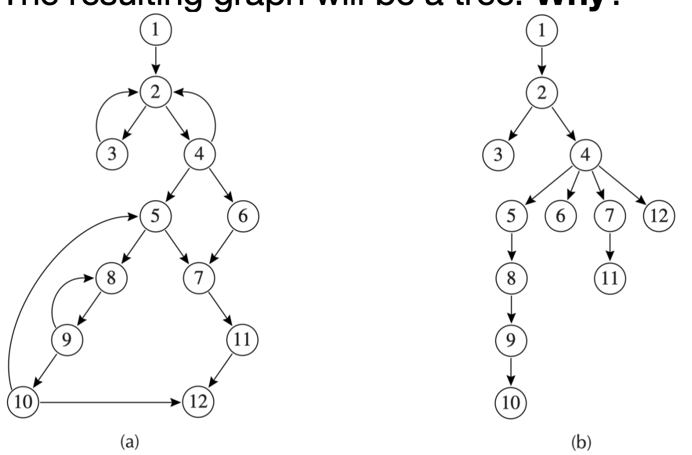
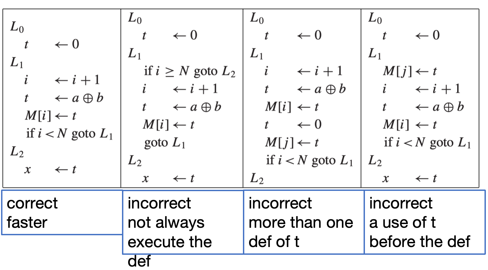
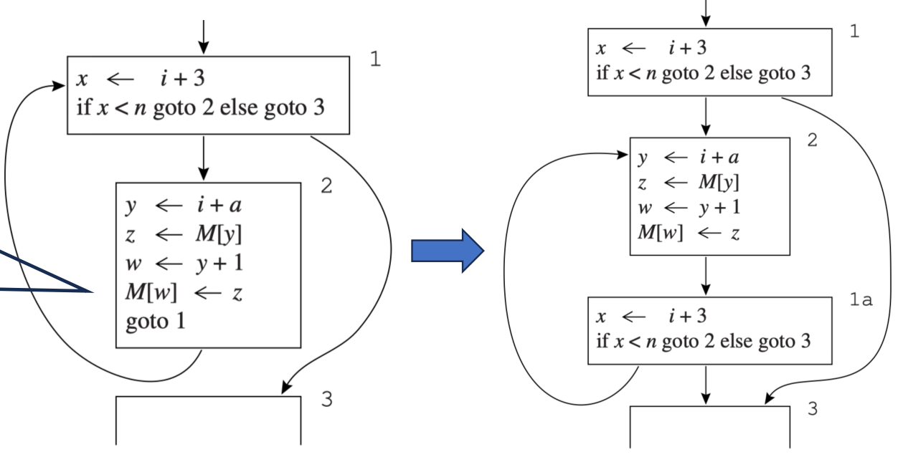

# 循环优化
> 实际上对应书本第十八章

大多数程序的运行时间并不是均匀分布在所有代码上的。程序的大部分时间会花在一小部分代码上，而这部分代码往往就是循环。

本章主要讨论几类典型优化：

- **Loop-invariant code motion**：把每轮循环都得到相同结果的计算移到循环外。

- **Strength reduction**：把昂贵运算换成便宜运算，例如把乘法换成递增加法。

- **Induction-variable elimination**：在强度削减之后删掉不再真正需要的归纳变量。

- **Array-bounds check elimination**：删除可以证明冗余的数组越界检查。

- **Loop unrolling**：展开循环体，减少循环控制本身的开销。
> 只有前两个是考点,所以后面不讲

## Loop

一个控制流图中的循环可以看成一个节点集合 $S$，其中包含一个 header 节点 $h$，并满足：

1. 从 $S$ 中任意节点出发，都存在一条有向路径回到 $h$。
2. 从 $h$ 出发，可以到达 $S$ 中任意节点。
3. 从循环外部进入 $S$ 的边，只能指向 $h$。
> $h$ 是这个循环唯一的入口。

!!! info "Entry 和 Exit"
    - **loop entry node**：有前驱节点来自循环外部的节点。

    - **loop exit node**：有后继节点指向循环外部的节点。

    一个适合优化的循环通常只有一个入口，但可以有多个出口。

## Dominators

为了在控制流图里找到循环，首先要引入 **支配关系 (dominator)**。


!!! info "Dominator 的定义"
    在一个控制流图中，如果从起始节点 $s_0$ 到节点 $n$ 的每一条路径都必须经过节点 $d$，那么称 $d$ **支配** $n$，记作 $d$ dominates $n$。

    直观上看，如果 $d$ 支配 $n$，那么无论程序如何执行，只要执行到达了 $n$，就一定已经执行过了 $d$。


我们可以由定义推导出如下结论:

- 每个节点都支配它自己。

- 一个节点可以有多个 dominator。

- 起始节点 $s_0$ 支配所有可达节点。

### Dominator Sets

设 $D[n]$ 表示支配节点 $n$ 的所有节点集合。支配集合可以通过数据流方程迭代求解：

$$
D[s_0] = \{s_0\}
$$

$$
D[n] = \{n\} \cup \bigcap_{p \in pred(n)} D[p], \quad n \ne s_0
$$


!!! note "迭代算法"
    1. 初始化 $D[s_0] = \{s_0\}$。

    2. 对于其他节点 $n$，先令 $D[n]$ 为图中的所有节点。(因为全集在$\cap$运算中会削减比较快)

    3. 反复使用上面的方程更新，直到所有集合不再变化。

### Immediate Dominator

如果 $d$ 支配 $n$，且 $d \ne n$，那么 $d$ 是 $n$ 的一个严格支配节点。

在所有严格支配 $n$ 的节点中，离 $n$ 最近的那个叫做 $n$ 的 **直接支配节点 (immediate dominator)**，记作 $idom(n)$。

更形式化地说，$idom(n)$ 满足：

- $idom(n) \ne n$。

- $idom(n)$ 支配 $n$。

- $idom(n)$ 不支配 $n$ 的其他严格支配节点。

!!! info "为什么 immediate dominator 唯一"
    在一个连通控制流图中，如果 $d$ 和 $e$ 都支配 $n$，那么二者之间一定有一个支配另一个。

    因此，所有支配 $n$ 的节点在支配关系下可以排成一条链。去掉 $n$ 自己之后，链上最靠近 $n$ 的那个节点就是唯一的 $idom(n)$。

### Dominator Tree

有了 $idom$ 之后，我们就可以构造 **dominator tree**：

- 图中每个控制流节点都是树上的一个节点。

- 对每个 $n \ne s_0$，从 $idom(n)$ 连一条边到 $n$。

因为每个非起始节点都有且只有一个 immediate dominator，所以每个非根节点在这棵树里都有唯一父亲，最后得到的结构就是一棵树。

<center>
<div text-align="center">
    
    <br>
    <center>
    <caption>控制流图和对应的 dominator tree</caption>
    </center>
</div>
</center>

## Natural Loops

循环优化最关心的是有单入口的循环。这样的循环通常通过 **back edge** 找到。

!!! definition "Back Edge"
    如果控制流图中有一条边 $n \to h$，并且 $h$ 支配 $n$，那么这条边叫做一条 **back edge**。

> 既然 $h$ 支配 $n$，执行到 $n$ 之前一定已经经过 $h$。现在又从 $n$ 跳回 $h$，这就形成了一个以 $h$ 为入口的循环。

对于 back edge $n \to h$，它对应的 **natural loop** 是这样一组节点：

- $h$ 支配这些节点。

- 从这些节点出发，可以不经过 $h$ 到达 $n$。

- 这个循环的 header 是 $h$。

讲人话就是说,自然循环就是“能沿着某条路径走到回边起点 $n$，再通过回边回到 $h$”的那一组节点。


### Nested Loops

循环可以嵌套。假设 $A$ 和 $B$ 是两个循环，header 分别为 $a$ 和 $b$。如果 $a \ne b$，且 $b$ 在循环 $A$ 中，那么 $B$ 的节点集合会是 $A$ 的真子集。

这时称 $B$ 嵌套在 $A$ 中，或者说 $B$ 是内层循环。

### Loop-Nest Tree

为了系统地表示嵌套关系，可以构造 **loop-nest tree**：

1. 计算控制流图的 dominators。

2. 构造 dominator tree。

3. 找出所有 back edges，以及它们对应的 natural loops。

4. 对每个 header $h$，合并所有以 $h$ 为 header 的 natural loops，得到 $loop[h]$。
5. 构造循环 header 之间的树：如果 $h_2$ 在 $loop[h_1]$ 中，那么 $h_1$ 位于 $h_2$ 上方。

### Loop Preheader

在循环优化中,我们可能需要把循环中某些语句提到外面.标准做法是,给循环加一个 **preheader** 节点 $p$：

- $p$ 是一个新的、初始为空的基本块。
- 所有从循环外部指向 header $h$ 的边，都改为先指向 $p$。
- $p$ 再无条件跳转到 $h$。

这样，preheader 就成为“进入循环前一定会执行一次”的位置。

## Loop-Invariant Computations

如果循环中有一条语句：

```text
t <- a op b
```

并且每一轮循环里，$a$ 和 $b$ 的值都不变，那么 $t$ 的值每轮也不变。这种计算就是 **loop-invariant computation**。

我们希望把它从循环里搬出去，避免重复计算。

!!! definition "Loop-Invariant Computation"

    $d: t \leftarrow a_1 \oplus a_2$ 在循环 $L$ 内是 loop-invariant，当且仅当对每个操作数 $a_i$，满足以下条件之一：

    1. $a_i$ 是常量。
    2. 所有能到达 $d$ 的 $a_i$ 定义都在循环外。
    3. 只有一个 $a_i$ 的定义能到达 $d$，并且这个定义本身也是 loop-invariant。

    !!! definition "Reach(到达)"
        定义 $d$ 能到达语句 $s$，当且仅当存在一条从 $d$ 到 $s$ 的控制流路径，并且在这条路径上，$d$ 定义的变量没有被重新定义。

    因此,后两个条件讲人话就是:

    - $d$ 读到的 $a_i$ 要么只可能来自循环外的定义,要么只可能来自循环内某一个已经确定是 loop-invariant 的定义.

我们用迭代算法来计算循环不变量：

1. 先把显然不依赖循环内定义的语句标记为 loop-invariant。

2. 再检查依赖这些语句结果的其他语句。

3. 反复传播，直到没有新的语句能被标记。

### Hoisting 的正确性条件

发现 loop-invariant 语句并不意味着一定能把它搬出去。

考虑语句：

```text
d: t <- a op b
```

<center>
<div text-align="center">
    
    <br>
    <center>
    <caption>同一个语句,但是只有第一种情况可以外提</caption>
    </center>
</div>
</center>

因此,对于语句$d$,要把它 hoist 到 loop preheader 的末尾，至少需要满足：

1. $d$ 支配所有 $t$ 在循环出口处 live-out 的 exit。
> 讲人话就是：如果某个出口离开循环之后还会继续用到 $t$，那么原来在循环里的定义 $d$ 必须保证在到达这个出口前一定执行过。否则，把 $d$ 提前到 preheader 后，可能会让某些原本不会执行 $d$ 的路径也产生一个新的 $t$，程序语义就变了。

2. 循环中只有这一个 $t$ 的定义。

3. $t$ 在 loop preheader 的出口处不是 live-out。

这几个条件分别排除三类错误：

- 原本某些路径不会执行 $d$，搬出去后反而执行了。

- 循环里还有别的 $t$ 定义，搬出去会改变 $t$ 的版本关系。

- preheader 之后、进入循环之前已经有人需要原来的 $t$。

### while 循环的问题

在 `while` 循环里，循环体可能一次都不执行。因此，循环体中的语句往往不支配循环出口。

这会让“$d$ 支配所有相关出口”的条件变得很难满足，从而阻止很多 hoisting。

一种处理思路是把 `while` 形式改写成类似 `repeat-until` 的形式，让循环体至少在某些路径结构上更适合优化。不过这类变换也必须保持原程序的语义，不能为了优化改变是否执行循环体。

<div text-align="center">
    
    <br>
    <center>
    <caption>while 循环的控制流图</caption>
    </center>
</div>