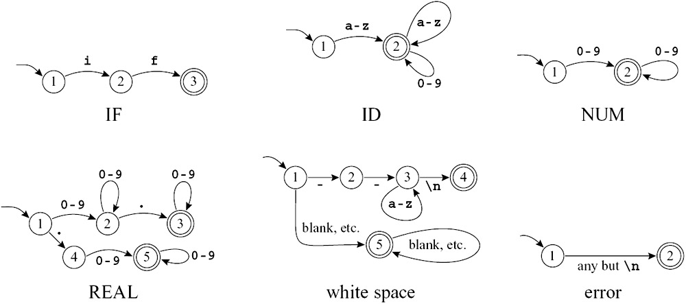
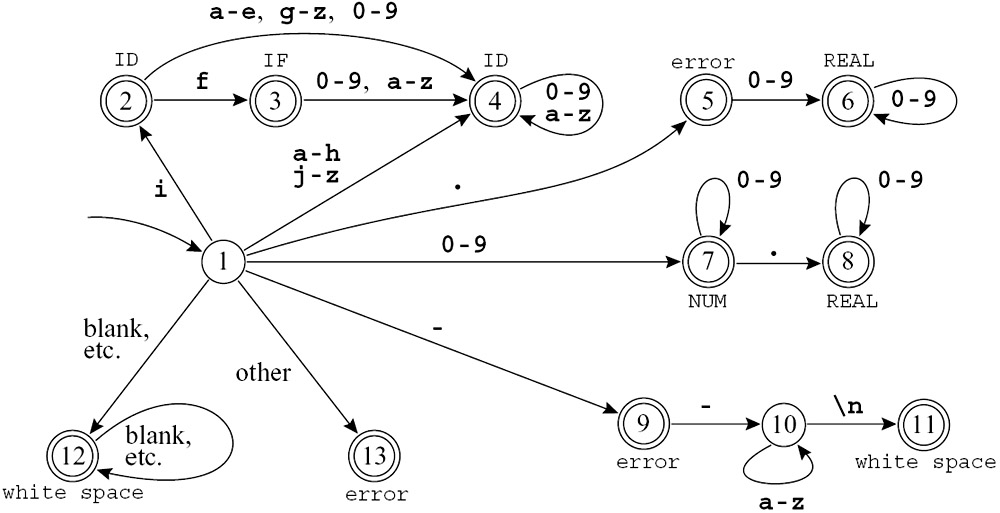
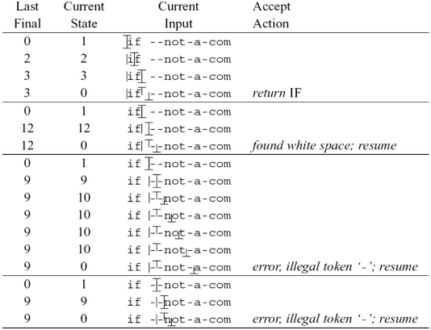
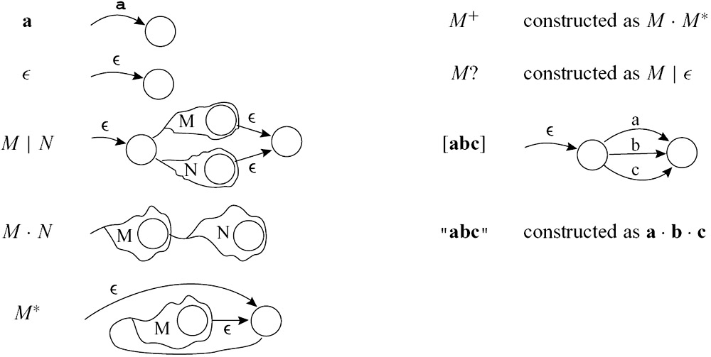

# 词法分析

??? question "为什么要把词法分析和语法分析分开"
    从本质上来说,词法分析使用的是DFA,语法分析使用的是CFG,如果不先做一步词法分析,语法分析当然也能涵盖词法分析的能力,但是会让语法分析的过程显得更复杂


## Lexical Token

词法分析器会把字符流切分为一系列 Token。常见类别如下:


!!! note "区分元字符与字面量"
    在正则中,`.` 通常是元字符；但放进引号后(如 `"a.*"`),可按普通文本处理。

| Token 类别 | 作用 | 示例 |
| --- | --- | --- |
| 关键字 (Keyword) | 语言保留字,有固定语义 | `if`, `while`, `int`, `return` |
| 标识符 (Identifier) | 程序员定义的名字 | `sum`, `count`, `main` |
| 字面量 (Literal) | 直接写在代码里的常量值 | `123`, `3.14`, `'a'`, `"hello"` |
| 运算符 (Operator) | 表示运算或比较 | `+`, `-`, `*`, `/`, `==`, `=` |
| 分隔符 (Delimiter / Punctuation) | 分隔语句或表达式结构 | `;`, `,`, `(`, `)`, `{`, `}` |

实际上,字面量还可以分为NUM(整数)与REAL(实数)等.

类似的, 还有一些内容被称为 **Non-tokens**，它们在经过词法分析器时会被直接跳过或丢弃，不生成 Token 传递给语法分析器，主要包括：

- **空白字符 (Whitespaces)**：包括空格 (Space)、制表符 (Tab)、换行符 (Newline) 等。它们的作用通常仅是为了分隔其他的 Token。

- **注释 (Comments)**：包括单行注释（如 `// ...`）和多行注释（如 `/* ... */`）。代码注释纯粹是为了人类阅读，对程序的语义没有实质影响。

- **预处理指令 (Preprocessor Directives)**：比如在 C/C++ 中的 `#include`、`#define` 等，它们通常在独立的预处理阶段或者词法阶段初就被执行或展开，不会作为原本的 Token 交给后端的分析阶段。

以下面这段代码为例:

```c
#include<stdio.h>
#define ZERO 0.

/* find a zero */
float match0(char *s) { 
    if (!strncmp(s, "0.0", 3))
    return ZERO; 
}  

```

有些编译器会预先过滤为:

```c
float match0(char *s) {
    if (!strncmp(s,"0.0",3))    
    return 0.;} 
```

对应的 Token 序列可以写成:

```text
FLOAT ID(match0) LPAREN CHAR STAR ID(s) RPAREN LBRACE
IF LPAREN BANG ID(strncmp) LPAREN ID(s) COMMA STRING(0.0) COMMA NUM(3) RPAREN RPAREN
RETURN REAL(0.0) SEMI
RBRACE EOF
```

!!! summary "词法分析与 Token 规则总结"
    - **标识符规则 (Identifiers)**: 标识符由字母和数字组成，且**首字符必须是字母**。其中，下划线 `_` 被视为字母。
    - **大小写敏感 (Case Sensitivity)**: 大写字母和小写字母是不同的（例如 `Var` 和 `var` 是两个不同的标识符）。
    - **最长匹配原则 (Maximal Munch)**: 当输入流被解析为 Token 时，如果遇到一个字符，分析器会尽可能地去匹配**能构成合法 Token 的最长字符串**（例如遇到 `==` 会解析为一个等号运算符 Token，而不是两个赋值运算符 `=` 分离的 Token）。
    - **非记号过滤 (Non-tokens)**: 空白字符 (空格、制表符、换行符) 以及注释都会被直接忽略，除非它们的作用是用于分隔其他的 Token。
    - **必要的分隔**: 在某些情况下（如相邻的标识符、关键字、常量之间），**必须需要**使用空白字符将它们隔开，否则它们会被根据最长匹配原则合并为一个 Token。

## 正则表达式

重复的内容不讲了,在[这里](../TOC/ch1.md#finite-representations-of-languages)

| 写法 | 含义 | 示例说明 |
| --- | --- | --- |
| `[abcd]` | 匹配括号内任意一个字符 | 等同于 `(a | b | c | d)` |
| `[b-g]` | 匹配范围内的任意一个字符 | 等同于 `[bcdefg]` |
| `[b-gM-Qkr]` | 匹配多个范围或独立字符中的任意一个 | 等同于 `[bcdefgMNOPQkr]` |
| `M?` | 匹配 $M$ 零次或一次（可选） | 等同于 `(M | ε)` |
| `M+` | 匹配 $M$ 一次或多次（至少一次） | 等同于 `(M · M*)` |
| `.` | 匹配除换行符外的任意单个字符 | `a.c` 可匹配 `abc`、`a9c` |
| `"a.*"` | 引号中的字符串按字面意义匹配 | 表示字符序列 `a.*` 本身,而不是“a 后跟任意字符” |

---

下面,我们可以看一些例子:


```lex
if                                      { return IF; }
[a-z][a-z0-9]*                          { return ID; } 
[0-9]+                                  { return NUM; } 
([0-9]+"."[0-9]*)|([0-9]*"."[0-9]+)     { return REAL; }
("--"[a-z]*"\n")|(" "|"\n"|"\t")+       { /* do nothing */ }
.                                       { error(); }
```

- `if { return IF; }`：遇到了保留字 `if`，直接返回 `IF` 这个 Token。

- `[a-z][a-z0-9]* { return ID; }`：匹配以小写字母开头，后接零个或多个小写字母/数字的字符串。这就是前面定义的**标识符**规则，返回 `ID`。

- `[0-9]+ { return NUM; }`：匹配一个或多个数字序列，返回整数型 Token `NUM`。

- `([0-9]+"."[0-9]*)|([0-9]*"."[0-9]+) { return REAL; }`：左半部分匹配 `123.` 这种形式，右半部分匹配 `.456` 这种形式，共同构成了**浮点数**规则，返回 `REAL`。

- `("--"[a-z]*"\n")|(" "|"\n"|"\t")+ { /* do nothing */ }`：用来匹配哪些Non-tokens
    - 左边 `"--"[a-z]*"\n"` 用于匹配以 `--` 开头的单行注释。

    - 右边 `(" "|"\n"|"\t")+` 用于匹配一个及以上的空格、换行或制表符（空白字符）。

- `. { error(); }`：`.` 表示匹配除换行符以外的任何**其他单字符**。相当于一个兜底策略,如果前面的匹配都没对上,说明匹配出了问题,因此这里要返回一个报错

---

事实上,有了上面这些规则之后还无法完成词法分析的内容,因为仍然存在歧义

!!! examle "if8"
    "if8"既可以被识别为`ID(if8)`,也可以被识别为`IF NUM(8)`,我们应该如何区分这两种?


- 和计网里面学过的最长子网前缀匹配规则一样,当有一个串可以被多种方式匹配时,我们选择能匹配最长子串的方式,在这里就表现为`ID(if8)`

- 另外,如果两种方式都能匹配同样长的子串,我们按照匹配规则的重要性选择.因此,`if`会被当作`IF`而不是`ID(if)`,因为保留字的匹配优先级更高.

## FA

自动机的内容在[这里](../TOC/ch2.md#自动机automata)

如下图,之前讨论的正则表达式可以写为如下的DFA:


<div style="text-align: center;">

<br>
<caption>DFA*6</caption> </div>


考虑到划分token的优先级,我们可以把上面的DFA汇总为:

<div style="text-align: center;">

<br>
<caption>DFA All-in-One</caption> </div>

> 可以看到,在读取到一个`i`的时候,会先认为读取到的是一个`ID`,但是如果后续读取到一个`f`,就会把之前的`i`和现在的`f`合并成一个`IF`,这就是最长匹配原则和优先级原则的体现.

上面画成图之后,人比较容易看懂；但编译器真正实现时,一般不会拿着图一条边一条边地找,而是会把整个 DFA 编码成一个**状态转移表 (transition matrix)**。

### DFA 的表驱动实现

所谓 transition matrix,本质上就是一个二维数组:

- 行表示**当前状态编号**


- 列表示**当前读到的输入字符**

- 表里的值表示: 读到这个字符后,应该跳到哪个状态

也就是说,原来图上的一条边:

```text
状态 i --读到字符 c--> 状态 j
```

现在就可以写成:

```c
edges[i][c] = j;
```

这样做的好处是,运行时不需要“在图里找边”,只要查一次表就行.


例如:

```c
int edges[][] = {
/* columns    {0,1,2,...,-,...,e,f,g,h,i,j,...} */
/* state 0 */ {0,0,...},
/* state 1 */ {0,0,...7,7,7...9...4,4,4,4,2,4...},
/* state 2 */ {0,0,...4,4,4...0...4,3,4,4,4,4...},
...
}
```

它表达的意思其实很朴素:

- `state 1` 这一行: 表示“当前在状态 1 时”,如果输入不同字符,分别该跳到哪里

- 比如某几列是 `7,7,7`,表示读到那几类字符时,都跳到状态 7

- 某一列是 `2`,表示读到那个特定字符时,跳到状态 2

- 某些列是 `0`,表示这个字符在当前状态下**走不通**

### Dead State

为了统一处理“没有这条边”的情况,通常会专门留一个 **Dead State**（死状态）,一般记为 `state 0`.

它有两个特点:

- 如果某个状态遇到不合法字符,就跳到 `state 0`
- `state 0` 无论再读到什么字符,都还停在 `state 0`

也就是所谓的“掉进去就出不来了”.

```c
/* state 0 */ {0,0,0,0,0,...}
```

这行的含义就是: 从死状态出发,读任何字符都回到自己.


### Finality Array

光有 `edges` 还不够,因为它只告诉我们**怎么走**,却没有告诉我们**走到这里意味着什么**。

所以还要再配一个 **Finality Array**，它的作用是记录:

- 哪些状态是**终态 (final state)**

- 这个终态对应的 Token 或动作是什么

例如:

```text
state 2 -> ID
state 5 -> NUM
state 8 -> REAL
```

意思就是:


- 如果扫描最后停在状态 2,说明当前识别出了一个 `ID`

- 如果停在状态 5,说明识别出了一个 `NUM`

- 如果停在状态 8,说明识别出了一个 `REAL`

所以PPT里说的:

> A "finality" array, mapping state numbers to actions

其实就是“建立一个从**状态编号**到**动作/Token 类型**的映射表”.

可以粗略写成:

```c
int finality[] = {
    /* 0 */ NONE,
    /* 1 */ NONE,
    /* 2 */ ID,
    /* 3 */ NONE,
    /* 4 */ ID,
    /* 5 */ NUM,
    ...
};
```

其中:

- `NONE` 表示这个状态还不是一个合法终态

- `ID`、`NUM` 之类表示: 如果停在这里,就应该返回对应的 Token

---

前面说了 `edges` 和 `finality` 怎么配合,下面可以直接看一个真正扫描输入串的过程。  
假设当前输入是:

```text
if --not-a-com
```

!!! example "按表驱动方式扫描 `if --not-a-com`"
    === "表头含义"
        这里表格里的几列可以这样理解:

        | 列名 | 含义 |
        | --- | --- |
        | `Last Final` | 最近一次到达的终态编号 |
        | `Current State` | 当前自动机所在状态 |
        | `Current Input` | 还没处理的输入,下划线 `_` 表示当前读头位置 |
        | `Accept Action` | 如果此时需要停下来,应该执行什么动作 |

        其中 `Last Final` 很关键,因为它记录的是:

        - 虽然我们还在继续往后读
        - 但“最近一次曾经读成一个合法 Token”的位置在哪里

        这正是最长匹配原则在实现里的落点.

    === "识别 `IF`"
        一开始从初态出发:

        ```text
        Last Final   Current State   Current Input
        0            1               _if --not-a-com
        ```

        读入 `i` 之后,到达某个可接受状态.此时:

        - 当前串 `i` 可以先被看成一个普通标识符前缀
        - 所以 `Last Final` 会先被更新

        继续读入 `f` 之后:

        - 自动机进入代表 `IF` 的终态
        - `Last Final` 更新为这个更“高级”的终态

        再继续往后看,下一个字符是空格,而 `IF` 后面不能再直接接字母数字继续扩展:

        ```text
        Last Final   Current State   Current Input     Accept Action
        3            0               if_ --not-a-com   return IF
        ```

        这一步的意思是:

        - 继续尝试转移时,发现走不通,掉进了 `state 0`
        - 但没关系,因为我们还记得最近一次合法终态是 `3`
        - 所以此时回退到那个终态对应的位置,执行 `return IF`

        这就是:

        - **先尽量往后读**
        - **一旦走不动,就返回最近一次合法匹配**

    === "跳过空白符"
        识别完 `IF` 之后,扫描器不会停机,而是继续从空格开始扫描:

        ```text
        Last Final   Current State   Current Input
        0            1               if_ --not-a-com
        12           12              if _--not-a-com
        12           0               if _--not-a-com   found white space; resume
        ```

        这里说明:

        - 空格本身也可以被 DFA 识别成某种“非 token”
        - 对应的动作不是返回一个真正的 Token
        - 而是 `found white space; resume`,也就是“发现空白符,跳过后继续扫描”

        所以空白符虽然也会被自动机识别,但最后不会送给语法分析器.

    === "非法 Token"
        继续往后,输入来到:

        ```text
        --not-a-com
        ```

        自动机开始尝试匹配:

        ```text
        Last Final   Current State   Current Input
        0            1               if _--not-a-com
        9            9               if -_-not-a-com
        9            10              if --n_ot-a-com
        9            10              if --no_t-a-com
        ...
        9            0               if --not-a_com   error, illegal token '-'; resume
        ```

        - 扫描器起初把 `-` 当成可能的注释

        - 所以 `Last Final` 先记下了状态 `9`

        - 但随着后面继续读入,发现出现了[a-z]与`\n`之外的字符,说明是语法错误

        - 最终转移失败,进入 `state 0`

        于是扫描器就会:

        - 回到最近一次合法终态

        - 发现那个终态其实只对应一个单独的 `-`

        - 但这里的上下文下它并不能构成合法 token

        - 因此报错: `illegal token '-'`.这里的'-'指的是那个第一个`-`,因为Final State中只读到了那个`-`,后面的`-not-a-com`都没读到,所以报错时只能说是那个`-`不合法

        后面的 `resume` 表示:

        - 报错之后,扫描器不会整个停止
        - 而是跳过这个出错位置,从后面继续扫描

    === "总结"
        1. 自动机每读一个字符,就按 `edges` 转移

        2. 如果当前状态是终态,就更新 `Last Final`

        3. 只要还能继续匹配,就继续读

        4. 一旦走不通,也就是没有对应的转移,进入了State 0,就根据 `Last Final` 决定返回 token、跳过空白符,或者报告词法错误

        词法分析器不是“读到一个字符就立刻决定”,而是会一边向前试探,一边记住最近一次合法终态。

        这样一来,既能实现**最长匹配**,也能在失败时知道应该**返回哪个 token、跳过哪些内容、或者从哪里开始报错并继续扫描**。

    

---

### NFA

如[这里](../TOC/ch2.md#nfanondeterministic-finite-automata)所讲,把正则表达式转换为一个NFA,再将NFA转换为DFA,是比较可行的一种做法.

<div style="text-align: center;">

<br>
<caption>RE->NFA</caption> </div>

??? info "NFA转DFA的算法from codex"

    也可以看 https://blog.csdn.net/weixin_43655282/article/details/108963761


    实际上,就是一直从开始状态的$\epsilon$-closure出发,不断地计算新的状态集合,直到没有新状态产生为止.

    === "两个基本操作"
        在真正构造之前,先要会两个操作:

        - `ε-closure(S)`:
          从状态集合 `S` 出发,只沿着 `ε` 边一直走,所有能到达的状态都算进来

        - `move(S, a)`:
          从状态集合 `S` 出发,读入字符 `a` 后,所有可能到达的状态集合

        实际构造时,每次真正算的新状态都是:

        ```text
        ε-closure(move(S, a))
        ```

    === "算法步骤"
        设 NFA 的开始状态为 `s0`,那么:

        1. 先算出 `ε-closure({s0})`

        2. 把这个状态集合作为 DFA 的初态

        3. 对每个还没处理过的 DFA 状态 `S`,以及每个输入字符 `a`:

            - 计算 `T = ε-closure(move(S, a))`

            - 从 `S` 向 `T` 连一条标号为 `a` 的边

            - 如果 `T` 是新集合,就把它加入 DFA 状态集合

        4. 重复上一步,直到没有新状态产生为止

    === "终态确定"

        $F' = \{K \subseteq Q \mid K \cap F \neq \emptyset\}$：终止状态集包含所有与NFA终止状态有交集的状态子集。


#### DFA中的等价状态

在得到NFA转换而来的DFA之后,有时我们可以对这个DFA进行**最小化**处理,也就是合并一些**等价状态**。

!!! definition "等价状态 (Equivalent States)"
    如果对于DFA中的两个状态 `p` 和 `q`，对于任意输入字符串 `w`，从状态 `p` 出发经过输入 `w` 最终停在一个接受状态的条件与从状态 `q` 出发经过输入 `w` 最终停在一个接受状态的条件完全相同，那么我们就称状态 `p` 和 `q` 是**等价的**。

!!! info "划分等价状态的方法 (分组法)"
    这个方法的思想是: 不直接去证明“两个状态对任意字符串都一样”,而是先把**看起来可能等价**的状态放进同一组,再不断把其中“不真的等价”的状态踢出去。

    === "初始分组"
        第一步只按“是不是终态”分:

        - 所有**终止状态**放在一组

        - 所有**非终止状态**放在一组

        这是因为:

        - 终态和非终态一定不等价

        - 但同为终态的状态,或者同为非终态的状态,还**有可能**等价

    === "不断细分"
        接下来检查每一个组内部的状态。

        对于同一组里的两个状态 `s` 和 `t`,如果对某个输入符号 `a`,它们转移到的状态**不在同一组**,那么 `s` 和 `t` 就不应该留在同一组里。

        更形式化一点地说:

        - `s` 和 `t` 能留在同一组

        - 当且仅当对每个输入符号 `a`,都有 `trans[s, a]` 和 `trans[t, a]` 落在同一组

        如果不满足,就把原来的组拆开,形成几个更小的新组。

        然后:

        1. 对所有组重复这个检查

        2. 只要某个组还能继续拆,就继续拆

        3. 直到所有组都稳定下来,不再变化为止

        最后剩下的这些组,就对应**最小化 DFA** 里的状态。

    === "构造最小 DFA"

        当分组稳定后:

        - 每一个组,就是最小 DFA 的一个状态

        - 原来 DFA 的开始状态属于哪个组,哪个组就是新 DFA 的开始状态

        - 只要一个组里含有原来的某个终态,这个组就是新 DFA 的终态

        新 DFA 的边也很好加:

        - 因为同一组里的所有状态,在同一个输入符号下,都会转移到**同一组**

        - 所以可以直接把“组”当作新状态来连边

    === "例子"
        设这个 DFA 的状态集合是:

        $$
        Q = \{A, B, C, D, E\}
        $$

        输入字母表:

        $$
        \Sigma = \{0, 1\}
        $$

        终态是:

        $$
        F = \{C, D\}
        $$

        转移表如下:

        | 状态 | `0` | `1` |
        | --- | --- | --- |
        | `A` | `B` | `C` |
        | `B` | `A` | `D` |
        | `C` | `E` | `C` |
        | `D` | `E` | `D` |
        | `E` | `E` | `E` |

        === "第一步: 初始分组"
            先按“终态/非终态”分组:

            $$
            P_0 = \{\{C,D\}, \{A,B,E\}\}
            $$

            因为终态和非终态肯定不等价。

        === "第二步: 检查终态组"
            接着检查终态组 `\{C, D\}`。

            对状态 `C`:

            - 读 `0` 时,`C \to E`,而 `E` 在组 `\{A,B,E\}`

            - 读 `1` 时,`C \to C`,而 `C` 在组 `\{C,D\}`

            所以 `C` 的去向模式是:

            $$
            (\{A,B,E\}, \{C,D\})
            $$

            对状态 `D`:

            - 读 `0` 时,`D \to E`,而 `E` 在组 `\{A,B,E\}`

            - 读 `1` 时,`D \to D`,而 `D` 在组 `\{C,D\}`

            所以 `D` 的模式也是:

            $$
            (\{A,B,E\}, \{C,D\})
            $$

            因此 `C` 和 `D` 仍然等价,这一组不用拆。

        === "第三步: 检查非终态组"
            再检查非终态组 `\{A, B, E\}`。

            对状态 `A`:

            - 读 `0` 时,`A \to B`,而 `B` 在 `\{A,B,E\}`
            - 读 `1` 时,`A \to C`,而 `C` 在 `\{C,D\}`

            模式是:

            $$
            (\{A,B,E\}, \{C,D\})
            $$

            对状态 `B`:

            - 读 `0` 时,`B \to A`,而 `A` 在 `\{A,B,E\}`

            - 读 `1` 时,`B \to D`,而 `D` 在 `\{C,D\}`

            模式也是:

            $$
            (\{A,B,E\}, \{C,D\})
            $$

            对状态 `E`:

            - 读 `0` 时,`E \to E`,而 `E` 在 `\{A,B,E\}`
            - 读 `1` 时,`E \to E`,而 `E` 仍在 `\{A,B,E\}`

            模式是:

            $$
            (\{A,B,E\}, \{A,B,E\})
            $$

            所以 `A` 和 `B` 模式相同,但 `E` 不同,这一组需要拆开:

            $$
            \{A,B,E\} \Rightarrow \{A,B\}, \{E\}
            $$

            于是新的划分为:

            $$
            P_1 = \{\{C,D\}, \{A,B\}, \{E\}\}
            $$

        === "第四步: 再检查一轮"
            现在继续检查还能不能再拆。

            检查 `\{A,B\}`:

            - `A` 的模式是 `(\{A,B\}, \{C,D\})`
            - `B` 的模式也是 `(\{A,B\}, \{C,D\})`

            所以这一组不用拆。

            检查 `\{C,D\}`:

            - `C` 的模式是 `(\{E\}, \{C,D\})`
            - `D` 的模式也是 `(\{E\}, \{C,D\})`

            所以这一组也不用拆。

            `\{E\}` 只有一个状态,当然也不用拆。

        === "第五步: 得到最小 DFA"
            因此最终分组稳定为:

            $$
            \{\{A,B\}, \{C,D\}, \{E\}\}
            $$

            所以最小化后:

            - `A` 和 `B` 合并成一个状态
            - `C` 和 `D` 合并成一个状态
            - `E` 单独保留

            把新状态记成:

            - `X = [A,B]`
            - `Y = [C,D]`
            - `Z = [E]`

            则最小 DFA 的转移表为:

            | 新状态 | `0` | `1` |
            | --- | --- | --- |
            | `X = [A,B]` | `X` | `Y` |
            | `Y = [C,D]` | `Z` | `Y` |
            | `Z = [E]` | `Z` | `Z` |

            其中唯一的终态是:

            $$
            \{Y\}
            $$
