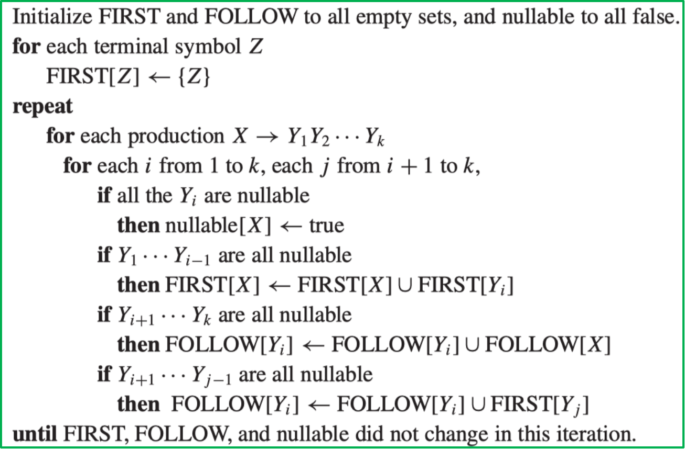
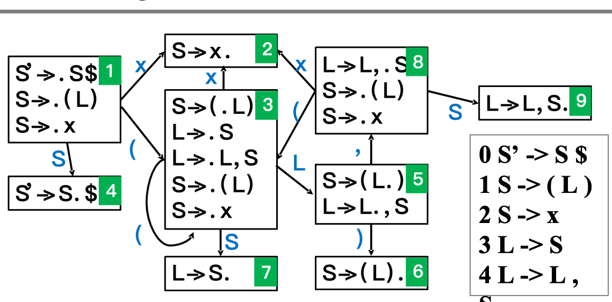
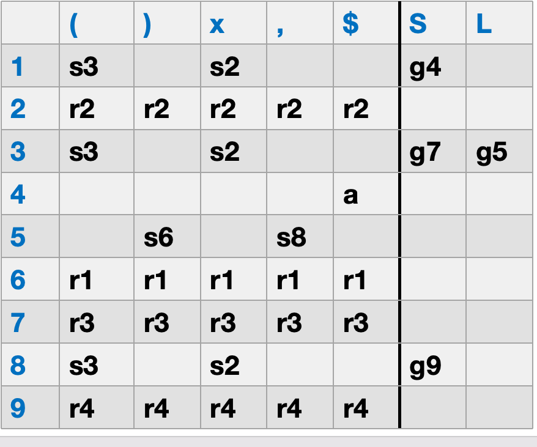

# 语法分析 

基于CFG的parser有两种:

- top-down parser: 从根节点开始,逐步展开到叶子节点

    - 也就是从初始符号开始,根据产生式规则逐步替换成终结符

    - LL(K):**L**eft-to-right scanning, **L**eftmost derivation, **K** lookahead tokens

- bottom-up parser: 从输入字符串开始,逐步归约到根节点

    - 实验中的parser.y就是这种写法

> CFG的细节就不讲了.

## CFG

我们期望实现的效果是,给定CFG文法,检验某个输入字符串是否符合这个文法.

可以先看一个简单例子. 设文法为:

$$
\begin{aligned}
1.\ &E \to E * E \\
2.\ &E \to E / E \\
3.\ &E \to E + E \\
4.\ &E \to E - E \\
5.\ &E \to \text{id} \\
6.\ &E \to \text{num} \\
7.\ &E \to (E)
\end{aligned}
$$

下面说明串 `id * id + id` 可以由该文法推导出来,因此它属于这个文法生成的语言.

按最左推导(leftmost derivation)可写为:

$$
\begin{aligned}
E
&\Rightarrow E + E \\
&\Rightarrow E * E + E \\
&\Rightarrow \text{id} * E + E \\
&\Rightarrow \text{id} * \text{id} + E \\
&\Rightarrow \text{id} * \text{id} + \text{id}
\end{aligned}
$$

因此:

$$
\text{id} * \text{id} + \text{id} \in L(G)
$$

!!! info "Ambiguous grammar"

    上面的文法是**二义性的(ambiguous)**,因为它可以有多于一个的最左推导. 例如:

    $$
    \begin{aligned}
    E
    &\Rightarrow E * E \\
    &\Rightarrow E * E + E \\
    &\Rightarrow \text{id} * E + E \\
    &\Rightarrow \text{id} * \text{id} + E \\
    &\Rightarrow \text{id} * \text{id} + \text{id}
    \end{aligned}
    $$

    而我们前面已经给出了另一种最左推导:

    $$
    \begin{aligned}
    E
    &\Rightarrow E + E \\
    &\Rightarrow E * E + E \\
    &\Rightarrow \text{id} * E + E \\
    &\Rightarrow \text{id} * \text{id} + E \\
    &\Rightarrow \text{id} * \text{id} + \text{id}
    \end{aligned}
    $$

    这两种推导对应两种不同的分组方式:

    - `((id * id) + id)`
    - `(id * (id + id))`

    因此同一个串对应了不止一棵语法树,所以该文法是二义性的.

为了消除这种歧义,我们选择引入更多的非终结符

- `E` 表示 expression

- `T` 表示 term

- `F` 表示 factor

改写后的无二义性文法可以写成:

$$
\begin{aligned}
1.\ &E \to E + T \\
2.\ &E \to E - T \\
3.\ &E \to T \\
4.\ &T \to T * F \\
5.\ &T \to T / F \\
6.\ &T \to F \\
7.\ &F \to \text{id} \\
8.\ &F \to \text{num} \\
9.\ &F \to (E)
\end{aligned}
$$

这个改写的作用是:

- `E` 层只处理 `+` 和 `-`
- `T` 层只处理 `*` 和 `/`
- `F` 层只处理最基本的因子,如 `id`、`num`、括号表达式

于是乘除只能先在 `T` 这一层归约,加减只能在 `E` 这一层归约,从而强制了:

- `*`、`/` 的优先级高于 `+`、`-`
- $E \to E + T$、$E \to E - T$、$T \to T * F$、$T \to T / F$ 这样的左递归形式会对应**左结合(left associativity)**.这相当于语法树不断向左下角延伸,从而保证了左边的表达式先被计算

---

!!! definition "$"
    
    在文法中,我们用 `$` 来表示输入串的结束符(end of input),它不属于文法中的任何一个终结符. 例如,对于上面的文法,我们可以把输入串写成 `id * id + id $`,其中 `$` 表示输入串的结束.

## Recursive-descent parsing

前面讨论了 top-down parser 的基本思想. 更进一步,如果文法合适,我们甚至可以直接把文法翻译成一组递归函数,这就是**递归下降分析(recursive-descent parsing)**.

它的核心思想很直接:

- 每个非终结符对应一个递归函数
- 调用某个函数,就表示“尝试匹配这个非终结符”
- 这个非终结符的每个产生式,在代码里通常对应这个函数中的一个分支

例如,考虑下面这个文法:

$$
\begin{aligned}
S &\to \text{if}\ E\ \text{then}\ S\ \text{else}\ S \\
S &\to \text{begin}\ S\ L \\
S &\to \text{print}\ E \\
L &\to \text{end} \\
L &\to ;\ S\ L \\
E &\to \text{num} = \text{num}
\end{aligned}
$$

这个文法的结构很适合直接写成递归下降分析器. 例如:

- `S()` 负责匹配非终结符 `S`
- `L()` 负责匹配非终结符 `L`
- `E()` 负责匹配非终结符 `E`

其中 `L` 的两个产生式

$$
L \to \text{end}
\qquad
L \to ;\ S\ L
$$

就可以直接翻译成下面这样的代码:

```c
void L(void) {
    switch (tok) {
        case END:
            eat(END);
            break;
        case SEMI:
            eat(SEMI);
            S();
            L();
            break;
        default:
            error();
    }
}
```

这里的逻辑是:

- 如果当前记号是 `END`,就匹配产生式 `L \to end`
- 如果当前记号是 `SEMI`,就匹配产生式 `L \to ; S L`
- 否则说明输入不符合文法,调用 `error()`

其中:

- `tok` 表示当前向前看记号(current token)
- `eat(x)` 表示“当前记号必须是 `x` ,然后读入下一个记号”
- `error()` 表示语法错误

这样一来,文法规则就几乎一比一地变成了程序结构. 这也是递归下降分析最直观的地方: **文法的结构,基本上就是代码的结构**.

上面的例子非常简单,因为每一个非终结符的产生式的第一个字符都是不同的终结符,这使得我们可以直接根据当前记号来选择匹配哪个产生式. 但是如果文法更复杂,就不一定能直接写成递归下降分析器了.

下面看一个更接近实际表达式处理的例子. 设文法为:

$$
\begin{aligned}
S &\to E\$ \\
E &\to E + T \\
E &\to E - T \\
E &\to T \\
T &\to T * F \\
T &\to T / F \\
T &\to F \\
F &\to \text{id} \\
F &\to \text{num} \\
F &\to (E)
\end{aligned}
$$

按照前面的思路,我们很自然会想“给每个非终结符写一个函数”. 比如:

```c
void S(void) {
    E();
    eat(EOF);
}

void E(void) {
    switch (tok) {
        case ???:
            E();
            eat(PLUS);
            T();
            break;
        case ???:
            E();
            eat(MINUS);
            T();
            break;
        case ???:
            T();
            break;
        default:
            error();
    }
}
```

问题马上就出现了: 如果当前记号是 `num` 或 `id`,那么 `E` 的三个产生式

$$
E \to E + T
\qquad
E \to E - T
\qquad
E \to T
$$

看起来都“有可能”被使用. 也就是说,只看当前一个记号,我们并不能决定到底该选哪一个分支.

更严重的是,如果真的直接按 $E \to E + T$ 把代码写成对 `E()` 的递归调用,那么 `E()` 一进入自己又会立刻调用自己,从而导致**无限递归**. $T \to T * F$ 和 $T \to T / F$ 也有同样的问题.

这说明一件事: **并不是所有 CFG 都能直接写成递归下降分析器**.

综上,我们需要解决这两个问题:

1. 首先,我们需要知道在这三个产生式中进行选择时,各自产生式可能出现的第一个终结符.

2. 其次,如果多个产生式都可能以 `num` 开始,就需要改写文法,使得在该处只能唯一地选择一个产生式.


下面先解决第一个问题:

---

首先,我们需要了解三个set:

=== "Nullable"

    Nullable(X) = true,如果 X 能够推导出空串 $\epsilon$; 否则 Nullable(X) = false.

=== "First"

    First(X) = {a | X $\Rightarrow^*$ a$\alpha$},其中 a 是一个终结符, $\alpha$ 是一个字符串.
    > 也就是说,First(X) 包含了所有可能出现在 X 推导出的字符串开头的终结符.

=== "Follow"
    Follow(X) = {a | S $\Rightarrow^*$ $\alpha X a \beta$},其中 a 是一个终结符, $\alpha$ 和 $\beta$ 是字符串.
    > Follow(X)实际上和由X产生的字符串无关,它看重的是在整个生成过程中,X的后面可能会跟什么终结符.

有了这些定义之后,我们就可以回答这样一个问题:

- 对于非终结符 $X$ 的某个产生式 $X \to \gamma$,它可能以哪些终结符开头?

规则是:

- 任何属于 $First(\gamma)$ 的终结符,都可能作为这个产生式推导结果的第一个终结符

- 如果 $\gamma \Rightarrow^* \epsilon$,那么任何属于 $Follow(X)$ 的终结符,也可能在选择 $X \to \gamma$ 时出现在当前输入位置

也就是说,对产生式 $X \to \gamma$ 来说,它对应的候选输入记号集合可以写成:

$$
First(\gamma)\ \cup\ Follow(X) \qquad \text{if } \gamma \Rightarrow^* \epsilon
$$

更准确地说:

$$
\text{Predict}(X \to \gamma)=
\begin{cases}
First(\gamma), & \gamma \not\Rightarrow^* \epsilon \\
\left(First(\gamma) - \{\epsilon\}\right) \cup Follow(X), & \gamma \Rightarrow^* \epsilon
\end{cases}
$$

这个集合的作用是: 当当前 lookahead token 落在这个集合里时,我们就可以考虑选择产生式 $X \to \gamma$.

---

因此,只要我们写出了每个非终结符的 First 和 Follow 集合,就可以知道在每个非终结符的每个产生式处,应该选择哪个分支了.

接下来是具体的算法介绍.

### Computing Nullable, First, Follow

#### Nullable 的计算

$Nullable(X)=\text{true}$ 当且仅当 $X \Rightarrow^* \epsilon$.

这个集合通常用迭代法计算,思路和不动点求解类似:

```text
for each symbol X:
    Nullable(X) = false

repeat
    for each production X -> Y1 Y2 ... Yk:
        if Nullable(Yi) = true for all 1 <= i <= k:
            Nullable(X) = true
until Nullable did not change in this iteration
```

也就是说:

- 初始时先假设没有任何符号可以推出空串
- 如果某个产生式右侧的所有符号都可空,那么左侧非终结符也可空
- 持续重复,直到集合不再变化

#### First 的计算

$First(X)$ 可以按归纳方式定义.

Base case:

- 如果 $X$ 是终结符,那么

$$
First(X)=\{X\}
$$

Inductive case:

- 如果 $X$ 是非终结符,并且有产生式

$$
X \to Y_1 Y_2 \cdots Y_k
$$

那么:

$$
First(X)=First(X)\cup First(Y_1Y_2\cdots Y_k)
$$

而

$$
First(Y_1Y_2\cdots Y_k)=F_1\cup F_2\cup \cdots \cup F_k
$$

其中:

- $F_1 = First(Y_1)$
- 如果 $Y_1 \Rightarrow^* \epsilon$,那么 $F_2 = First(Y_2)$; 否则 $F_2 = \varnothing$
- 依此类推
- 如果 $Y_1Y_2\cdots Y_{k-1} \Rightarrow^* \epsilon$,那么 $F_k = First(Y_k)$; 否则 $F_k = \varnothing$


直观理解也很显然,由于在First中的终结符一定要是在最左侧的,所以要么是 $Y_1$ 的First,要么是后面一堆产生的First,前提是$Y_1$可以消失.

#### Follow 的计算

$Follow(X)$ 一般通过迭代方式计算.

基例(base case):

- 初始时先假设没有任何终结符跟在 $X$ 后面

$$
Follow(X)=\varnothing
$$

归纳步骤(inductive case):

- 对任意字符串 $\alpha,\beta$,如果有产生式

$$
Y \to \alpha X \beta
$$

那么:

$$
Follow(X)=Follow(X)\cup First(\beta)
$$

- 对任意字符串 $\alpha,\beta$,如果有产生式

$$
Y \to \alpha X \beta
\qquad\text{且}\qquad
\beta \Rightarrow^* \epsilon
$$

那么:

$$
Follow(X)=Follow(X)\cup Follow(Y)
$$

这两条规则的含义分别是:

- 如果 $X$ 后面还跟着一个串 $\beta$,那么 $\beta$ 能出现的首终结符,也可能跟在 $X$ 后面
- 如果 $\beta$ 可以整体消失,那么原来能跟在 $Y$ 后面的终结符,也能跟在 $X$ 后面

因此,`Nullable`、`First`、`Follow` 三者通常都不是一次就能算完,而是要不断扫描全部产生式,直到结果不再变化为止.

---

!!! example

    设文法为:

    $$
    \begin{aligned}
    Z &\to X Y Z \\
    Z &\to d \\
    Y &\to c \\
    Y &\to \epsilon \\
    X &\to a \\
    X &\to Y
    \end{aligned}
    $$

    我们希望最后填出下表:

    | Symbol | Nullable | First | Follow |
    | --- | --- | --- | --- |
    | $Z$ |  |  |  |
    | $Y$ |  |  |  |
    | $X$ |  |  |  |

    === "Step 1: Nullable"

        先判断哪些非终结符可以推出空串.

        可以从最直接的产生式开始:

        - $Y \to \epsilon$,所以 $Nullable(Y)=\text{true}$
        
        然后发现$X \to Y$,满足最开始说的右边每个项都满足可空,那么 $X$ 也可空,所以 $Nullable(X)=\text{true}$

        但是 $Z$ 的两个产生式 $Z \to X Y Z$ 和 $Z \to d$ 都不能推出空串,所以 $Nullable(Z)=\text{false}$.
        最终结果:

        | Symbol | Nullable |
        | --- | --- |
        | $Z$ | false |
        | $Y$ | true | 
        | $X$ | true |

    === "Step 2: First"

        接下来计算 $First$ 集合.

        我们按照最原始的做法,一个一个产生式地去计算.

        - 初始全部置空

        - $Z \to X Y Z$ 中,因为 $X,Y$ 可空,所以 $First(Z)=First(Z) \cup First(X Y Z) = First(X) \cup First(Y) \cup First(Z)=\{ \}$

        - $Z \to d$ 中,因为 $d$ 是终结符,所以 $First(d) = \{d\}$,因此 $First(Z) = \{d\}$

        - $Y \to c$ 中,因为 $c$ 是终结符,所以 $First(c) = \{c\}$,因此 $First(Y) = \{c\}$

        - $Y \to \epsilon$ 中,因为 $\epsilon$ 是空串,所以不考虑

        - $X \to a$ 中,因为 $a$ 是终结符,所以 $First(a) = \{a\}$,因此 $First(X) = \{a\}$

        - $X \to Y$ 中,$First(X) = First(X) \cup First(Y) = \{a\} \cup \{c\} = \{a,c\}$

        这一轮发生了变化,所以还要进行下一轮:

        - $Z \to X Y Z$ 中,$First(Z)=First(Z) \cup First(X Y Z) = First(X) \cup First(Y) \cup First(Z)=\{a,c,d\}$

        ...后面就没有变化了,可以自己去尝试

        因此最后的结果是:

        | Symbol | First |
        | --- | --- |
        | $Z$ | $\{a,c,d\}$ |
        | $Y$ | $\{c\}$ |
        | $X$ | $\{a,c\}$ |

    === "Step 3: Follow"

        最后计算 $Follow$ 集合.

        同样,初始全部为空

        - $Z = \to X Y Z$ ,这个式子我们可以得到:

            - $Follow(X) = Follow(X) \cup First(Y Z) = Follow(X) \cup First(Y) \cup First(Z) = \{a,c,d\}$

            - $Follow(Y) = Follow(Y) \cup First(Z) = \{a,c,d\}$

            - $Follow(Z) = Follow(Z) \cup Follow(Z) = \{a,c,d\}$
            > 这是因为Z后面就空了,所以Z的Follow集合也包含Z的Follow集合

        - $X \to Y$ ,这个式子我们可以得到:

            - $Follow(Y) = Follow(Y) \cup Follow(X) = \{a,c,d\}$

        ...后面就没有变化了,因此最终结果是:

        | Symbol | Follow |
        | --- | --- |
        | $Z$ | $\{\}$ |
        | $Y$ | $\{a,c,d\}$ |
        | $X$ | $\{a,c,d\}$ |

**总的来说,要看$First(X)$里有什么,就要去看$X$可以产生什么;要看$Follow(X)$里有什么,就要去看$X$可以被什么产生.**

实际上,这里三个集合的计算可以同时进行:

<div align="center">
    
</div>

---

### 计算parser规则

有了这三个集合的结果,我们就可以开始填表了.

表的结构如下:

|    | $a$ | $c$ | $d$ |
| --- | --- | --- | --- |
| $Z$ |  |  |  |
| $Y$ |  |  |  |
| $X$ |  |  |  |

这个表的含义是:

- 行表示当前要展开的非终结符

- 列表示当前的 lookahead terminal

- 表项 $(X,T)$ 中填入的内容,表示“当栈顶是 $X$ 且当前输入符号是 $T$ 时,应该选择哪条产生式”

也就是说,如果我们已经算出了每条产生式的 $Predict$ 集合,那么就可以把对应的产生式填到表里.

规则如下:

- 如果 $T \in First(\gamma)$,那么就在第 $X$ 行、第 $T$ 列填入产生式 $X \to \gamma$

- 如果 $\gamma$ 是可空的,并且 $T \in Follow(X)$,那么也要在第 $X$ 行、第 $T$ 列填入产生式 $X \to \gamma$

> 实际上就是说,我们相信这个产生式能够满足下一个终结符是lookahead token的情况,所以就把它填到表里. 


这里填完的结果是:

|    | $a$ | $c$ | $d$ |
| --- | --- | --- | --- |
| $Z$ | $Z \to X Y Z$ | $Z \to X Y Z$ | $Z \to X Y Z$ , $Z \to d$ |
| $Y$ | $Y \to \epsilon$ | $Y \to c$ , $Y \to \epsilon$ | $Y \to \epsilon$ |
| $X$ | $X \to a$ , $X \to Y$ | $X \to Y$ | $X \to Y$ |

更细一点逐条看:

- $Z \to X Y Z$:
  因为 $First(XYZ)=\{a,c,d\}$,所以填入 $(Z,a)$、$(Z,c)$、$(Z,d)$

- $Z \to d$:
  因为 $First(d)=\{d\}$,所以再填入 $(Z,d)$

- $Y \to c$:
  因为 $First(c)=\{c\}$,所以填入 $(Y,c)$

- $Y \to \epsilon$:
  因为右侧可空,所以看 $Follow(Y)=\{a,c,d\}$,于是填入 $(Y,a)$、$(Y,c)$、$(Y,d)$

- $X \to a$:
  因为 $First(a)=\{a\}$,所以填入 $(X,a)$

- $X \to Y$:
  因为 $First(Y)=\{c\}$,并且 $Y$ 可空,还要并上 $Follow(X)=\{a,c,d\}$,所以最终填入 $(X,a)$、$(X,c)$、$(X,d)$

可以看到,这个表里出现了多个冲突:

- 在 $(Z,d)$ 处同时有 $Z \to X Y Z$ 和 $Z \to d$
- 在 $(Y,c)$ 处同时有 $Y \to c$ 和 $Y \to \epsilon$
- 在 $(X,a)$ 处同时有 $X \to a$ 和 $X \to Y$

因此这个文法对应的预测分析表不是单值的,也就是说它**不是 LL(1) 文法**.

但它是 LL(2) 文法,因为如果我们看两个记号,就可以唯一地选择产生式了.

---

### CFG中的栈


设文法为:

$$
S \to (S)S \mid \epsilon
$$

这个文法描述的是一类合法括号串. 对应的预测分析表可以写成:

| $M[N,T]$ | `(` | `)` | `$` |
| --- | --- | --- | --- |
| $S$ | $S \to (S)S$ | $S \to \epsilon$ | $S \to \epsilon$ |

这里的规则是:

- 如果栈顶是终结符,并且它等于当前输入符号,那么执行 `match`

- 如果栈顶是非终结符,那么根据预测分析表选择对应产生式进行展开

- 如果栈顶和当前输入都是 `$`,那么接受输入串

- 其他情况都表示语法错误

可以把它概括成一句话:

- Terminal: `match`

- Non-terminal: `derive`

下面用输入串 `()$` 演示整个过程.

| Step | Parsing Stack | Input | Action |
| --- | --- | --- | --- |
| 1 | `$S` | `()$` | $S \to (S)S$ |
| 2 | `$S)S(` | `()$` | `match` |
| 3 | `$S)S` | `)$` | $S \to \epsilon$ |
| 4 | `$S)` | `)$` | `match` |
| 5 | `$S` | `$` | $S \to \epsilon$ |
| 6 | `$` | `$` | `accept` |

这个过程可以这样理解:

- 第 1 步栈顶是非终结符 $S$,当前输入是 `(`,查表得 $S \to (S)S$

- 展开时要把右侧**逆序压栈**,所以栈从 `$S` 变成 `$S)S(`

- 第 2 步栈顶是终结符 `(`,与当前输入符号相同,因此匹配并同时弹出

- 第 3 步栈顶再次是 $S$,当前输入是 `)`,查表得 $S \to \epsilon$,因此直接弹出 $S$

- 第 4 步匹配 `)`
- 第 5 步剩下的 $S$ 在 lookahead 为 `$` 时继续推出 $\epsilon$
- 第 6 步栈和输入同时到达 `$`,因此接受

---

接下来,我们关注第二个问题:如果多个产生式都可能以 num 开始,就需要改写文法,使得在该处只能唯一地选择一个产生式.


其实就是把最左递归的文法改写成非左递归的文法:

一般来说,如果文法形如:

$$
A \to Aa \mid \beta
$$

那么它生成的串的形式其实是:

$$
\{\beta,\ \beta a,\ \beta aa,\ \ldots\}
$$

也就是说,它表示“先生成一个 $\beta$,然后在右边重复若干次 $a$”.

这实际上是有歧义的,因为$First(A)$里必然有$First(\beta)$,所以我们无法根据当前输入的第一个记号来唯一地选择产生式.

为了消除左递归,可以把它改写成:

$$
\begin{aligned}
A &\to \beta A' \\
A' &\to aA' \mid \epsilon
\end{aligned}
$$

这里新引入的 $A'$ 用来表示后面可以重复出现的那一串 $a$. 

## Bottom-up parsing

- LR(K):Left-to-right parse,Rightmost derivation,k-token lookahead

bottom-up parsing 的核心思想是:

- 从输入串出发,不断做**归约(reduce)**

- 每次归约时,都把某个产生式右侧(RHS)替换成左侧(LHS)

- 如果最后能够把整个串归约成开始符号,那么输入串就被成功识别

它和 top-down parsing 正好相反:

- top-down parsing 是从开始符号不断展开
- bottom-up parsing 是从输入串不断向上收缩

也可以把它理解成:

- 按照从左到右的顺序读入输入
- 但归约顺序对应的是**最右推导(rightmost derivation)的逆过程**

下面看一个简单例子. 设文法为:

$$
\begin{aligned}
E &\to T + E \\
E &\to T \\
T &\to \text{int} * T \\
T &\to \text{int}
\end{aligned}
$$

考虑输入串:

$$
\text{int} * \text{int} + \text{int}
$$

bottom-up parsing 的归约过程可以写成:

$$
\begin{aligned}
\text{int} * \text{int} + \text{int}
&\Rightarrow \text{int} * T + \text{int} \\
&\Rightarrow T + \text{int} \\
&\Rightarrow T + T \\
&\Rightarrow T + E \\
&\Rightarrow E
\end{aligned}
$$

每一步对应使用的产生式分别是:

$$
\begin{aligned}
T &\to \text{int} \\
T &\to \text{int} * T \\
T &\to \text{int} \\
E &\to T \\
E &\to T + E
\end{aligned}
$$

在LR中,解析器干下面这些事:

=== "shift"

    从输入串中读入一个记号,并把它压入栈中

=== "reduce"

    设当前要使用的产生式为:

    $$
    X \to ABC
    $$

    那么做一次归约时,栈上的操作是:

    - 栈顶必须能够匹配这个产生式右侧,也就是栈顶应当正好是 `A B C`

    - 由于栈顶在最右边,实际弹栈顺序会是 `C`,`B`,`A`

    - 把右侧全部弹出后,再把左侧非终结符 `X` 压回栈顶

    也就是说,reduce 的本质就是:

    - 匹配某条产生式的 RHS

    - 弹出这段 RHS

    - 把对应的 LHS 压回栈中

=== "error"

    如果当前状态下,既不能 shift 也不能 reduce,就说明输入串不符合文法,因此报错

=== "accept"

    如果当前状态下,输入串已经完全被接受了,就说明输入串符合文法,因此接受输入

### LR(0) parsing

LR(0)不看ahead token,因此它的状态转移完全由当前栈顶的状态决定. 这就要求在每个状态下,对于每条产生式,要么只能 shift,要么只能 reduce,不能两者兼有.

我们用DFA来表示LR(0) parser的状态转移. 下面作一些具体说明:

1. DFA每一个状态是一个集合,其中每个元素是一个**LR(0)项(LR(0) item)**,它的形式是:

    $$
    A \to \alpha . \beta
    $$

    其中这个点 `.` 表示:在识别这条产生式时,当前已经走到了哪里.

    换句话说,LR(0) item 本质上是在记录一种**识别进度**. 自底向上分析时,分析器每读入一些符号,都必须同时知道:

    - 我现在可能正在匹配哪些产生式
    - 这些产生式已经匹配到哪里了
    - 接下来可能期待什么符号

    而 LR(0) item 正是用来表达这种“进度信息”的.

    例如,若有产生式

    $$
    A \to XYZ
    $$

    那么它对应的 LR(0) item 可以有:

    $$
    \begin{aligned}
    A &\to .XYZ \\
    A &\to X.YZ \\
    A &\to XY.Z \\
    A &\to XYZ.
    \end{aligned}
    $$

    这些项目分别表示:

    - `A -> .XYZ`: 还什么都没识别到,接下来期待 `X`
    - `A -> X.YZ`: 已经识别了 `X`,接下来期待 `Y`
    - `A -> XY.Z`: 已经识别了 `XY`,接下来期待 `Z`
    - `A -> XYZ.`: 整条产生式右侧都已经识别完了,这时可以考虑按 `A -> XYZ` 做 reduce


    但要注意,LR(0) 的一个 DFA 状态并不是**单个 item**,而是**一组 item**. 它表示:

    - 在当前栈内容和当前输入位置下,分析器可能同时处于这些识别进度中

    这一点也很像 NFA 子集构造得到 DFA 的过程:

    - 一个 DFA 状态对应一组可能的小状态

    - 一个 LR(0) 状态对应一组可能同时成立的 item

2. 为了构造这样的状态集合,我们需要定义 **closure**.

    如果某个状态里有项目

    $$
    A \to \alpha . X \beta
    $$

    这说明当前点后面期待符号 `X`.

    - 如果 `X` 是终结符,比如 `id`、`+`,那么没什么额外工作,只要等待这个终结符被读入即可
    - 如果 `X` 是非终结符,比如 `B`,那意思并不是“下一步直接看到字母 `B`”,而是“接下来要开始识别一个 `B`”

    那么“识别一个 `B`”从哪里开始? 当然必须从 `B` 的所有产生式开头开始.

    例如,如果

    $$
    B \to \gamma_1 \mid \gamma_2
    $$

    那么只要状态里出现了

    $$
    A \to \alpha . B \beta
    $$

    就必须把

    $$
    \begin{aligned}
    B &\to .\gamma_1 \\
    B &\to .\gamma_2
    \end{aligned}
    $$

    也一并加入到这个状态中.

    这就是 `closure` 在做的事情. 本质上就是:

    - 如果我现在期待某个非终结符

    - 那我就必须预先准备好识别这个非终结符的各种可能开头

    因此 `closure(I)` 的定义可以写成:

    - 先把项目集 $I$ 中的所有项目放进去

    - 如果其中有项目 $A \to \alpha . B \beta$,并且 $B$ 是非终结符

    - 那么就把所有 $B \to .\gamma$ 加入进去

    - 重复这个过程,直到不能再加入新项目为止

3. 有了 `closure` 之后,就可以定义 **goto**.

    如果某个状态 $I$ 中有若干项目的点前面都可以越过同一个符号 $X$,那么读入或识别了这个符号后,就把这些项目中的点统一向右移动一格,再对所得结果取 closure. 这就是:

    $$
    \mathrm{goto}(I, X)
    $$

    形式化地说:

    $$
    \mathrm{goto}(I, X)=\mathrm{closure}(\{A\to \alpha X . \beta \mid A\to \alpha . X \beta \in I\})
    $$

    它表示:

    - 当前处于状态 $I$
    - 并且成功识别了一个符号 $X$
    - 那么分析器就转移到新状态 $\mathrm{goto}(I, X)$

4. 由所有这些项目集和转移构成的图,就叫做**LR(0)项目集规范族(canonical collection of LR(0) items)**,它本质上就是 LR(0) 分析器对应的 DFA.

    构造它时,通常先增广文法. 如果原文法开始符号是 $S$,就加入新的开始符号:

    $$
    S' \to S $
    $$

    然后:

    - DFA 的**开始状态**是 $\mathrm{closure}(\{S' \to .S\})$

    - 如果从某个状态经过 `goto` 能到达另一个新项目集,就在 DFA 中连一条对应标号的边

    - 重复这个过程,直到不再产生新状态

    至于**接受状态**,它对应的关键项目是:

    $$
    S' \to S .$
    $$

    这表示:

    - 原开始符号 $S$ 已经完全识别完毕
    - 输入也应当正好读到结束符 `$`

    因此更准确地说,当分析器处在包含项目

    $$
    S' \to S.
    $$

    的状态,并且当前 lookahead 是 `$` 时,就执行 `accept`.

!!! example "用 LR(0) 项目集构造 DFA,并识别串 `(x)$`"

    考虑下面这个增广文法:

    $$
    \begin{aligned}
    0.\ &S' \to S\$ \\
    1.\ &S \to (L) \\
    2.\ &S \to x \\
    3.\ &L \to S \\
    4.\ &L \to L,S
    \end{aligned}
    $$

    我们希望说明两件事:

    - 如何从这个文法构造出 LR(0) 的 DFA
    - 有了这个 DFA 之后,如何识别输入串 `(x)$`

    === "Step 1: 构造 DFA"

        === "1. 增广文法"

            先加入新的开始符号 $S'$,得到增广文法:

            $$
            \begin{aligned}
            0.\ &S' \to S\$ \\
            1.\ &S \to (L) \\
            2.\ &S \to x \\
            3.\ &L \to S \\
            4.\ &L \to L,S
            \end{aligned}
            $$

            这样做的目的是让分析器有一个明确的“接受完成”标志,也就是项目

            $$
            S' \to S.\$
            $$

        === "2. 构造开始状态 I1"

            从开始项目出发:

            $$
            I_1=\mathrm{closure}(\{S' \to .S\$\})
            $$

            由于点后面是非终结符 $S$,所以要把 $S$ 的所有产生式都展开进来,得到:

            $$
            \begin{aligned}
            I_1:\quad
            S' &\to .S\$ \\
            S &\to .(L) \\
            S &\to .x
            \end{aligned}
            $$

            这就是 DFA 的开始状态.

        === "3. 从 I1 出发做 goto"

            从 $I_1$ 出发,可以沿着不同符号走向不同状态:

            - 读到 `x`:

                $$
                I_2=\mathrm{goto}(I_1,x)=\{S \to x.\}
                $$

            - 读到 `(`:

                $$
                \begin{aligned}
                I_3=\mathrm{goto}(I_1,\texttt{(}):\quad
                S &\to (.L) \\
                L &\to .S \\
                L &\to .L,S \\
                S &\to .(L) \\
                S &\to .x
                \end{aligned}
                $$

                这里之所以会多出关于 $L$ 和 $S$ 的项目,是因为对 `S -> (.L)` 做 closure 时,点后面出现了非终结符 $L$.

            - 识别出一个 `S`:

                $$
                I_4=\mathrm{goto}(I_1,S)=\{S' \to S.\$\}
                $$

        === "4. 继续展开 I3"

            对状态 $I_3$ 继续做 `goto`,得到:

            - $\mathrm{goto}(I_3,x)=I_2$
            - $\mathrm{goto}(I_3,\texttt{(})=I_3$
            - $\mathrm{goto}(I_3,S)=I_7=\{L \to S.\}$
            - $\mathrm{goto}(I_3,L)=I_5$

            其中

            $$
            \begin{aligned}
            I_5:\quad
            S &\to (L.) \\
            L &\to L.,S
            \end{aligned}
            $$

            这里可以看出:

            - $goto(I_3, x)=I_2$ 表示在括号内部也可以直接识别一个 `x`
            - $goto(I_3, \texttt{(})=I_3$ 表示括号表达式可以递归嵌套
            - $goto(I_3, S)=I_7$ 表示一个 `S` 已经被识别成了一个列表项
            - $goto(I_3, L)=I_5$ 表示括号里的列表 `L` 已经整体识别出来了

        === "5. 展开 I5 和 I8"

            从 $I_5$ 出发:

            - 读到 `)`:

              $$
              I_6=\mathrm{goto}(I_5,\texttt{)})=\{S \to (L).\}
              $$

            - 读到 `,`:

              $$
              \begin{aligned}
              I_8=\mathrm{goto}(I_5,\texttt{,}):\quad
              L &\to L,.S \\
              S &\to .(L) \\
              S &\to .x
              \end{aligned}
              $$

            再从 $I_8$ 出发:

            - $\mathrm{goto}(I_8,S)=I_9=\{L \to L,S.\}$
            - $\mathrm{goto}(I_8,x)=I_2$
            - $\mathrm{goto}(I_8,\texttt{(})=I_3$

            这说明在逗号后面,又要开始识别一个新的 `S`,所以状态结构和前面“准备识别一个 `S`”时非常相似.

        === "6. 总结整个 DFA"

            最后,状态 $I_1,\dots,I_9$ 以及它们之间的 `goto` 转移,就组成了整个 LR(0) DFA.

            直观上:

            - 状态中的 item 表示“当前可能识别到了哪一步”
            - 边上的符号表示“继续识别这个符号后会转到哪里”
            - 含有点在最右端的项目,对应可以做 reduce 的状态
            - 含有 $S' \to S.\$$ 的状态,对应接近接受的位置

        <div align="center">
            
        </div>

    === "Step 2: 用 DFA 识别 `(x)$`"

        下面演示 LR 分析器如何利用这个 DFA 来识别输入串 `(x)$`.

        | Stack (states) | Stack (symbols) | Input | Action |
        | --- | --- | --- | --- |
        | `1` |  | `(x)$` | `shift 3` |
        | `1, 3` | `(` | `x)$` | `shift 2` |
        | `1, 3, 2` | `(x` | `)$` | `reduce 2`: $S \to x$ |
        | `1, 3` | `(S` | `)$` | `goto 7` |
        | `1, 3, 7` | `(S` | `)$` | `reduce 3`: $L \to S$ |
        | `1, 3` | `(L` | `)$` | `goto 5` |
        | `1, 3, 5` | `(L` | `)$` | `shift 6` |
        | `1, 3, 5, 6` | `(L)` | `$` | `reduce 1`: $S \to (L)$ |
        | `1` | `S` | `$` | `goto 4` |
        | `1, 4` | `S` | `$` | `accept` |

        这个过程可以这样理解:

        - 一开始在状态 `1`,读到 `(`,沿 DFA 中标号为 `(` 的边 shift 到状态 `3`
        - 再读到 `x`,shift 到状态 `2`
        - 状态 `2` 中有项目 $S \to x.$,因此可以按产生式 2 做 reduce
        - reduce 完 $S \to x$ 之后,注意状态栈此时也更新了,吐出`x`意味着吐出了因为`x`而带来的状态`2`.查看栈顶状态`3`对 `S` 的 `goto`,转到状态 `7`
        - 状态 `7` 中有项目 $L \to S.$,因此继续 reduce 成 `L`
        - 然后由状态 `3` 经 `L` 的 `goto` 转到状态 `5`
        - 读入 `)` 后到达状态 `6`,其中有项目 $S \to (L).$,所以再做一次 reduce
        - 最后栈中归约出 `S`,并且状态到达 `4`,输入也只剩下 `$`,因此接受

        这里可以看到,所谓“利用 DFA 识别字符串”,本质上就是:

        - `shift` 时沿着 DFA 的边前进
        - `reduce` 时根据当前状态里的完成项目进行归约
        - 归约后再依据新的栈顶状态做一次 `goto`
        - 当到达包含 $S' \to S.\$$ 的状态并读到 `$` 时,执行 `accept`

    === "Step 3: 从 DFA 构造 LR 分析表"

        有了上面的 DFA 之后,就可以进一步构造 LR 分析表. 其核心思想其实很直接:

        - 如果某条边读入的是终结符,那它对应一个 `shift`
        - 如果某条边读入的是非终结符,那它对应一个 `goto`
        - 如果某个状态里出现“点已经到最右边”的项目,那它对应一个 `reduce`
        - 如果某个状态里出现增广开始产生式的完成项目,那它对应 `accept`
    
        <div align="center">
            
        </div>

        可以更形式化地写成下面四条规则.

        === "1. Shift 项"

            如果 DFA 中有一条边:

            - 从状态 $i$ 出发
            - 经过终结符 $t$
            - 到达状态 $n$

            那么就在分析表中填写:

            $$
            T[i,t]=s_n
            $$

            这里的 `s_n` 表示:遇到终结符 $t$ 时,执行 `shift`,并进入状态 $n$.

        === "2. Goto 项"

            如果 DFA 中有一条边:

            - 从状态 $i$ 出发
            - 经过非终结符 $X$
            - 到达状态 $n$

            那么就在分析表中填写:

            $$
            T[i,X]=g_n
            $$

            这里的 `g_n` 表示:当栈顶已经归约出非终结符 $X$ 时,转到状态 $n$.

            实际上,很多教材会把这部分单独记成 `GOTO[i,X]=n`,而把 `shift/reduce/accept` 单独放进 `ACTION` 表里. 不过本质上表达的是同一件事.

        === "3. Reduce 项"

            如果某个状态 $i$ 中包含一个完成项目:

            $$
            X \to A \cdots C.
            $$

            也就是点已经移动到了产生式最右端,说明右侧已经全部识别完成,那么就可以按这条产生式做归约.

            设这条产生式的编号是 $k$,那么就在表中填写:

            $$
            T[i,\text{每个允许的终结符}]=r_k
            $$

            这里的 `r_k` 表示:按第 $k$ 条产生式进行归约.

            在**纯 LR(0)** 的写法里,通常会把它填到该状态下的所有终结符列上. 这也是为什么 LR(0) 很容易出现冲突:如果同一个状态里一边想 shift,一边又想对所有终结符 reduce,就会产生 shift/reduce conflict.

        === "4. Accept 项"

            如果某个状态 $i$ 中包含项目

            $$
            S' \to S.\$
            $$

            那么就在结束符这一列填写:

            $$
            T[i,\$]=\text{accept}
            $$

            这表示:

            - 开始符号 $S$ 已经识别完成
            - 当前输入也正好走到了结束符 `$`

            因此整个串可以被接受.

        === "5. 结合这个例子理解"

            对照上面的 DFA:

            - 因为有边 $1 \xrightarrow{(} 3$,所以表里有 `shift 3`
            - 因为有边 $1 \xrightarrow{S} 4$,所以表里有 `goto 4`
            - 因为状态 `2` 中有项目 $S \to x.$,所以会填入 `reduce 2`
            - 因为状态 `7` 中有项目 $L \to S.$,所以会填入 `reduce 3`
            - 因为状态 `6` 中有项目 $S \to (L).$,所以会填入 `reduce 1`
            - 因为状态 `4` 中有项目 $S' \to S.\$$,所以在 `$` 这一列填 `accept`

            所以前面识别 `(x)$` 时表格里出现的 `shift 3`、`goto 7`、`reduce 2`、`accept`,本质上都可以直接从这个 DFA 中读出来.


!!! info "Shift-Reduce Conflict"

    如果某个状态里既有 shift 项又有 reduce 项,就会产生 shift-reduce conflict.

    例如,如果某个状态里同时包含:

    - $A \to \alpha . a \beta$ (shift 项)

    - $B \to \gamma . $ (reduce 项)

    那么在输入符号为 `a` 时,分析器就不知道是应该 shift 还是 reduce.

    这时就说明这个文法不是 LR(0) 的. 不过它可能是 LR(1) 的,因为如果看一个记号的 lookahead 就可以区分开来.


---

### SLR(Simple LR) parsing

前面说过,在 **LR(0)** 中,如果某个状态里出现了完成项目

$$
A \to \alpha .
$$

那么我们往往会直接在这一行的很多终结符列里填入 reduce 动作.  
这种做法很粗,因为它只看到了“这条产生式已经识别完了”,却没有进一步判断:

- 现在是不是真的适合归约
- 当前下一个输入符号,是否允许出现在归约后的非终结符后面

这正是 **SLR(Simple LR)** 想解决的问题.

SLR 的基本思想是:

- 如果状态中出现完成项目 $A \to \alpha .$ ,说明这段串**可以**被归约成 $A$
- 但是否真的执行 reduce,还要看当前lookahead是否属于 $Follow(A)$
- 只有当下一个输入符号 $t \in Follow(A)$ 时,才允许在表项中填写这条 reduce

例如,假设某个状态中有完成项目

$$
E \to \alpha .
$$

如果这条产生式对应规则 `r2`,那么并不是这一行所有终结符列都能填 `r2`.  
SLR 的规则是:

$$
\text{若 } t \in Follow(E),\text{ 则可令 } T[i,t]=r2
$$

否则就不能填.

比如,如果

$$
Follow(E)=\{\$\}
$$

那么就说明在这个文法里,`E` 后面合法出现的符号只有输入结束符 `$`.  

然而,SLR仍然可能出现 shift-reduce conflict.比如当$Follow(E)$中包含了$a$,并且还有一个项目 $E \to \alpha . a \beta$ 时,就会产生 shift-reduce conflict. 

### LR(1) parsing

事实上,SLR仍然可能conflict的原因是,它没有考虑特定的上下文,有时候即使$Follow(A)$里有某个符号,但在当前状态下这个符号并不适合归约.

LR(1)的一个item在LR(0) item的基础上,还多了一个lookahead符号. 例如:

- $A \to \alpha . a \beta, t$

逗号后面的 `t` 是这个 item 自带的 **lookahead**. 
> 所有非形如`S->a.`的表达式,它们的`lookahead`的作用就是把上下文传递下去,直到可规约的式子里,比如`S->a.,c,$`,意思就是lookahead是`c``$`的情况下,才能把`a`规约成`S`.

这说明 LR(1) 和前面的 LR(0)、SLR 相比,关键变化有两点:

1. item 的定义变了:现在 item 不只是“产生式 + 点”,而是“产生式 + 点 + lookahead”
2. 在做 closure 时,不仅要展开非终结符,还要把右边上下文产生的 lookahead 一起传播下去

下面给出 LR(1) 的核心算法.

=== "Closure"

    设 $I$ 是一个 LR(1) 项目集. `closure(I)` 的计算规则是:

    - 重复执行下面过程,直到项目集不再增大
    - 如果 $I$ 中有某个项目

      $$
      A \to \alpha . X \beta,\ z
      $$

      并且 $X$ 是非终结符

    - 那么对于每个产生式

      $$
      X \to \gamma
      $$

    - 以及每个

      $$
      w \in First(\beta z)
      $$

      都把项目

      $$
      X \to .\gamma,\ w
      $$

      加入到 $I$ 中

    最后返回得到的项目集.

    这和 LR(0) closure 的区别就在于:

    - LR(0) 只会把 `X -> .γ` 加进去
    - LR(1) 还要额外记录“这个新项目是在什么 lookahead 上下文里出现的”,也就是这里的 $w$

=== "Goto"

    `goto(I, X)` 的定义和 LR(0) 基本一样,区别只是 item 现在带着 lookahead:

    - 先令 $J=\emptyset$
    - 对于 $I$ 中每个项目

      $$
      A \to \alpha . X \beta,\ z
      $$

      把

      $$
      A \to \alpha X . \beta,\ z
      $$

      加入到 $J$

    - 最后返回

      $$
      closure(J)
      $$

    也就是说,`goto` 只是把点向右移动一格,lookahead 本身不会在这一步改变; 真正会产生新的 lookahead 的地方是在 `closure`.

=== "Start State"

    和 LR(0) 一样,我们仍然先增广文法:

    $$
    S' \to S\$
    $$

    然后 LR(1) 自动机的开始状态取为:

    $$
    closure(\{S' \to .S\$, ?\})
    $$

    这里图里把初始 lookahead 记成 `?`,意思是“先给开始项目一个初始上下文,然后在 closure 的过程中向下传播”.  
    在很多教材里,也常直接写成以 `$` 作为开始项目的 lookahead.

=== "Reduce Actions"

    在 LR(1) 中,reduce 动作的填写方式也比 SLR 更精确.

    如果某个状态 $I$ 中有完成项目

    $$
    A \to \alpha .,\ z
    $$

    那么只加入一个 reduce 动作:

    $$
    (I,z,A \to \alpha)
    $$

    也就是说:

    - 在状态 $I$ 中
    - 只有当当前 lookahead 恰好是 $z$
    - 才按产生式 $A \to \alpha$ 做 reduce

    对比 SLR:

    - SLR 会对所有 $x \in Follow(A)$ 填入 reduce
    - LR(1) 只对 item 自己携带的 lookahead $z$ 填入 reduce

    所以 LR(1) 的 lookahead 比 SLR 的 $Follow(A)$ 更精确.  
    SLR 可能会把某些“理论上能跟在 $A$ 后面、但在当前状态里其实不合法”的符号也填进去,而 LR(1) 不会.

### LALR(1) parsing

虽然 LR(1) 比 SLR 更精确,但它有一个明显缺点:  
**状态数往往很多**.

原因在于,LR(1) 的状态不仅区分“点在哪里”,还区分“lookahead 是什么”.  
于是两个状态即使核心部分完全一样,只要 lookahead 不同,在 LR(1) 里也会被当成两个不同状态.

例如,下面两个项目:

$$
A \to \alpha . \beta,\ a
\qquad
A \to \alpha . \beta,\ b
$$

它们的“识别进度”其实是一样的,差别只在 lookahead 不同.  
如果一个状态只是在 lookahead 上有区别,而核心项目完全相同,那么把它们分成两个状态就会导致 LR(1) 自动机非常大.

这正是 **LALR(1)** 要解决的问题.

LALR 的基本思想可以概括成一句话:

- 先构造完整的 LR(1) 项目集规范族
- 然后把 **核心(core) 相同** 的状态合并起来

这里所谓核心(core),就是把 LR(1) item 的 lookahead 去掉之后剩下的 LR(0) 部分.  
也就是说:

$$
A \to \alpha . \beta,\ a
\qquad \text{和} \qquad
A \to \alpha . \beta,\ b
$$

有相同的 core:

$$
A \to \alpha . \beta
$$

因此,如果两个 LR(1) 状态中的所有项目去掉 lookahead 后完全相同,就称它们有相同的 core,这时可以把它们合并.

=== "如何合并"

    假设有两个 LR(1) 状态:

    $$
    I_1=\{A \to \alpha . \beta,\ a,\ \ldots\}
    $$

    $$
    I_2=\{A \to \alpha . \beta,\ b,\ \ldots\}
    $$

    如果去掉 lookahead 后,它们的项目集合完全一样,那么就把它们合并成一个新状态.

    合并的方法是:

    - 保留相同的 core
    - 把对应项目的 lookahead 合并起来

    例如:

    $$
    A \to \alpha . \beta,\ a
    \qquad
    A \to \alpha . \beta,\ b
    $$

    合并后可以看成

    $$
    A \to \alpha . \beta,\ \{a,b\}
    $$

    更准确地说,实现时通常仍然把它写成两个 item,只是它们被放进同一个状态里.

=== "为什么这样做可行"

    因为这些状态的 LR(0) 核心相同,说明它们的“识别进度结构”是一样的.  
    换句话说:

    - 点的位置一样
    - 可以做哪些 shift / goto 也一样
    - 真正不同的只是 reduce 时允许使用哪些 lookahead

    所以把它们合并后,自动机的整体结构基本不会变,只是把多个只在 lookahead 上不同的状态压缩成一个.

=== "LALR 与 LR(1) 的关系"

    可以把三者的关系理解成:

    - LR(0): 不看 lookahead,最粗
    - SLR: 用 $Follow$ 限制 reduce,比 LR(0) 稍微精细
    - LR(1): 每个 item 自带 lookahead,最精细
    - LALR(1): 保留 LR(1) 的 lookahead 信息,但把同核状态合并,以减少状态数

    因此,LALR(1) 可以看成是:

    - **分析能力接近 LR(1)**
    - **状态规模接近 SLR**

    这也是为什么很多实际编译器生成工具会使用 LALR(1).

=== "可能的问题"

    合并同核状态虽然能减少状态数,但也可能重新引入冲突,其中一个典型例子就是 **reduce-reduce conflict**.

    下面看一个最简单的例子. 设文法为:

    $$
    \begin{aligned}
    S &\to A \\
    S &\to B \\
    A &\to a \\
    B &\to a
    \end{aligned}
    $$

    对输入串 `a`,如果某个合并后的状态里同时包含:

    $$
    A \to a.
    \qquad
    B \to a.
    $$

    那么分析器虽然知道“现在应该做 reduce”,但仍然不知道:

    - 到底该按 $A \to a$ 归约
    - 还是按 $B \to a$ 归约

    也就是说,在同一个状态、同一个 lookahead 下,表中会同时想填入两个 reduce 动作:

    - `reduce A -> a`
    - `reduce B -> a`

    这就是 reduce-reduce conflict.

    可以把它和 shift-reduce conflict 对比着理解:

    - shift-reduce conflict: 不知道是先 shift 还是先 reduce

    - reduce-reduce conflict: 已经确定该 reduce 了,但不知道该选哪条产生式

    这也说明,LALR 虽然通过合并状态减少了规模,但合并后的信息有时会变得不够精确.
