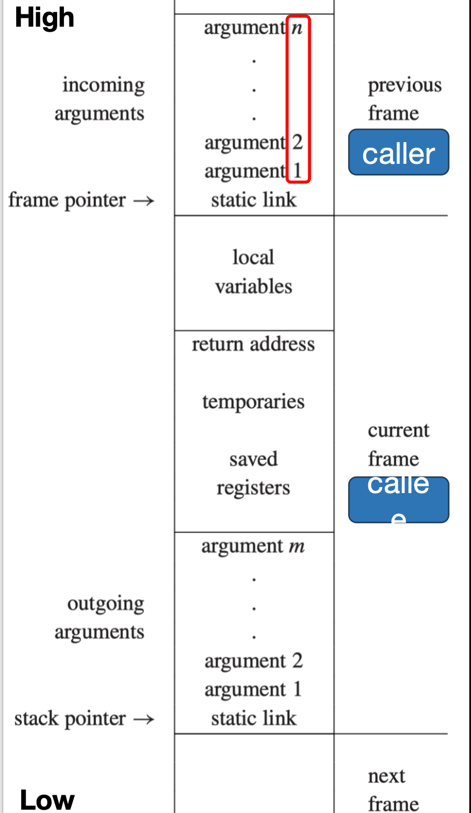

# Activation Records

在这一章中,我们关注函数调用在内存上的组织形式.

!!! definition "Activation Records"
    === "调用与返回"
        - 控制栈(Control Stack)负责管理过程调用与返回。

        - 调用时压栈: 为局部变量分配空间。

        - 返回时出栈: 释放该调用占用的空间。

    === "激活与记录"
        - 一次过程调用称为一次激活(activation)。

        - 每个 live activation 在控制栈上对应一个活动记录(activation record/frame)。

## Stack Frame Layout

<div style="text-align: center;">
    
</div>

如上图所示,一个个Activation Record在栈中是以这样的格式组织的,下面,我们将逐个介绍这些字段的含义.

### Frame Pointer
> 调用另一个函数的函数叫做 caller,被调用的函数叫做 callee.

FP与SP是两个指向栈中某个位置的指针:

- `FP`指向当前函数的基准位置(在栈中的起始位置)

- `SP`指向当前栈顶(在栈中的结束位置),通常为`FP-FRAME_SIZE`

当函数`g`调用函数`f`时,我们需要:

- 保存`g`的FP和返回地址(即调用`f`后继续执行的位置)

- 设置`f`的FP为当前SP,以便`f`可以访问自己的局部变量和参数

- 设置`f`的SP为`FP-FRAME_SIZE`,为`f`分配足够的空间

当离开函数`f`时,我们需要:

- 将`SP`赋值为`FP`,以释放`f`占用的空间

- 恢复`g`的FP和返回地址

在这里,我们之所以需要两个指针,是因为帧大小可能是不固定的,如果帧大小已经固定,那我们就不需要FP了,直接使用SP就可以了.


### Registers

!!! definition "Incoming arguments and Outgoing arguments"
    - **Incoming arguments**: 以callee的角度来看,由 caller 传递过来的参数,在 callee 的栈帧中.

    - **Outgoing arguments**: 以caller的角度来看,由 caller 传递给 callee 的参数,在 caller 的栈帧中.

访问寄存器(register)比访问内存(memory)快得多,因此编译器总是尽量把经常使用的局部变量、中间结果放在寄存器里.

现代机器通常有一组通用寄存器,例如常见地会有大约 `32` 个寄存器. 但问题在于:

- 不同的过程(procedure) / 函数(function)都会争用这些寄存器

- 一次函数调用会打断当前函数的执行,被调用函数也可能需要使用同一个寄存器

这就引出了一个核心冲突:

- 假设函数 `f` 正在使用寄存器 `r` 保存某个局部变量

- 此时 `f` 调用了另一个函数 `g`

- 而 `g` 也想使用同一个寄存器 `r` 做自己的计算

如果不做额外处理,那么 `g` 会覆盖 `f` 原本保存在 `r` 中的值,导致 `f` 返回后无法继续正确执行.

因此,在 `g` 使用 `r` 之前,必须先把 `r` 的原值保存到栈帧(stack frame)中; 当 `g` 使用完毕后,再把这个值从栈帧中恢复回来.

这个过程可以概括为:

1. `save`: 在寄存器值可能被覆盖前,先把它存入当前栈帧

2. `use`: 被调用过程使用该寄存器

3. `restore`: 调用结束后,再从栈帧中取回原值

---

围绕"谁负责保存寄存器",调用约定(calling convention)通常把寄存器分成两类.

!!! definition "Caller-save Register"
    如果寄存器 `r` 是 **caller-save register**, 那么保存和恢复它的责任在 **caller** 身上.

    也就是说,在上面的例子里:

    - 如果 `f` 之后还要继续使用 `r`
    - 那么 `f` 必须在调用 `g` 之前先保存 `r`
    - 并在 `g` 返回之后恢复 `r`

    **调用者自己保护自己在乎的寄存器值**.

!!! definition "Callee-save Register"
    如果寄存器 `r` 是 **callee-save register**, 那么保存和恢复它的责任在 **callee** 身上.

    也就是说:

    - `g` 如果要使用这个寄存器
    - 就必须先保存其中原有的值
    - 在返回给 `f` 之前再恢复它

    **被调用者必须保证某些寄存器在函数返回时看起来"没有被改过"**.

### Parameters Passing

正如我们刚刚讲的,通过寄存器来访问变量会比栈要快.

一般规定,前几个参数通过寄存器传递,剩余的参数通过栈传递.

然后,通过寄存器传递并不意味着完全没有内存访问开销了,比如:

- `f`调用`g`,要把第一个参数放在寄存器`r1`里

- 但`r1`之前保存了`f`的某个局部变量的值

- 所以`f`必须先把这个值保存到栈帧里,然后才能把参数放入`r1`

!!! definition "Why Registers Still Save Time"
    === "Leaf Procedures"
        - **leaf procedure** 指不会再调用其他过程的过程.

        - 这类过程通常可以直接在参数寄存器中使用 incoming arguments.

        - 因为它不会继续调用别人,所以往往不必先把参数写回自己的栈帧.

        - 因此,leaf procedure 是寄存器传参收益最直接的情况.

    === "Dead Variables"
        - 如果某个寄存器里保存的旧值在调用点之后已经不会再被使用,那么它就是 **dead variable**.

        - 例如参数 `x` 原本在 `r1` 中,当执行到 `h(z)` 时,如果 `x` 之后不再被使用,那么新的调用就可以直接覆盖 `r1`.

        - 这时不需要先保存旧值,因为旧值即使丢失也不会影响后续计算.

        - 所以,编译器会结合 **liveness analysis** 来判断哪些寄存器可以直接重用.

    === "Interprocedural Allocation"
        - 一些优化编译器会做 **interprocedural register allocation**.

        - 它不是只看一个函数,而是分析整个程序中的函数调用关系.

        - 编译器会为不同过程分配不同寄存器来接收参数和保存局部变量.

        - 这样可以减少不同函数之间的寄存器冲突,进一步减少内存访问.

    === "Register Windows"
        - 某些体系结构支持 **register windows**.

        - 每次函数调用时,硬件会给当前调用分配一组新的寄存器窗口.

        - 这样调用者与被调用者可以使用不同的一组寄存器,减少频繁的 save / restore.

        - 因而函数调用时的参数传递和局部变量保存都可以减少内存流量.

### Return Address

计组里面已经学过了,当函数 `f` 调用函数 `g` 时,需要把 `f` 中调用 `g` 后继续执行的位置(即返回地址)保存到`ra`

当然,如果函数内部还需要调用其他函数,那么就需要把之前的`ra`写到栈帧里,以免被覆盖.


### Frame-Resident Variables

在什么时候,变量需要放在帧栈里?

!!! definition "When Values Must Be Written To The Frame"
    === "核心思想"
        - 编译器会尽量把值保存在寄存器中,只有在 **确实有必要** 时,才把值写到内存中.

        - 这里的内存通常就是当前过程的 **stack frame**.


    === "Pass By Reference"
        - 如果一个变量要 **按引用传递(pass by reference)**, 那么它必须有一个真实的内存地址.

        - 例如在 `C` 语言中使用取地址运算符 `&` 时,变量就不能只存在于寄存器里.

        - 因为寄存器值本身没有可供外部使用的稳定内存地址.

    === "Accessed By Nested Procedure"
        - 如果当前过程中的变量会被其内部嵌套的过程(nested procedure)访问,那么这个变量通常也需要放在内存中.

        - 这是因为嵌套过程需要通过某种可共享的位置访问它.

        - 不过,如果编译器做了足够强的 **interprocedural register allocation**, 这类情况有时可以被进一步优化.

    === "Too Large For One Register"
        - 如果一个值太大,无法放进单个寄存器,那么它就必须存放在内存中.

        - 例如某些复合对象、较大的数据结构或需要多个机器字表示的值,都不适合完全驻留在一个寄存器里.

    === "Arrays Need Addresses"
        - 如果变量是数组(array),那么通常也需要放在内存里.

        - 因为访问数组元素时需要做 **address arithmetic** 来定位各个分量.

        - 而这种按地址计算偏移再取分量的方式,本质上要求数组具有可寻址的内存布局.

    === "Register Needed For Another Purpose"
        - 有时某个变量原本在寄存器里,但这个寄存器接下来必须承担一个特定用途.

        - 一个典型例子就是 **parameter passing**: 某个参数寄存器要用来给被调用函数传参.

        - 这时,原本保存在该寄存器中的值就可能需要先写回 frame,以便腾出寄存器.

    === "Register Spilling"
        - 如果局部变量和临时值过多,超出了可用寄存器的数量,那么就不可能让所有值都留在寄存器中.

        - 这时编译器会把其中一部分值暂时放进栈帧里,这个过程叫做 **spilling**.

        - 被放回 frame 的值称为 **spilled values**.

另外,有三种情况下,变量必须放在栈帧里:

- **Pass by reference**: 需要一个内存地址供外部访问.

- **Accessed by nested procedure**: 需要一个共享位置供嵌套过程访问.

- **Need Address**: 例如数组需要可寻址的内存布局.

### Static Links

!!! info "Why Static Links?"
    - 在支持嵌套过程(nested procedure)的语言中,一个内部过程可能需要访问其外部过程的变量.

    - 由于每个过程调用都会创建一个新的栈帧,所以内部过程需要一种机制来找到包含它的外部过程的栈帧.

    - **静态链接(static link)** 就是为了解决这个问题而引入的一种指针.

    - 更准确地说: 当函数 `f` 被调用时,它会额外接收到一个指针,指向在程序文本中直接包围 `f` 的外层函数 `g` 的、当前最近一次激活所对应的栈帧.

    - 因此,每个栈帧中的静态链接字段,指向的不是"调用者(caller)"的栈帧,而是它在 **静态作用域(static scope)** 上的直接外层过程的当前活动记录.

    - 通过静态链接,内部过程可以沿着链条访问外部过程的变量,实现对嵌套作用域的支持.

```c
type tree = {key: string, left: tree, right: tree}
function prettyprint(tree: tree) : string =
  let
    var output := “”  
    function write(s: string) = 
      output := concat(output,s)

    function show(n:int, t: tree) =
      let function indent(s: string) =
            (for i := 1 to n
             do write(“ ”));
             output := concat(output, s);
             write("\n"))
      in if t=nil 
         then indent(".")
         else (indent(t.key));
               show(n+1, t.left);
               show(n+1, t.right))
      end
    in show(0, tree); output
  end
```

上面这段程序就是一个典型的,要用到静态链接的例子. `prettyprint` 是一个外层函数,它定义了一个内部函数 `show`,而 `show` 又定义了另一个内部函数 `indent`.`indent` 需要访问 `n` 和 `output`,而 `show` 需要访问 `output`,因此它们都必须通过静态链接来访问外层函数的栈帧中的变量.

解析如下:

!!! tip "静态链接传参规则"
    - 规则: 传给被调函数的 static link,应指向它在词法作用域上的直接外层函数的当前栈帧。
    - 关键词: 看"定义位置"(静态嵌套),不看"谁调用了谁"(动态调用链)。

=== "in show(0, tree); output"
    这一句是`prettyprint`的函数体,调用了一个定义在其内部的函数`show`.系统会隐式地将`prettyprint`的`FP`作为一个额外参数传递给`show`,以便`show`能够通过静态链接访问`prettyprint`的栈帧.

=== "let function indent(s: string) = ... in ..."
    这一部分定义了`show`内部的另一个函数`indent`.同样地,当调用`indent`时,系统会隐式地将`show`的`FP`作为一个额外参数传递给`indent`,以便`indent`能够通过静态链接访问`show`的栈帧.

    然而,`indent`还需要访问`prettyprint`的变量`output`,因此它也需要通过静态链接访问`prettyprint`的栈帧.这就形成了一个链条: `indent` -> `show` -> `prettyprint`.

    另外,系统并不总是将caller的`FP`直接传递给callee作为静态链接,而是根据嵌套层次来决定传递哪个外层函数的`FP`.比如下一条


=== "write(“ ”)"
    在`indent`函数内部,它调用了`write`函数,但此时,它并不是将自己的`FP`传给它,因为`static links`是看语法上定义时,最近的外层包裹函数是什么,而不是去看动态调用链.

    因此可写为:
    `indent.static_link = show.FP`
    `show.static_link = prettyprint.FP`
    `=> 传给 write 的 static link = prettyprint.FP`

=== "show(n+1,left)"
    在`show`函数内部递归调用`show`时,新激活记录接收的 static link 与当前 `show` 激活相同,即仍指向 `prettyprint` 的活动记录.
