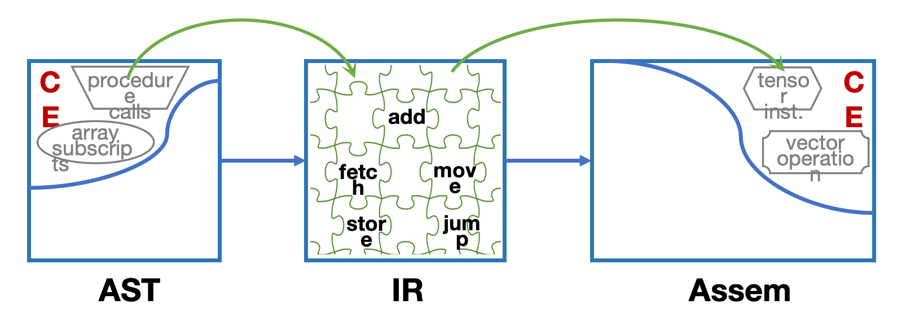

# IR

!!! definition "Intermediate Representation"
    - **Intermediate Representation (IR)**: 一种介于源代码和目标机器代码之间的抽象表示形式,用于编译器的优化和代码生成阶段.

    === "IR 的本质"
        - IR 可以看作一种 **abstract machine language**.

        - 它表达的是目标机器上将要执行的操作,但不会过早绑定到过多具体机器细节.

        - 同时,IR 也尽量独立于具体源语言的语法细节.

        - 因此,IR 起到了一种"中间桥梁"的作用: 前端把源程序翻译成 IR, 后端再把 IR 翻译成目标代码.

    === "Why Use IR"
        - 如果没有 IR, 编译器前端和后端会紧密耦合,不同源语言和不同目标机器之间难以复用.

        - 引入 IR 后,编译器可以把"语义分析"与"机器相关代码生成"分离开.

        - 比如,我们想在MIPS和x86两种不同的目标机器上生成代码,如果没有 IR,我们需要为每种源语言编写两套代码生成器(前端和后端),而有了 IR,我们只需要编写一套前端把源程序翻译成 IR,再编写两套后端把 IR 翻译成不同的目标代码即可.工作量从$n \times m$减少到$n + m$.

    === "Common Forms Of IR"
        - 编译器中可以使用很多不同形式的 IR.

        - 常见的包括:

        - **Three-Address Code (TAC)**: 以三地址指令形式表示计算过程,便于线性化和后续优化.

        - **Static Single Assignment (SSA)**: 每个变量只赋值一次的表示形式,便于数据流分析和优化.

        - **Control Flow Graph (CFG)**: 用图结构表示基本块及其控制流转移关系.

        - **Abstract Syntax Tree (AST)**: 用树结构保留程序的语法层次,更接近源程序结构.

        - **Expression Trees / IR Tree**: 用树表示表达式和语句的中间形式,例如 Tiger Compiler 中常用的 IR Tree.

## Three Address of Code

TAC 是一种常见的 IR 形式,每条指令最多包含三个地址(操作数),通常表示为:

```
x = y op z
```

我们通常使用四元组来表示 TAC 指令,其中包含操作符和操作数:

```
(op, arg1, arg2, result)
```

## Intermediate Representation Trees

一个好的IR应该:

- 容易从源程序生成

- 容易转换成目标代码

<div style="text-align: center;">
    
</div>

!!! info "Why IR Must Be Simple"
    === "Complex Effects"
        - 抽象语法(Abstract Syntax)中的某些结点可能带有 **complex effects (CE)**.

        - 例如图中的 `procedure calls`、`array subscripts` 这类结构,往往不仅仅对应一次简单操作.

        - 它们可能同时包含取值、地址计算、控制转移、访存等多个动作.

        - 机器语言中其实也存在复杂效果的指令,例如图中的 `tensor inst.`、`vector operation`.

    === "Why AST Cannot Map Directly To Assem"
        - 问题在于: AST 中的复杂结构,和机器指令中的复杂结构,它们的效果 **并不能一一良好对应**.

        - 也就是说,源语言里的一个复杂结点,未必能直接翻译成某一条目标机器指令.

        - 反过来,目标机器上的一条复杂指令,也不一定正好对应某个源语言结构.

        - 所以编译器不能简单地做"语法结点对机器指令"的直接映射.

    === "Role Of IR"
        - IR 必须足够简单,能够把抽象语法中的复杂操作 **拆开(split up)**.

        - 例如把一次复杂表达式拆成更基础的 `fetch`、`store`、`add`、`move`、`jump` 等小步骤.

        - 然后在后端阶段,再根据目标机器的特点,把这些简单 IR 操作重新 **组合(combine up)** 成真正的机器指令.

        - 因此,IR 的价值就在于: 它既不像 AST 那样过于接近源语言结构,也不像 Assem 那样过于依赖具体机器.

### IR Tree Nodes

!!! definition "Two Kinds of IR Tree Nodes"
    === "Expressions (`T_exp`)"
        - 表达式结点有return value.

        - 但表达式在求值过程中,也可能产生side effects,比如修改某个寄存器的值.

    === "Statements (`T_stm`)"
        - 语句结点没有返回值.

        - 它们主要负责执行side effects或改变控制流control flow.

---


!!! info "Expression Nodes"
    === "`CONST(i)`"
        - 表示整数常量 `i`.

    === "`NAME(n)`"
        - 表示符号常量 `n`,通常对应一个汇编标签(label).

    === "`TEMP(t)`"
        - 表示临时变量 `t`,可以把它看作抽象机器中的寄存器.

    === "`BINOP(op, e1, e2)`"
        - 表示对表达式 `e1` 和 `e2` 应用二元运算 `op`.


    === "`MEM(e)`"
        - 表示访问地址 `e` 所指向的内存内容.

        - 一般情况下,`MEM(e)` 表示 **fetch**.

        - 但当 `MEM(e)` 出现在 `MOVE` 的left child时,表示 **store** 的目标地址.

    === "`CALL(f, l)`"
        - 表示过程调用: 调用函数 `f`,参数列表为 `l`.

        - 参数通常按从左到右的顺序求值.

        - `CALL` 属于 expression,因为函数调用通常会返回一个结果.

    === "`ESEQ(s, e)`"
        - 先执行语句 `s` 的副作用,再计算表达式 `e` 的值.

        - 它把 statement 和 expression 临时组合到一起.


!!! info "Statement Nodes"
    === "`MOVE(TEMP t, e)`"
        - 计算表达式 `e`,并把结果放入临时变量 `t`.

    === "`MOVE(MEM(e1), e2)`"
        - 先计算 `e1`,得到地址 `a`.

        - 再计算 `e2`,并把结果存入从地址 `a` 开始的 `wordSize` 字节内存中.

        - 这里的 `MEM(e1)` 表示 **store**.

    === "`EXP(e)`"
        - 计算表达式 `e`,但丢弃其结果.

        - 主要用于只关心副作用的表达式,例如函数调用.

    === "`JUMP(e, labs)`"
        - 无条件跳转到 `e` 所表示的目标位置.

        - `labs` 给出所有可能的跳转目标,便于数据流分析.

    === "`CJUMP(op, e1, e2, t, f)`"
        - 先计算 `e1` 和 `e2`.

        - 再用关系运算符 `op` 比较两者.

        - 若条件成立则跳转到 `t`,否则跳转到 `f`.

    === "`SEQ(s1, s2)`"
        - 先执行语句 `s1`,再执行语句 `s2`.

    === "`LABEL(n)`"
        - 定义一个标签 `n`,作为控制流跳转的目标位置.

## Translation into IR Trees

我们希望将给定的抽象语法树(AST)翻译成 IR 树,以便后续的优化和代码生成.

### Expressions

!!! info "AST -> IR"
    我们想要将AST中的Exp节点翻译为IR Tree中的节点,分为以下三类:

    === "Ex: 有返回值的表达式"
        - **对应 IR 中的 `T_exp` 节点**
        
        - `a+b`-> `BINOP(PLUS, Ex(a), Ex(b))`

    === "Nx: 无返回值的表达式"
        - **对应 IR 中的 `T_stm` 节点**
        
        - 这类表达式求值后不产生返回值,只执行副作用
        
        - `while`-> `SEQ(CJUMP(...), SEQ(...))`

    === "Cx: 条件表达式"
        - **对应 IR 中的条件跳转 (`CJUMP`)**
        
        - 例如 `a < b` 可以翻译成 `CJUMP(LT, Ex(a), Ex(b), trueLabel, falseLabel)`

---

在翻译过程中,有时需要将一种类型的表达式转换为另一种类型的等价表达式.

- 考虑 Tiger 语句: `flag := (a>b | c<d)`

- 右侧 `(a>b | c<d)` 是一个条件表达式,自然翻译为 **Cx** (条件跳转),但赋值语句要求右侧是一个有返回值的表达式 **Ex**,因此需要将 **Cx 转换为 Ex**

在C语言中,这个`to_ex`很好写:

```c
if(cx) {
    ex = 1;
} else {
    ex = 0;
}
```

这段代码对应的IR Tree如下:

```
SEQ(
    MOVE(TEMP ex, CONST 1),
    SEQ(
        CJUMP(..., trueLabel, falseLabel),
        SEQ(
            LABEL falseLabel,
            MOVE(TEMP ex, CONST 0),
            LABEL trueLabel 
        )
    )
)
```

回到上面具体的例子 `flag := (a>b | c<d)`,实际翻译结果为:

```
MOVE(TEMP r, CONST 1)
CJUMP(GT, a, b, t, z)
LABEL z
CJUMP(LT, c, d, t, f)
LABEL f
MOVE(TEMP r, CONST 0)
LABEL t
TEMP r
```

其中:

- `r` 是临时变量,用于存储最终结果
- `t` 是条件为真时的跳转标签
- `z` 是第一个条件为假时的中间标签
- `f` 是两个条件都为假时的标签


### Simple Variables

在这一部分,我们想解决的问题是,当原语言里有一个简单变量 `x` 时,我们应该找到它在寄存器或者内存中的位置,并生成相应的 IR Tree 来访问它.

- 变量在内存中:

    - `MEM(BINOP(PLUS, TEMP fp, CONST k))`,它表示访问位于帧指针 `fp` 偏移 `k` 位置的内存内容,也就是访问变量 `x` 的值.
- 变量在寄存器中:

    - `TEMP t`,它表示访问临时变量 `t`,也就是访问变量 `x` 的值.

---

### Array Variables

不同语言中,数组变量的含义不同,例如C语言中的数组变量 `a` 实际上是一个常量指针,它指向数组的第一个元素.而Pascal语言中的数组变量 `a` 则是一个真正的数组对象,它包含了所有元素的值.

因此,在翻译数组变量时,我们需要根据具体语言的语义来生成相应的 IR Tree.


### Structured L-Values

!!! info "L-Values"
    - L-value 是指可以出现在赋值语句左侧的表达式,它表示一个内存位置或者寄存器位置,可以被赋值.

    - 例如在 `x = 5` 中,`x` 是一个 L-value,它表示一个内存位置或者寄存器位置,可以被赋值为 `5`.

    - 左值同样也可以作为右值

在我们这门课中学的Tiger语言中,只有标量左值,但是C语言中存在结构体这种Structured L-value,它的大小就不再是简单的`WordSize`,而是一个更大的值,因此我们在取地址的时候,需要加上`size`字段.

### Subscripting and Field Selection
> 没什么好讲的...

一般来说,左值都被优先翻译为地址,例如`a = 2`中的`a`被翻译为要写入的地址,而不是这个地址中存储的值.

当左值需要被当作右值使用的时候,我们就需要用`Mem`来取值,例如`b = a`中的`a`被看作值,我们用`Move(TEMP b, MEM(a))`来实现.

### Conditiional

大概可以写为一堆`CJUMP`,`LABEL`和`SEQ`的组合,没有什么特别的东西.

### While loop

对于一个形如

```
while condition do body
```

的while循环,我们可以写为如下格式:

```
test:
     if not(condition) goto done 
     body 
     goto test 
done:
```

### For loop
> 每一个for循环都可以被翻译成一个while循环

### Function Call

直接用`CALL`节点来表示函数调用,参数列表按照从左到右的顺序求值.

唯一需要注意的就是在上一章学的`static_link`的实现,我们需要在函数调用时传递正确的静态链指针,以便被调用函数能够访问到正确的变量环境.

## Translation of Declarations

### Function Declarations

函数的翻译包含三个部分: **prologue (入口代码)**、**body (函数体)** 和 **epilogue (出口代码)**.

!!! info "Function Translation Structure"
    === "Prologue (入口代码)"
        函数入口处需要完成以下工作:
        
        - **伪指令**: 标记函数开始
        
        - **函数标签**: 定义函数名对应的标签
        
        - **栈指针调整**: 调整栈指针以分配新的栈帧
        
        - **保存参数**: 
            - 将"逃逸"的参数 (包括静态链 static link) 保存到栈帧中
            - 将非逃逸参数移动到新的临时寄存器中
        
        - **保存寄存器**: 保存被调用者需要保存的寄存器 (callee-save registers),包括返回地址寄存器

    === "Body (函数体)"
        - Tiger 函数的函数体是一个表达式

    === "Epilogue (出口代码)"
        函数出口处需要完成以下工作:
        
        - **移动返回值**: 将函数返回值移动到指定的返回值寄存器
        
        - **恢复寄存器**: 恢复之前保存的 callee-save 寄存器
        
        - **栈指针恢复**: 重置栈指针以释放栈帧
        
        - **返回指令**: `JUMP` 到返回地址
        
        - **伪指令**: 标记函数结束

