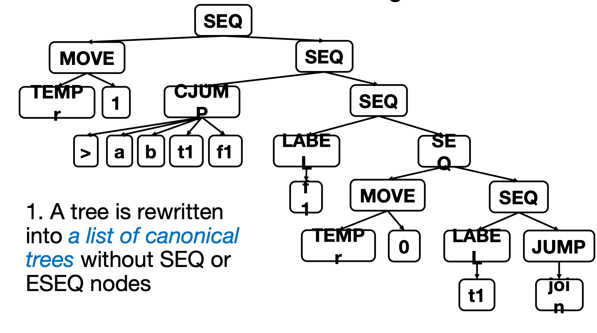
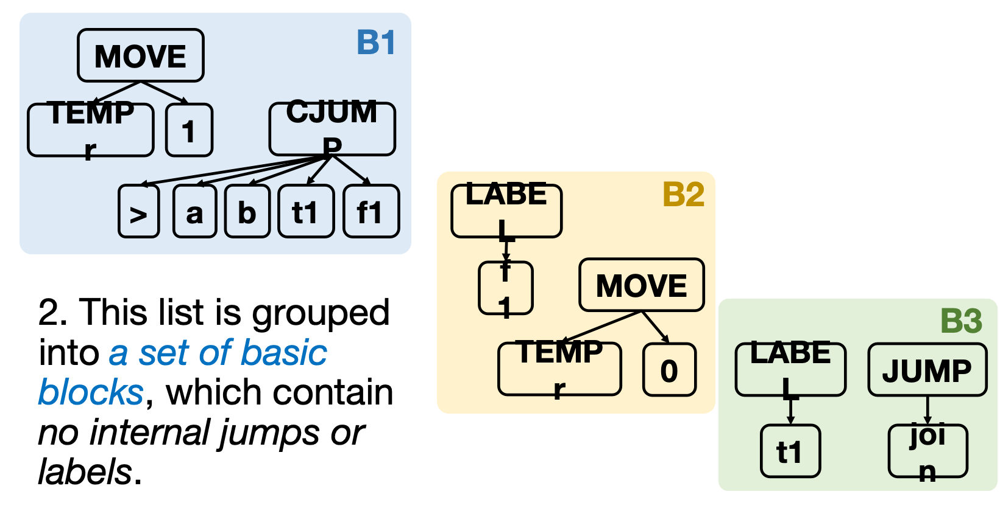
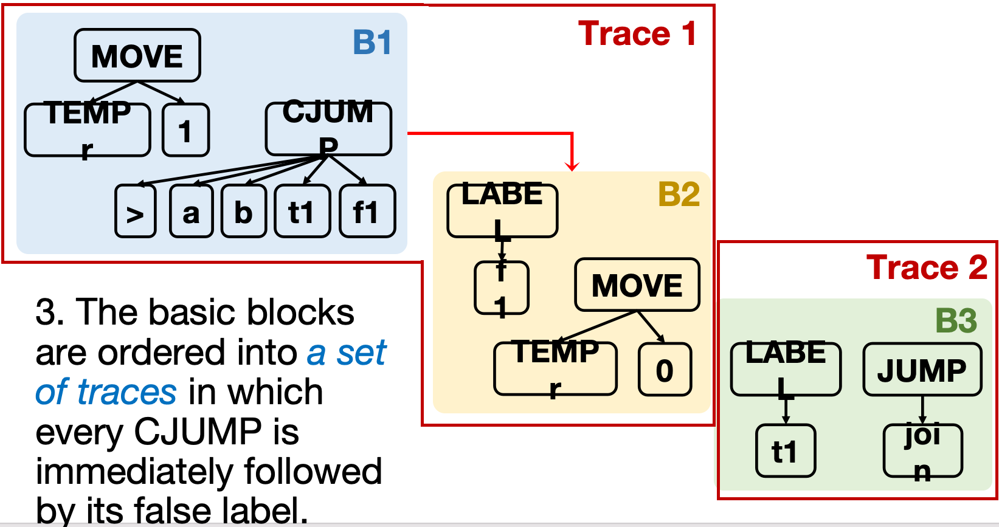
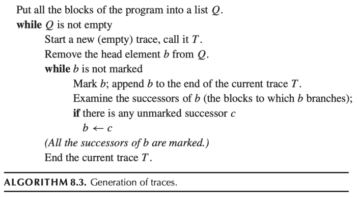

# 基本块和轨迹
> 这一章主要讲怎么对IR进行优化

总的来说，IR 指令与真实机器指令之间的差距，主要源于以下三种 IR 结构：

1. **CJUMP** — IR 中的条件跳转 `CJUMP(cond, l_true, l_false)` 有两个目标标签，条件为真跳转到一个标签，条件为假跳转到另一个。但真实机器的条件跳转指令在条件为假时是**直通（fall-through）到下一条指令**的，而不是跳转到两个不同的标签。

2. **ESEQ** — `ESEQ(s, e)` 表示先执行语句 `s`，再返回表达式 `e` 的值。但是我们希望能以任意顺序执行语句和表达式，而不受 ESEQ 的限制。

3. **CALL** — 首先,`call`的参数列表出现了和`ESEQ`一样的限制,参数必须按从左到右的顺序求值.其次,函数的嵌套调用可能会带来寄存器相关的问题,比如`CALL(f, [CALL(g, args)])` 可能会导致 `g` 的调用覆盖掉 `f` 的返回值寄存器.

那么,如何解决呢?

??? example
    对于如下这个IR Tree

    <div style="text-align: center;">
    
    </div>

    显然,它对应的C语言是:

    ```c

    if(a<b)
        r=0;
    else
        r=1;
    ```

    首先,我们把它拆分成一堆规范(canonical)树:

    <div style="text-align: center;">
    
    </div>

    这一步消去了`ESEQ`(if any)与`SEQ`指令,并且划分了`B1``B2``B3`三个基本块.

    !!! definition "基本块(Basic Block)"
        - 基本块是指一段连续的指令序列,满足以下条件:

            1. 只有第一个指令可以被跳转到(即有一个标签)

            2. 只有最后一个指令可以跳转到其他地方(即是一个跳转指令)

        - 基本块内部不能相互跳转

    然后,我们把这些基本块连接成一个个轨迹(trace):

    <div style="text-align: center;">
    
    </div>

    这里,我们之所以要把`B1`和`B2`连接成一个轨迹,是因为如果B1的`CJUMP`的条件为假,它会跳转到`B2`,而不是`B3`,因此我们把它们连接成一个轨迹,这样就可以消去`CJUMP`指令的假分支,从而得到更接近真实机器指令的IR Tree.

## Canonical Trees


!!! definition "规范树 (Canonical Trees)"
    满足以下性质：

    - **No `SEQ` or `ESEQ`**：规范树中不包含 `SEQ` 和 `ESEQ` 节点。
    
    - **`CALL` 的父节点限制**：每个 `CALL` 节点的父节点只能是 `EXP(…)` 或 `MOVE(TEMP t, …)`。

    在拥有了以上基础性质后,规范树有以下良好性质

    === "性质 1推出"
        每棵规范树**只包含一个语句节点**，即根节点。其余节点全部是表达式节点。这是因为 `SEQ` 和 `ESEQ` 已经被消除(表达式节点的父节点只能是这两个)，且 `CALL` 的父节点限制确保了 `CALL` 不会出现在表达式中。

    === "性质 1 + 性质 2推出"
        `CALL` 节点的父节点必须是规范树的**根节点**，并且只能是 `EXP(..)` 或 `MOVE(TEMP t, ..)`。

        因此，一棵规范树中**最多只有一个 `CALL` 节点**，因为 `EXP(…)` 和 `MOVE(TEMP t, ...)` 各自只能包含一个 `CALL`。

---

为了得到一个规范树,我们采取如下做法:

---

### 消除 `ESEQ`：

> 通过将 `ESEQ` 中的语句提升到外层来消除 `ESEQ`。

例如嵌套的 ESEQ 可以通过如下方式展开：

$$\text{ESEQ}(s_1,\;\text{ESEQ}(s_2,\;e)) = \text{ESEQ}(\text{SEQ}(s_1,\;s_2),\;e)$$

即：把内层 ESEQ 的语句 $s_2$ 和外层 ESEQ 的语句 $s_1$ 合并为一个 `SEQ(s1, s2)`，最终只保留一个 ESEQ，其语句部分按顺序执行 $s_1$ 和 $s_2$，表达式部分返回 $e$。不断重复此过程，即可逐步消去所有 ESEQ。

!!! info "Commute 条件"
    在右子树场景中，$s$ 与 $e_1$ **可交换 (commute)**，当且仅当：

    - $s$ 所写入（赋值）的临时变量和内存位置**不被** $e_1$ 所引用；
    - 且 $s$ 和 $e_1$ 不会同时执行外部 I/O 操作。

    若 $s$ 与 $e_1$ commute，则可以将 $s$ 直接提到外层，无需引入临时变量：

    `BINOP(op, e1, ESEQ(s, e2))` $\;\to\;$ `ESEQ(s, BINOP(op, e1, e2))`

    若 $s$ 与 $e_1$ **不** commute，则需要先将 $e_1$ 保存到临时变量中（见下方右子树有副作用的情况）。

然而 $s$ 与 $e$ 是否 commute，在编译期**并不总是能准确判断**。例如：

```
s = MOVE(MEM(x), y)
e = MEM(z)
```

`x` 和 `z` 是否指向同一地址？这依赖运行时信息，编译器无法确定。因此我们采取**保守近似**：

- `commute(s, e) = True` 仅当 $s$ 和 $e$ **确定可交换**；
- `commute(s, e) = False` 用于所有存疑的情况。

具体实现中，一个朴素（naive）的 `commute` 函数如下：

- `CONST(i)`、`NAME(n)` 与任何语句 commute（它们不访问任何临时变量或内存）；
- 空语句（如 `EXP(CONST(0))`）与任何表达式 commute；
- 其余情况一律视为**不 commute**。

以下是各种具体例子：

=== "`BINOP` 中的 ESEQ"
    - **左子树**：`BINOP(op, ESEQ(s, e1), e2)` $\;\to\;$ `ESEQ(s, BINOP(op, e1, e2))`

    - **右子树**（$s$ 与 $e_1$ commute 时）：`BINOP(op, e1, ESEQ(s, e2))` $\;\to\;$ `ESEQ(s, BINOP(op, e1, e2))`

    - **右子树**（$s$ 与 $e_1$ 不 commute 时）：需要先将 `e1` 保存到临时变量中：

        `BINOP(op, e1, ESEQ(s, e2))` $\;\to\;$ `ESEQ(MOVE(TEMP t, e1),\;ESEQ(s,\;BINOP(op, TEMP t, e2)))`

        其中 `t` 是一个新的临时变量。

=== "`CJUMP` 中的 ESEQ"
    - **左子树**：`CJUMP(op, ESEQ(s, e1), e2, tr, fl)` $\;\to\;$ `ESEQ(s, CJUMP(op, e1, e2, tr, fl))`

    - **右子树**（$s$ 与 $e_1$ commute 时）：`CJUMP(op, e1, ESEQ(s, e2), tr, fl)` $\;\to\;$ `ESEQ(s, CJUMP(op, e1, e2, tr, fl))`

    - **右子树**（$s$ 与 $e_1$ 不 commute 时）：

        `CJUMP(op, e1, ESEQ(s, e2), tr, fl)` $\;\to\;$ `ESEQ(MOVE(TEMP t, e1),\;ESEQ(s,\;CJUMP(op, TEMP t, e2, tr, fl)))`

=== "`EXP` 中的 ESEQ"
    - `EXP(ESEQ(s, e))` $\;\to\;$ `SEQ(s, EXP(e))`

    这里直接变成了 `SEQ` 而非 `ESEQ`，因为不再需要返回值。

!!! info "ESEQ 消除的整体思路"

    消除 ESEQ 的整体思路可以归纳为两步：

    1. **子表达式提取 (subexpression-extraction)**：对当前结点的每个子结点，递归提取其中的「语句部分」得到一个纯语句 $s_i$，并将子结点替换为其「ESEQ-clean 版本」$e_i'$。
    2. **子表达式回填 (subexpression-insertion)**：用清理后的 $e_i'$ 重建当前结点，再根据 commute 关系将所有 $s_i$ 组合成最终的 `SEQ` / `ESEQ`。

    下面以一个具体例子走一遍这个过程。

    !!! example "CJUMP 中的 ESEQ 消除"
        原始 IR Tree：

        $$CJUMP(<,\;\text{CONST }343,\;\text{MEM}(\text{ESEQ}(s_x,\;\text{TEMP }a)),\;t,\;f)$$

        **Step 1 — 递归提取每个子表达式：**

        | 子表达式 | 提取结果 |
        |:--|:--|
        | `CONST(343)` | $s_1 = \text{EXP}(\text{CONST}(0))$ （空语句），$e_1' = \text{CONST}(343)$ |
        | `MEM(ESEQ(s_x, TEMP a))` | 递归处理 → `ESEQ(s_x, MEM(TEMP a))` → $s_2 = s_x$，$e_2' = \text{MEM}(\text{TEMP }a)$ |

        此时左右子树分别更新为：
        - 左：$\text{CONST}(343)$
        - 右：$\text{MEM}(\text{TEMP }a)$

        **Step 2 — 回填并组合语句：**

        提取到的语句列表为 $[s_1, s_2]$，将其组合成 `SEQ(s1, s2)`：

        $$\text{SEQ}(\text{EXP}(\text{CONST}(0)),\; s_x)$$

        空语句 $\text{EXP}(\text{CONST}(0))$ 没有实际效果，可以删掉，简化为 $s_x$。

        最后判断是否需要 `MOVE`：$s_2 = s_x$ 与 $e_1' = \text{CONST}(343)$ 是否 commute？
        — commute，因为常量不引用任何临时变量/内存，$s_x$ 不可能影响 `CONST(343)`。因此不需要额外的 `MOVE(TEMP t, ...)`。

        最终结果：

        $$\text{SEQ}(s_x,\;\;CJUMP(<,\;\text{CONST }343,\;\text{MEM}(\text{TEMP }a),\;t,\;f))$$ 

### `Call`的副作用：

Tree 语言允许 `CALL` 节点作为子表达式出现，例如：

```text
BINOP(PLUS, CALL(f, args1), CALL(g, args2))
```

实际上的意思就是：

```c
f(...) + g(...)
```

但是在真实约定中，每个函数调用的返回值通常都会放在同一个专门的返回值寄存器中，例如 `a0`。因此如果直接生成代码，可能出现如下求值顺序：

```text
CALL(f, args1)    // result in a0
CALL(g, args2)    // overwrite a0
BINOP(PLUS, a0, a0)  // both operands are now g's return value, not f's
```

此时第二个 `CALL` 会覆盖第一个 `CALL` 的返回值，导致 `PLUS` 无法得到正确的两个操作数。

!!! warning "`CALL` 作为子表达式的问题"
    `CALL` 不是普通的纯表达式：

    - 它有副作用：会修改返回值寄存器 `a0`，也可能修改 caller-save 寄存器。

    - 多个 `CALL` 嵌套在同一个表达式中时，后一个调用可能覆盖前一个调用的返回值。

    因此 canonical tree 要求：`CALL` 的父节点只能是 `EXP(...)` 或 `MOVE(TEMP t, ...)`，不能直接出现在 `BINOP`、`MEM`、`CJUMP` 等表达式内部。

解决办法是：**每次函数调用结束后，立刻把返回值保存到一个新的临时变量中**。

变换规则如下：

```text
CALL(fun, args)
```

转换为：

```text
ESEQ(
    MOVE(TEMP t, CALL(fun, args)),
    TEMP t
)
```

其中 `t` 是一个 fresh temporary。这个 `ESEQ` 的含义是：

1. 先执行 `MOVE(TEMP t, CALL(fun, args))`，也就是调用函数并把返回值从 `TEMP(RV)` 保存到 `TEMP t`。
2. 再以 `TEMP t` 作为整个表达式的值。

例如：

```text
BINOP(PLUS, CALL(f, args1), CALL(g, args2))
```

先改写为：

```text
BINOP(
    PLUS,
    ESEQ(MOVE(TEMP t1, CALL(f, args1)), TEMP t1),
    ESEQ(MOVE(TEMP t2, CALL(g, args2)), TEMP t2)
)
```

之后，ESEQ 消除器会把内部的 `MOVE` 逐步提升到外层，得到类似如下的规范化结果：

```text
SEQ(
    MOVE(TEMP t1, CALL(f, args1)),
    SEQ(
        MOVE(TEMP t2, CALL(g, args2)),
        EXP(BINOP(PLUS, TEMP t1, TEMP t2))
    )
)
```

再拆成 canonical trees 后，每个 `CALL` 都只出现在合法位置：

```text
MOVE(TEMP t1, CALL(f, args1))
MOVE(TEMP t2, CALL(g, args2))
EXP(BINOP(PLUS, TEMP t1, TEMP t2))
```


### 消除`SEQ`：

实际上,一堆嵌套的`SEQ`语句就是一个不断顺序执行的过程,因此我们要做的就是把如下左偏的`SEQ`树:

```
SEQ(SEQ(a, b), c)
```

转换成右偏的`SEQ`树:

```
SEQ(a, SEQ(b, c))
```

这样会更加直观,因为语句实际上就是:

```
a
b
c
```

---

到这里为止,我们已经知道了如何把一个任意的 IR Tree 转换成一个规范树了,接下来我们要做的就是把这些规范树划分成基本块,并且把这些基本块连接成轨迹了.

!!! example "Basic Block"

    一个基本块是一堆语句,满足:

    1. 第一个语句是一个`LABEL`作为整个基本块的唯一入口

    2. 最后一个语句是一个跳转指令,作为整个基本块的唯一出口

    3. 在基本块内部,没有任何`LABEL`或跳转指令


要把一堆重整为规范树的语句变成一个个基本块,我们采取如下做法:

## 划分基本块

将一长串语句划分为基本块的算法如下：

1. 从头到尾扫描整个语句序列。

2. 每当遇到一个 `LABEL`，就开始一个新的基本块，同时结束前一个基本块。

3. 每当遇到一个 `JUMP` 或 `CJUMP`，就结束当前基本块，并让下一条语句开始新的基本块。

4. 如果某个基本块最后没有以 `JUMP` 或 `CJUMP` 结尾，就在该基本块末尾补上一个跳转到下一个基本块标签的 `JUMP`。

5. 如果某个基本块开头没有 `LABEL`，就创建一个新的 `LABEL` 并插入到该基本块开头。


---

## 连接基本块成轨迹

基本块具有如下性质:一堆基本块可以以块为单位,按照任意顺序摆放,程序的输出是不变的.

那么,我们就可以调整基本块的顺序,从而实现我们在一开始说的:

> 真实机器的条件跳转指令在条件为假时是**直通（fall-through）到下一条指令**的

同时,我们也可以实现让所有无条件跳转的基本块的目标标签紧跟在它们后面,从而消去这些无条件跳转指令.

!!! definition "Trace"
    Trace 是一段语句序列，它们在程序执行过程中可能被连续执行，并且其中可以包含条件分支。

    一个程序可以有很多不同的 trace，这些 trace 之间甚至可以相互重叠。

    但是在重新排列 `CJUMP` 和 false-label 时，我们希望构造一组 trace，使其**恰好覆盖整个程序**：

    - 每个基本块必须恰好属于一个 trace。
    - 我们希望覆盖程序所需的 trace 数量尽可能少。

    这样做的目的是：尽量减少从一个 trace 跳转到另一个 trace 时所需的 `JUMP` 数量。

<div style="text-align: center;">

<br>
<caption>Trace 连接算法示例</caption>
</div>

实际上,如果一个块是另一个块的`Successor`,实际上就是:

- 对于一个 `CJUMP`，如果它的两个Label对应的基本块都是它的 successor.

- 对于一个 `JUMP`，如果它的目标标签是某个基本块的标签，那么这个基本块就是它的 successor。

上图已经展示了trace的构造方法,但是这个做法并不能保证`CJUMP`的false label紧跟在它后面,因此我们还需要对`CJUMP`做一些局部调整.

具体分三种情况：

1. 如果某个 `CJUMP` 后面已经紧跟它的 false label，则不需要修改。

    ```text
    CJUMP(cond, a, b, lt, lf)
    LABEL lf
    ```

2. 如果某个 `CJUMP` 后面紧跟的是它的 true label，则交换 true/false label，并对条件取反。

    ```text
    CJUMP(cond, a, b, lt, lf)
    LABEL lt
    ```

    改写为：

    ```text
    CJUMP(not cond, a, b, lf, lt)
    LABEL lt
    ```

    这样原来的 true label 变成了新 `CJUMP` 的 false label，因此仍然满足“`CJUMP` 后面紧跟 false label”的形式。

3. 如果某个 `CJUMP(cond, a, b, lt, lf)` 后面既不是 `lt`，也不是 `lf`，则新建一个 false label `lf'`，并把单条 `CJUMP` 改写成三条语句：

    ```text
    CJUMP(cond, a, b, lt, lf')
    LABEL lf'
    JUMP(NAME lf)
    ```

    这样 `CJUMP` 后面紧跟新建的 false label `lf'`；如果条件为假，控制流先落到 `lf'`，再通过 `JUMP` 跳到原来的 false label `lf`。
