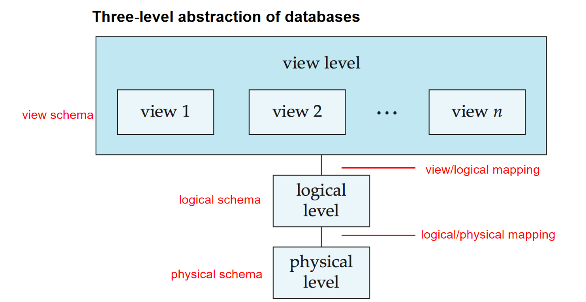
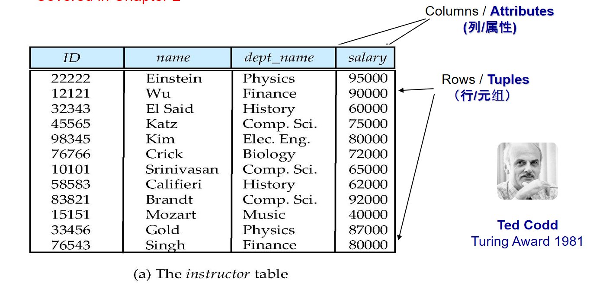
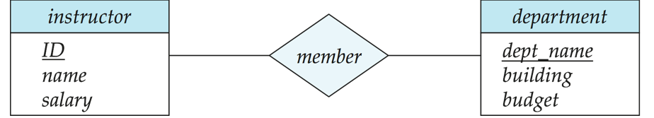
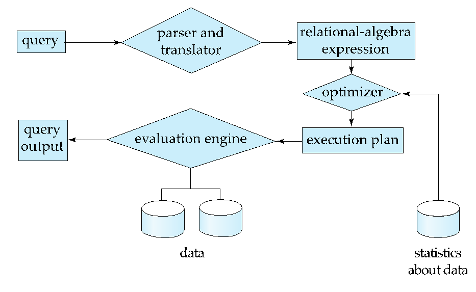

# Chapter 1: Introduction

## 引言

在早期,数据库应用是建立在文件系统之上的。这样有以下问题:

+ 数据冗余(Data Redundancy)与不一致性(Inconsistency):
    - 数据冗余是指数据在多个地方存储,造成数据冗余。例如,如果一个学生的专业是数学与音乐,那么这个学生的信息就会在两个地方存储。

    - 这样的存储方式还会导致数据不一致.因为在这样的情况下,修改一个数据需要在所有文件内修改,如果出现遗漏,那么数据就会不一致。

+ 数据隔离(Data Isolation):
    - 数据隔离是指由于文件种类与数目繁多,数据分散,导致数据难以访问。
    - 这同时也导致了存取数据困难(Data Access Difficulty)。

+ 完整性问题(Integrity Problems):
    - 数据库系统的完整性是指数据的正确性与一致性。在文件系统中,由于数据分散,数据的完整性难以保证。
    - 当完整性约束(如“balance >= 1”)只存在于程序代码而非在数据库中显式声明时,新增或修改这些约束需要修改多处代码,维护难度大且易导致数据不一致。

+ 原子性问题(Atomicity Problems):
    - 原子性问题其实和完整性问题很类似。原子性问题是指在文件系统中,由于数据分散,数据的原子性难以保证。例如,在一次转账中,A转出钱与B收到钱必须同时发生或同时取消,否则会导致数据不一致。

+ 并发访问异常(Concurrent Access Anomalies):
    - 并发问题是指在多个用户同时访问数据库时,由于数据分散,数据的并发访问难以保证。例如,在多个用户同时访问数据库时,如果不加控制,可能会导致数据不一致。    

+ 安全性问题(Security Problems):
    - 不同的用户可能有不同的权限,在文件系统中,由于数据分散,数据的安全性难以保证。

在这样的情形下,数据库系统应运而生.

---

## Views of Data

### 数据抽象

为了使得用户能便捷地使用数据库,同时开发人员可以维护与更新数据库,我们将数据库抽象为三个层次:

1. Physical Level(物理层): 数据库的最低层次,描述了数据在磁盘上的存储方式。

2. Logical Level(逻辑层): 数据库的中间层次,描述了数据的逻辑结构,即数据库中存在什么数据,以及数据之间的联系。

3. View Level(视图层): 数据库的最高层次,描述了用户所见到的数据。一个数据库系统存在多个视图,每个用户可以看到不同的视图。

这三个层次关系如下图:

<div align="center">
    
</div>

### 数据模式与实例(Schema and Instance)

Schema与Instance的关系类似于type与variable的关系。

+ Schema(模式): 描述了数据库的逻辑结构,即数据库中存在什么数据,以及数据之间的联系。

+ Instance(实例): 描述了数据库中的具体数据。

例如,下图是一个学生数据库的Schema:

```text
Student(sid: string, name: string, login: string, age: integer, gpa: real)
```

下表展示了学生数据库的Instance：

| sid   | name  | login | age | gpa |
|-------|-------|-------|-----|-----|
| 53688 | Smith | smith | 18  | 3.2 |
| 53689 | Jones | jones | 19  | 3.4 |
| 53690 | Smith | smith | 18  | 3.2 |

### Data Independence(数据独立性)

数据独立性是指数据库的三个层次之间的独立性。

+ Physical Data Independence(物理数据独立性): 是指数据库的物理层与逻辑层之间的独立性。即,数据库的逻辑层不依赖于数据库的物理层。当修改物理层时,无需修改逻辑层使之适配.

+ Logical Data Independence(逻辑数据独立性): 是指数据库的逻辑层与视图层之间的独立性。即,数据库的视图层不依赖于数据库的逻辑层。当修改逻辑层时,无需修改视图层使之适配。

### Data Models(数据模型)

数据模型用于描述数据、数据之间的联系、数据语义以及一致性约束的概念工具。常见的数据模型包括：

1. **关系模型(Relational Model):**  
    - **定义:** 以二维表的形式组织数据，每个表由行(记录)和列(属性)组成。当然,它们也有一个高级的名称:列是属性(Attribute),行是元组(Tuple)。如下图所示:
        <div align="center">
            
        </div>
    - **特点:** 
        - 数据结构化管理
        - 使用 SQL 语言进行数据查询与操作
        - 强调数据完整性与事务处理  
    - **示例:**  
        ```text
        Student(sid: string, name: string, login: string, age: integer, gpa: real)
        ```  

2. **实体-关系模型(Entity-Relationship Model):**  
    - **定义:** 利用实体、属性和实体间的关系来描述现实世界中的数据。  
    - **特点:**  
        - 更贴近业务概念
        - 常用于需求分析和数据库概念建模  
    - **示例:**  
        - 实体：学生(Student)
        - 属性：sid、name、age 等
        - 关系：学生与课程之间的选修关系  

3. **基于对象的数据模型(Object-Based Data Model):**  
    结合面向对象编程思想，把对象、类、方法等引入数据管理中，主要分为两种形式：  
    - **面向对象数据模型(Object-Oriented Data Model):**  
        - **定义:** 将数据视为对象，对象包含状态和行为。  
        - **特点:**  
            - 支持复杂数据类型
            - 继承、多态、封装等面向对象特性  
     
    - **面向对象-关系数据模型(Object-Relational Data Model):**  
        - **定义:** 在关系模型的基础上引入面向对象的扩展，如用户自定义数据类型和方法。  
        - **特点:**  
            - 兼具关系数据库的简洁性与面向对象数据库的灵活性  

4. **半结构化数据模型(Semi-Structured Data Model):**  
    - **定义:** 主要用于描述部分有组织但不严格依赖固定模式的数据，常见格式包括 XML 与 JSON。  
    - **特点:**  
        - 灵活性高，不强制要求固定结构  
        - 同时兼顾数据自描述和数据交换的需求  

## 数据库语言

数据库语言分为Data Definition Language (DDL)与Data Manipulation Language (DML) 两种实际上,这两种语言是相互联系的,它们共同构成了数据库系统的语言系统(例如SQL)。

### Data Definition Language (DDL)

DDL用于定义数据库的逻辑结构,包括表的创建、删除、修改等。
例如:
    
    ```sql
    CREATE TABLE Student(
        sid CHAR(20),
        name CHAR(20),
        login CHAR(10),
        age INTEGER,
        gpa REAL
    )
    ```
??? note "在实际应用中,实际的数据,比如学生的姓名当然是数据,那这些定义数据的语句是什么呢"
    这些数据被称为Metadata(元数据),它们是用来描述数据的数据(Data about data)。它们被存储在data dictionary(数据字典)中。
    
    Metadata包括:

    + Database Schema(数据库模式): 描述了数据库的逻辑结构。

    + Integrity Constraints(完整性约束): 定义数据必须遵守的规则和条件.

    + Authorization (权限): 定义了用户对数据库的访问权限。

    + Primary Key(主键): 用于唯一标识表中的每一行数据。

    + Referential Integrity(参照完整性): 用于保证表之间的数据一致性。

### Data Manipulation Language (DML)


DML用于查询、插入、删除、修改数据库中的数据。例如:

```sql
SELECT name
FROM Student
WHERE age > 18
```

上面的语句用于查询年龄大于18岁的学生的姓名。

有两种主要的DML语言:

1. **过程式语言(Procedural Language):**  
    - 通过编写程序来描述数据的操作过程。  
    - 例如,SQL中的PL/SQL、T-SQL等。

2. **非过程式语言(Declarative Language):**
    - 通过描述数据的结果来实现数据的操作。  
    - 例如,SQL中的SELECT语句。

### Database Access from Application Program

数据库系统提供了API(Application Programming Interface)来让应用程序访问数据库。常见的API有:

1. **Embedded SQL:**  
    - 将SQL语句嵌入到应用程序中。  
    - 例如,在C语言中使用`EXEC SQL`语句。

2. **ODBC(Open Database Connectivity):**

3. **JDBC(Java Database Connectivity):**
    - 用于Java程序访问数据库。
    - 例如,在Java中使用`java.sql`包。

## 数据库设计

数据库设计是指设计数据库的逻辑结构与物理结构。

其中的重点是概念设计(Conceptual Design)与逻辑设计(Logical Design)。

+ 概念设计: 是指设计数据库的逻辑结构,包括数据模型的选择、数据模式的设计等。

+ 逻辑设计: 是指设计数据库的物理结构,包括表的设计、索引的设计等。

在概念设计中,我们需要决定如此多的数据属性如何组织到一起,解决这个问题的办法主要有两种:

1. **Entity-Relationship Model:**  
    - 通过实体、属性和实体间的关系来描述数据。
       <div align="center">
            
        </div>

2. **Normalization:**  
    - 通过消除数据冗余来设计数据库。

## 数据库引擎

数据库引擎是数据库系统的核心组件,负责管理数据库的存储、检索、更新等操作。

数据库的主要部件包括:

1. **查询处理器(Query Processor):**  
    - 负责解析SQL语句,生成查询计划,执行查询计划,返回查询结果。
        <div align="center">
            
        </div>

2. **事务管理器(Transaction Manager):**
    - 负责管理事务,保证事务的ACID特性。
    - ACID特性是指事务的四个特性:原子性(Atomicity)、一致性(Consistency)、隔离性(Isolation)、持久性(Durability)。
    - 例如,在一次转账中,A转出钱与B收到钱必须同时发生或同时取消,否则会导致数据不一致。
    - 事务管理器包括恢复管理器(Recovery Manager)与并发控制器(Concurrency Controller)。

3. **存储管理器(Storage Manager):**
    - 负责管理数据库的存储,包括数据的存储、检索、更新等操作。
    - 数据库的存储结构包括表、索引、视图等。

