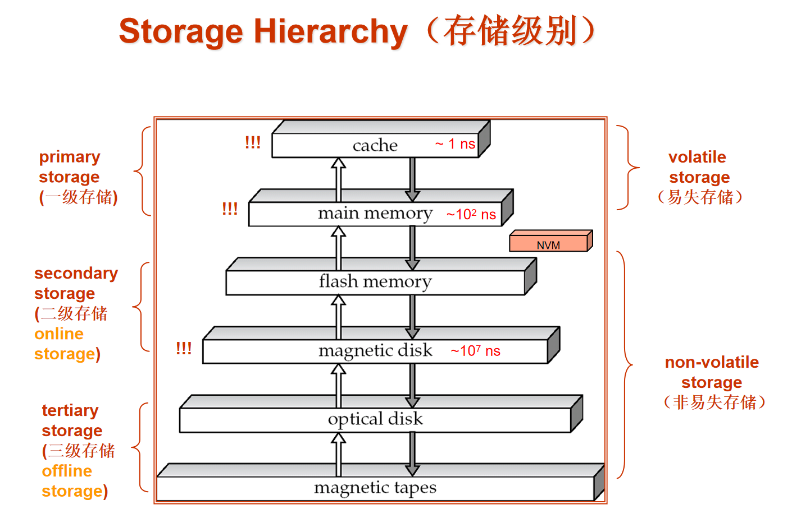

# 数据存储

!!! info 
    和计组[第六章](../Comcompose/Ch6.md)很像

## Classification of Physical Storage Media

<strike>似曾相识</strike>

存储的媒介，可以分为两大类：

- **volatile storage(易失存储):** 在断电后数据会丢失

    - RAM

    - Cache

- **non-volatile storage(非易失存储):** 在断电后数据不会丢失

    - Hard disk

    - Flash memory

    - CD/DVD

    - Tape

    - etc.

## 硬盘结构

### 读写头 (Read-write head)

- 位置非常接近磁盘表面（几乎接触）

- 读取或写入磁编码信息

### Magnetic Disks

-   :material-disc:{ .lg .middle } **磁道(Tracks)**

    ---
    
    - 磁盘表面被划分为圆形轨道

    - 典型硬盘每个盘片有超过50K-100K个磁道

-   :material-pizza:{ .lg .middle } **扇区(Sectors)**

    ---
    
    - 每个磁道被划分为扇区

    - 扇区是可读写的最小数据单位

    - 标准大小为512字节

    - 不同位置扇区数量：
        - 内侧磁道：500-1000个
        - 外侧磁道：1000-2000个

### 读/写过程

1. **定位**：磁盘臂摆动将读写头定位到正确的磁道

2. **传输**：盘片持续旋转，当目标扇区经过读写头时进行数据读取/写入

### 磁头-磁盘组件

- 单一主轴上安装多个磁盘盘片（通常1到5个）
- 每个盘片配备一个磁头，所有磁头安装在共同的磁臂上
- **柱面(Cylinder)**：由所有盘片上相同位置的磁道组成 (1)

1. 例如，柱面i由所有盘片的第i个磁道组成

### 磁盘控制器(Disk controller)

> 磁盘控制器是计算机系统和磁盘硬件之间的桥梁

**主要功能**：

- 接收并处理读写扇区的高级命令

- 控制磁盘臂移动和数据读写的实际操作

- 通过校验和机制保证数据完整性：

    * 为每个扇区计算并附加校验和

    * 读取时重新计算校验和并与存储值比对

    * 如数据损坏，两个校验和值几乎必然不匹配

- 执行写入验证：写入后自动读回扇区以确保写入成功

- 管理坏扇区：自动执行坏扇区的重新映射

## Performance Measures

### 访问时间 (Access Time)

> 从发出读写请求到开始数据传输所需的时间。包含以下组成部分：

-   **寻道时间 (Seek Time)**

    ---
    
    - 磁盘臂定位到正确磁道所需的时间
    - 平均寻道时间为最差情况的1/2
    - 典型硬盘约为4-10毫秒

-   **旋转延迟 (Rotational Latency)**

    ---
    
    - 等待目标扇区旋转到读写头下方所需的时间
    - 平均延迟为最差情况的1/2
    - 典型硬盘约为4-11毫秒（转速5400至15000 RPM）

### 数据传输率 (Data Transfer Rate)
    
- 从磁盘读取或写入数据的速率
- 最大约为25-100 MB/秒（内侧磁道较低）
- 常见接口速率：
    - SATA: 150 MB/秒
    - SATA-II: 300 MB/秒
    - Ultra 320 SCSI: 320 MB/秒
    - SAS: 3-6 Gb/秒
    - 光纤通道: 256-512 MB/秒

### 数据访问模式

1. **顺序访问模式 (Sequential Access Pattern)**
    - 连续请求位于连续的磁盘块
    - 只有第一个块需要磁盘寻道
    - 效率高，传输速度接近最大值

2. **随机访问模式 (Random Access Pattern)**
    - 连续请求的块可能分布在磁盘任何位置
    - 每次访问都需要寻道
    - 效率低，大量时间浪费在寻道上

### 磁盘性能指标

#### 每秒I/O操作数 (IOPS)

- 磁盘每秒能支持的随机块读取数量

- 传统磁盘通常为50-200 IOPS

#### 平均故障时间 (MTTF)

- 磁盘预期无故障连续运行的平均时间

- 典型值为3-5年

- 新磁盘理论MTTF约为500,000至1,200,000小时

- 1,200,000小时的MTTF意味着1000个相对较新的磁盘中，平均每1200小时(50天)会有一个发生故障
    - $\frac{1,200,000}{1000} = 1200$小时/台磁盘

- 随着磁盘老化，MTTF会降低

### 磁盘块(Blocks)

- 存储分配与检索的逻辑单元

- 通常为4-16 KB

- 小块：更多磁盘传输

- 大块：更多空间因部分填充而浪费

## Optimization of Disk Block Access

### Nonvolatile write buffers （非易失性写缓存）

- 先将数据写到一个非易失性存储器中（如RAM）

- 当硬盘没有处理其他请求时，才将数据写入硬盘

### 文件组织 (File Organization)

- 尽可能连续地分配文件的块，减少磁盘碎片
  
- 以**盘区(extents)**为单位进行分配
  
- 文件可能会发生碎片化
  
    - 例如，当磁盘上的空闲块分散时，新创建的文件的块也会分散在整个磁盘上

    - 顺序访问碎片化的文件会导致磁盘臂移动增加，降低性能

- 某些系统提供磁盘碎片整理工具，用于重新组织文件系统以加快文件访问速度
