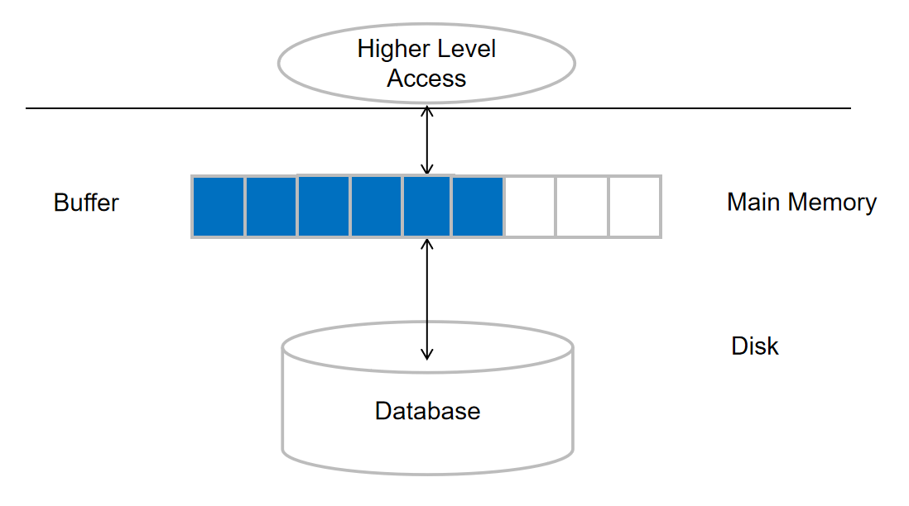
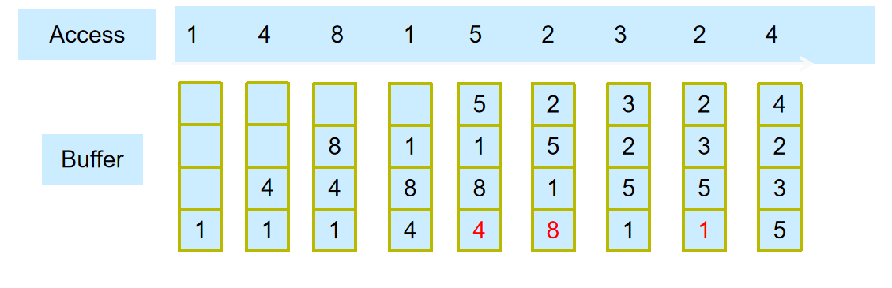
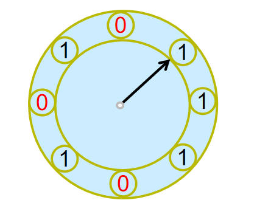
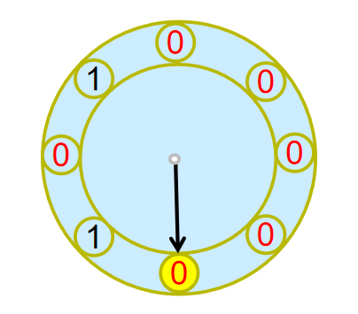

# 数据存储结构

## File Organization

> 数据库是以一系列文件的形式存储的
> 每个文件都是有一系列记录组成的
> 每个记录都是由一系列字段组成的

我们分为两部分内容讨论:记录是定长//不定长

### Fixed-Length Records

第i个记录从第$n*(i-1)$个字节开始,长度为n个字节

由于记录的长度比块小,可能会出现一个记录跨越了两个块的情况.为了避免这种情况,我们设定不允许一个记录跨越两个块.

<div align="center">

</div>

---

对于定长记录的删除,有如下三种做法.

!!! tip "记录删除"
    === "依次前移"
        删除第i个记录,将第i+1到最后的记录依次前移一位,并在最后一个记录中填入空白.
        
    === "最后一个记录覆盖"
        删除第i个记录,将最后一个记录覆盖第i个记录.
        
    === "Steam删除法"
        不移除记录,把所有空的记录链接起来,形成一个空记录链表.
        

### Variable-Length Records

变长记录在数据库系统中出现的几种情况：

1. **存储多种记录类型在同一个文件中**
    - 不同记录类型可能有不同的字段和长度

2. **记录类型允许一个或多个字段具有可变长度**
    - 例如字符串类型(varchar)
    - 不同记录中同一字段可能占用不同空间

3. **记录类型允许重复字段**
    - 在一些较早的数据模型中使用
    - 一个字段可能出现多次，导致记录长度不固定

对于变长记录的属性,以(offset, length)的形式存储在记录中.

- offset: 该属性的值在块中的起始位置

- length: 值的长度

<div align="center">

</div>

> salary是定长的，所以直接存值

> 位置 20 放的 0000, 表示前面四个属性均是非空的, 1 表示空。

#### Slotted Page Structure（分槽页）

!!! definition "分槽页"
    分槽页是一种用于存储变长记录的页面组织方式，它允许记录在物理位置上移动而不改变其标识。

    **基本结构：**

    - 页头(Header)：包含:

        - Record Entries的数目

        - End of free space in block:指向空闲空间的指针

        - 每个记录的位置和长度

    - 槽目录(Slot Directory)：从页面头部开始，包含指向各记录的指针.指针不应该直接指向记录,而是指向槽目录中的槽号.

        - 槽号：槽目录中每个记录的编号

        - 槽目录的大小：槽目录的大小是固定的，通常为4字节

        - 槽目录的起始位置：槽目录在页面中的起始位置

    - 记录区域：从页面底部向上增长，存放实际的数据记录

    - 自由空间：位于槽目录和记录区域之间的可用空间

    **工作原理：**


    1. 每个记录通过槽号(slot number)来引用

    2. 槽目录保存每条记录在页面中的起始位置

    3. 新记录添加到空闲空间中

    4. 删除记录时可以通过重组页面来回收空间

    

---

## Organization of Records in Files

> 记录在文件中有很多组织方式,比如我们在FDS和ADS中学过的数据结构

1. **Heap**:记录可以以任意顺序存储在文件中,没有特定的顺序.这种方式适合于小型文件,或者是经常进行插入和删除操作的文件.

2. **Sequential**:记录按照某个顺序存储在文件中,比如按照主键的顺序.这种方式适合于经常进行查询操作的文件.

3. **B+-tree file organization**:记录按照B+-tree的方式存储在文件中,这种方式适合于经常进行范围查询操作的文件.

4. **Hash file organization**:用一个哈希函数把记录的Search Key映射到一个地址上,指示这条记录应该放在文件里的哪个块中.这种方式适合于经常进行等值查询操作的文件.

5. **Clustered file organization**:把多个文件按照某种方式组织在一起,比如把多个文件按照主键的顺序组织在一起.这种方式适合于经常进行范围查询操作的文件.


### Heap File Organization

文件被允许放在任何空余的位置.因此,对于这种存储方式,快速找到空闲的空间十分重要.

我们使用Free-Space Map来快速查找空闲空间.

!!! definition "Free-Space Map"
    Free-Space Map是一个数据结构，用于跟踪文件中空闲空间的分布情况。它可以帮助数据库系统快速找到可用的存储空间，以便插入新的记录。

    **基本结构：**

    - Free-Space Map是一个位图，每个位表示文件中的一个块

    - 一个块是n-bit，例如，下图中每个块是3Bit，可以表示0-7的数，除以8就是块的空闲空间占比，

    - 通过扫描Free-Space Map，可以快速找到空闲块的位置

    


### Sequential File Organization

<div align="center">

</div>

- 删除
    - 使用指针链

- 插入
    - 先找到插入的位置

    - 如果有空余的空间，直接插入

    - 不然，插入到一个overflow block中

    - 不管怎么样，都要更新指针链


- 需要定时重新整理顺序

### Multitable Clustering File Organizatio

对于经常要连接在一起的两个表，可以放在一起。

<div align="center">

</div>


### Table Partitioning

> Records in a relation can be partitioned into smaller relations that are stored separately

> E.g., transaction relation may be partitioned into transaction_2018, transaction_2019, etc.

在查找时需要找遍所有的分区。


## Data-Dictionary Storage

> The Data dictionary (also called system catalog) stores metadata; that is, data about the data

元数据包括:


1. 关系（Relations）信息📘

    - 关系的名称  
    - 每个关系的属性名称、数据类型及长度  
    - 视图（View）的名称与定义  
    - 完整性约束（Integrity Constraints）


2. 用户与账户信息👤

    - 用户身份与权限信息  
    - 密码及认证信息


3. 统计与描述性数据📊 

    - 每个关系中的元组（记录）数量  
    - 属性取值的分布情况（可选）


4. 物理文件组织信息💾 

    - 关系的存储方式（如：顺序存储、哈希存储等）  
    - 关系的物理位置（例如所在文件、页号等）  
    - 索引结构与位置的信息

---

## Buffer Management

> Blocks are units of both storage allocation and data transfer.
>
> Buffer – portion of main memory available to store copies of disk blocks.
>
> Buffer manager – subsystem responsible for allocating buffer space in main memory.


### Buffer Manager要做什么

当程序需要访问磁盘上的数据块时，会调用Buffer Manager：

1. **如果请求的块已在Buffer中**
    - Buffer Manager直接返回该块在内存中的地址

2. **如果请求的块不在Buffer中**
    - Buffer Manager在Buffer中分配空间
    - 如需要腾出空间，则替换（移除）某个其他块
    - 被替换的块仅在自上次写入/从磁盘读取后被修改时才写回磁盘
    - 从磁盘读取新块到Buffer，并向请求者返回该块在内存中的地址


### Buffer Manager的策略

Buffer Manager在需要为新数据块腾出空间时，需要遵循一定的策略：

#### 固定块(Pinned Block)机制

- **固定块**：不允许被写回磁盘的内存块

- **固定过程**：

    - 在读/写数据块前进行固定(Pin)操作

    - 读/写完成后进行解除固定(Unpin)操作

    - 支持多个并发的固定/解除固定操作

- **固定计数器**：

    - 维护每个缓冲块的固定计数

    - 只有当固定计数为0时，缓冲块才能被替换出去

#### 缓冲区锁定

缓冲区需要共享锁和排他锁来保证数据一致性：

- **共享锁(Shared Lock)**：允许多个进程同时读取

- **排他锁(Exclusive Lock)**：仅允许一个进程独占访问

##### 锁定规则

1. 同一时刻只能有一个进程获得排他锁

2. 排他锁与共享锁不能同时存在

3. 多个进程可以同时获得共享锁

> **应用场景**：锁机制防止在页面内容移动/重组时被并发操作读取，并确保同一时间只进行一次移动/重组操作。读取操作获取共享锁，更新操作需要排他锁。


<div align="center">

</div>

### Buffer-Replacement Policies


正如在计组中学过的，对于一个buffer，我们需要考虑替换策略。

??? example "LRU"
    

    > LRU strategy - replace the block least recently used

还有一些其他的策略：

1. Toss-immediate strategy:当一个block最后一个tuple被处理完时，就把这个block替换掉

2. MRU Strategy:替换掉最近使用的block

3. Buffer managers also support forced output of blocks for the purpose of recovery 

### Clock: An approximation of LRU
>Arrange block into a cycle, store one reference_bit per block
>
>When pin_count reduces to 0, set  reference _bit =1
>
>reference _bit as the 2nd chance bit

<div align="center">

</div>

```plaintext
do for each block in cycle {
    if (reference_bit ==1)
        set reference_bit=0;
    else if (reference_bit ==0)
        choose this block for replacement;
    } until a page is chosen;
```

<div align="center">

</div>

`reference_bit`为1表示这个block最近被使用过.