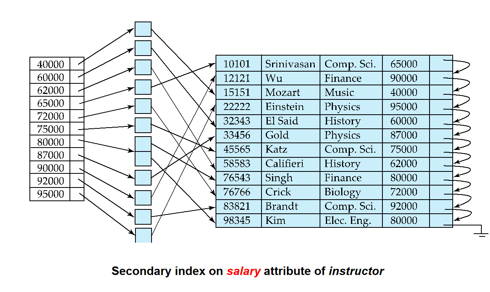
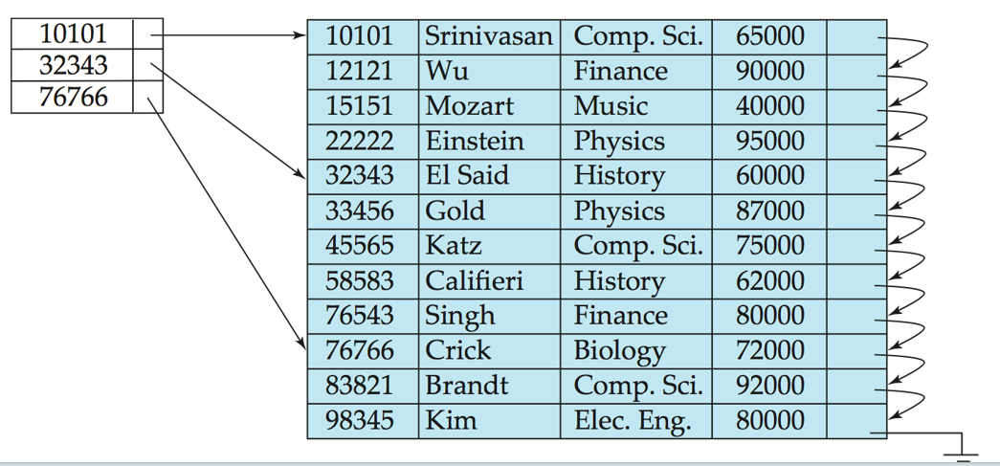
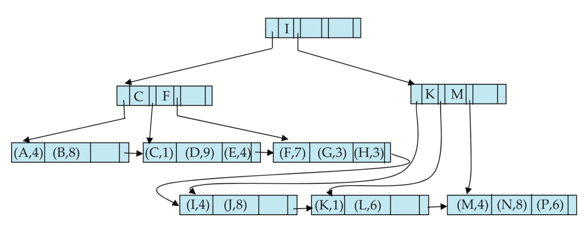
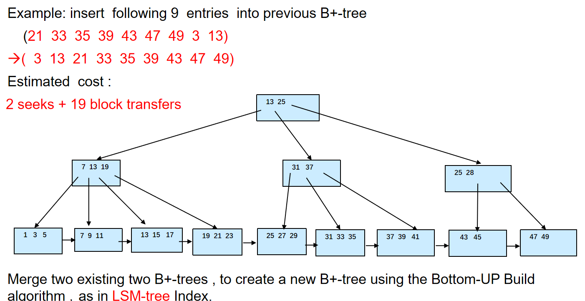
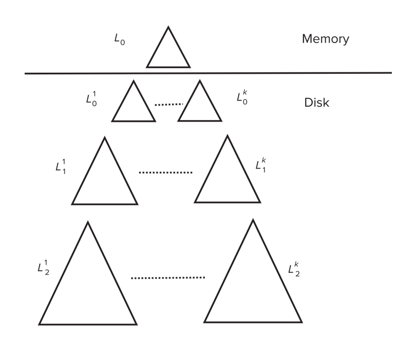

# 索引

## Basic Concepts

- 索引是一个数据结构，用于加速对数据库表中数据的访问。

- Search Key: 索引的关键字，用于查找数据。
- 一个Index File包含多个Index Entry，每个Index Entry包含一个Search Key和一个指向数据记录的指针。
    
    | Search Key | Record Pointer |
    |------------|----------------|

- 有两种索引类型:

    - Ordered Index: 索引条目按顺序排列，适用于范围查询。

    - Hash Index: 索引条目无序排列，适用于等值查询。


### Index Evaluation Metrics
> 索引的评估指标

- Access types supported efficiently.  E.g., 
    - Point query: records with a specified value in the attribute,点查询
    
    - Range query: or records with an attribute value falling in a specified range of values,范围查询

- Access time

- Insertion time

- Deletion time

- Space overhead

## Ordered Indices

> Indexes that are ordered by the search key.

有如下的概念:

- Primary Index(主索引): 也称为clustering index（聚集索引）.决定了排列顺序的索引,其Search Key通常,但并不一定,是主键.主索引的记录在文件中是有序的.
    <div align="center">
    </div>


- Secondary Index(次索引): 也称为non-clustering index（非聚集索引）.它决定的顺序与文件实际排列的顺序不一样.
    <div align="center">
    </div>

- Index-sequential file（索引顺序文件）: ordered sequential file with a primary index.


- Dense Index Files(稠密索引文件): 所有的Search Key都有一个索引条目.每个索引条目都指向一个数据记录.
    <div style="display: grid; grid-template-columns: 1fr 1fr; gap: 10px;">
        <div>
            
            <p align="center">稠密索引</p>
        </div>
        <div>
            
            <p align="center">稀疏索引</p>
        </div>
    </div>

<!-- <div align="center" style="display:flex; justify-content:center;">
    
    
</div> -->

- Sparse Index Files(稀疏索引文件): 只有一部分Search Key有索引条目.每个索引条目都指向一个数据块.
    <div align="center">
    </div>

    - Good tradeoff: sparse index with an index entry for every block in file, corresponding to least search-key value in the block.

    - 和B+树有点像.

## Multilevel Index (多级索引)

- Treat primary index kept on disk as a sequential file and construct a sparse index on it.
    - outer index – a sparse index of primary index
    
    - inner index – the primary index file

<div align="center">
</div>

## B+-Tree Index

和[ADS](../ADS/Tree.md#b树)一样

一个B+树节点典型的结构如下:

<div align="center">
</div>

- $K_i$是搜索键的值.通常$K_1<K_2<...<K_{n-1}$

- $P_i$是指向下一个节点的指针.如果是叶子节点,那么$P_i$指向数据记录.如果是非叶子节点,那么$P_i$指向下一个节点.

- 对于叶子节点,$P_n$指向下一个叶子节点,也就是下一个数据记录.

### Examples

由于ADS中已经学过相关操作,所以这里就放一些B+树的例子.

#### B+ Tree

对于下图的B+树:

<div align="center">
</div>

1. 其阶数n=6

2. 叶子节点的键值数目范围是[3,5] **这里和ADS不一样,是[(n-1)/2,n-1]**

3. 非叶子节点的孩子数目范围是[3,6] 

4. 根节点要么是叶子,要么至少有两个孩子


!!! info "高度结论"
    如果一个B+树中存储了$K$个索引,则其高度的范围是:

    $$
    max{\lceil \log_{n/2} {K/2} \rceil +1 ,\lceil \log_{n/2} K \rceil }\geq h \geq \lceil \log_{n} K \rceil
    $$

#### 插入与删除

??? example "所有的例子"
    === "插入1"
        
    === "插入2"
        
    === "插入3"
        
    === "插入4"
        
    === "删除1"
        
    === "删除2"
        
    === "删除3"
        
    === "删除4"
        
    === "删除5"
        

> Average node occupancy depends on insertion order
> 
> $\frac{2}{3}$  with random, $\frac{1}{2}$with insertion in sorted order

### B+- tree : height and size estimation

对于如下的数据定义:

```sql
person( pid char(18)  primary key，
        name char(8),   
        age smallint,                             
        address char(40) ); 
```

与1000000个人相关的记录.

一个block大小4KB,一个指针大小4B,一个char(18)大小18B,一个char(8)大小8B,一个smallint大小2B,一个char(40)大小40B.

因此一个block可以存储的记录数为:

$$
\frac{4096}{8+18+2+40}=\frac{4096}{68}\approx 60
$$

B+树的阶数为:

$$
\frac{4096-4}{18+4}+1=\frac{4092}{22}+1\approx 187
$$

如果是两层的B+树,那么最多可以存储的记录数为:

$$
187*186\approx 34782
$$

如果是三层的B+树,那么最多可以存储的记录数为:

$$
187*187*186\approx 6504234
$$

因此我们使用三层的B+树,可以存储下上面这一百万条记录.

> 一个叶子可以存储[93,186]条记录,一个非叶子节点可以有[94,187]个孩子

1. 半满叶节点情况

    | 节点层级 | 计算值 | 向上取整 | 单位 |
    |---------|--------|---------|------|
    | 叶节点数 | 10752.69 | 10752 | nodes |
    | 第二层节点数 | 114 | 114 | nodes |
    | 根节点 | 1 | 1 | node |
    | **总节点数(最多)** | **10867** | **10867** | **nodes** |

2. 满叶节点情况

    | 节点层级 | 计算值 | 向上取整 | 单位 |
    |---------|--------|---------|------|
    | 叶节点数 | 5376.344 | 5377 | nodes |
    | 第二层节点数 | 29 | 29 | nodes |
    | 根节点 | 1 | 1 | node |
    | **总节点数(最小)** | **5407** | **5407** | **nodes** |

### B+ Tree File Organization

- B+-Tree File Organization:
    - Leaf nodes in a B+-tree file organization store records, instead of pointers.存储记录而不是指针

    - Helps keep data records clustered even when there are insertions/deletions/updates

- Leaf nodes are still required to be half full
    - Since records are larger than pointers, the maximum number of records that can be stored in a leaf node is less than the number of pointers in a nonleaf node.

<div align="center">
</div>

### Other Issues in Indexing


- Record relocation and secondary indices
    - If a record is relocated, all secondary indices on the record must be updated.

    - 这会导致节点的分裂开销十分大

    - 解决方法是:在二级索引中不要直接存储记录地址，而是存储该记录的“主键”值，再通过主索引定位记录。

- Variable length strings as keys
    - Variable fanout

- Prefix compression
    - Keys in leaf node can be compressed by sharing common prefixes

    - Keep enough characters to distinguish entries in the subtrees separated by the key value
        - E.g. “Silas” and “Silberschatz” can be separated by “Silb”

## Bulk Loading and Bottom-Up Build
> 批量加载和自底向上构建


Inserting entries one-at-a-time into a B+-tree requires  1 IO per entry

因此,我们有两种解决方法:

1.  Insert in sorted order
    
    - 充分利用数据局部性.

2.  Bottom-up B+-tree construction

    - 和上面一样,先排序

    - 然后从底部开始构建B+-树

!!! example "Bulk Loading"
    


### Bulk insert index entries

!!! example "Bulk Insert"
    

    先把之前那颗树的叶子节点找到,1 Seek+6 blocks

    然后构建完树后,把树再写回去,1 Seek+13 blocks

### Multiple-Key Access

- Composite search keys are search keys containing more than one attribute
    - E.g. (dept_name, salary)

- Lexicographic ordering: (a1, a2) < (b1, b2) if either 
    - a1 < b1, or 
    
    - a1=b1 and  a2 < b2

## Indexing in Main Memory

当索引结构（如 B+ 树）主要或完全存储在主内存（RAM）中时，我们需要考虑新的性能优化点。

- **内存访问的成本：**
    - 虽然内存随机访问比磁盘/闪存快得多，但与 CPU 缓存（Cache）相比，仍然相对较慢且存在延迟。

- **大节点与缓存未命中（Cache Misses）：**
    - 传统 B+ 树为优化磁盘 I/O 而设计的大节点，在内存中进行内部查找（如二分查找）时，容易跨越多个block，导致频繁的**缓存未命中**，降低效率。

- **缓存友好（Cache-Conscious）数据结构：**
    - 对于内存索引，优化重点转向**最大化 CPU 缓存利用率**。我们需要设计“缓存友好”的数据结构。

**关键思想（Key Idea）：**

为了平衡磁盘/内存访问和缓存访问的优化：

1.  **保留大节点：** 继续使用较大的 B+ 树节点，以减少磁盘 I/O（如果需要）或整体内存访问（如减少 TLB 未命中）。

2.  **优化节点内部结构：** 不再使用简单的有序数组，而是在大节点**内部嵌入一个小的、缓存友好的树结构**（例如，节点大小与缓存行匹配的小 B 树）。这样，节点内部的查找操作能更好地利用缓存，减少未命中。


## Indexing on Flash

在闪存中，写入不是立即的，需要等待原来的数据被擦除后才能写入新的数据。

闪存的随机读取速度远快于磁盘，没有寻道和旋转延迟。因此，读取小页面和大页面的延迟差异远小于磁盘

并且，如果使用大页面，擦除时的代价就会很高。

- Optimum page size therefore much smaller

- Bulk-loading still useful since it minimizes page erases

- Write-optimized tree structures (i.e., LSM-tree) have been adapted to minimize page writes for flash-optimized search trees


### Log Structured Merge (LSM) Tree

!!! definition "LSM Tree"
    LSM树是一种数据结构，旨在优化写入操作的性能。它通过将写入操作首先存储在内存中，然后定期将这些数据批量写入磁盘，从而减少随机写入的次数。

    

插入数据时:

1. 数据块先插入到内存中的$L_0$树

2. 当$L_0$树满了，使用bottom-up build的策略把$L_0$树中的数据写入到$L_1$树中

3. 当$L_1$树的大小超过某个阈值，就把它合并到$L_2$树中

4. 以此类推，有$L_3$树，$L_4$树，...


#### Stepped Merge Index

当一层上存在k个索引时，把它们合并为下一层的一个树。

<div align="center">
</div>

布隆过滤器可以用来快速判断一个元素是否在某个集合中。

1.  使用一个位数组和多个哈希函数。
2.  添加元素时，用哈希函数计算多个位置，并将这些位置的位设为 1。
3.  查询元素时，检查其哈希函数对应的所有位：
    *   如果**所有位**都是 1，则报告元素**可能存在**。
    *   如果**至少有一位**是 0，则报告元素**绝对不存在**。

#### Delete

在LSM树中，如果我们要删除一个entry,我们就加入一个特殊的delete entry，然后：

1. 在查询时，同时查找original entry和delete entry,如果有entry和某个delete entry匹配了，就不返回

2. 在合并树时，如果我们找到某个delete entry匹配了某个entry,就把这个这两个entry都删除掉

### Buffer Tree
> Key idea: each internal node of B+-tree has a buffer to store inserts

也就是把B+树每个节点剩下的空间用来存储插入的记录.
    - 这样可以减少磁盘I/O,因为我们可以把插入的记录先存储在内存中,等到节点满了再写入磁盘.


## Bitmap Indices

认为一个关系里的一个个元组都是从0开始有序依次编号的

对于每一个属性的每一种值，都有一个bitmap，`1`表示该元组的该属性为这个值,反之为`0`.

因此,bitmap使用于那些值比较少的属性,比如性别,国家,城市等.

!!! example "Bitmap Indices"
    

Bitmap Indices对于多值属性的查找非常友好,只要把两个属性值的bitmap做与(and)/或(or)操作就可以了.

- Bitmaps are packed into words": 位图在内存中不是按单个位存储的，而是被打包成 CPU 的原生字长（Word Size），通常是 32 位或 64 位。这意味着一个 32 位的整数可以存储位图中的 32 个连续位。

- 为了快速知道结果位图中有多少个 1,我们使用如下方法

    1. 预计算数组: 事先创建一个包含 256 个元素的数组（我们称之为 popcount_lookup）。数组的索引范围是 0 到 255，正好对应一个字节（8 位）能表示的所有可能值。
    2. 数组内容: `popcount_lookup[i]` 存储的是整数 i 的二进制表示中包含的 1 的个数。例如：
    
        - `popcount_lookup[0]` (二进制 00000000) = 0, 
        - `popcount_lookup[1]` (00000001) = 1, 
        - `popcount_lookup[2]` (00000010) = 1, 
        - `popcount_lookup[3]` (00000011) = 2, 
        - ..., 
        - `popcount_lookup[255]` (11111111) = 8

    3. 将位图按字节（8 位）拆分。对于每个字节，直接以该字节的值作为索引去查预计算数组，就能立刻得到这个字节中 1 的个数。