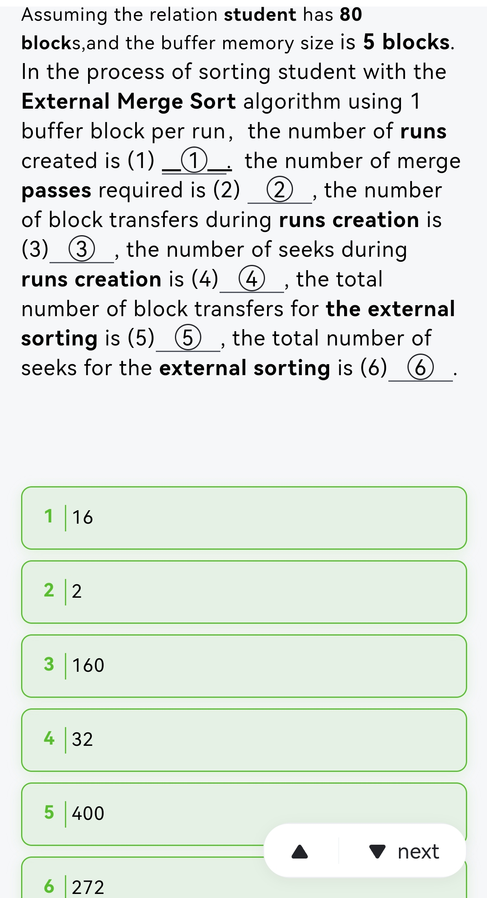
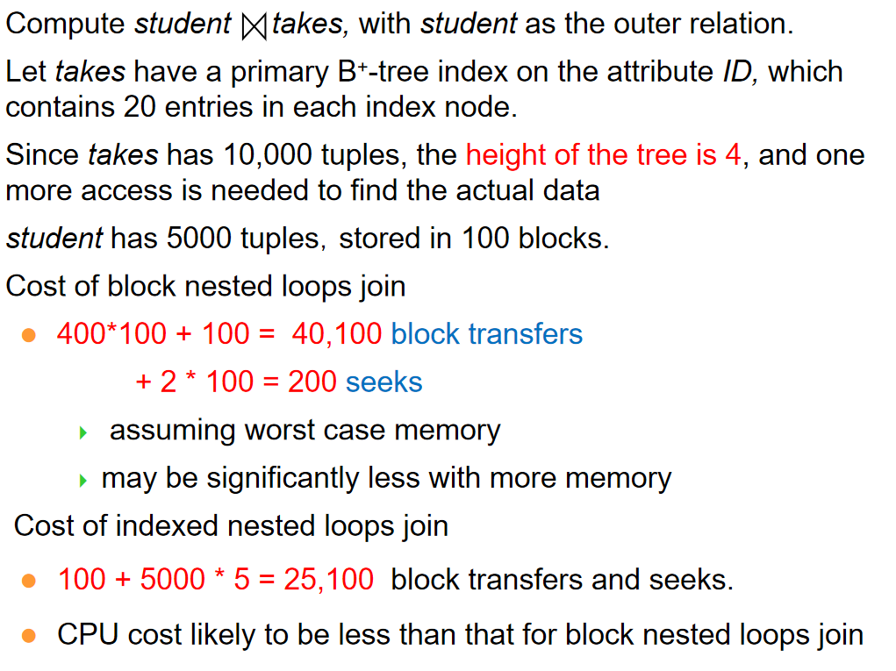
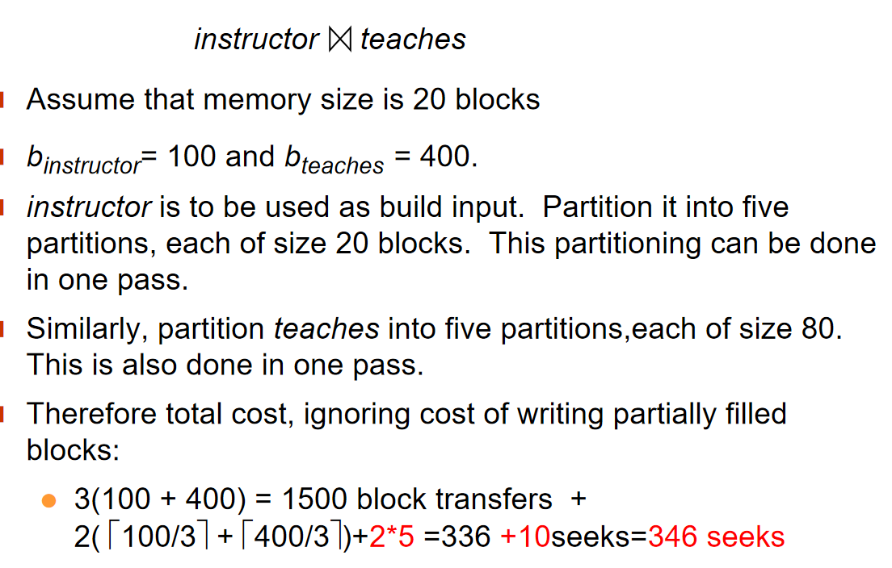

# 查询处理

## Basic Steps in Query Processing

<div align="center">
    </div>


查询处理的基本步骤是：

1. 解析与转换 (Parsing and translation)

    - 将查询转换为其内部形式，通常转换为关系代数形式
    - 解析器执行以下任务：
        - 检查查询的语法是否正确
        - 验证查询中引用的关系是否存在
        - 检查属性名是否有效

2. 优化 (Optimization)

    - 在所有等价的执行计划中，选择代价最低的执行计划
    - 查询优化器负责生成有效的查询执行计划

3. 执行 (Evaluation)

    - 查询执行引擎接收查询执行计划
    - 按照计划执行各个操作
    - 返回查询结果给用户


!!! example "🌰"
    对于如下的语句:
    ```sql
    select name, title 
    from instructor natural join (teaches natural join course)
    where dept_name=‘Music’ and year = 2009; 
    ```

    用关系代数来表达就是:
    $$
    \pi_{name,title}(\sigma_{dept\_name=‘Music’ \land year=2009}(instructor \bowtie (teaches \bowtie course)))
    $$

    优化前与优化后的表达树为:

    <div align="center">
        </div>

    从中可以看出几点逻辑:

    1. 把选择运算往叶子上推；因为叶子节点的表小，选择运算的代价小，并且这样也能减少中间结果集的大小。

    2. 小的表先连接，减少中间结果集的大小。

    **An evaluation plan defines exactly what algorithm is used for each operation, and how the execution of the operations is coordinated.**

    如下图:
    <div align="center">
        </div>

    左边使用B+树扫描，右边使用线性扫描，并且两边是可以Pipeline的。

    还有merge join和hash join的区别。

## Measurement of Query Cost
> Typically disk access is the predominant cost, and is also relatively easy to estimate. 
>
> 硬盘访问的开销总是最大的

我们考虑如下三个因素:

1. Number of seeks

2. Number of blocks read

3. Number of blocks written

通常写的代价比读大很多，因为一般写完我们还要读一遍来检验。

为了简化，我们使用如下两个量来评估代价:

1. number of block transfers,与之相配的是$t_T$ – time to transfer one block

2. number of seeks,与之相配的是$t_S$ – time to perform one seek

3. 对于b次块传输和s次寻道，代价为：
    $$
    C = b \cdot t_T + s \cdot t_S$$

> We often use worst case estimates, assuming only the minimum amount of memory needed for the operation is available

## Selection Operation

### File scan

Algorithm **A1** (linear search).  Scan each file block and test all records to see whether they satisfy the selection condition.
> 我们假定块是连续存放的

- Worst Cost:$b_r \times t_T + t_S$
    - $b_r$是块数目

- Average Cost: $\frac{b_r}{2} \times t_T + t_S$
    - 如果查找的是一个主键值，并且我们找到符合的就停止

### Index scan
> search algorithms that use an index
>
> 

#### A2 

A2 (primary B+-tree index / clustering B+-tree index, equality on key). 

- 即使用B+树索引

- 找的是主键值

<div align="center">
    </div>

Cost:

$$
C = (t_S + t_T) \cdot (h + 1)$$

- $h$是树的高度

- B+树每到新的一层,都要重新寻道一次

- 最后要+1是因为我们要读数据块

#### A3

A3 (primary B+-tree index/ clustering B+-tree index, equality on nonkey) 

- 即使用B+树索引

- 找的是非主键值

- 所以可能有多个结果

> Records will be on consecutive blocks, 所以最后找数据块只需要寻道一次
>
> Let b = number of blocks containing matching records


<div align="center">
    </div>

Cost:

$$
C = (t_S + t_T) \cdot h + t_S+ b \cdot t_T$$

#### A4

A4 (secondary B+-tree index , equality on key)

- 即使用B+树索引

- 找的是主键值

- 但使用的是非聚集索引

<div align="center">
    </div>

Cost和A2一样:

#### A4'

A4' (secondary B+-tree index , equality on nonkey)

- 即使用B+树索引

- 找的是非主键值

- 使用的是非聚集索引

> m 表示放指针的块的数量
>
> n 表示对应磁盘里的记录的数量。

<div align="center">
    </div>

$$
Cost = (t_S + t_T) \cdot (h + m + n)
$$

### Selections Involving Comparisons
> 进行查找$\sigma_{A \leq B}(r)$或$\sigma_{A \geq B}(r)$ 

#### A5

A5 (primary B+-index / clustering B+-index index, comparison)

- 索引是主键值

- 包含比较

- 已经排好序

1. 对于$\sigma_{A \geq B}(r)$
    
    - 先找到第一个符合的值，然后顺序扫描

    - Cost和A3一样

2. 对于$\sigma_{A \leq B}(r)$

    - 不需要使用索引

    - 直接从数据块里顺序扫描，直到读到第一个元组大于B为止

<div align="center">
    </div>

#### A6

A6 (secondary B+-tree index, comparison)

1. 对于$\sigma_{A \geq B}(r)$
    - 根据B+树索引找到第一个符合的值，然后顺序扫描

2. 对于$\sigma_{A \leq B}(r)$
    - 直接在叶子节点逐个扫描，直到读到第一个元组大于B为止

    - 然后对于每一个指针，去数据块里顺序读

<div align="center">
    </div>

### Implementation of Complex Selections
> 对于多条件的选择:$\sigma_{\theta_1 \land \theta_2 \land ... \land \theta_n}(r)$

1. A7 (conjunctive selection using one index)
    - 选一个条件，从A1-A6之间找一个最优的算法，得到一堆元组

    - 在这堆元组上测试其他条件


2. A8 (conjunctive selection using composite index)
    - Use appropriate composite (multiple-key) index if available.

3. A9 (conjunctive selection by intersection of identifiers)
    - 对于每一个条件，从A1-A6中选择一个最优的算法，得到结果集

    - 把结果集取交

### Algorithms for Complex Selections

1. 对于多条件的选择:$\sigma_{\theta_1 \lor \theta_2 \lor ... \lor \theta_n}(r)$

    - Applicable if all conditions have available indices.

    - Otherwise use linear scan.

    - Use corresponding index for each condition, and take union of all the obtained sets of record pointers.

    - Then fetch records from file

2. 取反的选择:$\sigma_{\neg \theta}(r)$

    - 先用线性扫描找出所有的元组，然后在内存中进行选择

### Bitmap

没讲

## Sorting
> 和ADS中的[外部排序](../ADS/exsort.md)很像,但是我当时没写(悲)

!!! definition "Runs 与 Pass"
    为了避免模糊，在这里直接把这两个关键定义给出

    - **Run**:一组已经排序好的数据，初始的Runs大小和内存大小一致

    - **Pass**:一个把N个Runs归并排序为$\frac{N}{M}$个Runs,其中M是内存中可以放的Block数量。

    <div align="center">
        </div>

### 排序步骤

1. Create sorted runs(归并段 )
    - Let i be 0 initially. 
    - Repeatedly do the following till the end of the relation:
        - Read M blocks of relation into memory
        
        - Sort the in-memory blocks  
        
        - Write sorted data to run $R_i$; increment 
        
        - Let the final value of i be N


2. Merge the runs (N-way merge)

    - $N \leq M$

        - 那么只需要一个Pass

        - 为每一个run准备一个Block作为缓冲区，再来一个Block作为输出的缓冲区，从每个run中读一个Block到缓冲区

        - 重复以下过程直到结束:

            - 对于缓冲区里面所有Block，归并出一块Block到输出缓冲区，然后写到磁盘上

            - 如果缓冲区里面的Block都读完了，那么就从磁盘上读下一个Block到缓冲区

        <div align="center">
            </div>

    
    - $N \geq m$
        - 每一次，把N个Runs变成$\lceil \frac{N}{M-1} \rceil$个Runs

        - 如果仍然数量超过 M, 继续 pass.

        - E.g.  If M=11, and there are 90 runs, one pass reduces the number of runs to 9, each 10 times the size of the initial runs

### Cost analysis(Simple version)

令$b_r$为需要排序的所有块的数目

- Runs总数目为$N = \lceil \frac{b_r}{M} \rceil$，因为初始时一个Runs的大小就是内存的大小

- 总共需要的Pass数目为$P = \lceil \log_{M-1} N \rceil$

- 对于每个Pass和初始的Runs的生成，Block的传输次数都为$2b_r$，因为我们要读和写
    - 需要注意的是，读一个Runs和写一个Runs的代价不是一个Block，而是Runs的实际大小。每轮Pass中Runs的总大小都是$b_r$

    - 每次都需要读和写这么多Block，所以代价是$2b_r$

    - 然而，在最后一个Pass中，我们只需要读一次，所以代价是$b_r$，因为可能不会写向磁盘，而是交给下一步

- 所以，总的Block Transfers为:

    $$ 
    \begin{align}
    &2b_r( \lceil \log_{M-1} {b_r / M} \rceil-1) &\text{(中间 Pass 的读写)}\\ 
    &+ b_r &\text{(最后 Pass 的读取)}\\ 
    &+ 2b_r &\text{(初始 Runs 生成的读写)}
    \end{align}
    $$

    也即$C = 2b_r \lceil \log_{M-1} {b_r / M} \rceil + b_r$

- 总的Seek为
    - 在Runs的生成时，需要$2 \lceil \frac{b_r}{M} \rceil$次寻道

    - 在每个Pass中，都需要$2 b_r$次寻道，因为每个Block都要被加载进内存，并写出

    - 除了最后一个Pass

    - 所以总的寻道次数为:

        \begin{align}
        2 \lceil \frac{b_r}{M} \rceil + 2b_r \lceil \log_{M-1} {b_r / M} \rceil - b_r
        \end{align}

!!! example "🌰"
    

### Cost analysis(Advance version)

每次只读一块的Seek次数太多了，我们改为每次读$b_b$块

<div align="center">
    </div>

这样，一次可以把$\lfloor \frac{M}{b_b} \rfloor -1$个Runs合并为一个新的Runs

- 这样，一共需要的Pass数目为$P = \lceil \log_{\lfloor \frac{M}{b_b} \rfloor-1} (b_r /M) \rceil$

总的Block Transfers为:

$$
C = 2b_r \lceil \log_{\lfloor \frac{M}{b_b} \rfloor-1} {b_r / M} \rceil + b_r
$$

- 总的Seek为:
    - 在生成Runs时，也同样是Runs个数的两倍:$2 \lceil \frac{b_r}{M} \rceil$

    - 不同的是，现在每个Pass中读和写的寻道个数都是$\lceil \frac{b_r}{b_b} \rceil$

    - 所以总的寻道次数为:

        \begin{align}
        2 \lceil \frac{b_r}{M} \rceil + 2\lceil \frac{b_r}{b_b} \rceil \lceil \log_{\lfloor \frac{M}{b_b} \rfloor-1} {b_r / M} \rceil - b_r
        \end{align}

## Join Operation
> 我们使用的例子数据是:
>
> Number of records of student:5,000,takes:10,000
>
> Number of blocks of student:100,takes:400


我们希望完成$ r \bowtie_\theta s$

### Nested-Loop Join

```plaintext
for each tuple tr in r do begin
    for each tuple ts in s do begin
        test pair (tr,ts) to see if they satisfy the join condition theta

        if they do, add tr • ts to the result.
    end
end
```

- 这是最朴素的做法

- r 被称为outer relation，s 被称为inner relation.

- 在最坏的情况，如果内存每次只能容纳两个关系各一个Block
    - $n_r * b_s + b_r$次块传输
        - 因为r的每个元组都要和s的每个元组进行比较，所以r的一个元组要遍历s的所有块

    - $n_r + b_r$次寻道(假设一个关系的块是连续存放的，每一个r的元组要Seek一次来找到s的块)

    - $n_s$是关系s的元组数目

    - $b_s$是关系s的块数目

    - $b_r$是关系r的块数目

- 但是，如果有一个关系的元组足够少，少到能整个放进内存中
    - 我们把这个关系当作内关系,始终放在内存中

    - $b_r +b_s$次块传输
        - 因为我们只需要读一次内关系的所有块
    
    - 两次寻道
        - 一次是读内关系的块，一次是读外关系的块

<div align="center">
    </div>

### Block Nested-Loop Join

上一个算法的问题就在于，关系表中连续存放的元组在块中不一定是连续存放的，因此我们如果以块为单位读取，先读取块，再读这个块里面的元组，那就可以减少寻道次数与块传输次数。

相当于，我们先各读一个块，然后在内存中比较，相当于按块的顺序来比较

<div align="center">
    </div>

在这样的情况下，如果最坏:

- $b_r * b_s + b_r$次块传输

    - Each block in the inner relation s is read once for each block in the outer relation

- $b_r + b_r$次寻道

最好的情况是一样的

--- 

Improvements to block nested loop algorithms:

假设内存有 M 块，有一块作为 output 的缓冲，剩下 M-1 块中 M-2 块均给外关系，内关系给一块。

<div align="center">
    </div>

当然还是沿用块嵌套循环的思想

- Block Transfers:$\lceil \frac{b_r}{M-2} \rceil * b_s + b_r$

- Seek: $2 \lceil \frac{b_r}{M-2} \rceil$
    - 假设对于外关系，一次读取连续的M-2块进来，这M-2块只需要一次寻道。

- 如果连接的属性是 key, 那么当我们匹配上之后就可以停止内循环。

- 利用 LRU 策略的特点，inner 正向扫描后再反过来，这样最近的块很可能还在内存中，提高缓冲命中率。

### Indexed Nested-Loop Join

如果内循环的关系有索引，那么对于外循环的每一个元组，我们根据特定属性上的值在内循环的索引里查找。

Cost：$b_r (t_T + t_S) + n_r * c$

- c指遍历索引并找到所有符合条件的元组的代价

!!! example "🌰"
    


---

### Merge Join

<div align="center">
    </div>

1. 对于每一个关系，先按连接属性排好序

2. Merge the sorted relations to join them
    - Join step is similar to the merge stage of the sort-merge algorithm.

    - Main difference is handling of duplicate values in join attribute — every pair with same value on join attribute must be matched

由于每个块只需要传输一次，所以:

- Block Transfers: $b_r + b_s$

- Seek: $ \lceil \frac{b_r}{b_b} \rceil + \lceil \frac{b_s}{b_b} \rceil$

一个数学问题:如果内存有M块，如何分配给两个关系的块？

答案是:
$$
x_r = \sqrt{b_r} \times \frac{M}{\sqrt{b_r} + \sqrt{b_s}}, \\
x_s = \sqrt{b_s} \times \frac{M}{\sqrt{b_r} + \sqrt{b_s}}
$$

### Hash-Join

我们使用一个哈希函数，把元组分块，这样，由于哈希函数的特点，能够连接的属性的值一定在同一块中，反之不然。

<div align="center">
    </div>

并且，分成的块数$n$与哈希函数要设计过，使得块的大小是足以放进内存的。

$n \geq \lceil \frac{b_s}{M} \rceil$

#### Hash-Join Algorithm

1. 对关系s用哈希函数H，内存同样保留input buffer和output buffer，分片之后再写出去

2. 关系r也用哈希函数H，分片之后再写出去

3. 把s的第i个分块加载到内存中，并在连接属性上再用一个不同的哈希函数建立哈希索引

4. 把r的第i个分块加载到内存中，每个元组在连接属性上作哈希，就能很快找到s中匹配的元组

5. 把连接结果输出

因此，s被叫做build input，r被叫做probe input

!!! definition "修正因子"
    通常n会被选为$\lceil \frac{b_s}{M} \rceil *f$

    其中f是修正因子，通常取1.2

需要注意的是，在分块的时候，我们要求对于每个块都要有一个输出缓冲块，比如哈希函数映射的值范围是0到n-1，那么我们就要有n个输出缓冲块,根据哈希函数的值来决定输出缓冲块的编号。

由此就引发了一个问题，因为这样的算法要求每次分块的个数必然不能大于内存的块数，如果原来关系很大，大到即使分成这么多块，大小还是太大了怎么办?

所以要用Recursive partitioning

#### Recursive partitioning

- Instead of partitioning n ways, use  M – 1 partitions for s

- Further partition the M – 1 partitions using a different hash function

- For example, consider a memory size of 12M bytes, divided into 4K bytes blocks; it would contain a total of 3K (3072) blocks. We can use a memory of this size to partition relations of size up to 3K ∗ 3K blocks, which is 36G (3K ∗ 3K ∗ 4K ) bytes. 

#### Cost of Hash Join

<div align="center">
    </div>

<div align="center">
    </div>

!!! example "🌰"
    

## Other Operations

- Duplicate elimination can be implemented via hashing or sorting.

    - On sorting duplicates will come adjacent to each other, and all but one set of duplicates can be deleted.  

    - Optimization: duplicates can be deleted during **run generation** as well as at intermediate merge steps in external sort-merge.

    - Hashing is similar – duplicates will come into the same bucket.

- Aggregation can be implemented in a manner similar to duplicate elimination.
    
    - Sorting or hashing can be used to bring tuples in the same group together, and then the aggregate functions can be applied on each group. 

    - Optimization: combine tuples in the same group during run generation and intermediate merges, by computing partial aggregate values
        
        - For count, min, max, sum: keep aggregate values on tuples found so far in the group.  
        
            - When combining partial aggregate for count, add up the aggregates

        - For avg, keep sum and count, and divide sum by count at the end

- 集合操作

    1. 对每个关系分块

    2. 对于每个i，$r_i$建立哈希索引

        - 如果是取并集:
            
            - 如果$s_i$中的元组经过哈希函数映射后，值不存在，则加入哈希索引中

            - 输出哈希索引

        - 如果是取交集:
            
            - 如果$s_i$中的元组经过哈希函数映射后，值存在，就输出

        - 如果是取差集:
            
            - 如果$s_i$中的元组经过哈希函数映射后，值如果存在，就从哈希索引中删除

            - 输出哈希索引中的所有元组

- Outer Join
    <div align="center">
        </div>