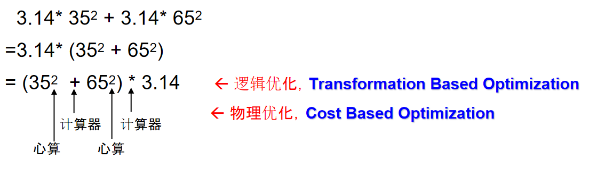
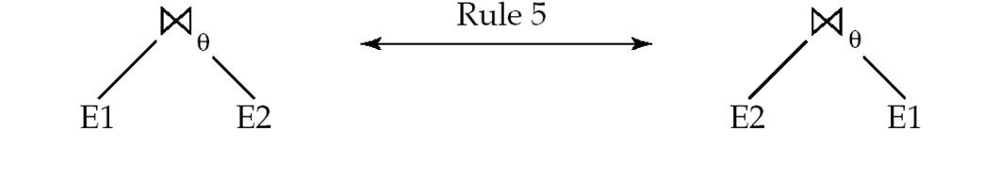
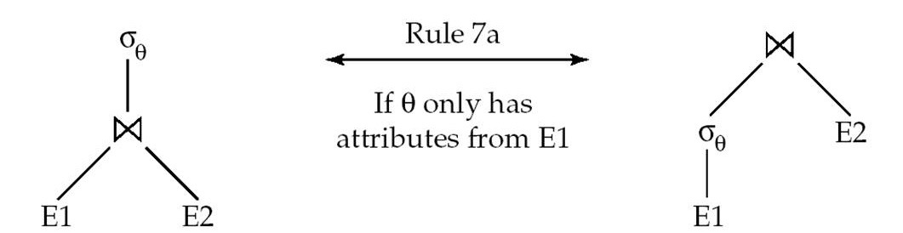
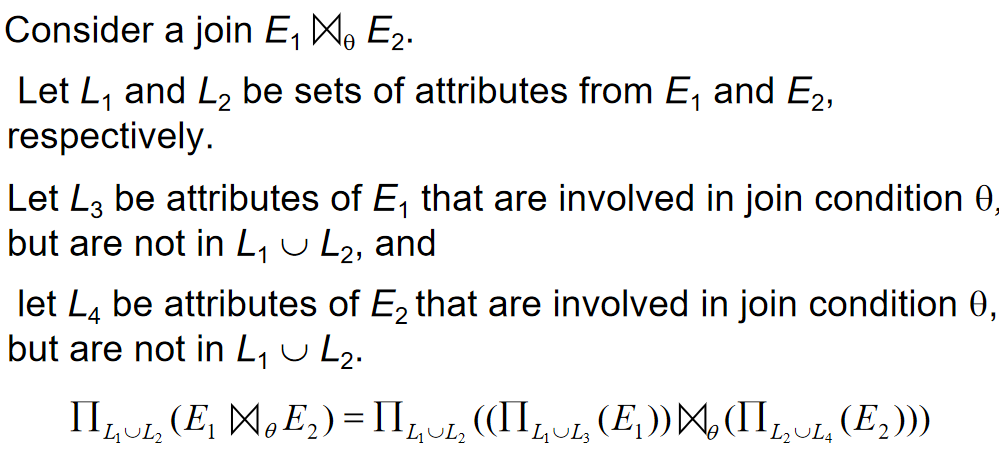
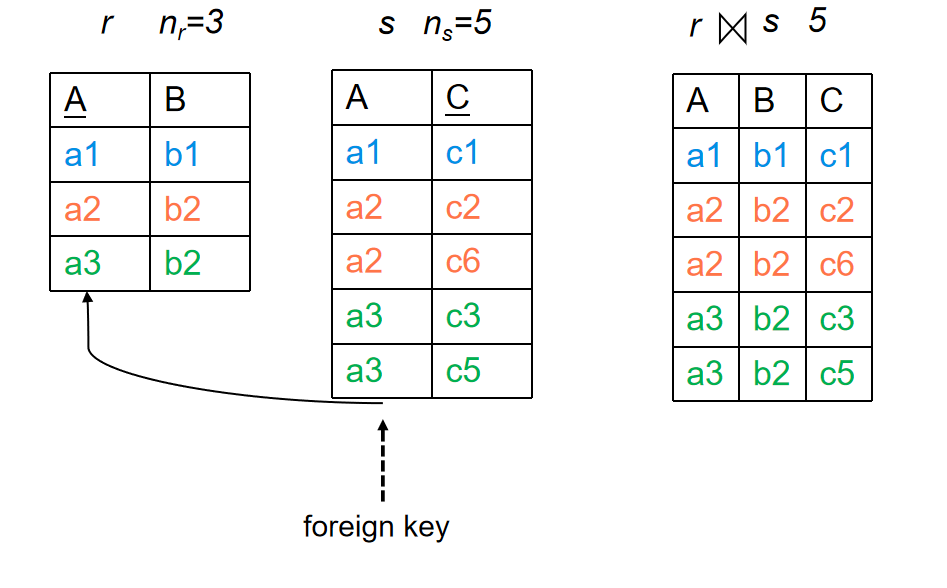
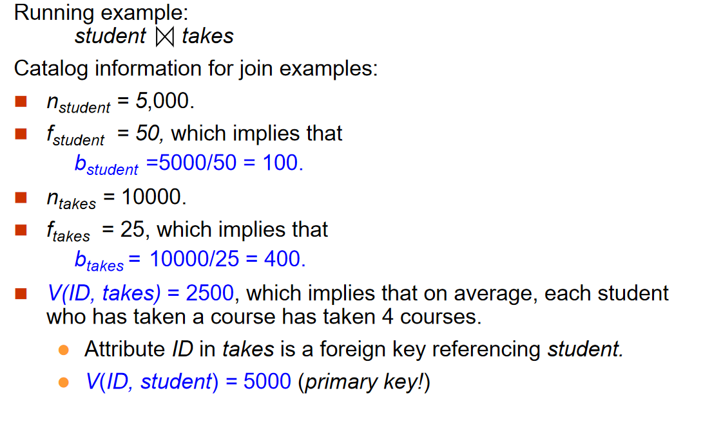
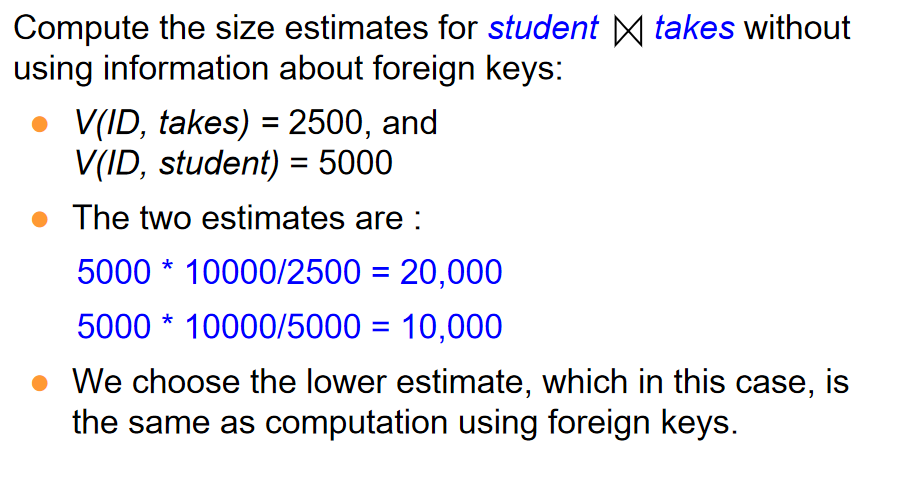
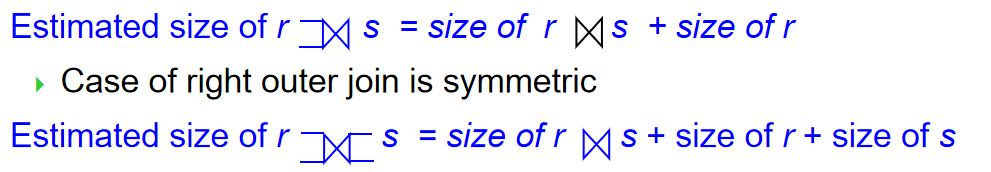
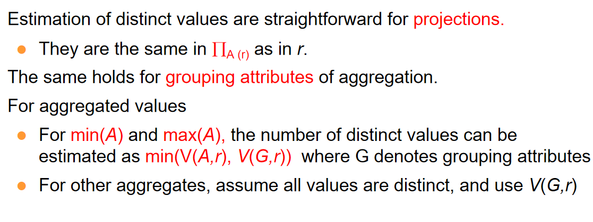
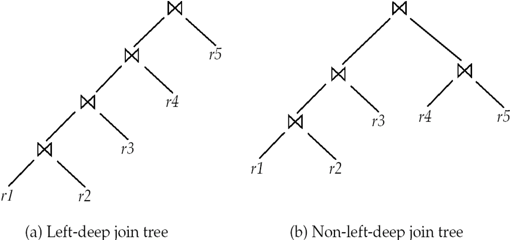

# 查询优化

## Introduction

<div align="center">
    </div>


Alternative ways of evaluating a given query

- Equivalent expressions:逻辑优化，先做投影，选择

- Different algorithms for each operation：物理层面的优化，为每个算子选择合适的算法

!!! example
    <div align="center">
        </div>

    <div align="center">
        </div>

## Generating Equivalent Expressions
> Two relational algebra expressions are said to be **equivalent** if the two expressions generate the same set of tuples on every legal database instance

### Equivalence Rules

#### Selection

1. **Conjunction decomposition**: 选择条件可以分解成多个条件

    $$\sigma_{p_1 \land p_2}(R) = \sigma_{p_1}(\sigma_{p_2}(R))$$

2. **Selection commutativity**: 选择条件可以交换

    $$\sigma_{p_1}(\sigma_{p_2}(R)) = \sigma_{p_2}(\sigma_{p_1}(R))$$

3. **Only the last projection is needed**: 只需要最后的投影条件

    $$\Pi_{L_1}(\Pi_{L2}(\dots(\Pi_{Ln}(R)))) = \Pi_{L1}(R)$$

4. **Selections can be combined with Cartesian products and theta joins**: 选择可以和笛卡尔积和连接结合

    $$\sigma_{p_1}(R \times S) = R \bowtie_{p_1} S$$

    $$\sigma_{p_1}(R \bowtie_{p_2} S) = R \bowtie_{p_1 \land p_2} S$$

#### Join

1. **Join commutativity**: 连接条件可以交换

    $$R \bowtie_{p_1} S = S \bowtie_{p_1} R$$

    <div align="center">
        </div>

2. **Join associativity**: 连接条件可以结合
    - $R \bowtie_{p_1} (S \bowtie_{p_2} T) = (R \bowtie_{p_1} S) \bowtie_{p_2} T$

    <div align="center">
        </div>

    - 另一种神奇的结合是:
        $$
        (R \bowtie_{p_1} S) \bowtie_{p_2 \land p_3} T = R \bowtie_{p_1 \land p_2} (S \bowtie_{p_3} T)
        $$
    - 其中条件$p_3$包含只来自于S和T的属性

3. **Select与Join分配**
    - $\sigma_{p_1}(R \bowtie_{p_2} S) = \sigma_{p_1}(R) \bowtie_{p_2} S$

    <div align="center">
        </div>

    - $\sigma_{p_1 \land p_2}(R \bowtie_{p_3} S) = \sigma_{p_1}(R) \bowtie_{p_2} \sigma_{p_3}(S)$

####  Projection

1. $\Pi_{L_1 \cup L_2}(R \bowtie_{p} S) = \Pi_{L_1}(R) \bowtie_{p} \Pi_{L_2}(S)$

<div align="center">
        </div>

#### 集合操作

1. 交换律
    - $R \cup S = S \cup R$
    - $R \cap S = S \cap R$

2. 结合律
    - $R \cup (S \cup T) = (R \cup S) \cup T$
    - $R \cap (S \cap T) = (R \cap S) \cap T$

3. 与Selection的分配律

    - $\sigma_{\theta}(R \cup S) = \sigma_{\theta}(R) \cup \sigma_{\theta}(S)$

        - 对差集，交集同样成立

    - $\sigma_{\theta}{R \cap S} = \sigma_{\theta}(R) \cap S$

        - 对差集成立，但是对于并集不成立

4. The projection operation distributes over union
    
    - $\Pi_{L}(R \cup S) = \Pi_{L}(R) \cup \Pi_{L}(S)$

#### Other
<div align="center">
        </div>


---

!!! example
    === "Select"
        

    === "Project"
        
    === "Join"
        
    === "Mix"
        

### Enumeration of Equivalent Expressions

Repeat

- apply all applicable equivalence  rules on every subexpression of every equivalent expression found so far

- add newly generated expressions to the set of equivalent expressions 

Until no new equivalent expressions are generated above


## Statistics for Cost Estimation

!!! definition "符号定义"

    1. $n_r$：relation r的元组数目

    2. $b_r$：relation r的块数目

    3. $l_r$: relation r一个元组的大小

    4. $f_r$: r中一个block能存储的元组数目

    5. $V(A,r)$: attribute A在relation r中不同值的个数,等价于$\Pi_{A}(r)$

    6. If tuples of r are stored together physically in a file, then: 
        - $b_r = \lceil \frac{n_r}{f_r} \rceil$


    7. Histogram on attribute age of relation person
        <div align="center">
            </div>

### Selection Size Estimation

1. $\sigma_{A = v}(R) = \frac{1}{ V(A,r)} \cdot n_r$
    - 这样的估算基于值是均匀分布的

    - 如果A是主键,那么结果当然是1

2. $\sigma_{A \leq v}(R) $
    - 令c为满足条件的元组数目

    - c = 0 if $v < min(A,r)$

    - $c= n_r \cdot \frac{v - min(A,r)}{max(A,r) - min(A,r)}$

    - 如果没有最大最小值的统计,认为c是$\frac{V(A,r)}{2}$

3. The selectivity（中选率）

    - 对于某个条件$\theta_i$,它的中选率是r中的一个元组满足该条件的概率

    - 令$s_i$是满足条件的元组数目,那么中选率是$s_i/n_r$

    - 计算:
        <div align="center">
            </div>

### Estimation of the Size of Joins

对于笛卡尔乘积,结果的元组数目是$n_r \cdot n_s$

1. 如果$R \cap S = \emptyset$,那么结果的元组数目是$n_r \cdot n_s$

2. 如果$R \cap S$的结果属性是R的主键,那么由于S中的一个元组最多和R中的一个元组连接,因此$R \bowtie S$的结果元组数目$\leq n_s$
    <div align="center">
        </div>

3. 如果$R \cap S$的结果属性是S引用R的外键,那么结果的元组数目就是$n_s$
    <div align="center">
        </div>

4. 如果$R \cap S$的结果属性都不是上面的情况

    - If we assume that every tuple t in R produces tuples in $R \bowtie S$,那么元组数目是

        $$\frac{n_r \cdot n_s}{V(A,s)}$$

    - 相当于计算每个R中的元组可以与S中的几个元组连接

    - 反之,公式是

        $$\frac{n_r \cdot n_s}{V(A,r)}$$

    <div align="center">
        </div>

!!! exmaple "Example"
    <div align="center">
        </div>

    <div align="center">
        </div>

### Size Estimation for Other Operations

1. **Projection**: 估计$\Pi_{A}(R)$的结果元组数目是$V(A,r)$

2. **Aggregation**: 估计$\gamma_{A}(R)$的结果元组数目是$V(A,r)$


3. **Set operations**: 
    -  For unions/intersections of selections on the same relation: rewrite and use size estimate for selections

    - 比如:

        $$\sigma_{\theta_1}(R) \cup \sigma_{\theta_2}(R) = \sigma_{\theta_1 \lor \theta_2}(R)$$

    - 对于直接的集合操作:
        - $\cup$ : $n_r + n_s$

        - $\cap$: $min(n_r, n_s)$

        - $r-s$: $n_r$

        - All the three estimates may be quite inaccurate, but provide upper bounds on the sizes.

4. **Outer Join**

    <div align="center">
        </div>

### Estimation of Number of Distinct Values

上面许多估计都要用到$V(A,r)$,即relation r中属性A的不同值的个数


1. Selection,estimate $V(A,\sigma_{\theta}(R))$

    - If $\theta$ forces A to take a specified value: $V(A,\sigma_{\theta}(R))$ = 1.
        - e.g., A = 3
    
    - If $\theta$ forces A to take on one of a specified set of values: 
        - $V(A,\sigma_{\theta}(R))$= number of specified values.
        - (e.g., (A = 1 V A = 3 V A = 4 )), 

    - If the selection condition  is of the form A op v
        - estimated $V(A,\sigma_{\theta}(R))$ = $V(A,r) \dot s$
        - s是上面说的中选率
    
    - In all the other cases, use approximate estimate:
        - $V(A,\sigma_{\theta}(R)) = min(V(A,r), n_{\sigma_\theta (r)} )$

2. Join,estimate $V(A,r\bowtie s)$

    - 如果A的所有属性来自R,那么$V(A,r \bowtie s) = min(V(A,r), n_{r \bowtie s})$

    - 如果A包含来自r的属性A1和来自s的属性A2，那么$V(A,r \bowtie s) = min(V(A1,r)*V(A2-A1,s), V(A1-A2,r)*V(A2,s),n_{r \bowtie s})$

3. Projection and aggregation
    <div align="center">
        </div>

## Choice of Evaluation Plans

Must consider the interaction of evaluation techniques when choosing evaluation plans

- choosing the cheapest algorithm for each operation independently may not yield best overall algorithm.  E.g.
    
    - merge-join may be costlier than hash-join, but may provide a sorted output which reduces the cost for an outer level aggregation.就是说，归并的代价可能暂时很大，但是这样做了可以减少后续操作的开销

    - nested-loop join may provide opportunity for pipelining

### Cost-Based Join-Order Selection

对于$r_1 \bowtie r_2 \cdots \bowtie r_n$，我们需要选择一个恰当的顺序来使得代价最小

一共有$\frac{(2(n-1))!}{(n-1)!}$种可能的顺序

但正如下面这个例子:

<div align="center">
        </div>

我们实际上可以用动态规划的思想来找到最佳的排列顺序

<div align="center">
        </div>

1. 递归到最深就是单个表，对于单个表，我们用Select和Index找到最佳的代价

2. 正常就是遍历所有可能把原来的表拆分为两个子表的情况($2^n-2$，两个有空集的情况不算)，然后再递归计算子表的代价。

#### Left Deep Join Trees

In left-deep join trees, the right-hand-side input for each join is a relation, not the result of an intermediate join.

<div align="center">
        </div>


#### Cost of Optimization

1. Dynamic Programming
    - 需要O(n^3)的时间来计算最优的连接顺序

    - 需要O(n^2)的空间来存储中间结果

2. left-deep join tree
    - 需要$O(n2^n)$的时间来计算最优的连接顺序

    - 需要$O(2^n)$的空间来存储中间结果

    <div align="center">
        </div>


#### Heuristic Optimization(启发式优化)

Heuristic optimization transforms the query-tree by using a set of rules that typically (but not in all cases) improve execution performance:

- Perform selection early (reduces the number of tuples)

- Perform projection early (reduces the number of attributes)

- Perform most restrictive selection and join operations (i.e. with smallest result size) before other similar operations.

- Perform left-deep join order

- Some systems use only heuristics, others combine heuristics with partial cost-based optimization.

## Additional Optimization Techniques

### Optimizing Nested Subqueries

对于如下的嵌套查询:
```sql
select name 
from instructor
where exists (select *
        from teaches
        where instructor.ID = teaches.ID and teaches.year = 2022)
```

这相当于是一个两重循环,低效.

Parameters are variables from outer level query that are used in the nested subquery; such variables are called correlation variables（相关变量）

- 比如上面的例子中,`instructor.ID`就是一个相关变量

我们想要把这个查询变得高效.常见的做法是把内层的查询变成一个连接操作,然后再做投影.也就是把上面的查询变成:
```sql
select name
from instructor, teaches
where instructor.ID = teaches.ID and teaches.year = 2022
```

但是,这样的做法还有问题.`teaches`中可能有许多重复的`ID`,这样就会导致`instructor`中的元组被重复计算,从而导致不必要的开销.

为解决这个问题,我们可以使用半连接(semijoin)来避免重复计算.

!!! definition "Semijoin"
    半连接的符号是$\ltimes$,其定义如下:

    "If a tuple $r_i$ appears n times in r, it appears n times in  the result of $r \ltimes_\theta s$ , if there is at least one tuple $s_i$ in s matching with $r_i$"

    通俗来讲,半连接就是连接操作,但是只保留左表的元组,而不保留右表的元组.也就是说,半连接的结果是左表中所有满足条件的元组,而不是连接后的结果.

    这样,我们就可以把上面的查询变成:

    $$\Pi_{name}(instructor \ltimes_{instructor.ID = teaches.ID \land teaches.year=2022} teaches)$$

    这样重复的名字就不会被多次计算,同时也可以避免同名出现问题.

因此,我们可以说,形如:

```sql
SELECT A
FROM r_1, r_2, ..., r_n
WHERE P_1 AND EXISTS (
    SELECT *
    FROM s_1, s_2, ..., s_m
    WHERE P_2^1 AND P_2^2
)
```

可以改写为:

$$
\Pi_A\left( \sigma_{P_1}(r_1 \times r_2 \times \cdots \times r_n) \ltimes_{P_2^2} \sigma_{P_2^1}(s_1 \times s_2 \times \cdots \times s_m) \right)
$$

其中：

- \( P_2^1 \) 包含**不涉及外层查询变量**的谓词（简单条件）。

- \( P_2^2 \) 包含**涉及外层查询变量**的谓词（相关子查询条件）。

- 将一个**嵌套子查询**替换为一个带有**连接或半连接**的查询（可能涉及临时表），这个过程称为 **Decorrelation（去除相关性）**。


在以下情况下，去相关化过程会更加复杂：

- 嵌套子查询中使用了**聚合操作**，或
- 嵌套子查询是一个**标量子查询**（返回单个值）。

这时通常需要使用**相关性评估（Correlated Evaluation）**。

!!! example "Example"
    

### Materialized Views

之前讲过,物化视图就是把原来的视图变成一个真正的表,这样在查询的时候就可以直接查询这个表,而不需要每次都去计算视图.

但是,这样做也是有代价的,我们需要在原来的表发生变化的时候,去更新这个物化视图,这样就会导致额外的开销.

这样的工作被称为**materialized view maintenance**

一个好的办法是incremental view maintenance(增量视图维护)<strike>感觉和latex与typst的区别差不多</strike>

视图维护可以通过以下方法操作:

1. 使用trigger来维护视图,当原来的表发生变化的时候,就会触发一个trigger,然后去更新物化视图.

2. 手动写一个更新程序

3. 定时更新,比如晚上

The changes (inserts and deletes) to a relation or expressions are referred to as its differential（差分）
> 差分就是差异

1. **Join Operation**

    - 如果物化视图$v = r \bowtie s$,并且更新r

    - 我们把原来和更新后的表称为$r_{new}$和$r_{old}$,那么:
        - 对于插入,$r_{new} \bowtie s = (r_{old} \cup i_r) \bowtie s$

        - 也即$r_{old} \bowtie s \cup i_r \bowtie s$,$r_{old} \bowtie s$是原来的视图,而$i_r \bowtie s$是新插入的元组和s连接的结果,也就是增量

        - 故$v_{new} = v_{old} \cup i_r \bowtie s$

        - 删除同理,是$v_{old} - d_r \bowtie s$

        <div align="center">
            </div>

2. **Selection** : $v = \sigma_{p}(r)$

    - 插入: $v_{new} = v_{old} \cup i_r$

    - 删除: $v_{new} = v_{old} - d_r$

3. **Projection,more difficult** 

    - 对于每一个$\Pi_{A}(r)$,我们维护其每个元组被取回次数

    - r插入了一个元组,如果它的映射已经在视图中,那么我们就增加这个元组的计数,如果它的映射不在视图中,那么我们就把计数置1,并且把它加入到视图中

    - 同理,删除的时候我们就减少这个元组的计数,如果计数为0,那么我们就把它从视图中删除

    <div align="center">
            </div>

4. **Count**: $v =_A \gamma_{count(B)}(r)$

    - 当向原表中插入一组元组 ir 时：

        - 对于 ir 中的每个元组r：
            - 首先检查它在对应的组是否已经存在于视图 v 中

            - 如果该组已存在，就将该组的计数增加 1

            - 如果该组不存在，就添加一个新的元组到视图中，并设置计数为 1

    - 当从原表中删除一组元组 dr 时：

        - 对于 dr 中的每个元组：
            - 在视图 v 中查找它的组

            - 将该组的计数减少 1

            - 如果计数变为 0，表示原表中不再有任何元组投影到这个值，因此从视图 v 中删除该组

5. **sum**: $v =_A \gamma_{sum(B)}(r)$

    - 和count类似,但是我们需要维护每个组的和,而不是计数

    - 插入的时候,我们就把这个元组的值加到视图中,删除的时候就减去这个元组的值

    - 同时,我们也需要维护count,以便当检测到一个组中没有元组时,把这个组删去,而不是简单地判断它的sum是不是0

    - 维护了`sum`和`count`,我们也可以算出`avg`了

6. **min,max**,删除时比较复杂

6. **集合操作**

    <div align="center">
            </div>

#### Materialized View Selection

What is the best set of views to materialize?