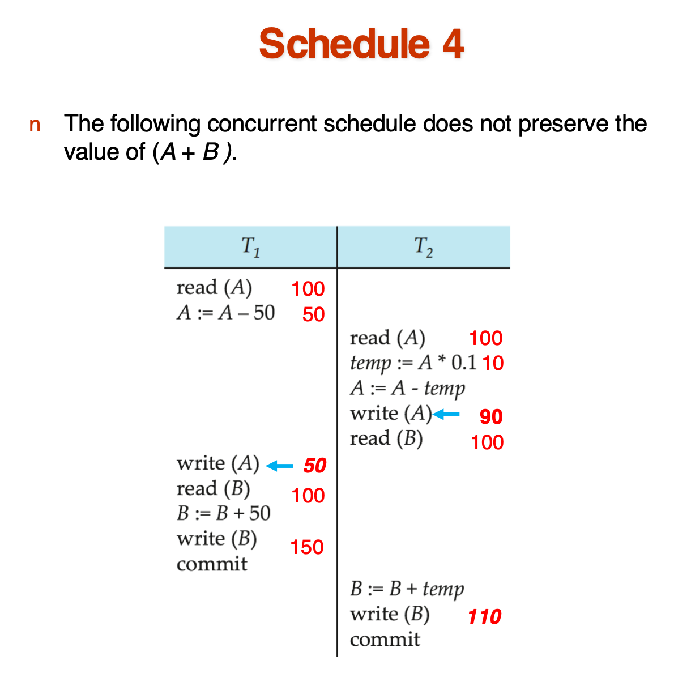
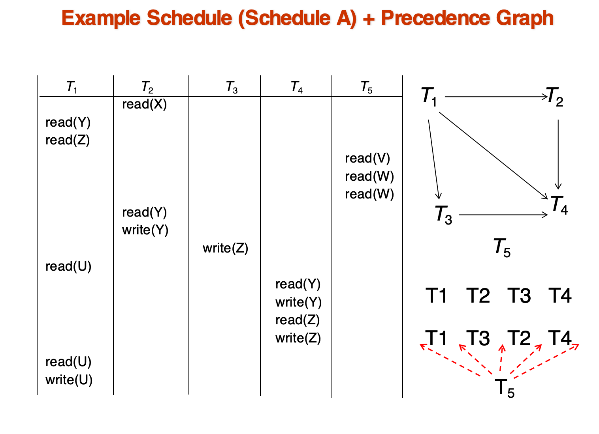

# Transaction

前面已经在[这里](./ch4.md#transactions事务)介绍过

## A Simple Transaction Model

在本章中,我们简化设计,把事务与数据的交互分为两种:

- `read(X)` ,将数据项 X 从数据项传输到执行读操作的事务的主内存工作区中的一个变量,也称为`X`

- `write(X)` ,将事务的主内存工作区中的变量 X 的值传输到数据库中的数据项上

    

!!! tip "Example of Fund Transfer"
    

    1. Atomicity requirement
        
        - 所有的操作都要么完成,要么不完成

    2. Durability requirement

        - 如果操作确认完成,数据库必须更新

    3. Consistency requirement
    
        - Explicitly（显式） specified integrity constraints e.g. primary keys , foreign keys
        
        - Implicit （隐式） integrity constraints e.g. sum of balances of all accounts minus sum of loan amounts must equal value of cash-in-hand
    
    4. Isolation requirement
        
        - 如果在 step 3 6 之间，另一个事务能够访问数据库,那么它就会看到一个不一致的状态.比如,A+B总值不对.

### Transaction State

    

- `Active` : 事务正在执行

- `Partially Committed` : 事务已经执行完所有的操作,但还没有提交(after the final statement has been executed)

- `Failed` : 事务执行失败,需要回滚

- `Aborted` : 事务已经回滚,需要重新开始或者直接kill掉这个事务

- `Committed` : 事务已经提交,所有的操作都已经完成

### Concurrent Executions

并发执行有很多优点,比如提高效率(one transaction can be using the CPU while another is reading from or writing to the disk)等等,但是如果不加以控制,可能会导致问题.

- Lost Update（丢失修改）
    
    ??? tip
        

        相当于有一百张票,两个人都订票,但是最后系统却显示剩余99张票,而不是98张票

- Dirty Read（脏读）
    
    ??? tip
        

        事务T2读取了事务T1未提交的值,但是T1最后回滚了,那么T2读取的值就不对了

- Unrepeatable Read（不可重复读）
    
    ??? tip
        

        事务隔离要求,T1读到的值,在T1提交之前,不能被其他事务修改,否则就会导致不可重复读的问题

- Phantom Problem（幻读）
    
    ??? tip
        
        
        事务T1读取了一个范围内的值,但是在T1提交之前,另一个事务T2插入了一个新的值,那么T1读取的范围就会发生变化,导致幻读的问题

## Schedule

> 当一组事务被执行时，它们的执行顺序称为调度（schedule）。调度可以是串行的，也可以是并行的。
>
> 一般来说,单个事务内的指令是保持原来的顺序的
>
> 如果一个事务成功执行,那么commit就是它的最后一条指令,不然rollback就是它的最后一条指令

!!! example "🌰"
    === "串行1"
        

        等待T1完成后,再执行T2
    
    === "串行2"
        

        等待T2完成后,再执行T1

    === "并行"
        

        T1和T2交替执行,但最终的结果和串行1或串行2是一样的

    === "并行/不保持值"
        

        T1和T2交替执行,但最终的结果和串行1或串行2不一样
        
        
        一般来说,这样做都会出现问题.

## Serializability(可串行化)
> 基本假设:每条事务都保持数据库的一致性
>
> 那么,它们串行执行,也必然能保持数据库的一致性

!!! definition "可串行化"
    
    如果一个调度(可能是并发)的结果和某个串行调度的结果等价,那么这个调度就是可串行化的

    根据"等价"的定义不同,有两种可串行化定义:

    1. conflict serializability(冲突可串行化 )

    2. view serializability(视图可串行化)

**Conflicting Instructions**

- 来自于事务$T_i$和$T_j$的指令$I_i$和$I_j$冲突,当且仅当:
    
    1. $I_i$和$I_j$访问同一个数据项
    
    2. $I_i$和$I_j$至少有一个是写操作

- 冲突的指令要求它们之间必须建立一个逻辑顺序,也就是一个“谁先谁后”的约束

### Conflict Serializability（冲突可串行化）

- 如果一个调度$S$可以通过交换一系列不冲突的指令的顺序,来变成另一个调度$S'$，那么我们称$S$和$S'$是冲突等价(conflict equivalent)的

- 如果$S$是冲突等价于某个串行调度$S'$，那么$S$就是冲突可串行化的

!!! example "🌰"
    

### Testing for Serializability
> Precedence graph（前驱图 ） — a directed graph where the vertices are the transactions (names).
>
> We draw an arc from $T_i$ to $T_j$ if the two transaction conflict, and $T_i$ accessed the data item on which the conflict arose earlier.

那么,我们可以从前驱图的角度,判断一个调度是否是冲突可串行化的:如果一个调度的前驱图是无环的,那么这个调度就是冲突可串行化的

并且,如果一个调度是无环的,我们可以使用拓扑排序的方法获得最后的串行调度

    

    

!!! example "🌰"
    

### View Serializability（视图可串行化）

- 视图可串行化是冲突可串行化的一个更宽松的定义

- view equivalence(视图等价): $S$和$S'$是视图等价的,当且仅当对于任意数据项Q:
    
    1. 如果$S$中有事务$T_i$读了Q的初始值,那么在$S'$中的$T_i$也必须读取Q的初始值

    2. 如果$S$中的事务$T_i$使用`read(Q)`读取了$T_j$产生的值,那么$S'$中的$T_i$也必须使用`read(Q)`读取$T_j$同一个`write(Q)`产生的值

    3. 如果$S$中的事务$T_i$用`write(Q)`写入了Q的最终值,那么$S'$中的$T_i$也必须用`write(Q)`写入Q的最终值

- 如果$S$是视图等价于某个串行调度$S'$，那么$S$就是视图可串行化的

- 所有的冲突可串行化的调度都是视图可串行化的,但是并不是所有的视图可串行化的调度都是冲突可串行化的
    

        
         
        <caption>视图可串行化的调度(T27,T28,T29),但不是冲突可串行化</caption>
    

### Other Notions of Serializability

有的调度既不是冲突可串行化又不是视图可串行化，但它是可串行化的。

    
    

这种基于数学的可串行化,难以编码到数据库中,所以很难实现.

## Recoverable Schedules

- 如果一个事务$T_i$读取了另一个事务$T_j$的值,那么$T_i$必须在$T_j$提交之后提交

    

        
         
        <caption>不是可恢复调度</caption>
        

- 上图的调度中,如果$T_8$回滚了,那么$T_9$读取的脏数据就完全错误了,并且此时已经$T_9$已经提交了,所以会出问题.

### Cascading Rollbacks

- 一个事务的回滚会导致其他事务的回滚,也就是级联回滚

    

        
         
        <caption>If $T_{10}$ fails,$T_{11}$ and $T_{12}$ must also be rolled back.</caption>
        

- 但是级联回滚的开销太大了,所以我们更希望使用非级联回滚的调度

    - 也即是,$T_j$在$T_i$提交之前,不能读取$T_i$的值

    - 这也是一种更严格的可恢复调度

## Transaction Isolation Levels

- 数据库系统必须确保所有可能的调度（Schedule）满足以下条件：

    - 是 **冲突可串行化（Conflict Serializable）** 或 **视图可串行化（View Serializable）**

    - 是 **可恢复的（Recoverable）**
    
    - 最好是 **无级联回滚的（Cascadeless）**

- **并发控制协议（Concurrency Control Protocols）**，使事务调度在运行时就具备以下性质：

    - 是冲突/视图可串行化的
    
    - 是可恢复的
    
    - 无级联回滚

- 完全的隔离会导致性能下降,所以我们可以使用不同的隔离级别来控制事务之间的隔离程度(minisql part 7部分)

    - Serializable — default:
        - 最高的隔离级别,所有的事务都是串行执行的,但是性能最低

    - Repeatable Read:

        - 只有已被提交的记录可以读取,在事务进行时始终保持共享锁

    - Read Committed:

        - 只有已被提交的记录可以读取,但是只有读数据时会加共享锁,因此重复读取的结果可能不一致

    - Read Uncommitted:

        - 最低的隔离级别

        - 允许读取未提交的记录,但是会导致脏读的问题,性能最高

    - 在sql中,可以使用`SET TRANSACTION ISOLATION LEVEL`来设置隔离级别

## Concurrency Control Protocols
> 事务调度的并发控制协议,是为了确保所有的调度都满足可串行化的要求

### 基于锁的协议

- **锁的粒度**
    - 对整个数据库加锁 vs 对单个数据项加锁
  
- **锁的持有时间**  
  
- **锁的类型**
    - 共享锁（Shared Lock）：允许多个事务同时读取数据
    - 排他锁（Exclusive Lock）：仅允许一个事务写入数据，阻止其他事务的读写操作

### 基于时间戳的协议

- **时间戳分配**
    - 当事务开始时，系统会为其分配一个唯一的时间戳
  
- **数据项时间戳**
    - 每个数据项存储两种时间戳：

        - 读时间戳（Read Timestamp）：记录最后读取该数据项的事务的时间戳

        - 写时间戳（Write Timestamp）：记录最后修改该数据项的事务的时间戳
  
- **访问顺序检测**
    - 系统使用时间戳来检测事务访问数据的顺序是否违反了串行化要求

### 基于验证的协议

- **乐观并发控制**
    - 假设事务之间的冲突较少，大多数情况下不会发生冲突
  
- **适用场景**
    - 事务之间冲突率较低的环境
  
- **三阶段执行**
    - 每个事务必须经过三个阶段：

        1. **读取阶段**：事务只读取数据，不进行任何修改

        2. **验证阶段**：检查是否与其他事务冲突

        3. **写入阶段**：通过验证后，事务可以将修改写入数据库
