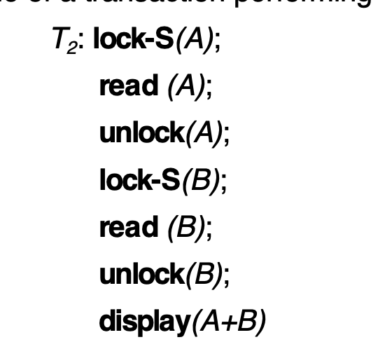
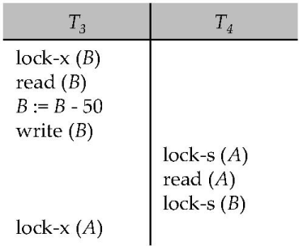
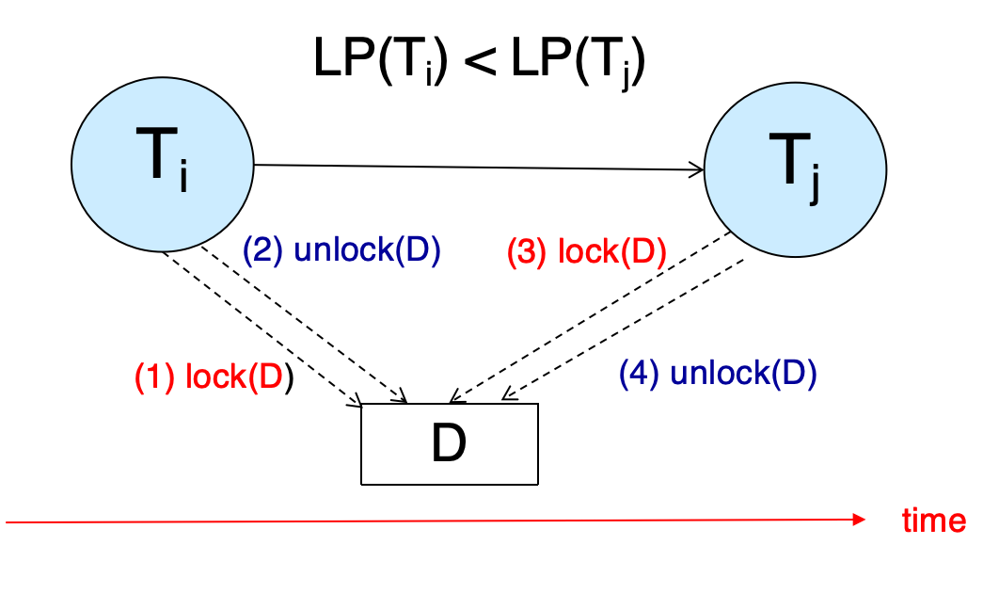
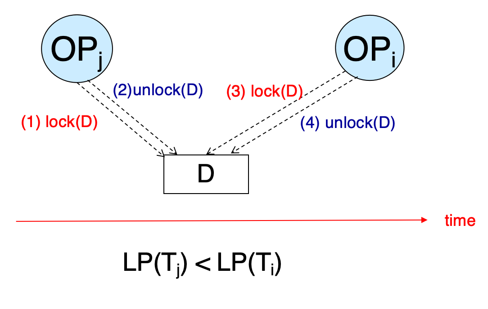
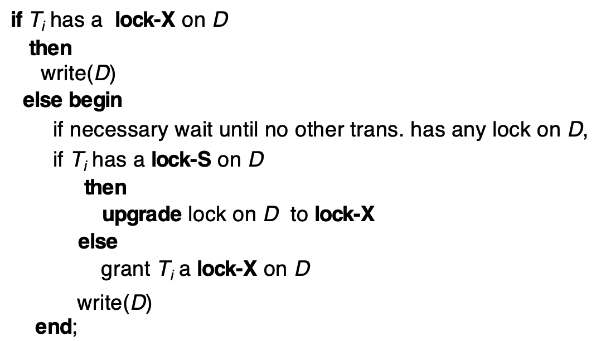
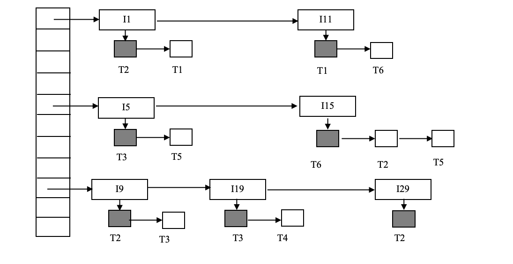
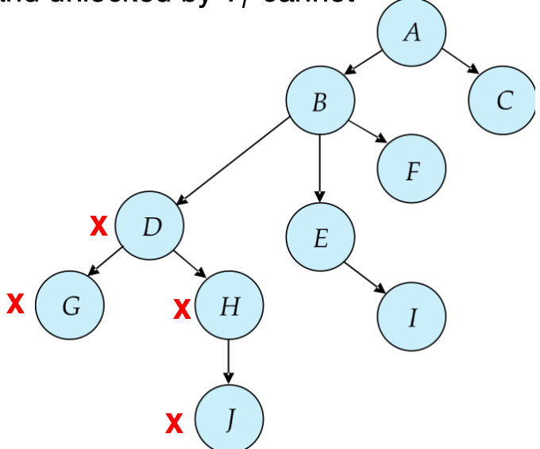
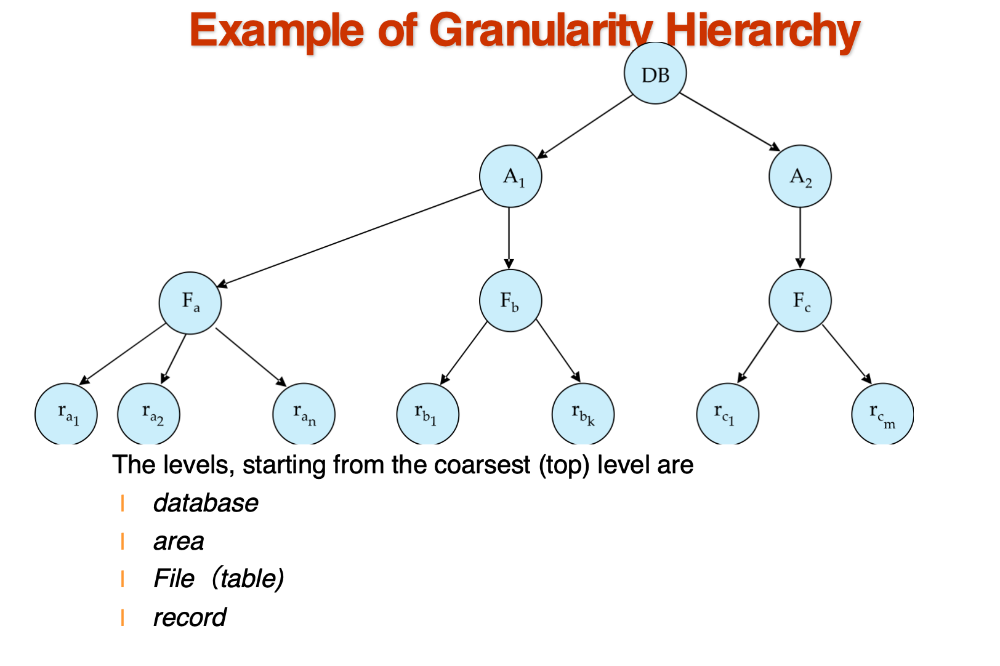

# 并发控制

## Lock-Based Protocols(基于锁的协议)

我们使用锁来控制对数据的访问,以确保在并发环境中数据的一致性和完整性。锁可以是独占锁或共享锁。

- 共享锁(S): 允许多个事务同时读取数据，但不允许修改。也即,数据是只读的

- 独占锁(X): 允许一个事务对数据进行修改，其他事务不能读取或修改该数据。也即,对拥有锁的事务而言,数据是可读可写的

- 对于同一个数据项,锁之间的排斥关系为:

    - 如果一个事务持有共享锁,那么其他事务可以申请共享锁,但不能申请排他锁

    - 如果一个事务持有排他锁,那么其他事务不能申请任何类型的锁

一个事务执行锁操作的例子:

    
     
    <caption>Example for lock</caption>

但,这样简单的操作无法保证事务可串行化,如果A,B在读取的中间发生了更新,那么结果就会不一致.

还有死锁的情况:

    
     
    <caption>Deadlock</caption>

> Neither $T_3$ nor $T_4$ can make progress — executing  `lock-S(B)` causes $T_4$ to wait for $T_3$ to release its lock on B
>
>while executing `lock-X(A)` causes $T_3$ to wait for $T_4$ to release its lock on A.
>
>Such a situation is called a deadlock. 

为此,我们引入locking protocol的概念.

### The Two-Phase Locking Protocol

    
     
    <caption>Two-Phase Locking Protocol</caption>

两个阶段:

- **Growing Phase**: 事务可以申请锁,但不能释放锁

- **Shrinking Phase**: 事务可以释放锁,但不能申请锁

- 两个阶段转换的标志是事务释放第一个锁

- 分界线是事务获得最后一个锁的时间,被称为**lock point**

- 按照**lock point**的顺序排序,得到一个调度,这个调度是可串行化的

### 2PL-Proof

- by Contradiction

    - 若在前驱图中,$T_i$到$T_j$有一条边,那么$LP(T_i)$在$LP(T_j)$之前

    

        
         
        <caption>Contradiction</caption>
    

- by Induction

    - 令$T_i$是最小锁点到事务,若$T_j$中有操作会阻碍$T_i$中的某个操作

    - 那么$T_j$的锁点在$T_i$的锁点之前

    

        
         
        <caption>Induction</caption>
    

---

基本的二阶段锁协议上延伸拓展出了一些其他的锁协议,为了保证可恢复的调度:

- **Strict Two-Phase Locking Protocol**: 事务在commit/abort之前,不能释放任何排他锁

    - 这样,就能保证在该事务出现需要回滚的情况下,不会有其他事务读到它写的数据

- **Rigorous Two-Phase Locking Protocol**: 事务在commit/abort之前,不能释放任何锁

!!! exmaple
    | T1      | T2      | T3      |
    | :------ | :------ | :------ |
    | write C |         |         |
    |         | write C |         |
    |         |         | write A |
    | write A |         |         |

    1. 画出前驱图

        

            
        

    2. 锁的操作?
        

            
        

### Lock Conversion
> 锁可以升级和降级

- 在Growing Phase中,可以将S锁升级为X锁,但不能将X锁降级为S锁

- 在Shrinking Phase中,可以将X锁降级为S锁,但不能将S锁升级为X锁

!!! tip "Automatic Acquisition of Locks"
    读和写操作都嵌入了锁相关的操作

    === "read"
        

            
             
            <caption>Read</caption>
        

    === "write"
        

            
             
            <caption>Write</caption>
        

## Implementation of Locking
> A lock manager can be implemented as a separate process to which transactions send lock and unlock requests

### Lock Table

    
     
    <caption>Lock Table</caption>

在minisql中,`lock_table_`是一个`unordered_map`,由`RowId`(数据项)映射到锁请求队列

### Deadlock Handling
> System is deadlocked if there is a set of transactions such that every transaction in the set is waiting for another transaction in the set.
>
> 我们上面使用的二阶段锁协议,并不能保证没有死锁的发生,所以我们需要一个死锁处理机制.

- Deadlock prevention protocols确保系统永远不会进入死锁状态,有如下几种方法

    - 执行前获得所有锁(Require that each transaction locks all its data items before it begins execution (predeclaration))

    - 制定偏序关系,

        -  a transaction can lock data items only in the order specified by the partial order (graph-based protocol).

        - e.g. $T_1$: A-50, B+50. $T_2$: B-10, A+10. 我们可以强制$T_2$先执行A+10,然后执行B-10,这样就不会发生死锁

    - Timeout-Based Schemes

        - 事务在等待锁时,如果超过了某个时间限制,就放弃等待,并回滚

        - 这种方法的缺点是可能会导致不必要的回滚,但它是最简单的死锁处理方法

- 还有一些利用事务的时间戳来避免死锁的方法,比如:

    - Wait-Die Scheme

        - 如果一个事务请求一个锁,而这个锁已经被一个比它早开始的事务持有,那么这个事务就会被终止(死掉)(Younger transactions never wait for older ones; they are rolled back instead)

        - 否则,如果这个事务比持有锁的事务早开始,那么它就会等待(older transaction may wait for younger one to release data item)

        

            
             
            <caption>Wait-Die Scheme</caption>
        

    - Wound-Wait Scheme

        - 如果一个事务请求一个锁,而这个锁已经被一个比它晚开始的事务持有,那么晚开始的事务会被直接终止(older transaction wounds (forces rollback) of younger transaction instead of waiting for it.)

        - 否则,如果这个事务比持有锁的事务晚开始,那么它就会等待(older transaction wounds (forces rollback) of younger transaction instead of waiting for it.)

        

            
             
            <caption>Wound-Wait Scheme</caption>
        

    - Both in wait-die and in wound-wait schemes, a rolled back transactions is restarted with its original timestamp. Older transactions thus have precedence over newer ones, and starvation is hence avoided.

### Deadlock Detection
> Minisql中也实现了.构建一个有向等待图.

- 若$T_i$等待$T_j$,那么就有一条边$T_i \to T_j$

- 如果图中有环,那么就发生了死锁

!!! example
    There are 6 transactions(T1-T6) and 6 data items(I1, I11, I5, I15, I9, I19, I29). Granted locks are filled (black) rectangles, while waiting requests are empty rectangles.

    

        
         
        <caption>Deadlock Detection</caption>
    

    T1 等 T2, T2 等 T6, T6 等 T1(死锁)

    T5等T6,T4等T3
### Deadlock Recovery

- When deadlock is detected :

    - Some transaction will have to rolled back (made a victim) to break deadlock.  Select that transaction as victim that will incur minimum cost.

    - Rollback -- determine how far to roll back transaction

        - Total rollback: Abort the transaction and then restart it.
    
        - More effective to roll back transaction only as far as necessary to break deadlock.

    - Starvation happens if same transaction is always chosen as victim. Include the number of rollbacks in the cost factor to avoid starvation

### Graph-Based Protocols

我们讲数据项按某种偏序关系排序.如果$d_i$到$d_j$有一条边,那么对于需要同时访问$d_i$和$d_j$的事务,就需要先访问$d_i$,再访问$d_j$

    
     
    <caption>Graph-Based Protocols</caption>

#### Tree Protocols
>树协议是图协议的一种特殊情况

1. 只允许申请排他锁

2. 对于某个事务$T_i$,它申请的第一个节点可以是任意的,当之后,一个节点Q能被$T_i$锁住,当且仅当Q的父节点被$T_i$锁住

3. 数据项可以在任何时候被释放锁

4. 如果数据项Q被$T_i$锁住又释放,那么$T_i$不能再申请Q的锁

    
     
    <caption>Tree Protocols</caption>

这样做,可以保证冲突可串行化.

- 优点:

    - 释放锁比2PL更早,减少等待时间,提高并发度

    - 无死锁,不需要rollback

- 缺点:

    - 不能保证可恢复,需要多加限制

    - 事务可能需要锁住比实际需求更多的数据项

## Multiple Granularity(多粒度)

数据项可以表示为一个树的结构,根据其大小

    
     
    <caption>The Tree</caption>

那么:

- fine granularity（细粒度）:对树偏下的节点加锁,比如对叶子节点加锁

- coarse granularity（粗粒度）:对树偏上的节点加锁,比如对根节点加锁

### Intention Locks

当事务涉及到多个粒度时,会产生不同级别上的锁冲突.比如,一个表的S锁和一个表中某个数据项的X锁之间会产生冲突.因此,我们引入意向锁(想要加某个锁)的概念

- **Intention-Shared Lock (IS)**: 事务想要在某个数据项上加一个共享锁,那么在这个数据项的父节点上加一个意向共享锁

- **Intention-Exclusive Lock (IX)**: 事务想要在某个数据项上加一个排他锁,那么在这个数据项的父节点上加一个意向排他锁

- **Shared-Intention-Exclusive Lock (SIX)**: S+IX锁,对当前节点有共享锁,且对子节点有排他锁
    - SIX锁主要用于这种场景：事务需要读取某个高级节点（如表）的所有数据，同时还需要更新其中的部分低级节点（如记录）。

现在,所有锁的兼容性表是(Y for yes, N for no):

| 请求的锁⬇️ \ 已有的锁➡️ | IS | IX | S  | SIX | X  |
| :------------------ |:-- |:-- |:-- |:--- |:-- |
| **IS**              | Y  | Y  | Y  | Y   | N  |
| **IX**              | Y  | Y  | N  | N   | N  |
| **S**               | Y  | N  | Y  | N   | N  |
| **SIX**             | Y  | N  | N  | N   | N  |
| **X**               | N  | N  | N  | N   | N  |

> 意向锁更像是一种声明而非真正的锁

## Insert and Delete Operations

- If two-phase locking is used :
    - A delete operation may be performed only if the transaction deleting the tuple has an exclusive lock on the tuple to be deleted.

    - A transaction that inserts a new tuple into the database is given an X-mode lock on the tuple

- 为了避免幽灵问题(比如一个事务在统计表中元组数目,一个事务在插入元组)

    - 可以使用表级的锁

    - 可以把元组数目和另一个额外的一个元组联系,读元组数目的事务需要在这个元组上加共享锁,而插入元组的事务需要在这个元组上加排他锁

    - 最好的方法是使用Index locking protocols

### Index Locking Protocols

> 通过在索引上加锁来避免幽灵问题

1. Every relation must have at least one index. 

2. A transaction can access tuples only after finding them through one or more indices on the relation

3. A transaction $T_i$ that performs a lookup must lock all the index leaf nodes that it accesses, in S-mode

    - Even if the leaf node does not contain any tuple satisfying the index lookup (e.g. for a range query, no tuple in a leaf is in the range)

4. A transaction $T_i$ that inserts, updates or deletes a tuple $t_i$ in a relation r 

    - must update all indices to r

    - must obtain exclusive locks on all index leaf nodes affected by the insert/update/delete

5. The rules of the two-phase locking protocol must be observed

### Next-Key Locking

上面的做法需要锁住所有的叶子节点,会大大降低并发度,因此还有一种方法:

- Lock all values that satisfy index lookup (match lookup value, or fall in lookup range)

- Also lock next key value in index

- Lock mode: S for lookups, X for insert/delete/update

## Multiversion Concurrency Control Schemes
> 不考

大概就是像git一样,每次写数据项不是直接覆盖,而是创建一个新的版本,带一个版本号,旧的版本被保留.

这样,任何读取操作都不需要等待,可以直接进行,只要根据版本号来读取数据项即可

这样就只有两类操作:

1. 只读事务

    - Assigned a timestamp by reading the current value of  ts-counter before they start execution.
    
    - When a read-only transaction $T_i$ issues a read(Q), the value returned is the contents of the version whose timestamp is the largest timestamp less than or equal to $TS(T_i)$

2. 更新(读写)事务

    - Acquire read and write locks

    - Hold all locks up to the end of the transaction. That is , follow rigorous two-phase locking.

    - Each successful write results in the creation of a new version of the data item written.

    - Each version of a data item has a single timestamp whose value is obtained from a counter ts-counter that is incremented during commit processing.
