# 数据库恢复
> 最后一章

## Failure Classification

有许多种错误:

1. **Transaction failure**: 事务失败,可能是由于应用程序错误,或者事务的逻辑错误导致的.
    - **logical error**: 逻辑错误,可能是由于应用程序的逻辑错误导致的,比如除以零,或者栈溢出等.
    
    - **system error**: 系统错误,比如进入死锁,系统必须终止某个活跃事务

2. **System crash**: 系统崩溃,比如突然停电,但非易失性存储器中的数据仍然是完整的

3. **Disk failure**: 硬盘错误,比如数据传输过程中崩溃

    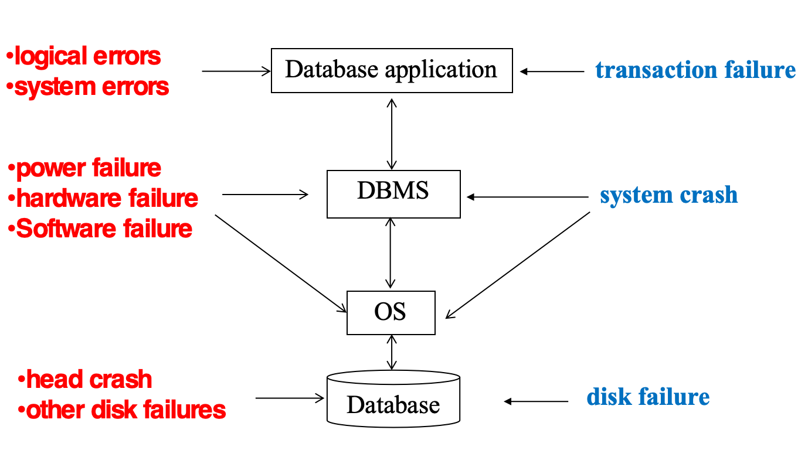

## Storage Structure

我们下面所说的稳定存储(stable storage)是指:

- 一种理想化的存储形式，能够在所有故障中幸存

- 通过在不同的非易失性介质(硬盘等)上维护多个副本来近似实现

### Stable-Storage Implementation

为了避免自然灾害等对数据库的破坏,我们需要采取远程备份的方法.

在数据传输中可能会出现以下结果:

1. **Success Completion**: 数据成功传输到远程备份,并且在远程备份中也成功写入

2. **Partial Failure**: 传输过程中发生故障,导致信息不正确

3. **Total Failure**: 目标块完全没有更新

假设一个块有两个物理备份,为了在数据传输中处理失败,我们定义如下方法:

1. 先写第一个备份

2. 当第一个备份成功写完后,再将相同的信息写到第二个备份

3. 只有当第二个备份成功写完后,输出操作才算完成

另外,如果在数据传输过程中发生故障,可能会导致信息不正确,造成不同备份之间内容不一致,我们采取以下方法修正:

1. **Expensive Solution**:对于每一个块,都比较它的两个备份内容是否一致

2. **Better Solution**:利用非易失性RAM记录写的过程的信息,利用这些信息找到可能发生数据不一致的块,并只对这些块作检查

3. 若两个备份内容不一致,但写的过程中都为检测到错误,用第一个备份的内容覆盖第二个备份的内容

## Data Access

1. **Physical Blocks**:硬盘中的数据块

2. **Buffer Blocks**:内存中的数据块,用于缓存硬盘中的数据块

内存与硬盘之间的数据块传输操作为:

1. **input**:将硬盘中的数据块读入到内存中的缓冲区

2. **output**:将内存中的缓冲区数据块写入到硬盘中

    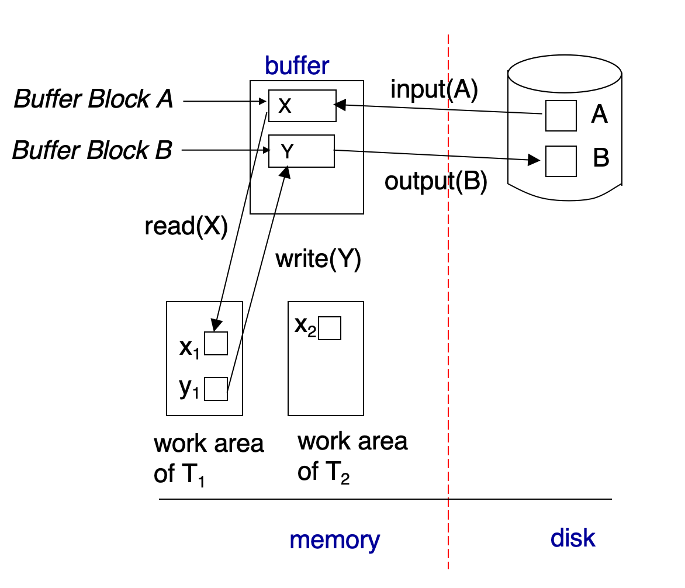

---

在事务进行时,它会有自己的私有工作区,用于存放它访问和修改的数据块的拷贝.因此,这个私有工作区需要与内存发生数据传输:

1. **read**: 将内存中的数据块读入到事务的私有工作区

2. **write**: 将事务的私有工作区中的数据块写入到内存中的缓冲区

> output并不一定要紧跟着write 

---

!!! info "一些概念"
    - **Recovery Alogrithms**: 恢复算法,用于在系统崩溃后恢复数据的一致性,有两个部分
       
        - 在事务正常处理的过程中,需要保证有足够的信息支撑鼓故障恢复

        - 在发生故障后,需要能够恢复到确保ACID的状态

    - 我们假设使用严格的两阶段锁协议(Strict Two-Phase Locking Protocol)来保证事务的隔离性,并且假设每个事务都能在有限时间内完成

    - **Idempotent(幂等性)**:如果执行一个恢复算法多次,和执行一次的结果一样,则我们称这个算法是幂等的

## Log-Based Recovery
> 为了确保在故障发生时,我们仍然能保证数据库的原子性,在修改数据库之间,我们先把描述修改的信息(也就是日志)写到稳定存储中

日志是由一系列日志记录(Log Record)组成的,每个日志记录包含:

- 事务标识符(transcation identifier)标识是哪个事务在做操作

- 数据项标识符(data-item identifier)：标识操作的是哪一个数据项

- 旧值(old value)：在写操作前数据项的值

- 新值(new value)：在写操作后数据项的值

典型的日志记录如下:

1. $<T_i,start>$:当一个事务开始时,写入这一条日志来注册这个事务

2. $<T_i,X,V_1,V_2>$:标志一个事务$T_i$写数据项$X$,其值从$V_1$变为$V_2$

3. $<T_i,commit>$:当一个事务提交时,写入这一条日志

4. $<T_i,abort>$:当一个事务废止时,写入这一条日志

--- 

在看一个日志例子前,我们需要先了解如下概念

??? definition "Undo and Redo"
    1. 对于$<T_i,X,V_1,V_2>$日志记录,我们可以有如下两种操作:

        - **Undo**:写$V_1$到数据项

        - **Redo**:写$V_2$到数据项

    2. 每次一个数据项被恢复为旧值(执行Undo),向日志中写入一个特殊的日志记录$<T_i,X,V>$,这被称为**compensation log(补偿日志)**.

    3. 当Undo结束时,写入一个$<T_i,abort>$日志记录

    4. Undo操作是自底向顶扫描日志的,Redo操作是自顶向底扫描日志的

    5. 当失败发生时:
        - 一个事务需要被undone,如果它的日志中包含了$<T_i,start>$,但是没有包含$<T_i,commit>$或$<T_i,abort>$

        - 一个事务需要被redone,如果它的日志中包含了$<T_i,start>$,并且包含$<T_i,commit>$或$<T_i,abort>$

    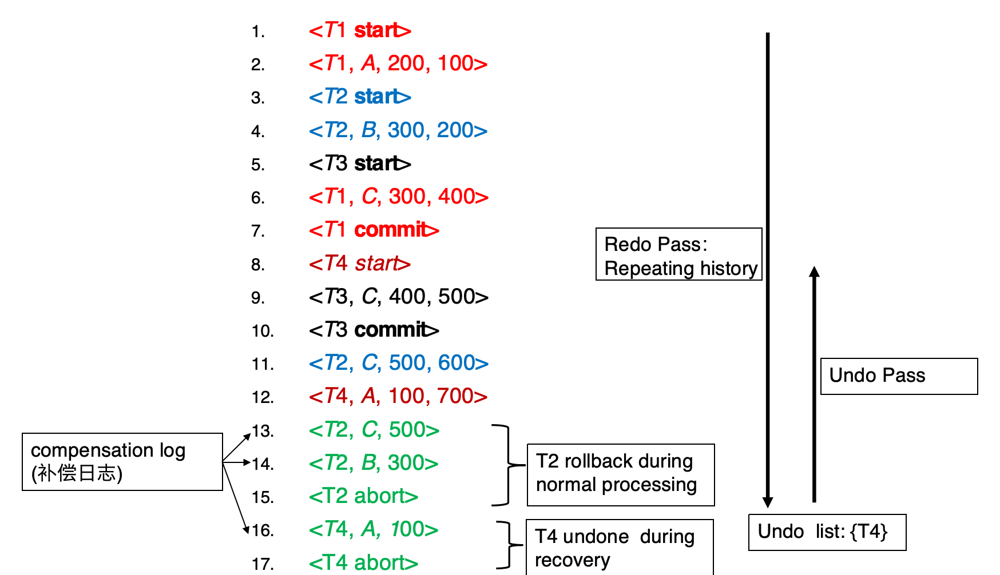

剖析上图的例子,我们给出数据库恢复的一般流程

1. 正常运行(normal process)在第15行$<T_2,abort>$结束,然后出了某种意外,我们需要恢复数据库.

2. 然后,从第一条记录开始,redo所有的日志记录,直到$<T_2,abort>$为止,在redo的过程中,我们已经确定了只有$T_4$需要undo.

3. 接下来,从最后一条日志开始,逐条向上扫描,如果遇到$T_4$的日志就做undo操作,并写一条补偿日志.直到遇到$<T_4,start>$,我们插入一条$<T_4,abort>$日志记录,表示$T_4$已经被废止.

> 也许会让人疑惑的是,如果一个事务在正常运行时已经废止,在redo时仍然会进行修改数据然后撤销修改的操作
>
> 这被称为repeating history（重复历史）.这看上去比较浪费,但这样做简化了恢复的设计,我们只要直接redo就可以了

---

### WAL

**WAL**(Write-Ahead Logging),也即先写日志原则,要求在将内存中的数据项写到硬盘时间,需要先将日志记录写到稳定存储中.

### Database Modification

在一项事务进行数据项修改时,实际上是先在私有工作区中修改数据项,然后将修改后的数据项写入到内存中的缓冲区,最后将日志记录写入到稳定存储中.

而真正对数据库产生影响的,是在事务写到内存或者硬盘之后.因此,不同的修改方式主要关注于事务在提交之前,能否将数据写出私有工作区.

1. **Immediate-modification(立即修改)**:
    - 允许事务在提交前将数据写到内存或者硬盘

    - 同样需要遵循WAL原则

2. **Deferred-modification(延迟修改)**:
    - 事务只能在提交时将数据写到内存或者硬盘

    - 存在保存局部拷贝的开销

---

那么,我们必须定义什么样的事务可以说是提交了的

!!! definition "Transaction Commit"
    一个事务被认为提交,当它的$<T_i,commit>$日志记录被写入到稳定存储中
    
    - 所有先前的日志都必须已经写到硬盘里

    - 但是涉及到的数据项可能还在buffer里

    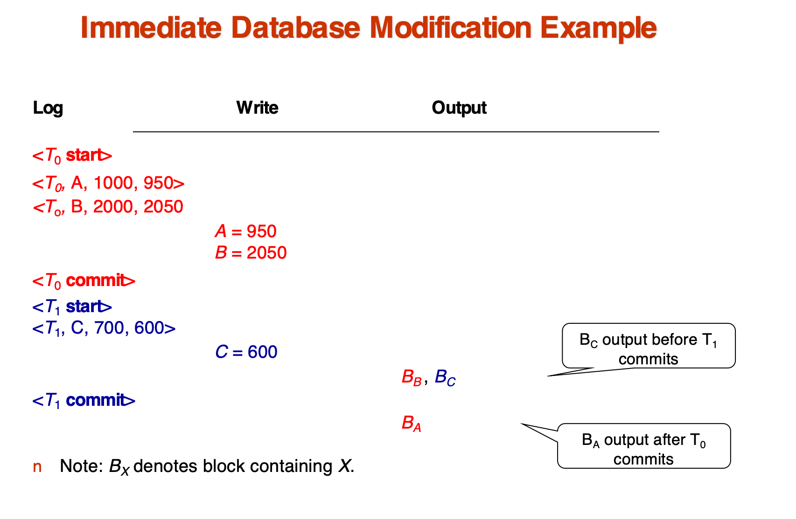
     
    <caption>立即修改的一个例子</caption>
     
     
    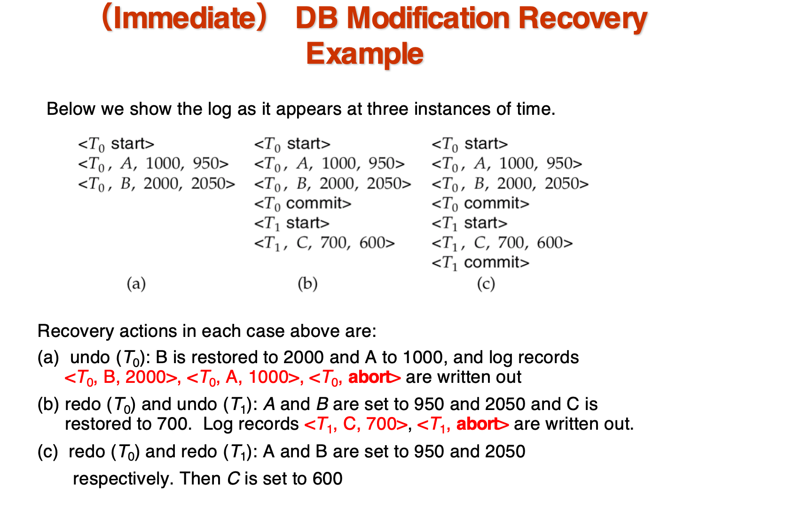
     
    <caption>另一个例子</caption>

### Checkpoints
> Checkpoint是指在日志中记录一个点,从这个点开始,所有的事务都已经提交,并且所有的日志都已经写入到稳定存储中

- 如果每次发生失败,都要redo所有的日志,然后undo所有的未提交事务,那么开销会变得非常大,因此我们需要定期做checkpoint

- 在进行一个checkpoint操作时,我们进行以下内容

    1. 将所有内存中的记录输出到硬盘中

    2. 将内存中所有修改的块输出到硬盘

    3. 向日志中写一条日志记录:$<checkpoint L>$,其中$L$时当前时间点仍然活跃(未提交或废止)的事务

    4. 在做如上操作时,不允许任何更新操作

有了检查点,我们就不需要在每次恢复时扫描所有记录:

1. 从日志底端开始扫描,直到找到第一条$<checkpoint L>$记录

2. 只有$L$以及后面所有的事务需要被redo或者undo,因此我们跳过其他事务

3. 其余操作和上面讲的一样

    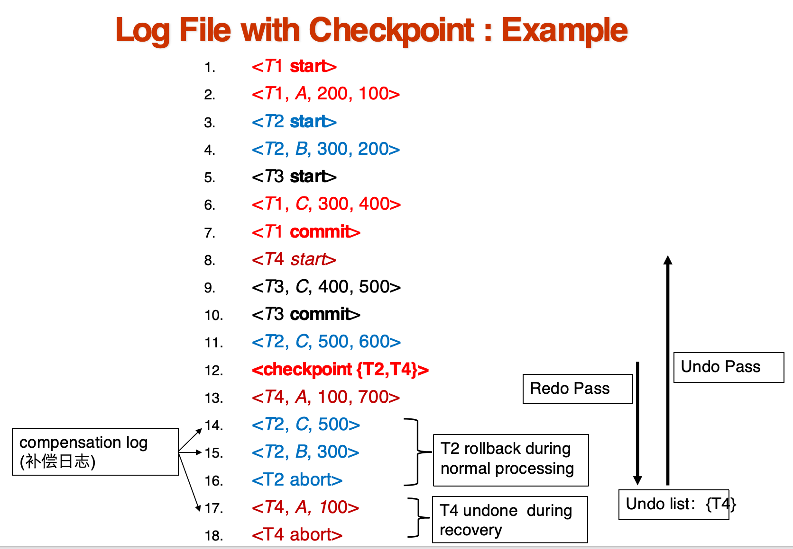
     
    <caption>采用checkpoint的日志,其中redo的范围减少的</caption>

## Recovery Algorithm

??? definition "总体算法说明"
    1. 日志记录（正常运行期间）

        - 在事务开始时，记录：$<T_i,start>$

        - 对每个更新操作，记录：$<T_i, X_j, V_1, V_2>$ ,表示事务 $T_i$ 将数据项 $X_j$ 从值$V_1$ 更新为$V_2$
        
        - 在事务结束（提交）时，记录：$<T_i,commit>$

    2. 事务回滚（正常运行期间）

        - 假设 $T_i$ 是需要回滚的事务

        - 从日志末尾向前扫描，对每一条属于 $T_i$ 的日志记录 $<T_i, X_j, V_1, V_2>$：
            - 执行撤销操作：将 $V_1$ 写回到 $X_j$
            - 写入一条新的日志记录：$<T_i, X_j, V_1>$，称为补偿日志记录（**compensation log record**）
        - 当找到 $<T_i,start>$ 记录时，停止扫描，并写入日志记录：$<T_i,abort>$

    3. 故障恢复：两个阶段

        1. 重做阶段：

            - 找到最近的一条 $<checkpoint L>$ 记录，初始化 undo-list 为 L
            - 从 $<checkpoint L>$ 开始向前扫描日志：
            - 遇到 $<T_i, X_j, V_1, V_2>$ 日志记录：
                - 重做操作：将 $V_2$ 写入 $X_j$
            - 遇到补偿日志记录 $<T_i, X_j, V_2>$：
                - 重做操作：将 $V_2$ 写入 $X_j$
            - 遇到 $<T_i,start>$ 记录：
                - 将 $T_i$ 加入 undo-list
            - 遇到 $<T_i,commit>$ 或 $<T_i,abort>$ 记录：
                - 将 $T_i$ 从 undo-list 中移除

    2. 撤销阶段：

        - 从日志末尾开始向前扫描：
        - 遇到 $<T_i, X_j, V_1, V_2>$ 且 T_i 在 undo-list 中：
            - 撤销操作：将 $V_1$ 写入$ X_j$
            - 写入补偿日志记录：$<T_i, X_j, V_1>$
        - 遇到 $<T_i,start>$ 且 $T_i$ 在 undo-list 中：
            - 写入日志记录：$<T_i,abort>$
            - 从 undo-list 中移除 $T_i$
        - 当 undo-list 为空时停止

    ---

    一个例子:

    

        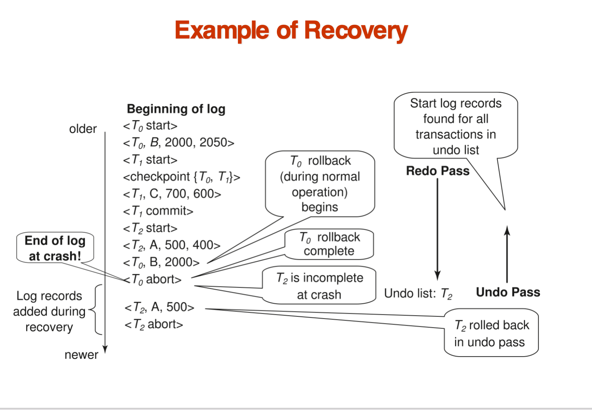
        

## Buffer

有两个buffer:

    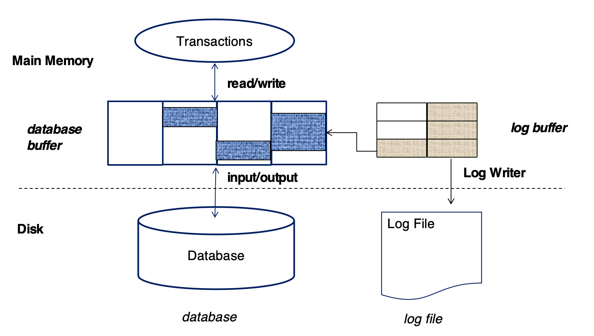

- Database Buffer: 用于存储数据库中的数据块

- Log Buffer: 用于存储日志记录

### Log Record Buffering

内存中的日志记录被输出到主存中,当:

- Log Buffer中的一个存放日志记录的block满了

- 或者执行了一个log force操作

**Group Commit**:在一次I/O操作中,将多个日志记录写入到稳定存储中,减少读写开销

日志记录按照创建记录依次输出到稳定存储

### Database Buffering

数据在内存中的管理策略从两个角度考虑:

1. steal policy(窃取策略):允许包含未提交事务修改的数据的block写入硬盘,与之相比的还有no-steal

2. no-force policy(非强制):当事务提交时,不强制将对应的数据写入硬盘,与之相比的还有force

最简单的策略就是no-force+steal,这样醉了灵活.

### Fuzzy Checkpointing
> 前面说到,在执行Checkpoint时,需要禁止所有更新操作,这会导致系统停顿,因此我们需要一种更灵活的checkpoint方式

!!! definition "Fuzzy Checkpointing"
    1. 短暂暂停事务更新
        - 在极短的时间内，系统会暂停所有正在进行的事务更新操作。这一步的目的是为了在写入检查点记录时，获得一个相对稳定的数据库状态快照，防止内存中的“脏页”（已修改但尚未写入磁盘的数据块）被新的更新再次改动。

    2. 写入`<checkpoint L>`日志记录并强制写入稳定介质

    3. 记录修改的缓冲区块列表`M`
        - 在短暂暂停更新的那一刻，系统会立即识别并记录下所有在内存缓冲区中被修改过的块（即脏页）。这些块构成了需要后续写入磁盘的“任务列表 M”

    4. 允许事务继续执行
        - 一旦上述步骤完成，数据库系统便会立即允许所有事务继续它们的正常读写操作。这是“模糊”检查点之所以“模糊”的关键所在，因为它避免了长时间的系统停顿。

    5. 异步将列表`M`中的脏页输出到磁盘
        - 在允许事务继续的同时，系统会在后台异步地将列表`M`中记录的所有脏页写入到磁盘。这个过程是与前台事务并行进行的。

        - 当某个数据块被选中并正在写入磁盘时，系统会确保在此过程中该数据块不会被其他事务修改。

        - 同时还要遵循WAL原则,在输出一个数据块钱要先输出所有对应的日志

    6. 在固定位置`last_checkpoint`存储检查点指针
        
        - 一旦整个模糊检查点过程完成（即列表 M 中的所有脏页都已写入磁盘），系统会在磁盘上一个预定义的、固定的位置 `last_checkpoint`中，存储一个指向最新完成的`<checkpoint L>`日志记录的指针。当系统崩溃后重启时，数据库恢复过程可以快速地找到这个指针，从而从最近的有效检查点开始恢复，大大缩短了恢复时间。

## Recovery with Early Lock Release and Logical Undo Operations
> 在高并发度的情况下,例如B+树索引的并发控制,并不使用2PL协议,也就是说,一个事务的锁可能早早就释放了
>
> 比如,银行账户上有100块,A事务往里面存了100块,然后马上释放了锁,B事务也存了100块,此时如果A事务废止了,再用我们上面的撤销方法就不对了
>
> 因为这会把钱变成100块,而不是应该有的200块

在这种情况下,我们使用**Logical Undo Operations**(逻辑撤销操作)

### Logical Undo Logging

!!! definition "Logical Undo Logging"
    - 我们在撤销一个事务时,不是简单的将数据块的字节重置到原来的状态(物理撤销),而是执行一个逻辑操作,使得数据块的状态变成正确的状态(逻辑撤销)

    - 比如,对于$<T_i,X,100,200>$,
        - 物理撤销是将$X$的值从200直接变为100

        - 逻辑撤销是将$X$的值减去100
        > redo还是可以使用原来的

    - 为了支持这种操作,我们规定如下日志写法:

        - 当一个操作开始执行时，记录日志：$<T_i, O_j, operation-begin>$  
        其中 $T_i$是事务标识符，$O_j$是操作实例的唯一标识符。

        - 操作执行期间，会记录常规日志记录，这些记录包含**物理重做（physical redo）**和**物理撤销（physical undo）**的信息。

        - 当操作执行完成时，记录日志：$<T_i, O_j, operation-end, U>$
        其中 U 包含执行**逻辑撤销（logical undo）**所需的信息。

        

            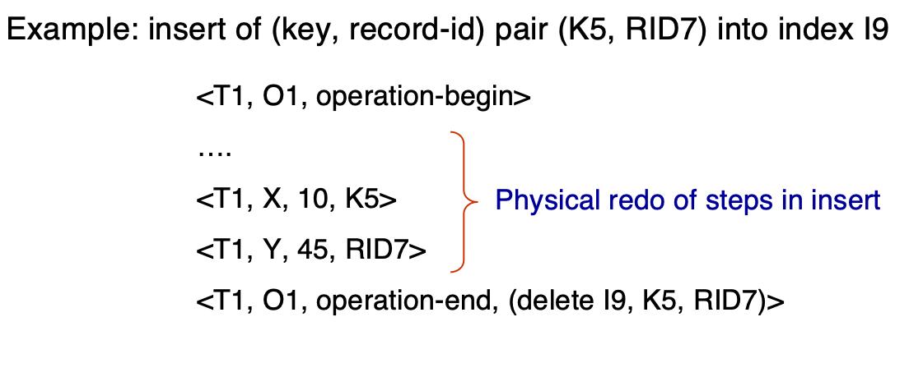
        

    
    - 如果回滚或故障发生:

        - 如果`operation-end`日志记录存在,则执行逻辑撤销操作

        - 不然,执行物理撤销操作

---

在逻辑撤销的基础上,我们重新定义事务的回滚操作:

- 从后向前扫描日志：
    1. 如果发现日志记录 `<Ti, X, V1, V2>`，则执行撤销操作（undo），将 V1 写回 X，并记录日志 `<Ti, X, V1>`。
    
    2. 如果发现日志记录 `<Ti, Oj, operation-end, U>`：
        - 使用其中的撤销信息 U，**以逻辑方式回滚该操作**。

        - 回滚期间所产生的更新操作，**像正常执行时一样记录日志**。
        - 操作回滚结束时，不再写入 `operation-end`，而是写入`<Ti, Oj, operation-abort>`
        - 然后跳过该操作之前的所有日志记录，直到遇到 `<Ti, Oj, operation-begin>` 为止。

    3. 如果遇到 **仅含重做信息的日志记录（redo-only）**，则忽略它。

    4. 如果遇到 `<Ti, Oj, operation-abort>` 记录：

        - 跳过该操作之前的所有日志记录，直到遇到 `<Ti, Oj, operation-begin>`。

    5. 当扫描到 `<Ti, start>` 时，停止扫描。
    
    6. 向日志中添加记录：`<Ti, abort>`

    7. 上述 **第3和第4种情况** 仅在 **数据库在事务回滚过程中崩溃** 时才会发生。

    8. 第 4 种情况所示跳过日志记录的机制，对于**防止同一操作被多次回滚**是非常重要的。

一个例子:

    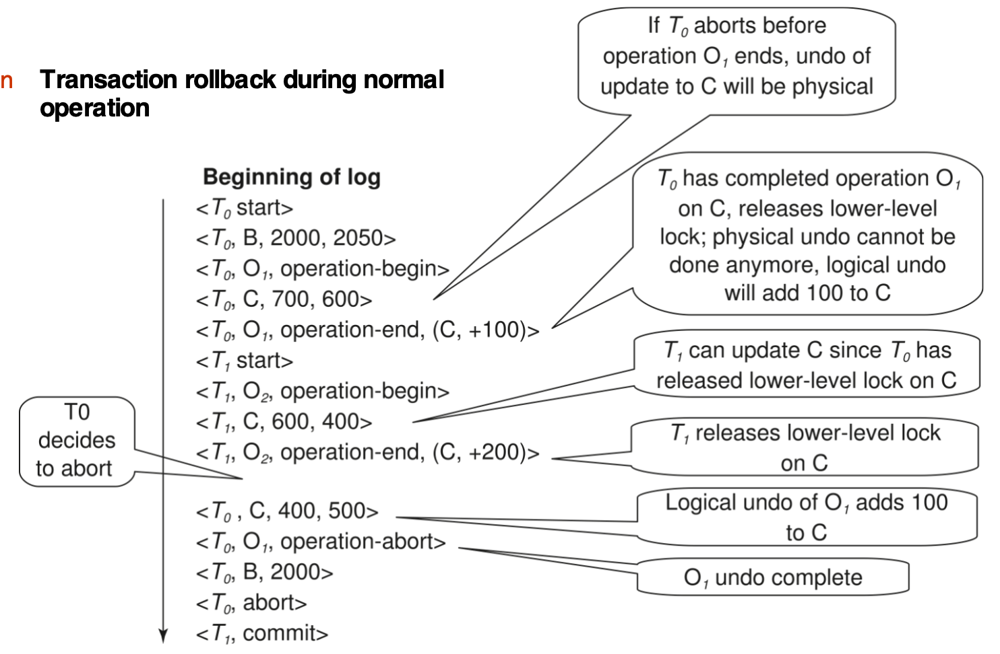

另一个例子:

    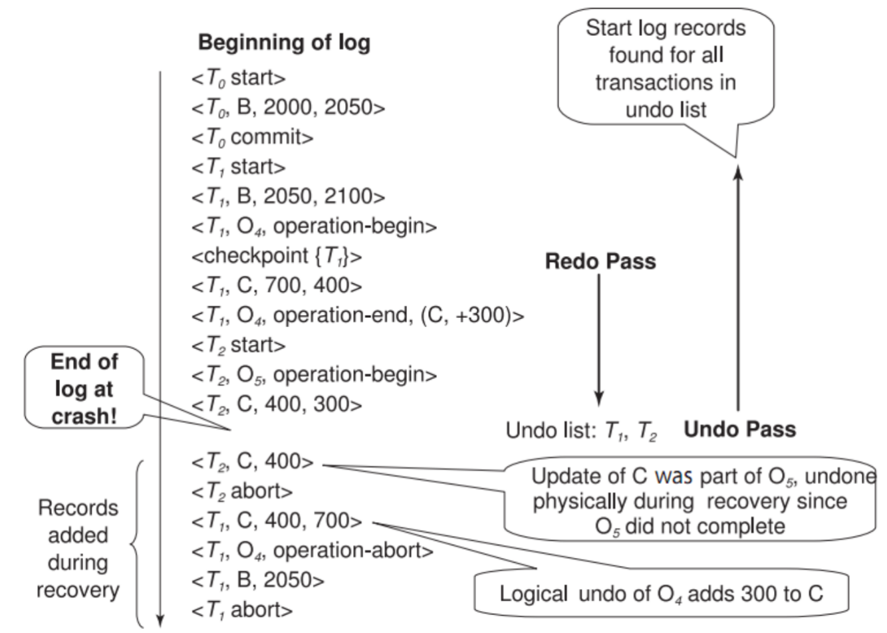
    

## ARIES
> ARIES(Algorithms for Recovery and Isolation Exploiting Semantics，利用语义的恢复和隔离算法)is a state of the art recovery method

ARIES算法有如下几个特点:

- 使用 **日志序列号（Log Sequence Number，LSN）** 来标识每一条日志记录。

- 在数据库页中存储对应的 LSN，以标识哪些更新已经应用到了该页。

- **物理-逻辑重做（Physiological Redo）**：结合物理页定位和逻辑记录应用的重做方式。

- 引入 **脏页表（Dirty Page Table）**，以避免在恢复过程中执行不必要的重做操作。

- **Fuzzy Checkpointin**：

    - 检查点时只记录脏页相关信息；

    - 不强制要求将所有脏页在检查点时立即写入磁盘。

### ARIES Data Structures

1. Log sequence number (LSN) 
    - 必须是顺序递增的

    - 通常是距离日志文件开始的偏移量

2. PageLSN:影响这个页的最后一条日志记录的LSN

3. Log records of several different types

    - `PrevLSN`:同一个事务的前一个日志记录

    

        
    

    - 如果是补偿记录,会有`UndoNextLSN`字段,指向下一个需要undo的记录
        

            
        

4. Dirty page table
    - 一个页的列表

    - 列表的每个项包括:
        - 该页的PageLSN

        - RecLSN:所有LSN小于RecLSN的日志记录都已经在磁盘上应用过了,也即RecLSN记录的是导致该页变为脏页的第一个日志记录的`LSN`
 

    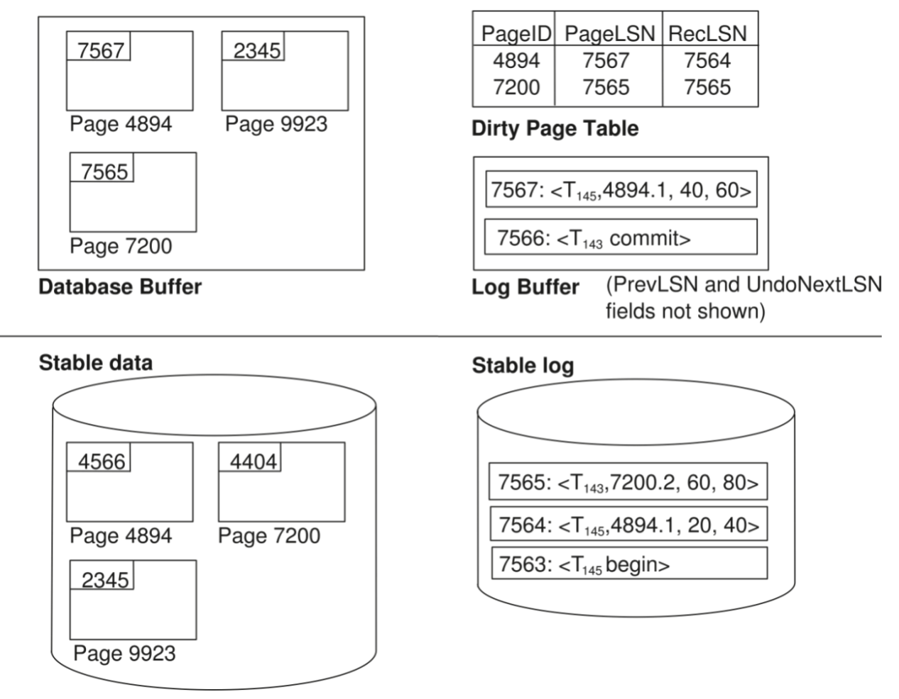

在ARIES中,checkpoint log record包括

1. 此时活跃的事务

2. 此时的Dirty Page Table

3. 每一个活跃的事务的LastLSN,也即该事务写入的最后一条日志记录的LSN

### ARIES Recovery Algorithm

    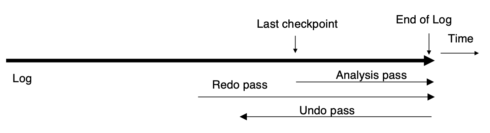

1. **Analysis Pass**:

    - 首先,从last complete checkpoint中读取Dirty Page Table和活跃事务列表

        - 设置`RedoLSN`为Dirty Page Table中所有页的`RecLSN`的最小值

        - 若没有脏页,则设置`RedoLSN`为checkpoint的LSN

    - 然后从checkpoint开始向日志底部扫描,和之前一样更新Undolist与Dirty Page Table
        - 还会跟踪撤销列表中各事务的最后一条记录，供撤销阶段使用。
    
    - 在分析阶段的最后
        - `RedoLSN`决定了哪里开始执行redo

        - 所有在UndoList中的事务都需要被undo

2. **Redo Pass**:

    - 从`RedoLSN`开始向日志底部扫描

    - 每当遇到更新操作
        - 若目标页不在 Dirty Page Table 中，或该日志记录的`LSN`小于Dirty Page Table中对应页面的`RecLSN`值，则跳过此日志记录；
        
        - 从硬盘读取该页，若其`PageLSN`小于当前日志记录的`LSN`，则重新执行该日志记录

        - 需要满足上面所有条件才能执行redo,不然,说明该日志对应的操作已经反映在页中,因为ARIES允许非幂等操作,所以重复执行可能会导致错误

3. **Undo Pass**:

    - 从日志底部向上扫描

    
    - 为了优化向后扫描日志的过程，采用如下策略跳过无用的日志记录：

        1. **初始化每个事务的“下一个待撤销的 LSN”**：
            - 设置为分析阶段（analysis pass）中找到的该事务最后一条日志记录的`LSN`。

        2. **每一步操作**：
            - 从当前待撤销的`LSN`中选择最大的一个（表示最新的一条），跳转到该`LSN`并执行撤销操作。

        3. **执行撤销后**：
            - 如果是普通日志记录：
                - 将该事务的下一个待撤销`LSN`设置为当前日志记录中记载的 `PrevLSN`。
            - 如果是补偿日志记录（**CLR：Compensation Log Record**）：
                - 将下一个待撤销`LSN`设置为日志记录中的`UndoNextLSN`字段。

        4. **跳过所有中间日志记录**：
            - 因为它们已经被前面的`CLR`所撤销，**不需要再次处理**。

    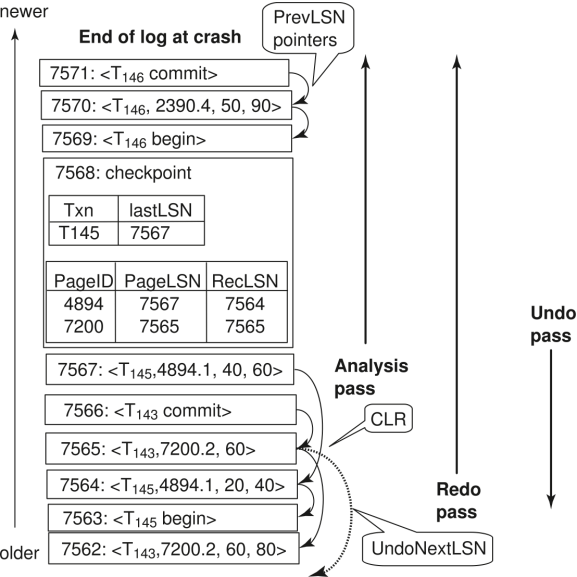

