# Chapter 2:关系数据模型

!!! definition "关系数据模型"
    正如我们在[第一章](./ch1.md/#data-models数据模型)中所讨论的那样，关系数据模型是一种用于表示数据的结构化方法。在关系数据模型中，数据被组织为表格（表）的形式。表格是由行和列组成的，其中每行代表一个实体，每列代表一个属性。表格中的每个单元格包含一个值。

    关系数据库是基于关系数据模型的数据库。

## 关系

给定集合 \\(D_1, D_2, \dots, D_n\\)，一个关系 \\(r\\) 是 \\(D_1 \times D_2 \times \dots \times D_n\\) 的子集。因此，一个关系是由 \\(n\\) 元组 \\((a_1, a_2, \dots, a_n)\\) 所组成的集合，其中每个 \\(a_i \in D_i\\)。

而所谓 Relation Schema, 是关系的模式，它定义了关系的名称以及每个属性的名称和类型。例如：

`instructor` = {`name`, `dept_name`, `salary`}

而关系实例可以是：

`r` = { (`Wu`, `Finance`, 90000),
      (`Mozart`, `Music`, 40000),
      (`Gold`, `Physics`, 87000),
      (`Singh`, `Finance`, 80000) }

## Keys

在关系模型中，一个关键（Key）是一个属性或属性集合，它可以唯一标识一个元组。

### Superkey(超键)

一个超键是一个属性集合，它可以唯一标识一个元组。例如，{name}不是一个超键，因为存在同名的人，但是{name,ID}的组合是一个超键。

### Candidate Key(候选键)

一个候选键是一个最小的超键，即它是一个超键，但是去掉任何一个属性后就不再是超键。例如，{ID}是一个候选键，但是{ID, name}不是。

### Primary Key(主键)

一个主键是一个候选键，且没有任何冗余属性。{ID}是一个主键，而{ID, name}不是。一般主键属性要加下划线，即{ID, name} -> {<u>ID</u>, name}。

### Foreign Key(外键)

外键就是一张表里某一列属性，它的值都可以在另一张表的主键中找到。个人感觉与C语言的指针有点像，指向另一张表的主键。

    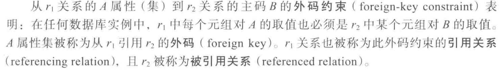

---

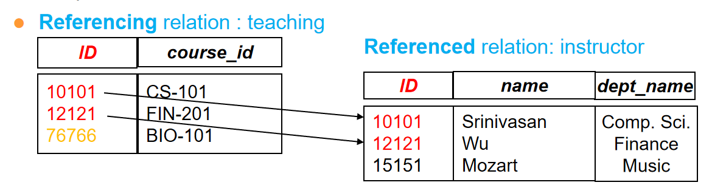

外键需要参照完整性(Referential integrity)约束，即外键的值必须在被参照的表的主键中存在。

---

## 模式图

有了主键与外键的概念，我们可以画出模式图。例如：

!!! example "大学数据库"
    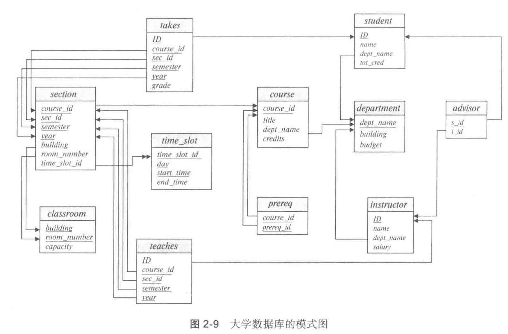

---

## 关系查询语言

关系查询语言是用于查询数据库的语言，它可以分为两类：

1. **关系代数**：关系代数是一种形式化的查询语言，它使用一组操作来操作关系。这些操作包括选择、投影、连接、并、差、交等。

2. **关系演算**：关系演算是一种声明性的查询语言，它描述了所需的数据，而不是如何获取数据。关系演算分为两种：元组关系演算和域关系演算。

上面两类语言在计算上是等价的，即可以相互转换。

### 六类基本操作

我们一般使用关系代数来查询数据库，分为如下六类:

#### Select:$\sigma$

选择操作，选择满足条件的元组。表示为$\sigma_{condition}(relation)$。condition是由属性，常量和逻辑运算符(和离散数学一样，使用 \(\lor\), \(\land\), \(\lnot\))组成的条件。例如：$\sigma_{dept_name='Finance'}(instructor)$, 选择出`dept_name`为`Finance`的元组;$\sigma_{salary>80000}(instructor)$, 选择出`salary`大于`80000`的元组。
    

    
    

#### Project:$\Pi$
    
投影操作，选择满足条件的属性。表示为$\Pi_{attribute}(relation)$。例如：$\Pi_{name, dept_name}(instructor)$, 选择出`name`和`dept_name`属性,组成一个新的关系。
    

    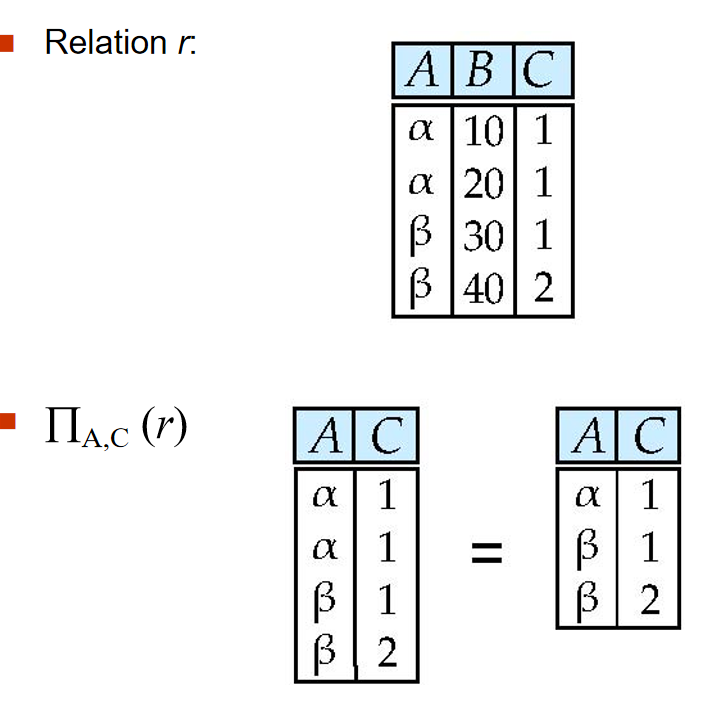
    

#### Union:$\cup$

并操作，合并两个关系。被合并的两个关系必须满足如下条件：

1. 两个关系的属性数目(arity)相同。

2. 属性的域(domain)是兼容的。

例如，要找到所以2009年秋学期与2010年春学期的课，可以这样写：

$\Pi_{course_id}(\sigma_{semester='Fall' \land year=2009}(section)) \cup \Pi_{course_id}(\sigma_{semester='Spring' \land year=2010}(section))$

    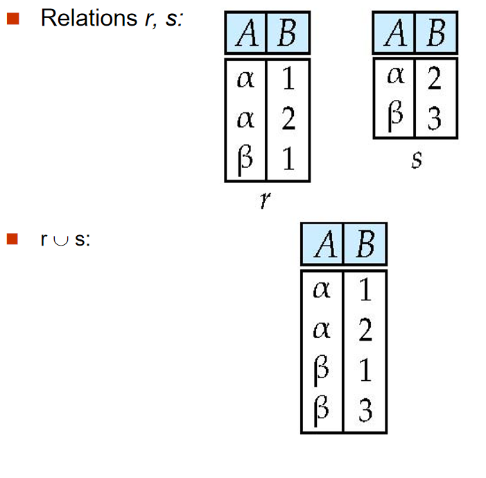
    

#### Set Difference:$-$

差操作，返回两个关系的差集。

例如，要找到所有2009年秋学期但不是2010年春学期的课，可以这样写：

$\Pi_{course_id}(\sigma_{semester='Fall' \land year=2009}(section)) - \Pi_{course_id}(\sigma_{semester='Spring' \land year=2010}(section))$

    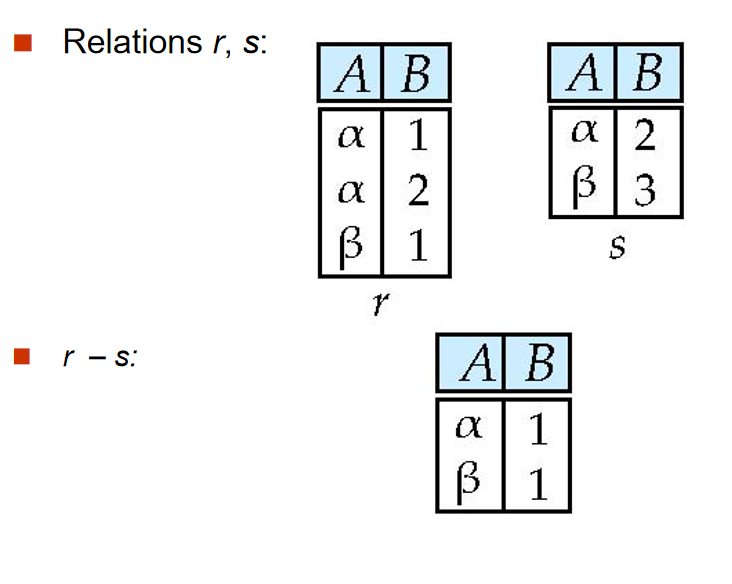
    

#### Cartesian Product:$\times$

笛卡尔积操作，返回两个关系的笛卡尔积。

例如，要找到所有教授和他们的课程，可以这样写：

$\sigma_{instructor.ID=teaches.ID}(instructor \times teaches)$

    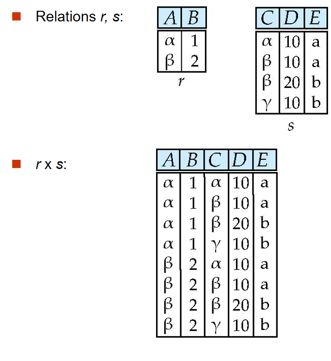
    

注意，两个关系要笛卡尔乘积，需要它们的属性不同。如果有相同的属性名，那么需要用rename操作。

#### Rename:$\rho$

重命名操作，重命名关系或属性。
假设有一个名为 `instructor` 的关系，包含属性 `ID` 和 `name`。

1.  **重命名关系**：

    将 `instructor` 关系重命名为 `professor`：

    $$
        \rho_{professor}(instructor)
        $$

2.  **重命名属性**：

    将 `instructor` 关系中的 `ID` 属性重命名为 `instructor_id`：

    $$
        \rho_{instructor_id, name}(instructor)
        $$

3.  **同时重命名关系和属性**：

    将 `instructor` 关系重命名为 `professor`，并将 `ID` 属性重命名为 `instructor_id`：

    $$
        \rho_{professor(instructor_id, name)}(instructor)
    $$

#### Example

!!! note "🌰"
    === "T1"
        ??? general "Find the names of all instructors in the Physics department, along with the course_id of all courses they have taught"

            $\Pi_{instructor.name,course\text{_}id}(\sigma_{dept\text{_}name="Physics"}(\sigma_{instructor.id=teaches.id}(instructor \times teaches)))$

### Additional Operations

#### Intersection:$\cap$

交操作，返回两个关系的交集。使用公式：

$$
    R \cap S = R - (R - S)
    $$

#### Natural Join:$\bowtie$

自然连接操作，返回两个关系的连接。自然连接是一种特殊的笛卡尔积，它只返回那些在连接属性($R \cap S$)上相等的元组。自然连接满足结合律和交换律。

#### Theta Jion

在自然连接的基础上加上一个条件。

写作：

$$
    R \bowtie_{condition} S
    $$

#### Outer Join: 外连接操作

返回两个关系的连接，同时返回那些在连接属性上不相等的元组。不存在的值用NULL填充。

对于下图的数据表：

    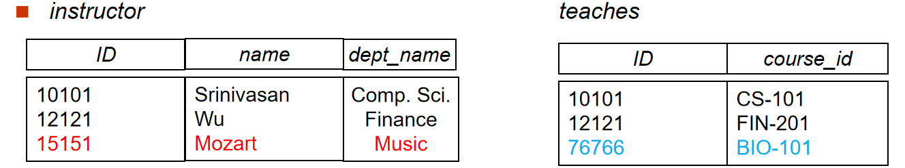
    

1. Left Outer Join: 返回左关系的所有元组，同时返回那些在连接属性上不相等的右关系的元组。

    

    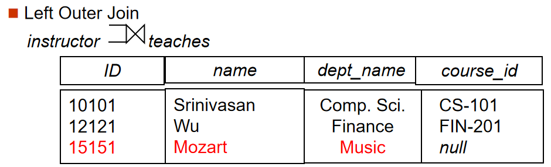
    

2. Right Outer Join: 返回右关系的所有元组，同时返回那些在连接属性上不相等的左关系的元组。

    

    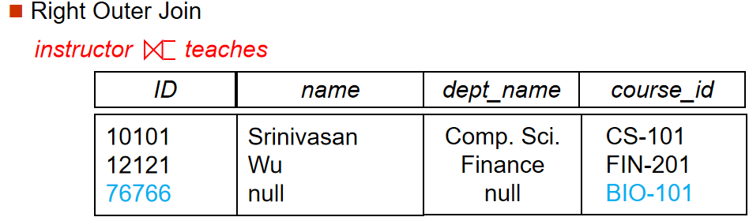
    

3. Full Outer Join: 返回两个关系的所有元组，同时返回那些在连接属性上不相等的元组。

    

    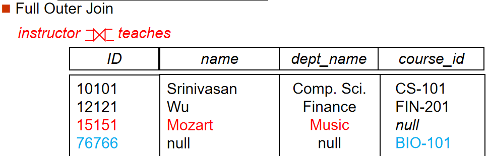
    

??? tips "外连接的表示？"
    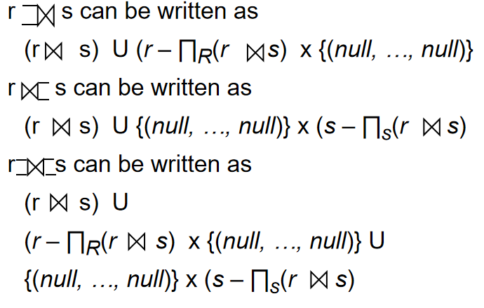

####  半连接操作

半连接会从关系 r 中选择那些与关系 s 中至少一个元组满足连接条件$\theta$的元组。通俗的说，半连接是一种存在性测试，它检查关系 r 中的元组在关系 s 中是否存在满足特定条件的匹配项。

对于命令：select name from instructor where exists (select * from teaches where instructor.ID = teaches.ID and teaches.year = 2022)

1. 选择出 teaches 表中 year 为 2022 的元组。

2. 选择出 instructor 表中 ID 与 teaches 表中 ID 相等的元组。

3. 选择出 instructor 表中 name 属性。

就可以写为如下的半连接：

    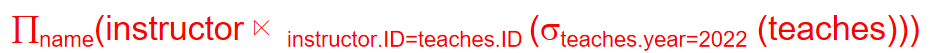
    

#### NULL Values

与Null的比较会得到一个新的布尔值：Unknown。

1. Or: True or Unknown = True, False or Unknown = Unknown, Unknown or Unknown = Unknown.

2. And: True and Unknown = Unknown, False and Unknown = False, Unknown and Unknown = Unknown.

3. Not: Not Unknown = Unknown.

#### Assignment: $\leftarrow$

赋值操作，将一个关系赋值给一个变量。

例如：

$$
R \leftarrow \sigma_{dept_name='Finance'}(instructor)
 $$

这个操作将选择出`dept_name`为`Finance`的元组，并将其赋值给变量`R`。

#### Division: $\div$

除法操作，返回两个关系的商。

!!! definition "商的定义"
    给定关系 r(R) 和 s(S)，其中 S 是 R 的子集，r $\div$ s 是满足以下条件的最大关系 t(R-S)：
        
$$
t \times s \subseteq r
$$

简单来说，关系 `r` 除以关系 `s` 的结果是一个关系 `t`，`t` 包含 `r` 中所有与 `s` 中的元组组合后仍然在 `r` 中的元组。

除法可以使用如下的公式表示：

$$
    temp1 \leftarrow \Pi_{R-S}(r) 
    $$

$$
    temp2 \leftarrow \Pi_{R-S}((temp1 \times s) - \Pi_{R-S,S}(r))
    $$

$$
    result \leftarrow temp1 - temp2
    $$

**解释：**

1.  **temp1**:  首先，我们通过投影操作 $\Pi_{R-S}(r)$，从关系 `r` 中选择所有不在关系 `s` 中的属性（R-S），并将结果存储在 `temp1` 中。这相当于找到所有可能出现在结果关系 `t` 中的元组。

2.  **temp2**:  接下来，我们计算 `temp2`。
        *   `(temp1 × s)`:  我们计算 `temp1` 和 `s` 的笛卡尔积。这将 `temp1` 中的每个元组与 `s` 中的每个元组组合在一起。
        *   `\Pi_{R-S,S}(r)`:  我们从关系 `r` 中投影出属性 R-S 和 S，也就是关系 r 的所有属性。
        *   `(temp1 × s) - \Pi_{R-S,S}(r)`:  我们从 `temp1 × s` 中减去 `\Pi_{R-S,S}(r)`。这将删除所有在 `r` 中存在的 `temp1` 和 `s` 的组合。剩下的元组就是那些与 `s` 组合后不在 `r` 中的 `temp1` 元组。
        *   `\Pi_{R-S}((temp1 \times s) - \Pi_{R-S,S}(r))`:  我们从结果中投影出属性 R-S。这将删除所有与 `s` 组合后不在 `r` 中的 `temp1` 元组。

3.  **result**:  最后，我们计算 `temp1 - temp2`。这将从 `temp1` 中删除所有与 `s` 组合后不在 `r` 中的元组。剩下的元组就是关系 `r` 除以关系 `s` 的结果。

### Extended Operations

#### Generalized Projection

在投影操作中允许使用表达式。

例如：

$\Pi_{name, salary*1.1}(instructor)$

#### Aggregation

聚合操作用于对关系中的元组进行汇总计算。它可以分为两种情况：

1.  **没有分组的聚合**:

    当没有指定分组属性时，聚合函数将应用于关系中的所有元组，计算出一个单一的结果。

    表示形式：

    $$
    \gamma_{agg\_func(attribute)}(relation)
    $$

    例如，计算所有教师的平均工资：

    $$
    \gamma_{AVG(salary)}(instructor)
    $$

2.  **有分组的聚合**:

    当指定了分组属性时，关系将首先按照这些属性进行分组，然后聚合函数将分别应用于每个组中的元组，计算出每个组的结果。

    表示形式：

    $$
    \sideset{_{grouping\_attribute_1, \dots, grouping\_attribute_n}}{} \gamma_{agg\_func(attribute)} (relation)
    $$

    例如，按照部门计算教师的平均工资：

    $$
    \sideset{_{dept\_name}}{AVG(salary)}\gamma (instructor)
    $$

在这个例子中，`dept_name` 是分组属性，`AVG(salary)` 是聚合函数。结果将包含每个部门的名称以及该部门教师的平均工资。

    
    
