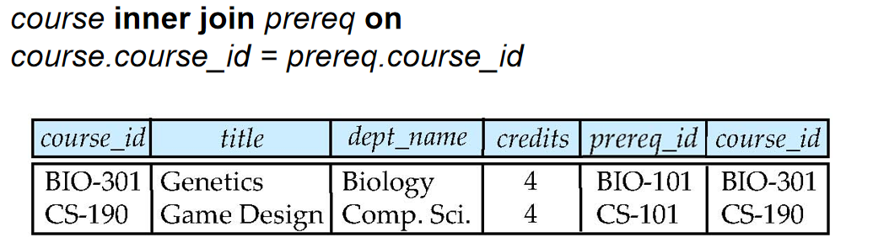
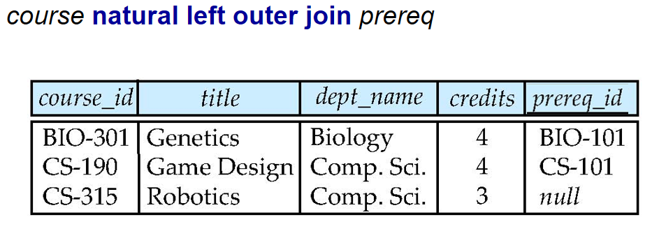
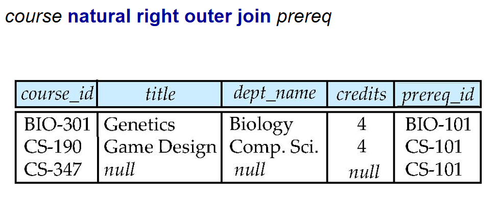
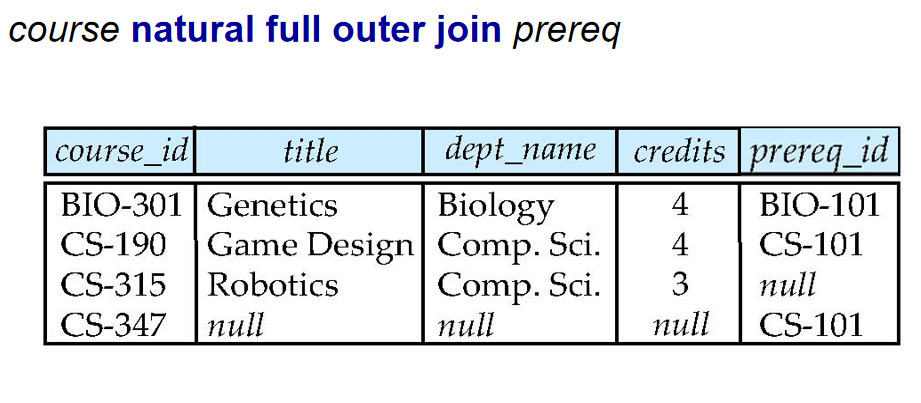
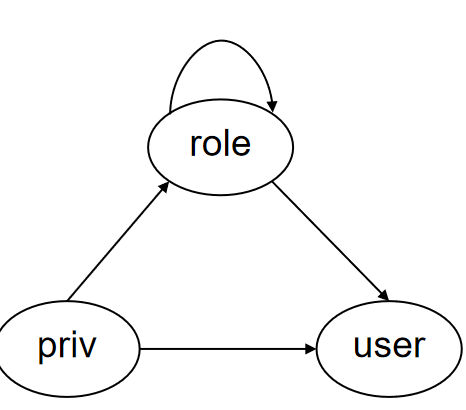

# Intermediate SQL


## Join Operations

连接操作有许多用法，下面介绍Join Type与Join Condition。

### Join Type

!!! note "Join Type"
    
    === "Inner Join"
        只返回两个表中匹配的行。自然连接是一种特殊的内连接，它只返回两个表中具有相同值的行。自然连接不需要指定连接条件，因为它会自动使用两个表中具有相同名称的列进行连接。
        
        

        ```sql
        SELECT *
        FROM table1
        INNER JOIN table2
        ON table1.column_name = table2.column_name;
        ```

    === "Left Join"
        返回左表中的所有行，以及右表中匹配的行。如果右表中没有匹配的行，则结果中包含NULL值。也就是关系代数中的左外连接。见[这里](./ch2.md#outer-join-外连接操作)

        

        ```sql
        SELECT *
        FROM table1
        LEFT JOIN table2
        ON table1.column_name = table2.column_name;
        ```

    === "Right Join"
        返回右表中的所有行，以及左表中匹配的行。如果左表中没有匹配的行，则结果中包含NULL值。也就是关系代数中的右外连接。

        

        ```sql
        SELECT *
        FROM table1
        RIGHT JOIN table2
        ON table1.column_name = table2.column_name;
        ```

    === "Full Join"
        返回两个表中的所有行。如果某个表中没有匹配的行，则结果中包含NULL值。也就是关系代数中的全外连接。

        

        ```sql
        SELECT *
        FROM table1
        FULL JOIN table2
        ON table1.column_name = table2.column_name;
        ```

---

### Join Condition

我们将连接条件分为三类:

1. **natural**:自然连接
    - 连接条件是两个表中具有相同名称的列。
    - 例如: `SELECT * FROM table1 NATURAL JOIN table2;`

2. **on <predicate>**:条件连接
    - 连接条件是一个布尔表达式，可以是任意的。
    - 例如: `SELECT * FROM table1 JOIN table2 ON table1.column_name = table2.column_name;`
    - 使用'on'连接时，必须指定连接条件。连接条件可以是任意的布尔表达式，包括比较运算符、逻辑运算符等,另外,这样的连接会返回所有列，包括连接条件中使用的列的两个副本。

3. **using**:等值连接
    - 连接条件是指定一个或多个共享的列名，这些列在两个表中必须具有相同的名称。
    - 与 NATURAL JOIN 不同，USING 子句允许你明确指定要用于连接的列，而不是自动使用所有同名列。
    - 与 ON 子句不同，USING 子句更简洁，并且会在结果中只显示指定列的一个副本（而不是两个）。
    - 例如: `SELECT * FROM table1 JOIN table2 USING(column_name);`
    - 也可以指定多个列: `SELECT * FROM table1 JOIN table2 USING(column1, column2);`

JOIN 语句是由Join Type和Join Condition组成的。如果不指明Join Type，默认使用Inner Join。如果不指明Join Condition，默认使用自然连接。

---

## SQL Data Types and Schemas

SQL 数据类型是用于定义表中列的类型和约束的。每个列都必须指定一个数据类型，以便数据库系统知道如何存储和处理该列的数据。

### Built-in Data Types

见[这里](./ch3.md#built-in-types内置类型)

### User-Defined Types

在SQL中,使用`CREATE TYPE`语句定义用户自定义类型。用户自定义类型可以是标量类型、复合类型、枚举类型、范围类型等。

```sql
create type Dollars as numeric (12,2) final;
```

然后，我们就可以使用自己定义的类型来创建表了。

```sql
create table account (
    id integer,
    balance Dollars
);
```

### Domains


使用`CREATE DOMAIN`命令创建值域

示例：

```sql
create domain degree_level varchar(10)
constraint degree_level_test
check (value in (’Bachelors’, ’Masters’, ’Doctorate’));
```

这条语句创建了一个名为`degree_level`的域，它基于`varchar(10)`数据类型，并添加了一个名为`degree_level_test`的约束，该约束确保该域的值只能是'Bachelors'、'Masters'或'Doctorate'中的一个。

### Large-Object Types

一些大型对象类型包括：

- `BLOB` (Binary Large Object): 用于存储二进制数据，如图像、音频、视频等。

    - 'TinyBLOB'：最大长度为 255 字节

    - 'BLOB'：最大长度为 65,535 (64 KB) 字节

    - 'MediumBLOB'：最大长度为 16,777,215 (16 MB) 字节

    - 'LongBLOB'：最大长度为 4,294,967,295 (4 GB) 字节

- `CLOB` (Character Large Object): 用于存储大量文本数据，如文档、HTML文件等。

- `NCLOB` (National Character Large Object): 用于存储大量的国家字符数据，通常用于多语言支持。

- `XML`: 用于存储 XML 数据。


---

## 完整性约束

### 单个关系上的完整性约束

1. `not null`约束
    - 确保列中的值不能为空。
    - 例如: `CREATE TABLE table_name (column_name data_type NOT NULL);`

2. 主键约束
    - 确保列中的值唯一且不能为空。
    - 例如: `CREATE TABLE table_name (column_name data_type PRIMARY KEY);`
    - 主键约束可以用于单列或多列。
    - 例如: `CREATE TABLE table_name (column1 data_type, column2 data_type, PRIMARY KEY (column1, column2));`

3. 唯一约束
    - 确保列中的值唯一，但可以为空。
    - 例如: `CREATE TABLE table_name (column_name data_type UNIQUE);`
    - 唯一约束可以用于单列或多列。
    - 例如: `CREATE TABLE table_name (column1 data_type, column2 data_type, UNIQUE (column1, column2));`

4. `check`从句
    - check(P),P是一个谓语
    -   
        ```sql
        create table section (
        course_id varchar (8),
        sec_id varchar (8),
        semester varchar (6),
        year numeric (4,0),
        building varchar (15),
        room_number varchar (7),
        time slot id varchar (4), 
        primary key (course_id, sec_id, semester, year),
        check (semester in (’Fall’, ’Winter’, ’Spring’, ’Summer’)));
        ```

    - 这里确保了学期是春夏秋冬中的一个

### 引用完整性

在[这里](./ch2.md#foreign-key外键)有介绍

对于下面的例子:

```sql
create table person (ID  char(10),name char(40),mother char(10),father  char(10),primary key (ID),foreign key (father) references person,foreign key (mother) references person);
```

对于这样的表，为了防止插入时出现错误，有如下方法：

1. 从祖先开始插入，也即先插入这个人父母的信息，再插入这个人的信息

2. 允许`NULL`值,
    - 例如: `CREATE TABLE person (ID char(10), name char(40), mother char(10) NULL, father char(10) NULL, PRIMARY KEY (ID), FOREIGN KEY (father) REFERENCES person, FOREIGN KEY (mother) REFERENCES person);`
    - 这样就可以在插入时不指定父母的信息

3. 延迟约束检查
    - 通过将外键约束声明为可延迟的(DEFERRABLE)，可以推迟约束检查到事务结束时进行
    - 例如:
    ```sql
    create table person (
        ID char(10),
        name char(40),
        mother char(10),
        father char(10),
        primary key (ID),
        foreign key (father) references person DEFERRABLE,
        foreign key (mother) references person DEFERRABLE
    );
    ```
    - 然后在事务中设置约束检查模式：
    ```sql
    SET CONSTRAINTS ALL DEFERRED;
    -- 现在可以以任意顺序插入数据
    INSERT INTO person VALUES ('1', 'Child', '2', '3');
    INSERT INTO person VALUES ('2', 'Mother', NULL, NULL);
    INSERT INTO person VALUES ('3', 'Father', NULL, NULL);
    COMMIT; -- 在事务提交时才会检查约束
    ```
    - 这种方式允许我们先插入子女记录，再插入父母记录，只要在事务结束时所有引用都是有效的即可

---

## assertion

assertion是一个布尔表达式，它在数据库中定义了一个约束条件。assertion可以用于检查数据库中所有表的约束条件。

```sql
CREATE ASSERTION assertion_name
CHECK (condition);
```

但是，上课时提到,现在大多数数据库系统都不支持assertion，因为它们会导致性能问题。assertion的实现需要在每次插入、更新或删除数据时检查所有表的约束条件，这会导致性能下降。

---

## Views

<strike>我也不知道为什么lab2就要做的视图在第四周才讲</strike>

视图是一个虚拟表，它是由一个查询定义的。视图可以用于简化复杂的查询、隐藏数据的复杂性、提供安全性等。
视图的定义是一个查询，它可以包含一个或多个表的连接、过滤、排序等操作。视图本身不存储数据，而是存储查询的定义。当查询视图时，数据库系统会执行视图的定义查询，并返回结果集。

### View Definition

使用语句
```sql
CREATE VIEW view_name AS
SELECT column1, column2, ...
FROM table_name
WHERE condition;
```
来创建视图.

视图的重要特点：
1. **虚拟性**：创建视图时并不会真正地创建一个新表并存储数据，而是仅仅保存了查询表达式的定义。
   ```sql
   -- 例如创建一个教授工资视图
   CREATE VIEW faculty_salary AS
   SELECT ID, name, salary
   FROM instructor
   WHERE dept_name = 'Finance';
   ```

2. **查询重写**：当使用视图时，系统会将视图的定义替换到原始查询中。例如：
   ```sql
   -- 原始查询
   SELECT name FROM faculty_salary WHERE salary > 90000;
   
   -- 系统实际执行的查询
   SELECT name 
   FROM instructor 
   WHERE dept_name = 'Finance' AND salary > 90000;
   ```

3. **动态性**：由于视图是基于原始表的查询定义，所以当原始表的数据发生变化时，通过视图看到的数据也会随之改变，始终反映最新的数据状态。

### Views Defined Using Other Views

视图可以嵌套定义，即一个视图可以基于另一个视图来创建。这样可以实现更复杂的查询和数据抽象。

```sql
CREATE VIEW view_name AS
SELECT column1, column2, ...
FROM another_view
WHERE condition;
```

例如：
```sql
CREATE VIEW high_salary_faculty AS
SELECT ID, name
FROM faculty_salary
WHERE salary > 90000;
```

### Update of a View

视图也可以更新其中的数据，并且这种更新会反映到原来的表中。

但是，这种特性对视图的条件要求很苛刻，只有满足如下条件的视图才可以更新：

1. **单一基表**：FROM子句中只能包含一个数据库表，不能包含多表连接、子查询等。
   ```sql
   -- 可更新的视图
   CREATE VIEW cs_faculty AS
   SELECT ID, name, salary
   FROM instructor
   WHERE dept_name = 'Comp. Sci.';

   -- 不可更新的视图（多表连接）
   CREATE VIEW faculty_dept AS
   SELECT i.name, d.building
   FROM instructor i JOIN department d
   ON i.dept_name = d.dept_name;
   ```

2. **简单映射**：SELECT子句只能包含列名，不能包含：
   - 表达式（如 salary * 1.1）
   - 聚合函数（如 SUM, COUNT）
   - DISTINCT关键字
   ```sql
   -- 可更新的视图
   CREATE VIEW simple_faculty AS
   SELECT ID, name, salary
   FROM instructor;

   -- 不可更新的视图（包含表达式）
   CREATE VIEW salary_plus AS
   SELECT ID, name, salary * 1.1 as increased_salary
   FROM instructor;
   ```

3. **NULL值允许**：未在视图中列出的原表列必须允许为NULL值或有默认值
   ```sql
   -- 假设phone_number允许为NULL
   CREATE VIEW basic_info AS
   SELECT ID, name
   FROM instructor;
   -- 此时可以通过视图插入数据，phone_number会自动设为NULL
   ```

4. **无分组**：查询中不能包含GROUP BY或HAVING子句
   ```sql
   -- 不可更新的视图（包含分组）
   CREATE VIEW dept_total AS
   SELECT dept_name, SUM(salary) as total_salary
   FROM instructor
   GROUP BY dept_name;
   ```

### Materialized Views

物化视图是一个存储在数据库中的视图，不同于普通的视图，物化视图的数据是实际存储的，而不是动态计算的。物化视图可以提高查询性能，尤其是在处理复杂查询时。

然而,物化视图无法自动与原始表同步更新，因此需要定期刷新以保持数据的一致性。刷新可以是手动的，也可以是定期自动的。

我们使用`CREATE MATERIALIZED VIEW`语句来创建物化视图。

```sql
CREATE MATERIALIZED VIEW view_name AS
SELECT column1, column2, ...
FROM table_name
WHERE condition;
```

物化视图的刷新可以使用`REFRESH MATERIALIZED VIEW`语句来实现。

```sql
REFRESH MATERIALIZED VIEW view_name;
```
如果要在创建物化视图时指定刷新策略，可以使用`WITH DATA`或`WITH NO DATA`选项。
- `WITH DATA`：创建物化视图时立即填充数据
- `WITH NO DATA`：创建物化视图时不填充数据，稍后可以手动刷新数据
```sql
CREATE MATERIALIZED VIEW view_name
WITH NO DATA AS
SELECT column1, column2, ...
FROM table_name
WHERE condition;
```

### Indexs

索引是数据库中用于加速数据检索的结构。它们类似于书籍的目录，可以帮助快速定位数据。索引可以在一个或多个列上创建，其底层实现是我们在ADS中学过的[B+树](../ADS/Tree.md#b树)。

其命令语句包括:

1. 创建索引
    ```sql
    CREATE INDEX index_name
    ON table_name (column1, column2, ...);
    ```

2. 删除索引
    ```sql
    DROP INDEX index_name;
    ```

---

## Transactions(事务)

事务的ACID特性包括：

1. **原子性(Atomicity)**：
   - 事务是一个不可分割的操作单元，要么全部执行成功，要么全部不执行
   - 例如：银行转账时，从A账户扣款和向B账户存款必须同时成功或同时失败
   ```sql
   BEGIN TRANSACTION;
   UPDATE account SET balance = balance - 100 WHERE account_id = 'A';
   UPDATE account SET balance = balance + 100 WHERE account_id = 'B';
   COMMIT;  -- 全部成功才提交
   -- 如果任何一步失败，则自动ROLLBACK
   ```

2. **一致性(Consistency)**：
   - 事务执行前后，数据库必须从一个一致性状态转换到另一个一致性状态
   - 例如：转账前后，总金额保持不变；外键约束、唯一性约束等规则始终得到满足
   ```sql
   -- 转账前后总额相同
   SELECT SUM(balance) FROM account;  -- 转账前：1000
   -- 转账操作
   SELECT SUM(balance) FROM account;  -- 转账后：1000
   ```

3. **隔离性(Isolation)**：
   - 多个事务并发执行时，每个事务都应该感觉不到其他事务的存在
   - 事务的中间结果对其他事务必须是不可见的
   - 对于任意两个事务T1和T2，T1必须觉得自己要么是在T2完全执行完后才开始执行，要么是在T2开始执行前就已经执行完成
   ```sql
   -- 事务1
   BEGIN TRANSACTION;
   UPDATE account SET balance = balance - 100 WHERE account_id = 'A';
   -- 此时事务2无法看到余额减少
   COMMIT;

   -- 事务2
   BEGIN TRANSACTION;
   SELECT balance FROM account WHERE account_id = 'A';
   -- 要么看到更新前的余额，要么看到更新后的余额，不会看到中间状态
   COMMIT;
   ```

4. **持久性(Durability)**：
   - 一旦事务提交，其对数据库的修改就是永久性的
   - 即使系统崩溃，已提交的事务结果也不会丢失
   - 通常通过写入磁盘和日志机制来实现
   ```sql
   BEGIN TRANSACTION;
   UPDATE account SET balance = balance - 100;
   COMMIT;  -- 提交后，即使系统立即崩溃，更新也不会丢失
   ```

### 事务相关的命令

1. `BEGIN TRANSACTION`：开始一个新的事务

2. `COMMIT`：提交当前事务，将所有更改永久保存到数据库中


3. `ROLLBACK`：回滚当前事务，撤销自上次提交以来的所有更改

4. `SAVEPOINT`：设置一个保存点，可以在事务中回滚到该保存点
   ```sql
   SAVEPOINT savepoint_name;
   ```

---

## Authorization

数据库中的授权可以分为两大类：

### 数据操作授权

允许用户对数据库中的数据进行操作：

1. **SELECT**：允许读取数据，但不能修改
   ```sql
   GRANT SELECT ON table_name TO user_name;
   ```

2. **INSERT**：允许插入新数据，但不能修改现有数据
   ```sql
   GRANT INSERT ON table_name TO user_name;
   ```

3. **UPDATE**：允许修改现有数据，但不能删除
   ```sql
   GRANT UPDATE ON table_name TO user_name;
   ```

4. **DELETE**：允许删除数据
   ```sql
   GRANT DELETE ON table_name TO user_name;
   ```

### 2. 数据定义授权

允许用户修改数据库的结构：

1. **RESOURCES/CREATE**：允许创建新的关系（表）
   ```sql
   -- MySQL中使用CREATE
   GRANT CREATE ON database_name TO user_name;
   ```

2. **ALTER**：允许在关系中添加或删除属性（列）
   ```sql
   GRANT ALTER ON table_name TO user_name;
   ```

3. **DROP**：允许删除关系（表）
   ```sql
   GRANT DROP ON database_name TO user_name;
   ```

4. **INDEX**：允许创建和删除索引
   ```sql
   GRANT INDEX ON table_name TO user_name;
   ```

5. **CREATE VIEW**：允许创建视图
   ```sql
   GRANT CREATE VIEW ON database_name TO user_name;
   ```

可以同时授予多个权限：
```sql
GRANT SELECT, INSERT, UPDATE ON table_name TO user_name;
```

撤销权限使用REVOKE命令：
```sql
REVOKE SELECT, UPDATE ON table_name FROM user_name;
```
### Grant:授权命令

上面使用的`GRANT`命令用于授权用户对数据库对象的访问权限。它允许数据库管理员或拥有足够权限的用户将特定的操作权限授予其他用户。

`Grant`命令的一般格式为:

```sql
GRANT privilege_type
ON object_name
TO user_name
WITH GRANT OPTION;
```

!!! warning
    一个视图的授权并不意味着对其基表的授权。也就是说，用户可以查询视图，但不能查询视图所基于的表，除非他们也被授予了对基表的访问权限。

### Revoke:撤销权限

有了授予权限的命令,必然也有撤销权限的命令.我们使用`revoke`来撤销权限.

`revoke`的基本格式与`grant`一样

```sql
revoke privilege_type
ON object_name
TO user_name;
```

### Roles

在数据库中,我们可以创造一个角色,对于这个角色可以设定特定的权限,并将这个角色授予用户.

使用`create role role_name`来创建一个角色.

权限可以被授予给角色,角色也可以被授予给角色(继承所有权限)

权限,角色,用户的授予关系如下图

<div align="center">
    
    </div>

### Other Authorization Features

外键的引用同样也需要权限

权限的转移:

1. **WITH GRANT OPTION**：允许被授权者进一步将权限授予其他用户
   ```sql
   -- 允许Amit将department表的SELECT权限授予给其他用户
   GRANT SELECT ON department TO Amit WITH GRANT OPTION;
   ```

2. **CASCADE撤销**：级联撤销权限，会同时撤销所有通过该用户获得的相关权限
   ```sql
   -- 撤销Amit和Satoshi的SELECT权限，同时撤销他们授予给其他用户的权限
   REVOKE SELECT ON department FROM Amit, Satoshi CASCADE;
   ```

3. **RESTRICT撤销**：限制性撤销，如果有其他用户通过被撤销者获得了权限，则撤销操作会失败
   ```sql
   -- 只有在Amit和Satoshi没有将权限授予其他用户时才能成功撤销
   REVOKE SELECT ON department FROM Amit, Satoshi RESTRICT;
   ```

4. **仅撤销授权权限**：只撤销用户转授权限的能力，但保留其原有权限
   ```sql
   -- Amit保留SELECT权限，但不能再将此权限授予其他用户
   REVOKE GRANT OPTION FOR SELECT ON department FROM Amit;
   ```

例如，假设以下权限链：

1. 管理员授权给Amit（带GRANT OPTION）
2. Amit授权给Bob
3. Bob授权给Carol

如果使用CASCADE撤销Amit的权限，则Bob和Carol的权限也会被撤销。

如果使用RESTRICT撤销Amit的权限，由于Bob已获得权限，撤销操作会失败。

如果只撤销Amit的GRANT OPTION，则Amit仍可以使用SELECT权限，但不能再授权给其他人。