# ER模型

ER模型是实体-联系模型（Entity-Relationship Model）的简称，是一种用于数据建模的图形化工具。它通过图形化的方式描述数据的结构和关系，帮助设计数据库的逻辑结构。

    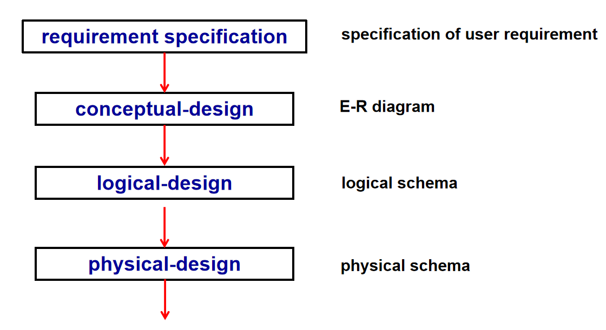
    

上图是数据库设计的一般流程。

## Database Modeling

!!! example "例子"
    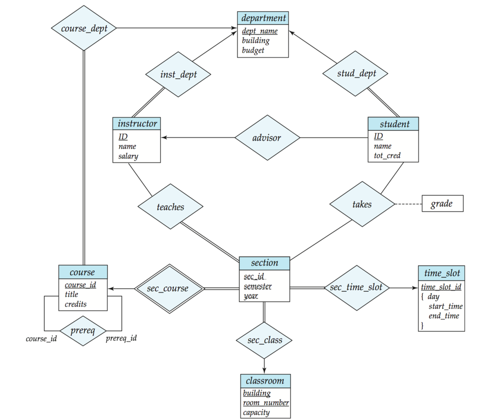

    + 一个方形框表示一个实体集合，包括了其属性

    + 实体与实体之间存在关系，用菱形框表示

        + 双横线表示每个实体都必须参与关系。例如，图中`course`与`course_dept`之间使用双横线连接，表示每一门课必须要归属于一个系

        + 单横线表示每个实体不一定参与关系。例如，图中`course`与`course_prereq`之间使用单横线连接，表示一门课不一定有先修课

        + `sec_course`是双框菱形，表示`section`是一个弱实体，必须依赖于`course`来唯一确定一个元组。

        + 箭头表示一对一，例如`course_dept`和`department`是一个单向箭头，表示一门课只能属于一个系。

        + 不加箭头的横线表示一对多，例如`course`与`course_prereq`之间没有箭头，表示一门课可以有多门先修课。

### Entities

**实体**

- 实体是一个独立存在的对象，可以与其他实体区分开来，例如，具体的人

- 实体集合是具有相同属性的实体的集合，例如，所有的学生、所有的课程等

- 实体的属性是实体所具有的特征，例如，学生的姓名、学号、性别等

!!! example "例子"
    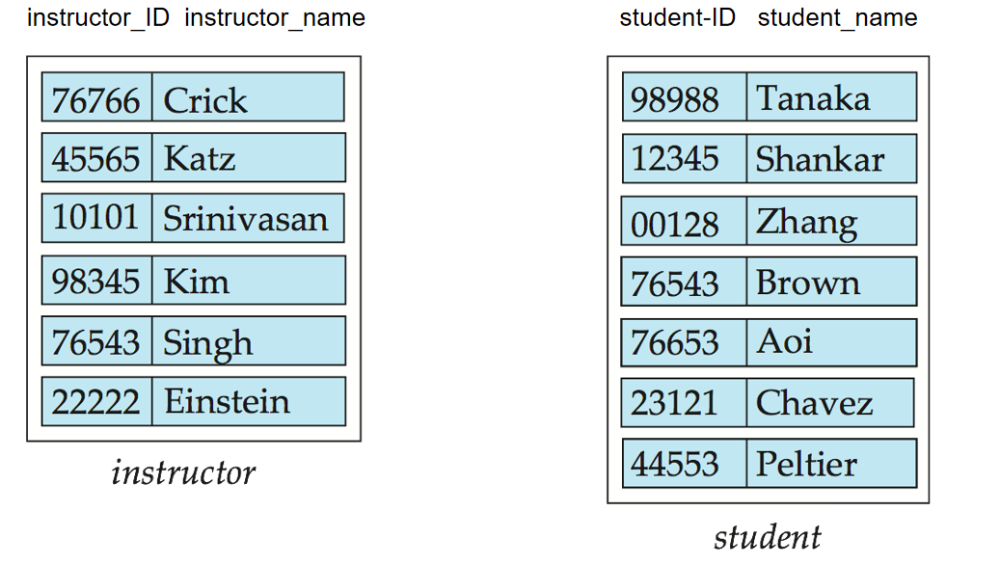

### Relationship Sets

**关系**

关系是多个集合之间的联系。

!!! example "例子"
    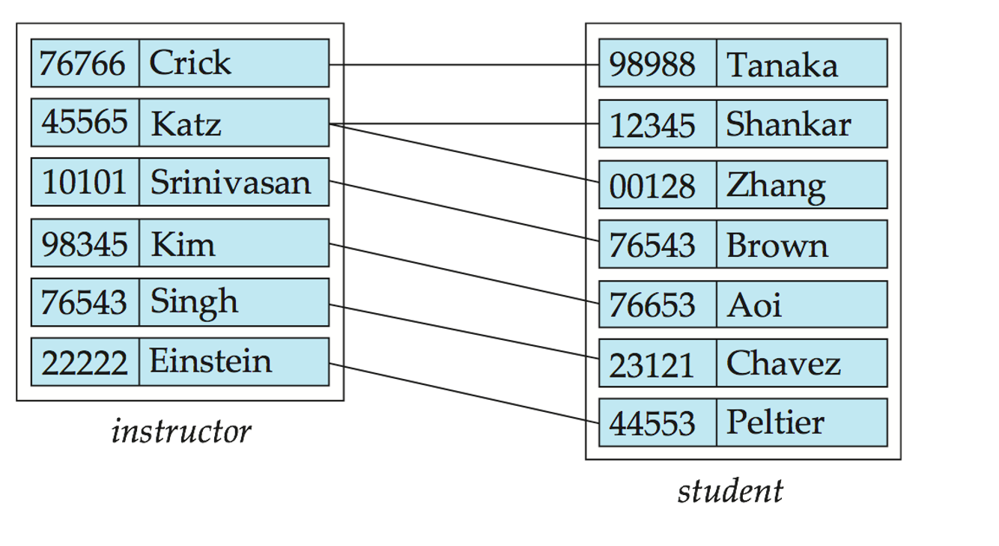

#### Relationship Sets with Attributes

关系集合也可以带有自己的属性，例如，`enrollment`关系集合可以有属性`grade`，表示学生在某门课程中的成绩。

#### Roles

- 关系中的实体不一定要不同

- 每个实体在关系中都有一个角色，下图中的`prereq_id`和`course_id`就是角色

!!! example "例子"
    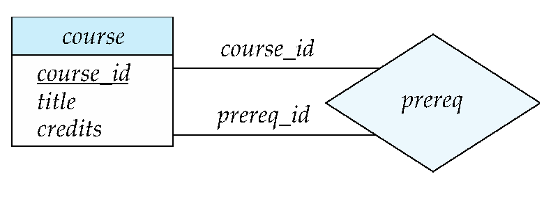

#### Degree(度) of a Relationship Set

- 关系集合的度是参与关系的实体集合的个数

- binary relationship（二元联系）

    - involve two entity sets (or degree two). 

    - most relationship sets in a database system are binary.

### Mapping Cardinality Constraints（映射基数约束）

- 对于具体的某个实体，描述其他实体通过某个关系可以关联的该实体的个数

- 在二元联系中，有如下几种

    - 1:1（one-to-one）

        - 每个实体集合中的每个实体都与另一个实体集合中的一个实体相关联

        - 例如，`course`和`course_dept`之间的关系

    - 1:N（one-to-many）

        - 每个实体集合中的每个实体都与另一个实体集合中的多个实体相关联

        - 例如，`course`和`section`之间的关系

    - N:M（many-to-many）

        - 每个实体集合中的每个实体都与另一个实体集合中的多个实体相关联

        - 例如，`student`和`course`之间的关系
    
    - N:1（many-to-one）
        - 每个实体集合中的多个实体都与另一个实体集合中的一个实体相关联

        - 例如，`section`和`course`之间的关系

!!! example "例子"
    === "one-to-many"
        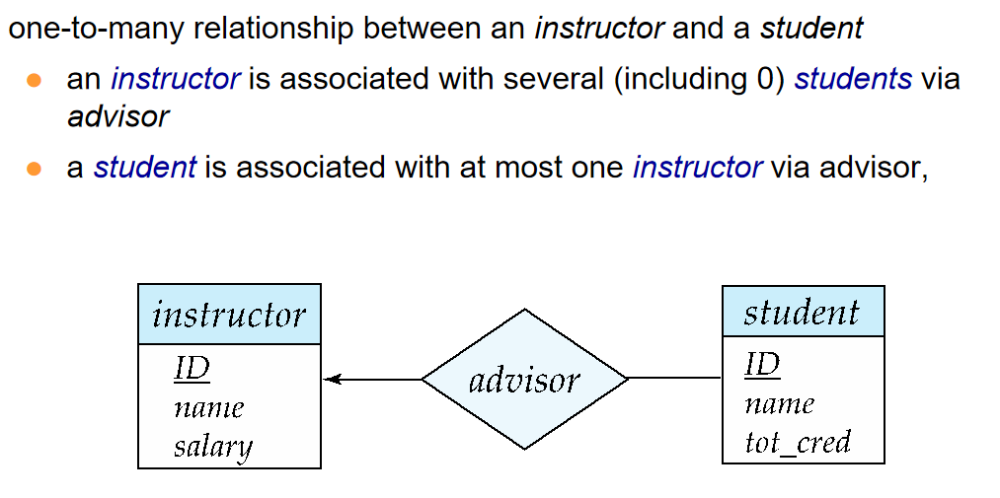
    === "one-to-one"
        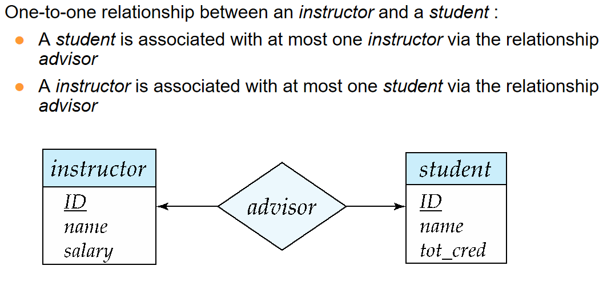
    === "many-to-one"
        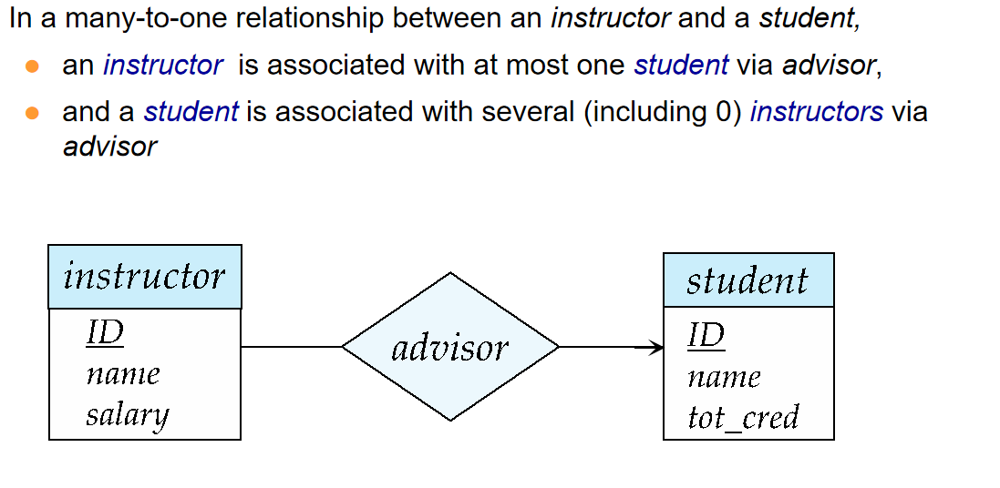
    === "many-to-many"
        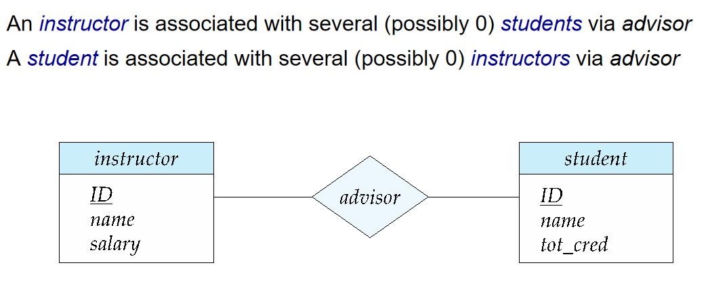

### Participation Constraints（参与约束）

- 完全参与（用双线表示）：实体集中的每个实体都至少参与关系集中的一个关系。

    - 例如：学生在 advisor 关系中是完全参与，每个学生都必须有一个相关的指导老师。

- 部分参与：有些实体可能不参与关系集中的任何关系。

    - 例如：指导老师在 advisor 关系中是部分参与。

### Notation for Expressing More Complex Constraints

A line may have an associated minimum and maximum cardinality, shown in the form l..h, where l is the minimum and h the maximum cardinality
    
- A minimum value of 1 indicates total participation.

- A maximum value of 1 indicates that the entity participates  in at most one relationship

- A maximum value of * indicates no limit.

!!! example "例子"
    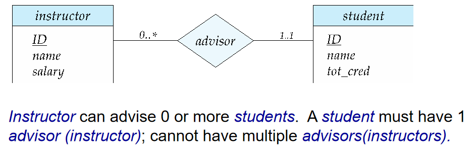

多元关系中，为避免混淆，我们允许最多一个箭头存在、

### Primary Key

#### Primary Key For Entity Sets

实体集合的主键是唯一标识实体集合中每个实体的属性或属性组合。主键可以是单个属性，也可以是多个属性的组合。

#### Primary Key For Relationship Sets

为了区分关系集合中的各种关系，我们使用关系集合中实体的各个主键。

设 R 是一个关系集合，涉及实体集合 E1, E2, .. En。

R 的主键由实体集合 E1, E2, ..En 的主键的并集组成。

如果关系集合 R 具有与之相关的属性 a1, a2, .., am，则 R 的主键还包括属性 a1, a2, .., am。

#### Weak Entity Sets（弱实体集）

- 弱实体集是指不具有主键的实体集。

- 弱实体集的存在依赖于标识性实体集（identifying entity set）。

    - 弱实体集必须通过一个完全参与的、从标识性实体集到弱实体集的一对多关系与标识性实体集相关联。

    - 标识性联系（Identifying relationship）使用双菱形表示。

- 弱实体集的分辨符（discriminator，或 partial key）是在已知依赖的标识性实体的情况下，用于区分弱实体集中所有实体的属性集合。

- 弱实体集的主键由其所依赖的强实体集的主键加上该弱实体集的分辨符组成。

在ER模型中,`partial key`使用虚线表示

!!! info "Redundant Attributes"
    假设我们有两个实体集

    - `student`，具有属性`ID`, `name`, `tot_cred`, `dept_name`

    - `department`，具有属性`dept_name`, `building`, `budget`

    - `student`和`department`之间有一个关系集`stu_dept`

    - 在ER图中，`student`需要删去`dept_name`属性，因为它可以通过`department`关系集中的`dept_name`属性来获得

    - 但是当我们在关系数据库中实现时，`student`表中仍然需要包含`dept_name`属性，因为它是一个外键，指向`department`表中的`dept_name`属性

## Reduction to Relational Schemas

将ER图转换为关系模式的过程称为`reduction to relational schemas`

+ A strong entity set reduces to a schema with the same attributes.
    - 例:course(course_id, title, credits)

+ A weak entity set becomes a table that includes a column for the primary key of the identifying strong entity set .也就是外键的使用

    - Primary key of the table is the union of the discriminator of the weak entity set and  the primary key of the identifying strong entity set 

    - 例:section(sec_id, course_id, semester, year)

+ A many-to-many relationship set is represented as a schema with attributes for the primary keys of the two participating entity sets, and any descriptive attributes of the relationship set.

    !!! example "例子"
        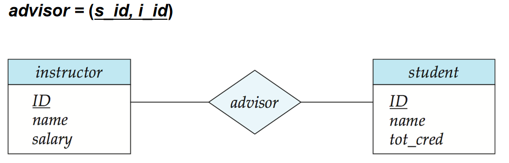
        我们把两个表的主键连接起来，形成一个新的表

+ Many-to-one and one-to-many relationship sets that are total on the many-side can be represented by adding an extra attribute to the “many” side, containing the primary key of the “one” side

+ For one-to-one relationship sets, either side can be chosen to act as the “many” side.That is, extra attribute can be added to either of the tables corresponding to the two entity sets 

### Composite and Multivalued Attributes

感觉比较平凡，看[这里](https://note.hobbitqia.cc/DB/db6/#composite-and-multivalued-attributes)吧

## Design Issues

### Common Mistakes in E-R Diagrams

1. 信息冗余
    !!! example "`dept_name`冗余"
        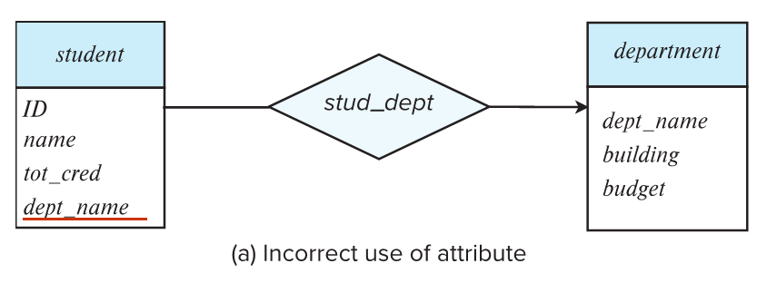
        `student`表中有`dept_name`属性，`department`表中也有`dept_name`属性，这样会导致数据冗余

2.  属性设置不当
    !!! example 
        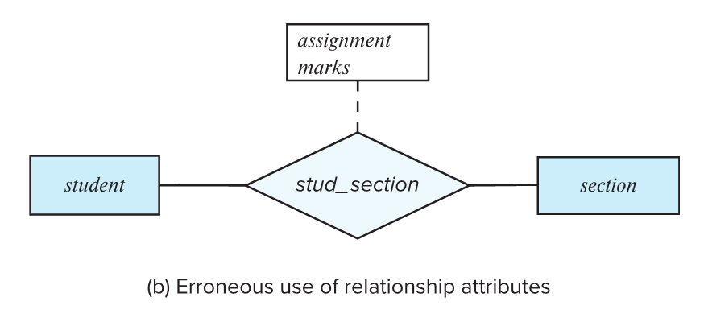
        
        一次课可能有多次作业，因此这样储存作业不合适

        ??? general "解决方法"
            === "1"
                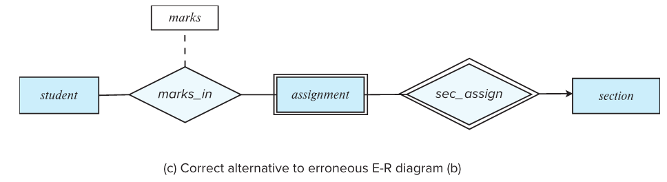
            === "2"
                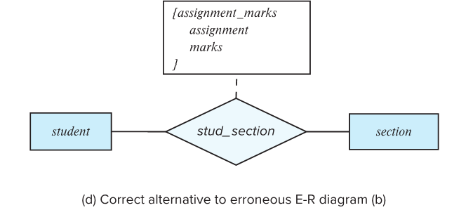

### Use of entity sets vs. attributes

    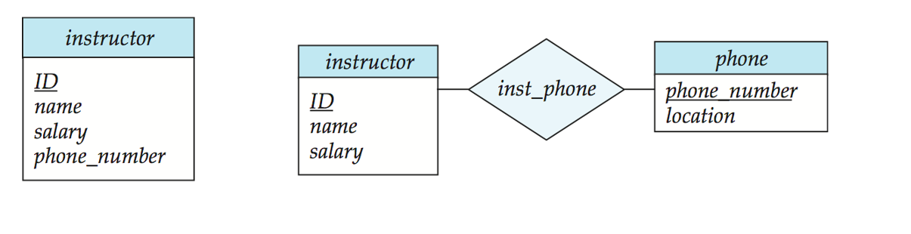
    

两种存放电话号码的方法。后一种方法允许存放更多信息。

---

后面的内容懒得写了，看[这里](hhttps://note.hobbitqia.cc/DB/db6/#use-of-entity-sets-vs-relationship-sets)吧

