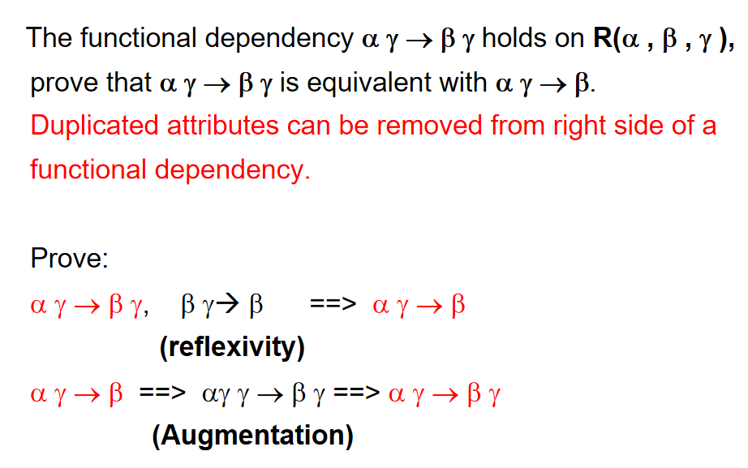

# 关系数据库设计

## 介绍

!!! example "引入"
    假设我们现在有如下关系模型：

    

    
    

    如果我们把instructor和department两个表合并，会怎么样?

    

    
    

    这样的一个表会有什么问题，让我们把它称为一个"bad" relation?

    1. Information repetition (信息重复):
        - `instructor`表中有很多`dept_name`属性的值是相同的，导致信息重复存储。

    2. Insertion anomalies (插入异常):
        - 如果我们想要插入一个新的系`dept_name`，但是没有任何教授属于这个系，那么我们就无法插入这个系的信息。

    3. Update difficulty (更新困难)
        - 如果我们想要更新一个教授的系`dept_name`，我们需要在多个地方进行更新,包括`budget`和`building`属性。

    那么,是什么原因导致这个表变成了一个"bad" relation呢?

    我们可以发现,在关系模型中,属性之间存在依赖关系,正如我们之前所说的主键.只要知道了主键,就可以唯一确定一个元组.

    在新的合成的表中,主键是`ID`.然而,`department`也能决定其他一些属性:`budget`和`building`.但在这里,`department`并不是一个candidate key,因为它无法唯一确定一个元组,因此我们应该把这个表分解成两个表.

    所以,我们也可以定义什么是好的关系模型:

    好的关系模型:

    
    - **只有candidate key才能决定其他属性**
    
    - 也就是说,如果一个属性决定了其他属性,那么它必须是一个candidate key.

---

看完了合成,我们来看看表的分解.

我们把分解分成两种:

1. **Lossy decomposition**: 有损分解.分解后,我们无法从分解后的表中恢复原来的表.

    - **定义**：分解后无法通过连接操作完全恢复原始表

    - **特点**：

        - 信息丢失

        - 可能产生虚假元组

        - 更多的元组意味着更多不确定性，即信息丢失

    - **示例**：

        

        
        

        - 主键选择不当（如图中错误地使用"名字"作为主键）
        

2. **Lossless decomposition**: 无损分解.分解后,我们可以从分解后的表中恢复原来的表.

    

    
    

    - **无损条件**：
                    $$
                    \pi_{R_1}(r) \bowtie \pi_{R_2}(r) = r
                    $$
    
    - **判断标准**（至少满足其一）：

        - $ R_1 \cap R_2 \rightarrow R_1 $

        - $ R_1 \cap R_2 \rightarrow R_2 $

        - 即公共属性是一个表的超键

---

### First Normal Form

- **定义**：关系模式R处于第一范式，当且仅当R的所有属性的域都是原子的。

- **原子域**：域是原子的，如果其元素被视为不可分割的单元。

- **非原子域的例子**：

    - 姓名集合、复合属性

    - 可以被分解成多个部分的标识号，如CS101->CS和101

- **关于原子性的说明**：

    - 原子性实际上是域元素使用方式的一种属性

    - 例如：字符串通常被视为不可分割的

    - 假设学生被赋予形如CS0012或EE1127的学号

        - 如果提取前两个字符来确定院系，则学号的域就不是原子的

        - 这样做是一个不好的设计：导致信息被编码在应用程序中，而不是在数据库中

### Devise a Theory for the Following

如果一个关系R不是一个好的关系,那么我们作如下操作

1. 将R分解为${R_1, R_2, \ldots, R_n}$

2. 使得每个$R_i$都是一个好的关系

Normal Forms(NF):

1NF -> 2NF -> 3NF -> BCNF -> 4NF 

---

## Functional Dependencies

让R是一个关系范式,并且对于属性$alpha$和$beta$:

$$
\alpha \subseteq R
$$

$$
\beta \subseteq R
$$

那么我们称函数依赖
$$
\alpha \rightarrow \beta
$$

保持在R上,当且仅当对于任何合法关系r(R),其任意元组$t_1$,$t_2$满足:

$$
t_1[\alpha] = t_2[\alpha] \implies t_1[\beta] = t_2[\beta]
$$

!!! example
    

1. K是关系范式R的超键当且仅当$K\rightarrow R$

2. K是关系范式R的主键当且仅当K是超键,并且没有任何真子集K'是超键.用数学语言表示就是:

    $$
    K \text{ is a superkey} \iff K \rightarrow R \text{ and } K' \nrightarrow R \text{ for all } K' \subset K
    $$

A functional dependency is trivial if it is satisfied by all relations

比如:

1. name -> name

2. {ID,name}->ID

一般的，如果$\beta \subseteq \alpha$，那么$\alpha \rightarrow \beta$是平凡的

### Closure(闭包)

#### Closure of a Set of Functional Dependencies

Given a set F of functional dependencies, there are certain other functional dependencies that are logically implied by F.

For example:  If  A -> B and  B -> C,  then we can infer that A -> C

我们定义：The set of all functional dependencies logically implied by F is the closure of F.

也即，闭包是一个包含所有函数依赖的集合,也就是F的所有函数依赖的集合.我们用$F^+$表示.

!!! example
    F={A->B, B->C}

    $F^+ = {A->B, B->C, A->C,AB->B,AB->C,\ldots}$

我们可以使用阿姆斯特朗定律来找到闭包

!!! definition
    - 如果 $\beta \subseteq \alpha$，那么 $\alpha \rightarrow \beta$ **(自反律 reflexivity)**

    - 如果 $\alpha \rightarrow \beta$，那么 $\alpha\gamma \rightarrow \beta\gamma$ **(增补律 augmentation)**

    - 如果 $\alpha \rightarrow \beta$ 且 $\beta \rightarrow \gamma$，那么 $\alpha \rightarrow \gamma$ **(传递律 transitivity)**

    这三条定律是:

    - Sound（正确有效的） (generate only functional dependencies that actually hold)

    - Complete（完备的） (generate all functional dependencies that hold).

    我们从这三条定律中也推出了另外三条additional rules:

    - 如果 $\alpha \rightarrow \beta$ 且 $\alpha \rightarrow \gamma$，那么 $\alpha \rightarrow \beta\gamma$ **(合并 union)**
    
    - 如果 $\alpha \rightarrow \beta\gamma$，那么 $\alpha \rightarrow \beta$ 且 $\alpha \rightarrow \gamma$ **(分解 decomposition)**
    
    - 如果 $\alpha \rightarrow \beta$ 且 $\beta\gamma \rightarrow \delta$，那么 $\alpha\gamma \rightarrow \delta$ **(伪传递 pseudotransitivity)**

!!! example
    === "Example 1" 
        
    === "Example 2" 
        

        这意味着函数依赖中，重复的属性在右边可以去除。

#### Closure of Attribute Sets

Given a set of attributes X, the closure of X with respect to a set of functional dependencies F is the set of attributes that are functionally determined by X under F.

也就是看看X能决定哪些属性.

The closure of X is denoted by $X^+$.

!!! example
    === "Example 1" 
        
    === "Example 2"
        

        可见，属性集合的闭包可以帮助我们判断一个属性集合是否是超键，是否是候选键。

#### Uses of Attribute Closure

属性闭包算法有以下几个用途：

1. **测试超键**：

    - 要测试 $\alpha$ 是否是超键，我们计算 $\alpha^+$，然后检查 $\alpha^+$ 是否包含 $R$ 的所有属性。

2. **测试函数依赖**：

    - 要检查函数依赖 $\alpha \rightarrow \beta$ 是否成立（换句话说，是否在 $F^+$ 中），只需检查 $\beta$ 是否包含于 $\alpha^+$。

    - 即我们使用属性闭包计算 $\alpha^+$，然后检查它是否包含 $\beta$。

3. **计算 $F$ 的闭包**：

    - 对于每个 $\alpha \subseteq R$，我们找到闭包 $\alpha^+$，然后对于每个 $S \subseteq \alpha^+$，我们输出一个函数依赖 $\alpha \rightarrow S$。

    

    
    

### Canonical Cover（正则覆盖）

函数依赖集可能会有冗余，包括：

1. 冗余的函数依赖：
    - 例如：在 $A \rightarrow B$ ,$A \rightarrow C$和 $B \rightarrow C$，中,$A \rightarrow C$是冗余的，因为它可以从 $A \rightarrow B$和 $B \rightarrow C$中推导出来。

2. 冗余的属性
    - LHS:

    
    

    - RHS:

    
    

因此,我们定义一个函数依赖集的正则覆盖是一个最小的函数依赖集,它与原来的函数依赖集等价.

!!! definition "无关属性 (Extraneous Attributes)"
    考虑函数依赖集F和其中的某个函数依赖 $\alpha \rightarrow \beta$，无关属性有两种类型：

    1. 左侧的无关属性

        如果属性A在$\alpha$中是无关的，意味着：

        - $A \in \alpha$

        - F逻辑上包含$(α-A) \rightarrow \beta$
        
        **通俗理解**：即使移除A，其余属性仍然能决定$\beta$

        **例子**：
        在F = {$A \rightarrow C$, $AB \rightarrow C$}中，B在"$AB \rightarrow C$"的左侧是无关的，因为单靠A就能决定C。

    2. 右侧的无关属性

        如果属性A在$\beta$中是无关的，意味着：

        - $A \in \beta$

        - F-{$\alpha \rightarrow \beta$}∪{$\alpha \rightarrow (\beta-A)$}逻辑上包含$\alpha \rightarrow A$
        
        **通俗理解**：从其他依赖也能推导出$\alpha \rightarrow A$

        **例子**：
        在F = {$A \rightarrow C$, $AB \rightarrow CD$}中，C在"$AB \rightarrow CD$"的右侧是无关的，因为我们已经知道$A \rightarrow C$，所以在$AB \rightarrow CD$中再包含C是多余的。

    上述情况的反向推导是显然成立的,因为一个更强的函数依赖集可以推导出一个更弱的函数依赖集.

---

OK,现在我们来给出正则覆盖完整的定义:

!!! definition "正则覆盖 (Canonical Cover)"
    函数依赖集F的正则覆盖是一个函数依赖集$F_c$，满足：
    
    1. F逻辑上包含$F_c$中的所有依赖

    2. $F_c$逻辑上包含F中的所有依赖

    3. $F_c$中没有任何函数依赖包含无关属性

    4. $F_c$中每个函数依赖的左侧都是唯一的

#### 正则覆盖的计算

我们用如下方法计算正则覆盖:

    

!!! example
    === "Example 1" 
        
    === "Example 2"
        
    === "Example 3"
        

## Boyce-Codd Normal Form(BCNF)

一个关系范式R在一个函数集合F下处于BCNF,要求对于所有$F^+$的函数依赖$\alpha \rightarrow \beta$,至少满足如下的一个条件:

- $\alpha \rightarrow \beta$ 是平凡的(即$\beta \subseteq \alpha$)

- $\alpha$是R的超键

### Decomposing a Schema into BCNF

假设我们有一个关系模式 $ R $，并且存在一个**非平凡依赖** $ \alpha \rightarrow \beta $，它导致违反了 **BCNF（Boyce-Codd范式）**。

我们将 $ R $ 分解为以下两个子关系：

- $ \alpha \cup \beta $
- $ R - (\beta - \alpha) $

在我们上面的例子中：

- $\alpha = \text{dept_name}$

- $ \beta = \{ \text{building}, \text{budget} \} $

因此，关系 `inst_dept` 被替换为：

- $\alpha \cup \beta = \{ \text{dept_name}, \text{building}, \text{budget} \}$

- $R - (\beta - \alpha) = \{ \text{ID}, \text{name}, \text{salary}, \text{dept_name} \}$

直白地讲，就是把不满足的函数依赖里的属性分解到一个新的表中,并且把原来的表中去掉这些属性。还要选出一个属性作为公共属性与新的表的主键，在这里就是`dept_name`。

    

!!! example
    

---

### BCNF and Dependency Preservation

!!! definition "Dependency Preservation"
    - 如果通过检验单一关系上的函数依赖，就能确保所有的函数依赖成立， 那么这样的分解是依赖保持的
    
    - 或者，原来关系R上的每一个函数依赖，都可以在分解后的单一关系上得到检验或者推导得到。

    设 $ F_i $ 是 $ F^+ $ 中所有**只包含 $ R_i $ 中属性**的函数依赖的集合。  
    即$ F_i $ 是将 $ F $ 限制在子关系 $ R_i $ 上的结果（称为对 $ R_i $ 的限制 restriction）。

    一个分解是**依赖保持的（Dependency Preserving）**，当且仅当：

    \[
    (F_1 \cup F_2 \cup \dots \cup F_n)^+ = F^+
    \]

Because it is not always possible to achieve both BCNF and dependency preservation, we consider a weaker normal form, known as third normal form.

!!! example 
    === "Example 1" 
        
    === "Example 2"
        
    === "Example 3"
        

## Third Normal Form

正如上面所说，BCNF是一个很强的范式,但是它并不总是能保持函数依赖.

因此,我们定义一个更弱的范式,称为第三范式(3NF)，它的特点是:

1. 允许一些冗余

2. 总是依赖保持的

3. 总可以将任意关系模式分解为满足3NF的子关系，且分解是无损连接、依赖保持的

!!! definition "Third Normal Form (3NF)"

    一个关系模式 \( R \) 属于**第三范式（3NF）**，当对于所有在 \( F^+ \) 中的函数依赖 \( \alpha \rightarrow \beta \)，满足以下至少一个条件：

    1. \( \alpha \rightarrow \beta \) 是平凡依赖（即 \( \beta \subseteq \alpha \)）

    2. \( \alpha \) 是 \( R \) 的一个超键（superkey）

    3. 对于 \( \beta - \alpha \) 中的每一个属性 \( A \)，都有：

    $$
        A是某个候选键（\text{candidate key}）的一部分
    $$

    - If a relation is in BCNF it is in 3NF (since in BCNF one of the first two conditions above must hold).

    - Third condition is a minimal relaxation of BCNF to ensure dependency preservation.

    !!! example
        

3NF分解算法如下图:

    

1. 令 \( F_c \) 是函数依赖集 \( F \) 的**标准覆盖**（Canonical Cover）。

2. 初始化计数器：\( i := 0 \)

3. 对于 \( F_c \) 中的每一个函数依赖 \( \alpha \rightarrow \beta \)，执行：

    - \( i := i + 1 \)
    - 创建关系模式：\( R_i := \alpha \cup \beta \)

    - 这一步确保了依赖保持

4. 如果当前构造出的所有子关系 \( R_j \)（\( 1 \leq j \leq i \)）**都不包含 \( R \) 的候选键**，则：

    - \( i := i + 1 \)
    - 任选一个 \( R \) 的候选键 \( K \)，令 \( R_i := K \)

    - 这一步确保了无损连接

5. 【可选步骤：删除冗余关系模式】

    - 重复以下操作，直到没有可以删除的关系模式：
        - 如果某个关系 \( R_j \) **完全包含在**另一个关系 \( R_k \) 中，则：
        - 删除 \( R_j \)，即设 \( R_j := R_i \)，并令 \( i := i - 1 \)

6. 最终返回子关系集合：

    \(
    (R_1, R_2, \ldots, R_i)
    \)