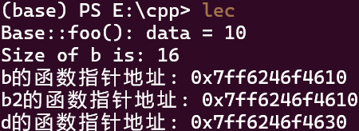

# 类与对象

我们先来看下面这个用C++编写的选择排序程序:

```cpp
#include <iostream>
using namespace std;

void selection_sort(int arr[], int n) {
    for (int i = 0; i < n - 1; i++) {
        int minIndex = i;
        for (int j = i + 1; j < n; j++) {
            if (arr[j] < arr[minIndex]) {
                minIndex = j;
            }
        }
        swap(arr[i], arr[minIndex]);
    }
}
```

我们使用这个程序,作为本节内容的例子.

## 引用类型

在上面的程序中,我们使用了一个`swap`函数来交换两个数的值。如果我们把`swap`函数这样写：

```cpp

void swap(int a, int b) {
    int temp = a;
    a = b;
    b = temp;
}
```
学过C语言的都知道，这个函数不能交换两个数的值。因为函数参数是值传递，函数内对参数的修改不会影响到实参。
如果我们想要交换两个数的值，可以使用指针作为参数：

```cpp  
void swap(int* a, int* b) {
    int temp = *a;
    *a = *b;
    *b = temp;
}
```

但是使用指针作为参数会使得函数的调用变得复杂，调用时需要传入变量的地址，并且在函数内需要使用`*`来解引用。
对此，C++提供了一个新的类型：引用类型来简化函数的调用。

```cpp
void swap(int& a, int& b) {
    int temp = a;
    a = b;
    b = temp;
}
```

在函数参数中使用`&`表示引用类型，引用类型的参数在函数内可以直接使用，而不需要使用`*`来解引用。

引用类型实际上就是对原来变量的一个别名，引用类型的参数在函数内对参数的修改会影响到实参。

任何对别名的修改都会影响到原变量。

## 函数模板

在编写排序算法时,我们需要考虑到排序的对象可能是int, float, double, string等多种类型。
如果我们为每种类型都编写一个排序函数,那就太麻烦了。
C++提供了一个新的特性：模板（template）来解决这个问题。

```cpp
template <typename T>

selection_sort(T arr[], int n) {
    for (int i = 0; i < n - 1; i++) {
        int minIndex = i;
        for (int j = i + 1; j < n; j++) {
            if (arr[j] < arr[minIndex]) {
                minIndex = j;
            }
        }
        swap(arr[i], arr[minIndex]);
    }
}
```

这样,编译器会帮我们根据传入的参数类型来生成相应的函数。
在函数定义时,我们使用`template <typename T>`来声明一个模板函数。
需要注意的时,一个`template<typename T>`只对紧跟着的函数有效,如果我们要定义多个模板函数,需要为每个函数都添加`template<typename T>`。

## 重载运算符

上面排序数据类型,比如int, float, double, string等都可以使用`<`来比较大小。

那如果我们自己写一个类,比如`Point`类:
```cpp
class Point {
public:
    int x, y;
    Point(int x, int y) : x(x), y(y) {}
};
```

我们想要比较两个`Point`对象的大小,比如`p1 < p2`表示`p1`离原点更近,我们该怎么做呢?
我们可以重载`<`运算符来实现这个功能。

```cpp
class Point {
public:
    int x, y;
    Point(int x, int y) : x(x), y(y) {}
    bool operator<(const Point& other) const {
        return x * x + y * y < other.x * other.x + other.y * other.y;
    }
};
```

- 形如`bool operator< (const Point& other) const`的函数称为运算符重载函数。

- 重载运算符不能改变运算符的优先级和结合性，也不能改变运算符的参数个数。

- 重载函数也可以不写在类内,而是写在类外,但是需要在函数前面加上`类名::`来表示这个函数是属于哪个类的：`String String::operator+(const String& that);`。

- 或者在全局写`String operator+(const String& l, const String& r);`,传入两个参数,分别表示左操作数和右操作数。


- 形如`<class name> :: <function name>`的东西叫做resolver,表示这个函数是属于哪个类的。

    - 如果是直接`::`的形式,表示这个函数是属于全局的。

```cpp
bool Pointer::operator<(const Point& other) const {
    return x * x + y * y < other.x * other.x + other.y * other.y;
}
```

可以重载的运算符有很多:

- 算术运算符：`+`, `-`, `*`, `/`, `%`

- 关系运算符：`<`, `>`, `<=`, `>=`, `==`, `!=`

- 逻辑运算符：`&&`, `||`, `!`

- 位运算符：`&`, `|`, `^`, `~`, `<<`, `>>`

- 赋值运算符：`=`, `+=`, `-=`, `*=`, `/=`, `%=`等

- 其他运算符：`[]`, `()`, `->`, `++`, `--`

甚至,你可以重载输出流运算符`<<`来实现自定义类型的输出。

注意,`x+y`其实是`x.operator+(y)`的简写,所以我们可以重载`+`运算符来实现自定义类型的加法运算。

```cpp
#include <iostream>
using namespace std;
class Point {
public:
    int x, y;
    Point(int x, int y) : x(x), y(y) {}
    friend ostream& operator<<(ostream& os, const Point& p) {
        os << "(" << p.x << ", " << p.y << ")";
        return os;
    }
};
```


### i++与++i的重载

我们需要思考,编译器如何区分`i++`与`++i`的区别呢?

可以发现,`i++`是后置运算符,而`++i`是前置运算符,它们的区别在于传入的参数不同

如下:

```cpp
Interger operator++(int) { //i++的重载
    Interger temp = *this; 
    ++value; 
    return temp; //i++的返回值还是自增之前的
}

Interger operator++() { //++i的重载
    ++value; 
    return *this; 
}
```

### 重载`[]`运算符
> 必须是成员函数

```cpp

int& operator[](int index) {
    return arr[index];
}
```

### 重载`()`运算符

`()`运算符重载允许对象像函数一样被调用，这种对象被称为**函数对象（Functor）**。通过重载`()`，我们可以让类的实例具有函数的行为。

```cpp
#include <iostream>
using namespace std;

class Adder {
    int sum = 0;
public:
    // 重载()运算符
    int operator()(int x) {
        sum += x;
        return sum;
    }
};

int main() {
    Adder add;
    cout << add(5) << endl;  // 输出5
    cout << add(10) << endl; // 输出15
    return 0;
}
```

重载还可以用在STL中,比如`std::sort`函数,我们可以传入一个自定义的比较函数来实现自定义排序.

```cpp
class Compare {
public:
    bool operator()(int a, int b) {
        return a > b;  // 降序排序
    }
};
sort(v.begin(), v.end(), Compare());
```

### 类型转换的重载

```cpp
operator double() const {
    return static_cast<double>(fenzi) / fenmu;
}
```

正如上面的代码所写的那样,我们可以重载类型转换的运算符,这样的一般写法是``operator <type>()`。


##  隐式转换

对于下面这段代码:

```cpp
#include <iostream>
#include <vector>
#include<string>
using namespace std;

class PathName {   string name; 
public: 
    PathName(const string& s) :name(s) {};    
    ~PathName(){}; 
}; 
    
int main(){
    string abc("abc"); 
    PathName xyz(abc); /
    xyz = abc;        
}
```

它是可以正常编译运行的,因为编译器会自动调用`PathName`类的构造函数来将`string`类型转换为`PathName`类型。

但是,如果加上`explicit`关键字:

```cpp
#include <iostream>
#include <vector>
#include<string>
using namespace std;

class PathName {   string name;
public: 
    explicit PathName(const string& s) :name(s) {};    
    ~PathName(){}; 
};
```

这样就会报错了,因为`explicit`关键字表示这个构造函数是显式的,不能隐式转换。

当然,隐式转换要求构造函数只有一个参数,或者多参数,但是后面都有默认值。

---

## 类与继承

来个生硬的转场...我们们来看看类与继承。

### 类

假设现在有三个类:circle, rectangle, triangle,它们都有一个`area`方法来计算面积,一个`perimeter`方法来计算周长。

```cpp
const double PI = 3.14;
class Circle {
    private:
    double radius;
public:
    Circle(double r) : radius(r) {}
    double area() {
        return PI * radius * radius;
    }
    double perimeter() {
        return 2 * PI * radius;
    }
};

class Rectangle {
    private:
    double width, height;
public:
    Rectangle(double w, double h) : width(w), height(h) {}
    double area() {
        return width * height;
    }
    double perimeter() {
        return 2 * (width + height);
    }
};

class Triangle {
    private:
    double a, b, c;
public:
    Triangle(double a, double b, double c) : a(a), b(b), c(c) {}
    double area() {
        double s = (a + b + c) / 2;
        return sqrt(s * (s - a) * (s - b) * (s - c));
    }
    double perimeter() {
        return a + b + c;
    }
};
```

!!! tips "类的小知识"
    === "public, private, protected"
        
        在类中,我们可以使用`public`, `private`, `protected`来控制成员的访问权限。

        - `public`表示公有成员,可以在类外访问。

        - `private`表示私有成员,只能在类内访问。

        - `protected`表示保护成员,只能在类内和子类中访问。

        | 访问权限 | public | private | protected |
        | -------- | ------ | ------- | --------- |
        | 类内     | √      | √       | √         |
        | 子类     | √      | ×       | √         |
        | 类外     | √      | ×       | ×         |

        例如上面的三个类中,`radius`, `width`, `height`, `a`, `b`, `c`都是私有成员,只能在类内访问。

        **注意,`private`等关键字的作用范围是从声明到另一个`private`等关键字的声明为止。**

    === "构造函数"
        上面的三个类中,我们使用了构造函数来初始化成员变量。

        构造函数与类名同名,没有返回值.

        上面使用`:`的方法来初始化成员变量,它的基本规则是

        ```cpp
        ClassName(Type1 arg1, Type2 arg2, ...) : member1(arg1), member2(arg2), ... {
            // constructor body
        }
        ```

        也可以使用`=`的方法来初始化成员变量,但是这种方法只能在构造函数体内使用。

        ```cpp
        ClassName(Type1 arg1, Type2 arg2, ...) {
            member1 = arg1;
            member2 = arg2;
            ...
        }
        ```

        然而，需要注意的是，后者的初始化方法实际上是一个默认初始化函数加上赋值操作，而不是一个构造函数。

        想知道区别的话，类内定义一个`const`的成员变量，然后在构造函数中使用`=`的方式来初始化这个成员变量，编译器会报错。此时只能使用列表的方式来初始化。

    === "析构函数"
        析构函数与类名同名,前面加上`~`,没有返回值,也没有参数。

        析构函数在对象被销毁时自动调用,用于释放资源。

        ```cpp
        ~ClassName() {
            // destructor body
        }
        ```

    + 如果什么都不写，默认变量和函数是`public`的。

    + 如果不写构造函数，编译器会自动生成一个默认构造函数。

    + 根据传进构造函数内的参数的不同，编译器会自动调用对应的构造函数。

??? warning "private对象真的不能在类外访问吗?"
    实际上，我们可以使用指针的方式来访问私有成员变量。

    ```cpp
    Circle c(1);
    Circle* p = &c;
    cout << p->area() << endl; // 3.14
    ```

    这是一个C++的<strike>漏洞</strike>特性。
---

### 继承

上面的三个类中,`area`和`perimeter`方法的实现是重复的。

我们可以使用继承来简化设计

```cpp
class Shape {
public:
   protected:
    const double PI = 3.14;
    double area = 0;
    double perimeter = 0;
};
class Circle : public Shape {
private:
    double radius;
public:
    Circle(double r) : radius(r) {}
    void area() {
        area = PI * radius * radius;
    }
    void perimeter() {
        perimeter = 2 * PI * radius;
    }
};
class Rectangle : public Shape {
private:
    double width, height;
public:
    Rectangle(double w, double h) : width(w), height(h) {}
    void area() {
        area = width * height;
    }
    void perimeter() {
        perimeter = 2 * (width + height);
    }
};
class Triangle : public Shape {
private:
    double a, b, c;
public:
    Triangle(double a, double b, double c) : a(a), b(b), c(c) {}
    void area() {
        double s = (a + b + c) / 2;
        area = sqrt(s * (s - a) * (s - b) * (s - c));
    }
    void perimeter() {
        perimeter = a + b + c;
    }
};
``` 

!!! definition "继承的一般写法"
    ```cpp
    class Base {
    public:
        // base class members
    };
    
    class Derived : public Base {
    public:
        // derived class members
    };
    ```
    这里的`public`表示`Derived`类是`Base`类的公有派生类。
    还有`protected`和`private`两种方式,分别表示`Derived`类是`Base`类的保护派生类和私有派生类。

    这三种方式的区别在于,派生类对基类成员的访问权限。

    | 访问权限 | public | protected | private |
    | -------- | ------ | --------- | ------- |
    | 基类     | √      | √         | √       |
    | 派生类   | √      | √         | ×       |
    | 类外     | √      | ×         | ×       |

    一般来说,我们使用`public`来继承基类。
    如果不写访问权限,默认是`private`继承。
    但如果是`struct`,默认是`public`继承。
---

子类在初始化时，也会调用父类的构造函数。如果父类构造函数不是默认构造函数(不写或者没有参数与行为的构造函数)，那么子类必须在初始化列表中调用父类的构造函数。

```cpp
class Shape {
public:
    Shape() {
        cout << "Shape constructor" << endl;
    }
    Shape(int x) {
        cout << "Shape constructor with x = " << x << endl;
    }
};
class Circle : public Shape {
public:
    Circle() : Shape() {
        cout << "Circle constructor" << endl;
    }
    Circle(int x) : Shape(x) {
        cout << "Circle constructor with x = " << x << endl;
    }
};
```

因此，在初始化时，基类的构造函数会先被调用，然后才是派生类的构造函数。

对于析构函数，则顺序正好相反，先调用派生类的析构函数，然后才是基类的析构函数。


### 抽象类与虚函数

可以看到,对于上面三个类,我们都需要计算周长与面积,实际上,计算周长与面积的函数可以在基类中实现,而在派生类中只需要实现构造函数即可。

然而,这三个几何图形的周长与面积的计算方法是不同的,所以我们不能在基类中实现这两个函数,只能够给出一个接口,让派生类来实现。这就需要用到关键字`virtual`与`override`。

```cpp
class Shape {
protected:
    const double PI = 3.14;
    double area = 0;
    double perimeter = 0;
public:
    virtual void area() = 0;
    virtual void perimeter() = 0;
};
class Circle : public Shape {
private:
    double radius;
public:
    Circle(double r) : radius(r) {}
    void area() override {
        area = PI * radius * radius;
    }
    void perimeter() override {
        perimeter = 2 * PI * radius;
    }
};
class Rectangle : public Shape {
private:
    double width, height;
public:

    Rectangle(double w, double h) : width(w), height(h) {}
    void area() override {
        area = width * height;
    }
    void perimeter() override {
        perimeter = 2 * (width + height);
    }
};
class Triangle : public Shape {
private:
    double a, b, c;
public:
    Triangle(double a, double b, double c) : a(a), b(b), c(c) {}
    void area() override {
        double s = (a + b + c) / 2;
        area = sqrt(s * (s - a) * (s - b) * (s - c));
    }
    void perimeter() override {
        perimeter = a + b + c;
    }
};
```

!!! tips "虚函数与复写"
    在上面的代码中,我们使用了`virtual`与`override`关键字。

    - `virtual`表示这个函数是一个虚函数,可以在派生类中复写。

    - `override`表示这个函数是对基类中的虚函数的复写,并不是必需的,但是加了这个关键字,编译器会检查这个函数是否真的复写了基类中的虚函数。如果没有复写,编译器会报错。

    - `= 0`表示这个函数是一个纯虚函数,没有实现,必须在派生类中实现。

    - 如果一个类中有纯虚函数,那么这个类就是一个抽象类,不能实例化。

---

+ 非虚函数:编译器在编译时就生成了静态的函数调用表,在运行时直接调用这个函数。

+ 虚函数:编译器在编译时生成了动态的函数调用表,在运行时根据对象的类型来决定调用哪个函数。

    - 由此可以引出静态绑定与动态绑定的概念

    - 静态绑定:根据声明的类型来决定调用哪个函数,在编译时就确定了函数的地址。

    - 动态绑定:根据实际的类型来决定调用哪个函数,在运行时才确定函数的地址。

??? note "How virtual really works"
    我们先写如下代码:
    ```cpp
    #include<iostream>

    using namespace std;

    class Base{
    public:
        Base() : data(10) {}
        void foo() {
            cout << "Base::foo(): data = " << data << endl;
        }
    private:
        int data;
    };

    int main(){
        Base b;
        b.foo();

        cout << "Size of b is: " << sizeof(b) << endl;
        return 0;
    }
    ```

    运行结果为:
    <div align="center">
            
        </div>
    
    这里我们可以看到,`sizeof(b)`的值是`4`,也就是`int`类型的大小,这是因为`data`是一个`int`类型的成员变量.

    现在,我们加一个虚函数`bar()`:
    ```cpp
    virtual void bar() {
        cout << "Base::bar()" << endl;
    }
    ```

    现在b的大小是多少呢?

    <div align="center">
            
        </div>

    可以看到,`sizeof(b)`变成了16,居然多了12个字节,这12个字节是什么呢?

    我们写一个指针,来访问一下这块地方:
    ```cpp
    int *p = (int*)&b;
    cout << *p << endl;
    p++;
    cout << *p << endl;
    p++;
    cout << *p << endl;
    ```

    这里用一个`int*`指针是因为,我们知道`int`类型的大小是4,而`void*`指针的大小是8,这样`p`每加1,其访问的地址就会加四个字节

    结果是:
    <div align="center">
            
        </div>

    可以看到,在`b`的内存中,前8个字节都是神奇的数字:1274168736与32758,这数字可能因电脑不同而不同,但再之后我们可以看到,出现了我们的`data`变量,也就是`10`.至于为什么后面还有四个字节,学过计组的或许能想到,内存空间是有对齐要求的,这里可能是用了double words来对齐.

    实际上,前8个字节存放的是一个函数指针,指向`bar()`函数的地址.这是因为`bar`函数加了`virtual`关键字,编译器会在这个类的对象中添加一个指向虚函数表的指针,这个指针指向了`bar()`函数的地址.

    实际上,使用`base`实例化的多个对象,它们的`bar()`函数指针是一样的,也就是它们指向同一个函数.
    ```
    int main(){
        Base b;
        b.foo();

        cout << "Size of b is: " << sizeof(b) << endl;
        int *p = (int*)&b;
        void* vptr = *(void* *)p;
        cout << "b的函数指针地址: " << vptr << endl; 

        Base b2;
        void *vptr2 = *((void**)&b2);
        cout << "b2的函数指针地址: " << vptr2 << endl;
        return 0;
    }
    ```

    运行结果:
    <div align="center">
            
        </div>

    我们再来看看,在子类中,虚函数是什么样的

    ```cpp
    #include<iostream>

    using namespace std;

    class Base{
    public:
        Base() : data(10) {}
        void foo() {
            cout << "Base::foo(): data = " << data << endl;
        }

        virtual void bar() {
            cout << "Base::bar()" << endl;
        }
    private:
        int data;
    };

    class Derived : public Base{
        public:
            void bar(){
                cout << "Derived::bar()" << endl;
            }
        };
    int main(){
        Base b;
        b.foo();

        cout << "Size of b is: " << sizeof(b) << endl;
        int *p = (int*)&b;
        void* vptr = *(void* *)p;
        cout << "b的函数指针地址: " << vptr << endl; 

        Base b2;
        void *vptr2 = *((void**)&b2);
        cout << "b2的函数指针地址: " << vptr2 << endl;

        Derived d;

        void* vptr3 = *((void**)&d);
        cout << "d的函数指针地址: " << vptr3 << endl;

        return 0;
    }
    ```

    运行结果:
    <div align="center">
            
        </div>

    可以看到,它们之间差了32个字节,32个字节是什么呢?我猜测是两个基类的大小,因为上面定义了两个基类对象`b`和`b2`,它们的大小是16.

    但如果我把继承类中的`bar()`函数去掉呢?

    结果如图:
    <div align="center">
            
        </div>

    可以看到,地址还是没变,这是因为这个函数指针实际上指向每个类的虚函数表,所以即使`Derived`类中没有`bar()`函数,它也会指向`Derived`类的虚函数表中的`bar()`函数.

现在,我们可以说说虚函数到底是怎么工作的了:

1. 当我们定义一个类时,编译器会为这个类生成一个虚函数表,这个表中存放了这个类的所有虚函数的地址.

2. 当我们用这个类实例化一个对象时,编译器会为这个对象添加一个指向虚函数表的指针.

3. 当我们调用一个虚函数时,编译器会根据这个对象的虚函数表中的指针来找到这个虚函数的地址,然后调用这个函数.

如果一个函数有多种类型,它们又全部被定义为虚函数,那么我们在子函数重写时,必须要重写这个函数所有的类型,不然其他类型的函数会被忽略.

```cpp
classBase {
    public:
    virtual voidfunc();
    virtual voidfunc(int);
};
```


!!! info
    如下操作中:
    ```cpp
    Ellipse elly(20F, 40F);
    Circle circ(60F);
    elly = circ;
    ```
    由于`Circle`是`Ellipse`的子类,所以可以直接赋值给`elly`,但是这样的赋值会截断`Circle`中`Ellipse`中没有的成员变量,所以会导致数据丢失.需要注意的时,这里函数指针没有被赋值,`elly` 仍然保留 `Ellipse` 类的虚函数表,这样是安全的.

    但是,我们如果用指针赋值:
    ```cpp
    Ellipse *elly = newEllipse(20f, 40f);
    Circle *circ = newCircle(60f);
    elly = circ;
    ```

    这是,`elly`就变成了一个指向`Circle`对象的指针,而不是一个`Ellipse`对象,所以不会丢失数据.
### 友元函数

在上面的代码中,我们使用了`protected`来保护成员变量,这意味着派生类可以访问基类的成员变量,但是类外不能访问。
如果我们想要在类外访问基类的成员变量,可以使用友元函数。

```cpp
class Shape {
protected:
    const double PI = 3.14;
    double area = 0;
    double perimeter = 0;
public:
    virtual void area() = 0;
    virtual void perimeter() = 0;
    friend ostream& operator<<(ostream& os, const Shape& s) {
        os << "area: " << s.area << ", perimeter: " << s.perimeter;
        return os;
    }
};
```
在这样的情况下,我们可以在类外访问基类的成员变量。

### Upcasting:上转型

!!! definition "上转型"
    上转型是指将派生类对象转换为基类对象的过程。

    例如：
    ```cpp
    Circle c(1);
    Shape* s = &c; // 上转型
    ```

    这里的`Shape* s = &c;`表示将`Circle`类的对象`c`转换为`Shape`类的指针`s`。

    上转型是安全的，因为派生类对象包含了基类对象的所有成员变量和成员函数。
    上转型后,我们只能访问基类的成员变量和成员函数,不能访问派生类的成员变量和成员函数。

    另外，上转型也可以通过引用来实现。

    `Shape& s = c;`表示将`Circle`类的对象`c`转换为`Shape`类的引用`s`。

## Comopile Unit

在C++中,每个源文件都是一个编译单元,编译器会将每个编译单元编译成一个目标文件,然后链接成一个可执行文件。

编译分为三个阶段:

- 预处理阶段:将源文件中的宏定义,头文件等进行处理,生成一个`.i`文件。

- 编译器单独处理每个 `.cpp` 文件，生成对应的目标文件（`.obj` 或 `.o`）

- 链接阶段:将所有的目标文件链接成一个可执行文件。

!!! info "头文件(.h)"
    正如我们在C语言中学过的，我们可以在一个文件中声明所有的函数和类，然后使用`#include`来包含这个文件。

    `#include`的写法有两种:

    1. `#include <filename>`:表示包含系统头文件,编译器会在系统目录中查找这个文件。

    2. `#include "filename"`:表示包含用户自定义头文件,编译器会在当前目录中查找这个文件。

    一般来说，头文件在写的时候最好加上这样几句话：

    ```cpp
    #ifndef FILENAME_H
    #define FILENAME_H
    // header file content
    #endif
    ```
    

    这几句话的意思是，如果`FILENAME_H`没有定义，就定义它，然后包含头文件的内容，最后结束这个条件编译。

    如果`FILENAME_H`已经定义，就不再包含头文件的内容。

    这样可以防止头文件被多次包含，造成重复定义的错误。

    给一个例子，我们定义一个`Point`类的头文件`Point.h`：

    ```cpp
    #ifndef POINT_H
    #define POINT_H
    class Point {
    public:
        int x, y;
        Point(int x, int y) : x(x), y(y) {}
        void move(int x,int y);
        void print();
    };
    #endif
    ```

    然后在`Point.cpp`中实现这个类：

    ```cpp
    #include "Point.h"
    #include <iostream>
    using namespace std;
    void Point::move(int x, int y) {
        this->x += x;
        this->y += y;
    }
    void Point::print() {
        cout << "(" << x << ", " << y << ")" << endl;
    }
    ```
    在`main.cpp`中使用这个类：

    ```cpp
    #include "Point.h"
    int main() {
        Point p(1, 2);
        p.move(3, 4);
        p.print();
        return 0;
    }
    ```

## Build Tools

在上面的例子中，我们用了好几个程序来实现`Point`类。

熟悉命令行操作的都知道，我们可以使用`g++`命令来编译这个程序：

```bash
g++ -o main.exe Point.cpp main.cpp
```

这条命令会将`Point.cpp`和`main.cpp`编译成一个可执行文件`main.exe`。

但是，如果我们有多个头文件，或者想要在不同的环境下编译这个程序，就需要使用一些工具来帮助我们。

我们在这里介绍`CMake`.

!!! tip
    我是在WSL中使用CMake，因为在linux中使用CMake比较方便。

1. 首先，使用`sudo apt install cmake`安装CMake。

2. 然后，在**项目目录**下创建一个`CMakeLists.txt`文件，内容如下：

    ```cmake
    cmake_minimum_required(VERSION 3.10)

    project(Point)

    set(CMAKE_CXX_STANDARD 11)

    include_directories(include)

    add_executable(main src/main.cpp src/Point.cpp)
    ```

    + `cmake_minimum_required(VERSION 3.10)`表示CMake的最低版本要求。

    + `project(Point)`表示项目名称为`Point`(不需要和文件名一致)。

    + `set(CMAKE_CXX_STANDARD 11)`表示使用C++11标准(可不写)。

    + `include_directories(include)`表示包含头文件的目录为`include`。

    + `add_executable(main src/main.cpp src/Point.cpp)`表示生成的可执行文件名为`main`，源文件为`src/main.cpp`和`src/Point.cpp`.注意这里的路径是相对于`CMakeLists.txt`文件的路径。

3. 然后，在**项目目录**下创建一个`build`目录，进入这个目录：
    
    ```bash
    mkdir build
    cd build
    ```

4. 然后，使用`cmake ..`命令生成Makefile文件：

    ```bash
    cmake ..
    ```
    这个命令会在`build`目录下生成一个`Makefile`文件。

5. 然后，使用`make`命令编译这个程序：

    ```bash
    make
    ```

6. 最后，使用`./main`命令运行这个程序：

