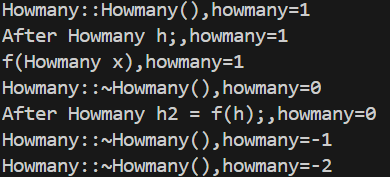
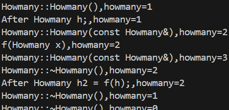
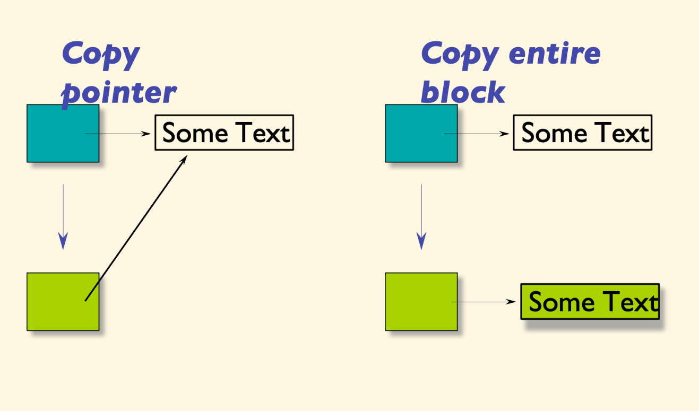

# Copy Constructor

!!! definition "Copy"
    Copy就是在创建一个新对象时，将一个已存在对象的值复制到新对象中。

    ```cpp
    //Currency as pass-by-value argument 
    voidfunc(Currency p){    
        cout << "X = " << p.dollars(); 
        } ... 
    Currency bucks(100, 0); 
    func(bucks); // bucks is copied into p
    ```

    在这里,`func`函数的参数`p`是一个`Currency`对象的副本。

    这意味着在函数调用时，`bucks`对象的值被复制到`p`中。

    不过在平时写的时候,更常见的情况是使用引用传递,即`func(Currency &p)`。


---

还是以一段程序开始:

```cpp
#include<iostream>

using namespace std;

static int howmany=0;

void print(const string& message){
    cout << message <<",";
    cout << "howmany=" << howmany << endl;
}

class Howmany{
public:
    Howmany(){
        howmany++;
        print ("Howmany::Howmany()");
    }
    ~Howmany(){
        howmany--;
        print("Howmany::~Howmany()");
    }
};

Howmany f(Howmany x){
    print("f(Howmany x)");
    return x;
}

int main(){
    Howmany h;
    print("After Howmany h;");
    Howmany h2 = f(h); // copy constructor
    print("After Howmany h2 = f(h);");
    return 0;
}
```

这段程序的运行结果是:

<div align="center">

</div>


这里调用了三次析构函数,但为什么好像只调用了一次构造函数呢?

??? tip "分析"
    这是因为在后面两次构造,也就是对`x`的构造和对`h2`的构造,都是调用了拷贝构造函数,而不是默认构造函数。

    而我们的类里面,没有拷贝构造函数,所以编译器会自动生成一个拷贝构造函数,这个拷贝构造函数的实现是直接把对象的所有成员变量逐个复制到新对象中。

    但是没有带上`howmany++`的语句,看起来好像只调用了一次构造函数.

    如果我们自己写一个拷贝构造函数:

    ```cpp
    Howmany(const Howmany& x){
        howmany++;
        print("Howmany::Howmany(const Howmany&)");
    }
    ```

    <div align="center">
    
    </div>

    这样就正常了，三次构造，三次析构。

    btw,在初始化时,`=`和`()`都会调用拷贝构造函数，也就是说，`MyClass b = a;`和`MyClass b(a);`是等价的。

---

## 细看拷贝构造函数

拷贝构造函数的定义是这样的:

```cpp
T(const T& x);
```

如果我们不写拷贝构造函数，编译器会自动生成一个拷贝构造函数。

这个自动生成的拷贝构造函数是`Member-wise copy`,也就是说，编译器会把对象的每个成员变量都复制到新对象中。

对于一般的变量,这当然是好的,但是对于指针来说,就意味着会把地址也复制过去.

<div align="center">

</div>

来搞点小花招:

```cpp
#include<iostream>
#include<cstring>
using namespace std;

class Person{
public:
    char* name;
    Person(const char* n){
        name = new char[strlen(n)+1];
        strcpy(name,n);
    }
    ~Person(){
        delete[] name;
    }
};

int main(){
    Person p1("Trump");

    Person p2 = p1;

    cout<<(void*)p1.name<<endl;
    cout<<(void*)p2.name<<endl;
}
```

这个程序跑出来,两个指针的地址是一样的,这是因为`name`是一个指针变量,所以编译器会把指针的值复制到新对象中,而不是复制指针指向的内容.

当然,如果你真的去跑的话,这个程序在最后肯定会出错或者崩溃.原因在于,删除`p1`的时候,`p2`的指针也被删除了,所以`p2`的指针就变成了悬空指针,在调用`p2`的析构函数的时候,我们在对一块地址`delete`了两次,所以会出错.

我们只要加上一个拷贝构造函数就可以了:

```cpp
Person(const Person& other){
        name = new char[strlen(other.name)+1];
        strcpy(name,other.name);
}
```

这样,两个指针指向的地址就不一样了,所以不会出错.

---

实际上,在C++中,更推荐的做法是使用`std::string`类,而不是使用`char*`指针.因为`std::string`类本身是一个类,因此在拷贝构造时会自动调用``std::string`类的拷贝构造函数,而不是直接复制指针.
```cpp
#include<iostream>
#include<string>
using namespace std;

class Person{
public:
    string name;
    Person(const string n):name(n){}
};

int main(){
    Person p1("Trump");

    Person p2 = p1;

    cout<<(void*)p1.name.data()<<endl;
    cout<<(void*)p2.name.data()<<endl;
}
```

这样,两个对象的指针地址就不一样了,所以不会出错.

---

现在,我们可以把默认拷贝构造的`Member-wise copy`总结如下:

1. Calling the copy ctors for each class-typemember (and the base part), recursively

2. Doing a plain assignment for each non-classtype member (e.g., int or pointer).


## Copy ctor guidelines

!!! tip "Rule"
    === "Rule of Zero"
        如果没有必要,就不要定义下面三者:

        1. 拷贝构造函数

        2. 析构函数

        3. `=`运算符重载
    === "Rule of Three"
        如果你定义了上面三者中的一个,那么就必须定义另外两个.

        例如

        ```cpp
        class MyClass{
        public:
            MyClass(const MyClass& x); // copy ctor
            MyClass& operator=(const MyClass& x); // assignment operator
            ~MyClass(); // destructor
        };
        ```

一般来说,重载`=`运算符有一个约定俗成的规则:

```cpp
MyClass& MyClass::operator=(const MyClass& x){
    if(this != &x){ // check for self-assignment
        // do the assignment
    }
    return *this; // return the current object
}
```

先检查是否为自赋值可以避免很多麻烦.

## 杂项

### 禁用拷贝构造

有时候,由于拷贝构造的代价太大,或是其他原因,我们需要禁用拷贝构造函数.

在C++11之前,一般是把拷贝构造设为private,然后不实现:

在C++11之后,可以使用`delete`关键字:

```cpp
class MyClass{
public:
    MyClass(const MyClass&) = delete; // disable copy ctor
    MyClass& operator=(const MyClass&) = delete; // disable assignment operator
};
```
这样,如果你尝试使用拷贝构造函数或赋值运算符,编译器会报错.

### Emplace_back

在C++11中,我们可以使用`emplace_back`来避免拷贝构造函数的调用.

```cpp
#include <iostream>
#include <vector>
#include <string>
using namespace std;

int main() {
    vector<string> v;
    string s = "Hello";
    v.push_back(s); // copy constructor is called
    v.emplace_back("World"); // no copy constructor is called
    cout << v[0] << " " << v[1] << endl;
    return 0;
}
```