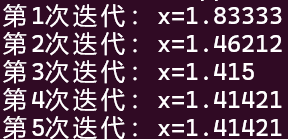
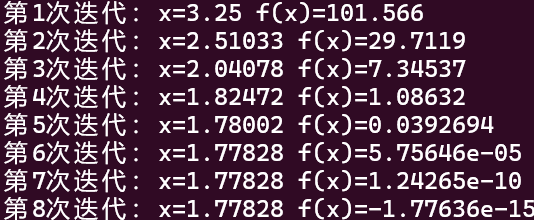

# C++设计

我们以一个实际问题来介绍这一章。

!!! question "如何计算一个函数的零点?"

对于这个问题，如果是Python的话，有很多好用的函数库可以直接使用，比如`scipy.optimize`。但是在C++中，我们需要自己实现一个函数来计算一个函数的零点。

在这里我们使用牛顿迭代法来计算一个函数的零点。

!!! definition "牛顿迭代法(Newton-Raphson Method)"
    牛顿迭代法是求函数零点的一种高效数值方法。它的基本思想是：通过函数在当前点的切线来线性近似函数，然后将切线与x轴的交点作为下一次迭代的估计值。

    - 原理推导
        假设函数$f(x)$在点$x_n$附近可导，我们可以用泰勒一阶展开式近似表示：
        $$
        f(x) \approx f(x_n) + f'(x_n)(x - x_n)
        $$

        为找到$f(x) = 0$的解，我们令上式等于0：
        $$
        f(x_n) + f'(x_n)(x - x_n) = 0
        $$

        解出$x$得到：
        $$
        x = x_n - \frac{f(x_n)}{f'(x_n)}
        $$

        这个$x$值就是函数切线与x轴的交点，我们将其作为下一次迭代的值$x_{n+1}$：
        $$
        x_{n+1} = x_n - \frac{f(x_n)}{f'(x_n)}
        $$

    - 几何意义
        - 在点$(x_n, f(x_n))$处作切线，切线方程为$y = f(x_n) + f'(x_n)(x - x_n)$
        - 切线与x轴交点的横坐标为$x_{n+1}$
        - 该点通常比$x_n$更接近实际零点

    - 迭代终止条件
        迭代可以基于以下条件之一终止：
        - 连续两次迭代结果变化很小：$|x_{n+1} - x_n| < \epsilon_1$
        - 函数值已经足够接近0：$|f(x_{n+1})| < \epsilon_2$
        - 达到最大迭代次数：$n > N_{max}$

---

当然，我们的重点不是牛顿迭代法的原理，而是如何用C++实现它。

## 开始

我们先假设我们的函数是$f(x) = x^2 - 2$，我们要计算它的零点。
我们可以用牛顿迭代法来计算它的零点。

```cpp
#include<cmath>

#include<iostream>

using namespace std;

int main(){
    int k=0;
    double x =3.0;

    while(fabs(x*x-2)>1e-12&&k<32){
        x = x-(x*x-2)/(2*x);
        k++;
        cout<<"第"<<k<<"次迭代：x="<<x<<endl;
    }
    return 0;
}
```

结果如下:
<div align="center">
    
</div>

可以看到，收敛得非常快(前提是初始值选得好)，逼近了$\sqrt{2}$。

## 进一步

在这个程序中国，有一些超参数存在。超参数指的是那些在程序运行前需要设定的参数。比如：

- 初始值`x`

- 最大迭代次数

- 精度`1e-12`

我们把上面的程序分装到一个类`NewtonSolver`中。

```cpp
#include<cmath>

#include<iostream>

using namespace std;


class NewtonSolver{

private:
    int max_iter;
    double tolerance;
    double a;
    double x;
    int k;

public:
    NewtonSolver(int max_iter, double tolerance, double a) : max_iter(max_iter), tolerance(tolerance), a(a),k(0) {}

    void print() {
        cout<<"第"<<k<<"次迭代：x="<<x<<endl;
    }
    double f(double x) {
        return x * x - a;
    }
    double f_prime(double x) {
        return 2 * x;
    }
    void solve(double x0) {
        x = x0;
        while (fabs(f(x)) > tolerance && k < max_iter) {
            x = x - f(x) /f_prime(x);
            k++;
            print();
        }
    }

};
int main(){
    int max_iter = 32;
    double tolerance = 1e-12;
    double a = 10.0;
    double x = 1.0;

    NewtonSolver solver(max_iter, tolerance, a);
    solver.solve(x);
    return 0;
}
```

这样就清爽多了。

## 然后

现在我们思考一个问题。在这个类中，`solve`函数实际上和具体情况无关,也就是说,不管计算什么函数的零点.`solve`函数都不用改.

那真正需要用户输入的是什么呢?

其实就是我们的函数`f`和它的导数`f_prime`。

总的来说,这个类有抽象部分与具体部分两种,那么在设计中,我们应该把抽象部分和具体部分分开,这样就可以实现代码的复用。

我们把`f`和`f_prime`函数做成纯虚函数,然后让用户继承这个类,实现自己的`f`和`f_prime`函数。
```cpp
virtual double f(double x) =0;
virtual double f_prime(double x) =0;
```
然后我们就需要实现这两个虚函数,才能求解.

我们搞一个继承类`SqrtSolver`,来求解`f(x) = x^2 - a`的零点.

```cpp
#include<cmath>

#include<iostream>

using namespace std;


class NewtonSolver{

private:
    int max_iter;
    double tolerance;
    double x;
    int k;

    virtual double f(double x) =0;
    virtual double f_prime(double x) =0;

public:
    NewtonSolver(int max_iter, double tolerance) : max_iter(max_iter), tolerance(tolerance),k(0) {}

    void print() {
        cout<<"第"<<k<<"次迭代：x="<<x<<" f(x)="<<f(x)<<endl;
    }
   
    void solve(double x0) {
        x = x0;
        while (fabs(f(x)) > tolerance && k < max_iter) {
            x = x - f(x) /f_prime(x);
            k++;
            print();
        }
    }

};

class SqrtSolver : public NewtonSolver {
private:
    double a;
    double f(double x) override {
        return x * x - a;
    }

    double f_prime(double x) override {
        return 2 * x;
    }
public:
    SqrtSolver(int max_iter, double tolerance, double a) : NewtonSolver(max_iter, tolerance), a(a) {}
};
int main(){
    int max_iter = 32;
    double tolerance = 1e-12;
    double a = 10.0;
    double x = 1.0;

    SqrtSolver solver(max_iter, tolerance,a);
    solver.solve(x);
    return 0;
}
```

这样设计有什么意义呢?

- 所有求解零点的函数都需要使用牛顿迭代法,所以我们把这个函数在基类里实现

- 不同函数之间的差别只有`f`和`f_prime`函数,所以我们把这两个函数做成虚函数,让用户实现

- 这样我们就可以实现代码的复用,而不需要重复实现`solve`函数

- 因此,在设计过程中,我们需要思考,需求会变在什么地方,那么我们就把这部分抽象出来,做成虚函数,让用户实现

## 继续

我们写一个类,来计算形如`f(x) = x^n - a`的零点,也就是`n`次方根.

```cpp
#include<cmath>

#include<iostream>

using namespace std;


class NewtonSolver{

private:
    int max_iter;
    double tolerance;
    double x;
    int k;

    virtual double f(double x) =0;
    virtual double f_prime(double x) =0;

public:
    NewtonSolver(int max_iter, double tolerance) : max_iter(max_iter), tolerance(tolerance),k(0) {}

    void print() {
        cout<<"第"<<k<<"次迭代：x="<<x<<" f(x)="<<f(x)<<endl;
    }
   
    void solve(double x0) {
        x = x0;
        while (fabs(f(x)) > tolerance && k < max_iter) {
            x = x - f(x) /f_prime(x);
            k++;
            print();
        }
    }

};

class SqrtSolver : public NewtonSolver {
private:
    double a;
    double f(double x) override {
        return x * x - a;
    }

    double f_prime(double x) override {
        return 2 * x;
    }
public:
    SqrtSolver(int max_iter, double tolerance, double a) : NewtonSolver(max_iter, tolerance), a(a) {}
};
class Nthsolver: public NewtonSolver{
private:
    int n;
    double a;
    double f(double x) override{
        return pow(x,n)-a;
    }
    double f_prime(double x) override{
        return n*pow(x,n-1);
    }
public:
Nthsolver(int max_iter,double tolerance, int n,double a):n(n),a(a),NewtonSolver(max_iter,tolerance) {}
};
int main(){
    int max_iter = 32;
    double tolerance = 1e-12;
    double a = 10.0;
    int n=4;
    double x = 1.0;

    Nthsolver solver(max_iter, tolerance,n,a);
    solver.solve(x);
    return 0;
}
```

结果如下:
<div align="center">
    
</div>