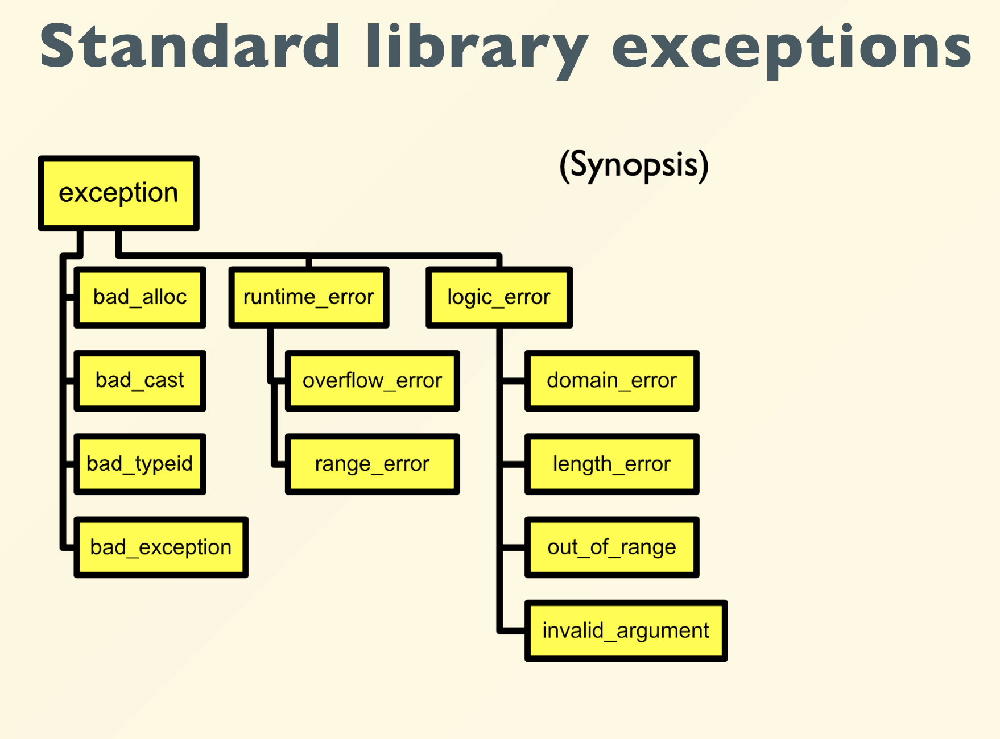

# 异常
> 程序在运行时,总会产生各种各样的问题.这些问题在静态,也即编译时,是无法发现的.
>
>比如,除数为0,数组越界,空指针引用等等.这些问题在运行时会导致程序崩溃,或者产生错误的结果.
>
>为了避免这些问题,我们需要使用异常处理机制.

!!! example "To Read a File"
    步骤如下:

    1. open the file;  
    
    2. determine its size;  
    
    3. allocate that much memory;  
    
    4. read the file into memory;  
    
    5. close the file;

    这其中可能会有各种各样的问题.古人使用`errorcode`来处理这些问题:
    
    ```cpp
    errorCodeType readFile { initialize errorCode = 0;
    open the file;
    if ( theFilesOpen ) { determine its size;
    if ( gotTheFileLength ) { allocate that much memory;
    if ( gotEnoughMemory ) { read the file into memory;
    if ( readFailed ) { errorCode = -1;
    } } else {
    errorCode = -2;
    } } else {
    errorCode = -3;
    }
    close the file;
    if ( theFILEDidntClose && errorCode == 0 ) { errorCode = -4;
    } else {
    errorCode = errorCode and -4;
    } } else {
    errorCode = -5;
    }
    return errorCode;
    }
    ```

    但是这种方法有几个问题:

    1. 代码可读性差,错误码的意义不明确,需要查阅文档才能理解.

    2. 错误码的处理逻辑复杂,需要在每个函数中都进行错误码的判断和处理,导致代码冗长.

    3. 错误码的传递和处理不够灵活,需要在每个函数中都进行错误码的传递和处理,导致代码冗长.

    为此,我们使用`try-catch`语句来处理异常:
    
    ```cpp
    try {
        open the file;
        determine its size;
        allocate that much memory;
        read the file into memory;
        close the file; 
    } 
    catch ( fileOpenFailed ) { 
        doSomething; } 
    catch ( sizeDeterminationFailed ) { 
        doSomething; } 
    catch ( memoryAllocationFailed ) { 
        doSomething; } 
    catch ( readFailed ) { 
        doSomething; } 
    catch ( fileCloseFailed ) { 
        doSomething; }
    ```

    这样,我们能保持代码的可读性,并且能灵活地处理异常.

- At the point where the problem occurs  
    - you may not know what to do, 
    
    - but you know  that you can’t just continue on merrily  
    
    - you must stop, and somebody, somewhere must figure out what to do next

比如,我们看下面这个`Vector`类的实现:

```cpp
template <class T> class Vector { 
private: 
    T* m_elements; 
    int m_size; 
public: 
    Vector (int size = 0) : 
    m_size(size) ... 
    ~Vector () { delete [] m_elements; } 
    void length(int); 
    int length() { return m_size; } 
    T& operator[](int); 
};
```

这里`[]`可能会有越界的风险,为了处理这个问题,我们有如下几种方式:

1. 不管三七二十一,直接`return`

    ```cpp
    return m_elements[idx];
    ```

    这样可能会导致程序崩溃,或者产生错误的结果.

2.  传一个特殊的值来表示错误

    ```cpp
    if (idx < 0 || idx >= m_size) {  
        T error_marker("some magic value");  r
        return error_marker;
    }  
    
    return m_elements[idx];
    ```

3. Just die
    ```cpp
    if (idx < 0 || idx >= m_size) {  
        cerr << "Index out of bounds" << endl;  
        exit(1);  
    }  
    
    return m_elements[idx];
    ```

    ```cpp
    assert(idx >= 0 && idx < m_size);
    return m_elements[idx];
    ```

4. 当然,最好的做法就是
    ```cpp
    if (idx < 0 || idx >= m_size) {  
        throw <something>;
    }  
    
    return m_elements[idx];
    ```

    这样,我们就能在`catch`中处理异常了.

---

那么,这里的`something`是什么呢?

我们定义一个类

```cpp
// What do you have? Data!  
// Define a class to represent the error  
class VectorIndexError {  

public:  
    
    VectorIndexError(int v) : m_badValue(v) { }  
    
    ~VectorIndexError() { }  
    
    void diagnostic() {  
        cerr << "index " << m_badValue  << "out of range!";  
    }  
    
private:  
    int m_badValue;  
};
```

这样,我们直接
```cpp
throw VectorIndexError(idx);
```

这样就可以在遇到越界的情况下抛出异常了.


## try-catch Block

- `try`后面接正常的代码,如果没有异常,就正常执行,如果有异常,就跳到`catch`中执行.

- 一个`try`可以有多个`catch`,每个`catch`可以处理不同类型的异常.

- 不同的`catch`是按照从上到下的顺序执行的,第一个匹配的`catch`会被执行.

- 因此,我们应该把最具体的异常放在前面,把最一般的异常放在后面.

- `catch(...)`可以捕获所有类型的异常,但是不推荐使用,因为这样会导致我们无法知道异常的类型,也就无法处理异常了.

标准库里有如下几种异常:

<div align="center">
    
    </div>


我们比较常用的有:

- `std::out_of_range`: 越界异常

- `std::invalid_argument`: 无效参数异常

- `std::bad_alloc`: 内存分配异常

- `std::bad_cast`: 类型转换异常

- `std::bad_typeid`: 类型异常

```cpp title="sample"
#include <iostream>
#include <stdexcept>
#include <string>
#include <vector>
#include <exception>
using namespace std;
int main() {
    try {
        vector<int> v(10);
        cout << v.at(20) << endl; // 越界异常
    } catch (const out_of_range& e) {
        cout << "out_of_range: " << e.what() << endl;
    } catch (const exception& e) {
        cout << "exception: " << e.what() << endl;
    }
}
```

## 异常继承

异常是一个类,所以它也可以继承,我们可以定义一个基类,然后定义多个子类来表示不同类型的异常.

```cpp
class Matherr{
public:
    Matherr(int v) : m_badValue(v) { }
    ~Matherr() { }
    void diagnostic() {
        cerr << "Math error: " << m_badValue << endl;
    }

private:
    int m_badValue;
}

class DivideByZero : public Matherr {
public:
    DivideByZero(int v) : Matherr(v) { }
    ~DivideByZero() { }
    void diagnostic() {
        cerr << "Divide by zero: " << m_badValue << endl;
    }
};


class Overflow : public Matherr {

public:
    Overflow(int v) : Matherr(v) { }
    ~Overflow() { }
    void diagnostic() {
        cerr << "Overflow: " << m_badValue << endl;
    }
};
```

在`std`中,异常的基类是`std::exception`,我们可以继承这个类来定义自己的异常类.

```cpp

class MyException : public std::exception
{
public:
    MyException(const char* msg) : m_msg(msg) { }
    ~MyException() { }
    const char* what() const noexcept { return m_msg; }
private:
    const char* m_msg;
};
```

- `noexcept`表示这个函数不会抛出异常,如果抛出异常,就会调用`std::terminate()`函数,终止程序.

- 异常会带来额外的开销,因此,如果我们能用正常的代码来处理问题,就不要使用异常.

- 异常应当用来表明错误,如果是程序的预期行为,那么完全没有必要用异常,例如遍历链表到末尾.


!!! tip "Summary"

    - Error recovery is a hard design problem  
    
    - All subsystems need help from their clients to handle exceptional cases  
    
    - Exceptions provide the mechanism for  
        - Propagating dynamically  
        
        - Destroying objects on stack properly

## Failure in constructors
> 构造函数没有返回值,因此不能用错误码之类的处理,需要用异常.

