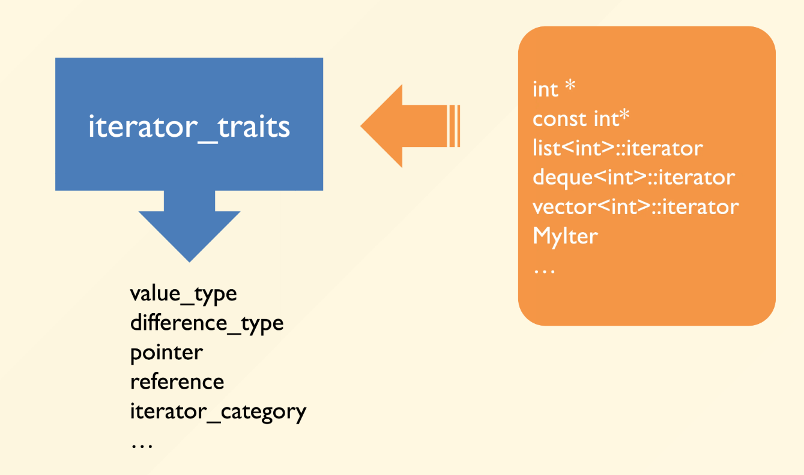

# Iterator

!!! tip "Why we need iterator?"

    - STL的设计理念是“算法和数据结构分离”，即算法不依赖于数据结构。

    - 但是，算法需要访问数据结构中的元素，所以需要一个统一的接口来访问数据结构中的元素，这就是迭代器的作用。

    - 迭代器是一个对象，它可以指向容器中的元素，并提供访问这些元素的方法。

    Iterator provide a way to access the elements of anaggregate object sequentially withoutexposing its underlying representation.

    也即，迭代器让我们能够在不暴露容器内部实现的情况下，访问容器中的元素。

一个很典型的例子就是`find`函数

```cpp
template <class InputIterator, class T>
InputIterator find(InputIterator first, InputIterator last, const T &value)
{
while (first!=last && *first!=value)
++first;
return first;
}
```

没有找到的话，就返回了`last`，可以通过这个返回值来判断是否找到了元素。

例子:

```cpp
vector<int> vecTemp;list<double> listTemp;

if (find(vecTemp.begin(),vecTemp.end(),3) == vecTemp.end())

cout << "3 not found in vecTemp" << endl;

if (find(listTemp.begin(),listTemp.end(),4) == listTemp.end())

cout << "4 not found in listTemp" << endl;
```

因此，迭代器工作起来就像指针，有`++`和`*`操作符。


---

迭代器的实现，就是多写一个类。

```cpp title="List"
template<class T>
class List {
public:
    void insert_front(); 
    void insert_end();
     /* ... */
private:
    ListItem<T> *front; 
    ListItem<T> *end; 
    long _size;
};
```

```cpp title="ListItem"
template<class T>
class ListItem {
public:
    T& val() {
        return _value;
    }
    ListItem* next() {
        return _next;
    }
 /* ... */
private:
    T _value;
    ListItem *_next;
};
```

    
```cpp title="ListIterator"
template<class T>
class ListIter {
    ListItem<T> *ptr;
public:
    ListIter(ListItem<T> *p=0) : ptr(p) {} 
    ListIter<T>& operator++(){ 
        ptr = ptr->next(); 
        return *this; 
        } 
    
    bool operator==(const ListIter& i) const { 
        return ptr == i.ptr; 
    }
    /* ... */
    T& operator*() { 
        return ptr->val(); 
    } 
    
    T* operator->() { 
        return &(**this);
    } 
};
```


## The associated type

因为我们并不知道迭代器指向的数据的类型，所以我们需要一个`associated type`来表示迭代器指向的数据的类型。

```cpp
// we do NOT know the data type of iter,// so we need another variable v to infer T
template <class I, class T>
void func_impl(I iter, T& v)
{
    T tmp;
    tmp = *iter;
 // processing code here
}


// a wrapper to extract the associated
// data type T
template <class I>
void func(I iter)
{
    func_impl(iter, *iter); // processing code here
}
```

---

我们也可以显式地定义迭代器类型:

```cpp
template <class T>
struct myIter {

    using value_type = T; // associated type
    using pointer = T*; // associated type
    using reference = T&; // associated type
    using difference_type = std::ptrdiff_t; // associated type
    using iterator_category = std::forward_iterator_tag; // associated type
    /* ... */
    T* ptr;

    myIter(T *p = 0) : ptr(p) {} 

    T& operator*() {
        return *ptr;
    }
};
```

这里我们用`using`定义了一个类型别名`value_type`，表示迭代器指向的数据的类型,然后,直接访问`value_type`就可以了。

```cpp
template <class T>
typename T::value_type func(T iter)
{
    return *iter;
}
```

---

现在有一个新的问题,如果传进来的是一个指针,我们如何找到其对应的迭代器类型呢?

### Iterator traits & Template specialization

迭代器特性(traits)是一种用于获取迭代器相关类型信息的技术，而模板特化(specialization)则是实现这一技术的关键机制。

#### 问题背景

当我们处理迭代器时，面临一个核心问题：如何统一处理自定义迭代器类和原生指针？

- 自定义迭代器类可以通过内嵌类型定义（如`value_type`）提供类型信息

- 但原生指针（如`int*`）没有这样的内嵌类型定义

#### 迭代器特性(Iterator traits)

Iterator traits 是一个中间层，用于提取迭代器的相关类型信息：

```cpp
template <class Iterator>
struct iterator_traits {
    using value_type = typename Iterator::value_type;
    using difference_type = typename Iterator::difference_type;
    using pointer = typename Iterator::pointer;
    using reference = typename Iterator::reference;
    using iterator_category = typename Iterator::iterator_category;
};
```
这个主模板适用于自定义迭代器类，直接从迭代器类中获取类型信息。

为了处理原生指针，需要对`iterator_traits`进行特化：

```cpp
// 针对T*的特化
template <class T>
struct iterator_traits<T*> {
    using value_type = T;
    using difference_type = ptrdiff_t;
    using pointer = T*;
    using reference = T&;
    using iterator_category = random_access_iterator_tag;
};

// 针对const T*的特化
template <class T>
struct iterator_traits<const T*> {
    using value_type = T;  // 注意：即使是const指针，value_type也是非const的
    using difference_type = ptrdiff_t;
    using pointer = const T*;
    using reference = const T&;
    using iterator_category = random_access_iterator_tag;
};

```

这样,根据传入的迭代器类型，`iterator_traits`会自动选择合适的特化版本，从而提取出正确的类型信息。

<div align="center">
    
    <caption>iterator_traits把不同的迭代器提取出如下信息</caption>
</div>

---

迭代器有五种类型:

- `input_iterator_tag`：输入迭代器，支持单向遍历，只能读取元素。

- `output_iterator_tag`：输出迭代器，支持单向遍历，只能写入元素。

- `forward_iterator_tag`：前向迭代器，支持单向遍历，可以读取和写入元素。

- `bidirectional_iterator_tag`：双向迭代器，支持双向遍历，可以读取和写入元素。

- `random_access_iterator_tag`：随机访问迭代器，支持随机访问，可以读取和写入元素。


根据迭代器类型不同,一种函数可以有多种写法,比如`advance`函数,其作用是让迭代器前进n步,可以有如下几种写法:

```cpp
template<class InputIterator, class Distance>void advance_II(InputIterator &i, Distance n)
{
 while (n--) ++i;
}

template<class BidirectionalIterator, class Distance>void advance_BI(BidirectionalIterator &i, Distance n)
{
 if (n > 0) while (n--) ++i;
 else while (n++) --i;
}

template<class RandomAccessIterator, class Distance>void advance_RAI(RandomAccessIterator &i, Distance n)
{
 i += n;
}
```

但是,我们如何根据迭代器类型来选择合适的函数呢?
我们可以使用使用函数的多态性来实现:

```cpp

template<class InputIterator, class Distance>void advance(InputIterator &i, Distance n, input_iterator_tag)
{
 while (n--) ++i;
}

template<class BidirectionalIterator, class Distance>void advance(BidirectionalIterator &i, Distance n, bidirectional_iterator_tag)
{
 if (n > 0) while (n--) ++i;
 else while (n++) --i;
}

template<class RandomAccessIterator, class Distance>void advance(RandomAccessIterator &i, Distance n, random_access_iterator_tag)
{
 i += n;
}
```

然后,我们可以通过`iterator_traits`来选择合适的函数:

```cpp

template<class Iterator, class Distance>void advance(Iterator &i, Distance n)
{
    using category = typename iterator_traits<Iterator>::iterator_category;
    advance(i, n, category());
}
```

如果迭代器是原生指针,直接当作`random_access_iterator_tag`来处理就可以了
