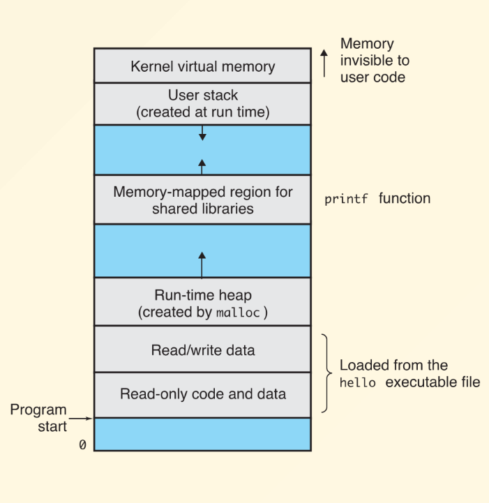

# C++中的内存

!!! info "引入 from PPT"
    ```cpp
    int i; // global vars.
    static int j; // static global vars.
    void f()
    {
    int k; // local vars. 
    static int l; // static local vars.
    int *p = malloc(sizeof(int)); // allocated vars.
    }
    ```
上面展示了C++中的不同变量类型。它们的内存分配和生命周期各不相同。

## Memory Overview

<div align="center">
    
</div>

我们重点关注下面这三个部分:

- **Stack**:存放局部变量(Local Variables)和函数调用信息(Function Call Information)。

- **Heap**:存放动态分配的内存(Dynamically Allocated Memory)。

- **Code/Data**:存放全局变量(Global Variables)和静态变量(Static Variables)。

## Global Variables

全局变量指的是在函数外部定义的变量。它们在整个程序中都是可见的，并且在程序运行期间一直存在。全局变量的生命周期从程序开始到结束。

### extern

`extern`关键字用于声明一个全局变量或函数在其他文件中定义。它告诉编译器该变量或函数在其他地方定义，而不是在当前文件中。

对于下面的代码:

```cpp title="File1.cpp"

#include<cstdlib>
#include<iostream>
using namespace std;

extern int globalx = 10;
double pi();

int main(){
    cout << "globalx = " << globalx << endl;
    cout << "pi = " << pi() << endl;
    return 0;
}
```

如果我们直接编译上述文件,会出现如下报错:

```bash
File1.cpp:5:6: error: 'globalx' initialized and declared 'extern'
    5 | extern int globalx = 10;
      |            ^~~~~~~
```

为了解决这个错误,我们需要再编写一个文件,比如`File2.cpp`,并在其中定义`globalx`:

```cpp title="File2.cpp"
int globalx = 10;

double pi(){
    return 3.14;
}
```
然后我们可以编译这两个文件:

```bash
g++ File1.cpp File2.cpp -o main
```

这样就可以成功编译并运行了.

!!! info "总结"
    在C++中,如果一个变量在一个文件中被声明为`extern`，那么它必须在另一个文件中被定义。否则编译器会报错。

    另外,C++中的函数是默认`extern`的,所以我们不需要在函数前面加上`extern`关键字。

---

## Static Variables

静态变量使用`static`关键字声明。它们的生命周期从程序开始到结束，但它们的作用域仅限于声明它们的函数或文件。静态变量在内存中只分配一次，并且在函数调用之间保持其值。

静态变量可以分为两种类型:

- **Static Local Variables**:在函数内部声明的静态变量。它们的作用域仅限于函数内部，但它们的生命周期从程序开始到结束。

- **Static Global Variables**:在文件内部声明的静态变量。它们的作用域仅限于文件内部，但它们的生命周期从程序开始到结束。

其他大概和程算中学的差不多,只会初始化一次的特点也很好用.

---

## Pointers to objects

<strike>指针又来了</strike>

程算中已经学过了,基础的就不讲了.

### Reference and Pointer

引用(Reference)是C++中的新特性

```cpp
char c; // a character
char* p = &c; // a pointer to a character
char& r = c; // a reference to a character
```

对于语句`type& y=x;`,这里的y相当于是x的一个别名而非实际变量,任何对于y的修改都会反映到x上.

同时也因为y并非一个实际变量,以下行为都是违法的:

- 创建一个引用的引用

- 创建一个指向引用的指针

- 创建一个数组的引用

但创建一个指针的引用是合法的.

下面一块不想写了,抄了bruce的ww

!!! example "From Bruce"
    === "In Definition"
	
		```c++
		int x = 3;
		int& y = x;
		const int& z = x;
		```

        在这种情况下,引用必须在创建时就初始化.
	
	=== "As a Function Argument"
	
	
		```c++
		void f(int& x)
		f(y) // Initialized when function is called
		```
		
		只有在函数被调用的时候 y 才会被“绑定”到 x 上
		
		- 需要注意的是，这里的函数调用是不能传递表达式的，例如 `f(y * 3)` 是不行的，因为 `y * 3` 是一个临时变量，无法被引用

		- 从术语上来说，需要传递的是一个左值（L-value，可以简单理解为在赋值操作中可以放在等号左边的值），而 `y * 3` 是一个右值（R-value）

        !!! tip "C++11小趣事"
            C++11 之后，允许传递右值引用（R-value Reference），可以传递临时变量，但需要使用 `&&` 来声明，例如 `void f(int&& x)`，这在函数重载和移动语义中非常有用.

!!! note "指针与引用的对比"

    | 特性 | 指针 | 引用 |
    |------|------|------|
    | 与绑定对象的关系 | 独立于绑定对象，可以指向不同对象 | 依赖于绑定对象，仅是别名 |
    | 初始化要求 | 可以不初始化 | 必须在创建时初始化 |
    | 重新绑定 | 可以绑定到不同对象 | 不能重新绑定到其他对象 |
    | 空值 | 可以设置为空（null） | 不能为空 |
    | 操作方式 | 需要使用解引用操作符（*） | 直接使用，无需特殊操作符 |
    | 多级间接引用 | 可以有指向指针的指针 | 不能有引用的引用 |
    | 与数组的关系 | 可以指向数组或数组元素 | 不能创建数组的引用 |


---

## Dynamic Memory Allocation

与C语言中的`malloc`不一样,`new`非常简单好用.

```cpp title="例子"
int *p = new int;
int *a = new int[10];
Student *q = new Student();Student *r = new Student[10];
delete p;
delete[] a;
delete q;
delete r;
delete[] r;
```

!!! tips "注意项"
    1. 数组使用`new type[n]`分配内存,同时必须使用`delete []`来释放内存

    2. `new`,`delete`相比于`malloc`,`free`的优点在于,它们不仅仅是单纯地申请内存和释放内存,实际上,它们调用了对应变量类型的构造与析构函数,从而表现出更多的特性

    3. 不要**混用**`new`,`malloc`,`free`,`delete`,其实我觉得也可以说,在C++中不要用`malloc`,`free`

    4. 不要对一个地址`delete`两次

    5. `delete`一个空指针是合法的,什么也不会发生


??? info "关于delete[],编译器如何得知数组的长度呢"

    1. 编译器在分配内存时会在数组前面(一般是4个字节)存储数组的长度信息,比如`int *a = new int[10]`,编译器会在`a-4`的位置存储`10`这个值

    2. `delete`时,编译器会读取这个信息,并调用对应的析构函数

    3. 这也是为什么不能对一个指针`delete`两次的原因,因为编译器会尝试读取这个信息,但实际上已经被释放了


---

## Const

我们使用`const`关键字来声明一个常量,它的值在程序运行期间不能被修改.

```cpp
const int x = 10; // x is a constant
x++; // error: x is a constant
```

常量有如下特点:

1. 常量必须在声明时初始化,除非是`extern`申明.

2. 常量的值不能被修改,否则编译器会报错

3. 常量默认为`internal linkage`,也就是只能在当前文件中使用,如果想要在其他文件中使用,需要加上`extern`关键字

### Run-time constant

```cpp
const int class_size = 12;int finalGrade[class_size]; // ok
int x;
cin >> x;
const int size = x;
double classAverage[size]; // error
```

这里最后会出现error,因为size虽然是`const`,但是它的值在编译时并不确定,而编译器要求数组在编译时就确定大小(和C语言不一样).

### Pointers with Const

```cpp title="What are these"
string s( "Fred" );
const string* p = &s;
string const* p = &s;
string *const p = &s;
```

在上面的程序中,出现了三种const与指针的搭配方式,它们有什么区别呢?

1. `const string* p = &s;` 和 `string const* p = &s;` 是一样的,它们表示指针p指向一个常量字符串,也就是不能通过p来修改s的值.

2. `string *const p = &s;` 表示指针p是一个常量指针,也就是不能修改p指向的地址,但是可以修改*p指向的值.

3. 总结:`const`在*前面表示指针指向的值是常量,而在*后面表示指针本身是常量.

!!! example "示例"
    ```cpp
    int i;
    const int ci = 3;
    int* ip;
    const int* cip;
    ip = &i;
    ip = &ci; // Error
    cip = &i;
    cip = &ci;
    *ip = 54; // always legal
    *cip = 54; // never legal
    ```

这意味着const变量的指针也需要使用`const`关键字来声明,否则会报错.

编译器允许把非const变量当作const变量来使用,但是不允许把const变量当作非const变量来使用.
这也是为什么`const int* p = &s;`是合法的,而`int* p = &ci;`是非法的原因.

!!! info "char *a与char a[]"
    在C语言中,这两个的区别都能出考点的了.

    对于下面这段程序:

    ```cpp
    char a[] = "hello";
    char *p = "hello";
    ```
    
    1. `char a[] = "hello";`表示创建一个字符数组a,并将"hello"这个字符串复制到a中,所以a是一个可修改的字符数组.

    2. `char *p = "hello";`表示创建一个指针p,并将"hello"这个字符串的地址赋值给p,实际上,`char*p`相当于`const char* p`,其值无法修改.

    3. 在C++中,我们可以统统不管,使用`std::string`来处理字符串,它会自动处理内存分配和释放,并且提供了很多方便的函数来操作字符串.

最后是一些小众的例子:

```cpp
void f1 (const int i) {
 i++; // illegal: compile-time error
}
```

```cpp
int f3() { return 1; }
const int f4() { return 1; }
int main() {
 const int j = f3(); // works fine int k = f4(); // this works fine too
}
```
