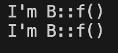
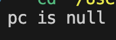
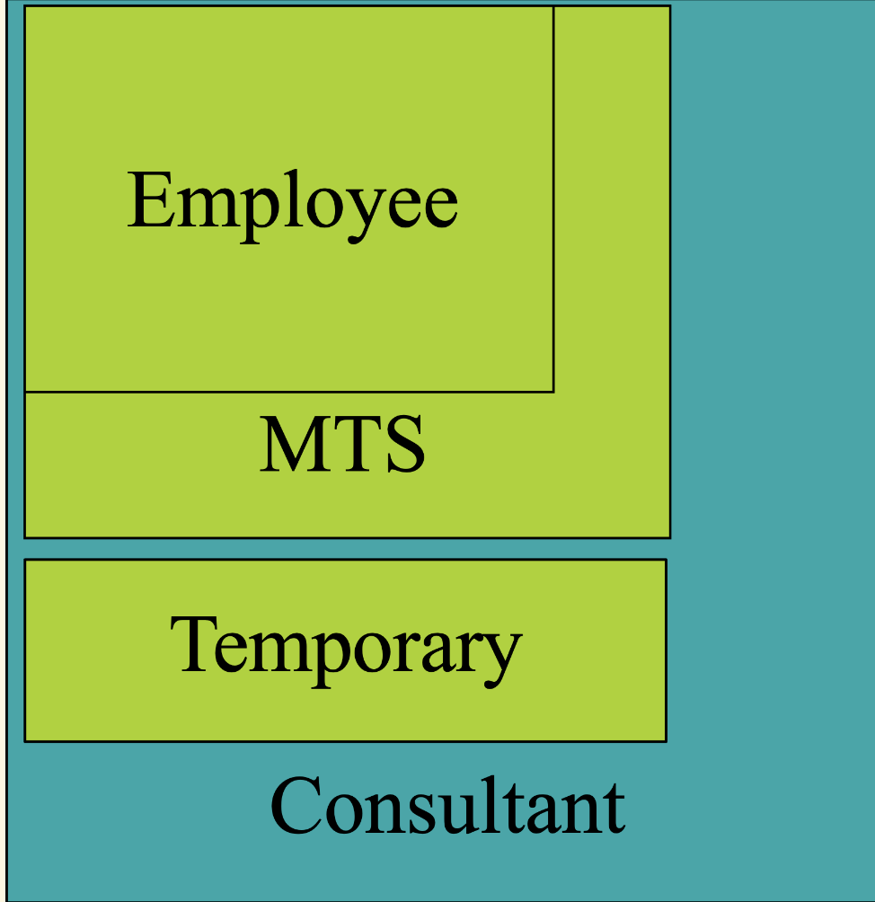
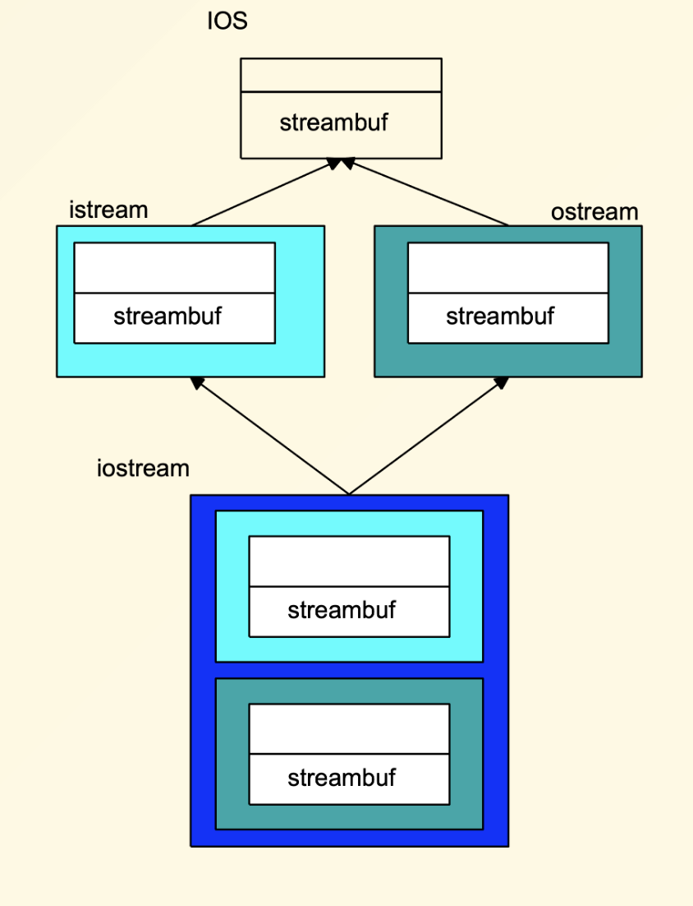
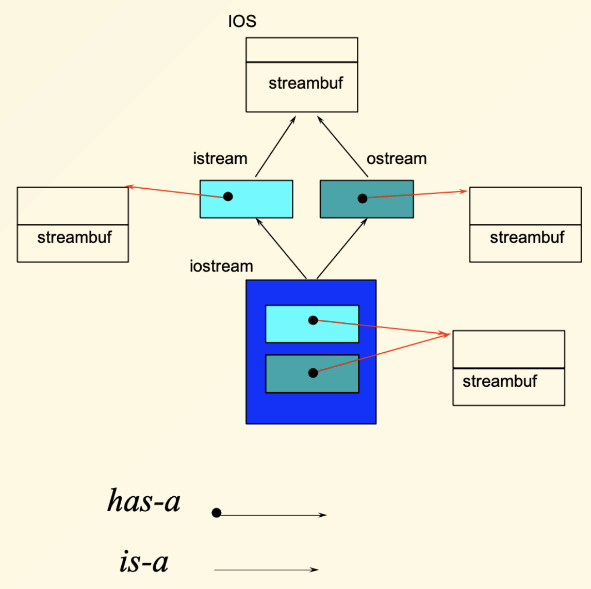

# 杂项

## Named casts

C语言中的类型转换是危险的,因为它们可能会导致未定义的行为。C++引入了命名转换,使得类型转换更安全。
C++提供了四种命名转换:

### static_cast

`static_cast`是最常用的转换操作符，用于基本类型之间的转换以及有继承关系的类之间的转换。

**特点：**

- 编译时检查

- 不执行运行时类型检查

**使用场景：**

- 基本数据类型之间的转换

- 派生类指针/引用转换为基类指针/引用（向上转型）

- 基类指针/引用转换为派生类指针/引用（向下转型，但不安全）

- void指针与其他指针类型之间的转换

```cpp title="sample"
// 基本类型转换
int i = 10;
double d = static_cast<double>(i);

// 类之间的转换
class Base {};
class Derived : public Base {};

Derived* derived = new Derived();

Base* base = static_cast<Base*>(derived);  // 向上转型，安全

Derived* derived2 = static_cast<Derived*>(base);  // 向下转型，需小心
```

### dynamic_cast

`dynamic_cast`专门用于处理多态类型的转换，提供运行时类型安全检查。

**特点：**

- 运行时类型检查

- 只能用于包含虚函数的多态类(至少有一个虚函数)

- 转换失败时返回nullptr（指针）或抛出bad_cast异常（引用）

**使用场景：**

- 安全的向下转型（基类到派生类）

- 运行时类型识别

**示例：**
```cpp title="sample"
class Base {
public:
    virtual ~Base() {}  // 需要虚函数才能使用dynamic_cast
};

class Derived : public Base {
public:
    void derivedMethod() {}
};

Base* base = new Derived();
Derived* derived = dynamic_cast<Derived*>(base);
if (derived != nullptr) {
    derived->derivedMethod();  // 安全调用
}
```

??? example "🌰"
    我们现在有这三个类:
    ```cpp
    struct A {  
    virtual void f() {}  
    };  

    struct B : public A {
        void f() override{
            cout<<"I'm B::f()"<<endl;
        }
    };  

    struct C : public A {
        void f() override{
            cout<<"I'm C::f()"<<endl;
        }
    };  
    ```

    来看看不同的cast的影响.

    === "static_cast"
        ```cpp title="sample"
        int main()  {  
        A *pa = new B; 
        
        C *pc = static_cast<C*>(pa); 
        
        try{
            pa->f(); 
            pc->f();
        } catch (const std::bad_cast& e) {
            cout << "Caught bad_cast: " << e.what() << endl;
        } catch (...) {
            cout << "Caught an unexpected exception." << endl;
        }
        }
        ```

         <div align="center">
        
        </div>

    === "dynamic_cast"
        ```cpp title="sample"
        int main()  {  
        A *pa = new B; 
        
        C *pc = dynamic_cast<C*>(pa); 
        
        if(!pc)
            cout<<"pc is null"<<endl;
        else{
            cout<<"pc is not null"<<endl;
            pc->f();
        }
        
        }
        ```

         <div align="center">
        
        </div>

        这里`dynamic_cast`检测到虚函数表中的类型是`B`,与期望的`C`不符,因此返回了`nullptr`,而`static_cast`则没有进行任何检查,直接将指针转换为`C*`。

    === "如果没有虚函数呢"
        如果没有虚函数,那么`dynamic_cast`就无法工作了,因为它需要虚函数表来进行类型检查。

        ```cpp title="sample"
        struct A {}; 

        struct B : public A {};
        
        int main() {
            A* a = new B();
            B* b = dynamic_cast<B*>(a); 
        }
        ```

        事实上,这个错误甚至在编译前就能被发现:

        <div align="center">
        
        </div>

### const_cast

`const_cast`用于添加或移除变量的const、volatile修饰符。

**特点：**

- 只能改变对象的const或volatile属性

- 不能改变对象的类型

- 移除const后修改原本为const的对象会导致未定义行为

```cpp title="sample"
// 移除const修饰符
const int ci = 10;
int* pi = const_cast<int*>(&ci);  // 移除const，但修改ci是未定义行为

// 常见用法：函数重载中避免重复代码
class MyClass {
    char* data;
public:
    const char* getData() const {
        // 复杂的逻辑...
        return data;
    }
    
    char* getData() {
        return const_cast<char*>(
            static_cast<const MyClass*>(this)->getData()
        );
    }
};
```

### reinterpret_cast

`reinterpret_cast`提供最底层的类型转换，几乎可以在任意类型之间转换。

**特点：**

- 不进行任何类型检查

- 最不安全的转换方式

```cpp title="sample"
// 指针与整数之间转换
int* ptr = new int(42);
uintptr_t addr = reinterpret_cast<uintptr_t>(ptr);
int* ptr2 = reinterpret_cast<int*>(addr);

// 不相关类型间的转换
char arr[4] = {1, 2, 3, 4};
int* intPtr = reinterpret_cast<int*>(arr);  // 将char数组当作int处理

// 函数指针转换
void func1() {}
void (*func2)() = reinterpret_cast<void(*)()>(func1);
```

---

总的来说

| 转换类型 | 安全性 | 检查时机 | 主要用途 |
|---------|--------|----------|----------|
| static_cast | 中等 | 编译时 | 基本类型转换、继承体系内转换 |
| dynamic_cast | 高 | 运行时 | 多态类型的安全向下转型 |
| const_cast | 低 | 编译时 | 修改const/volatile属性 |
| reinterpret_cast | 最低 | 无 | 底层位模式重解释 |

主要用的就是`static_cast`和`dynamic_cast`，前者用于基本类型和继承体系内的转换，后者用于多态类型的安全转换。`const_cast`和`reinterpret_cast`则用于特定场景下的类型修改和底层操作，但需要谨慎使用以避免未定义行为。

---

## 多继承

一个类可以继承多个基类，这称为多继承。

```cpp
class Employee {  
    protected:  String name;  EmpID id;  
};  

class MTS : public Employee {  
    protected:  Degrees degree_info;  
};  

class Temporary {  
    protected:  Company employer; 
};

class Consultant:  public MTS,  public Temporary {  /* ... */  };
```

它们的关系是:

<div align="center">

</div>

---

多继承可能也会导致问题

<div align="center">

</div>

当出现这样的菱形结构时,可能会造成混淆:

```cpp
struct B1 { int m_i; };  
struct D1 : public B1 {};  
struct D2 : public B1 {};  
struct M : public D1, public D2 {};  

int main() { 
    M m; // OK  
    B1* p = &m; // ERROR: which B1???  
    B1* p1 = static_cast<D1*>(&m); // OK  
    B1* p2 = static_cast<D2*>(&m); // OK  
}

这里,`M`类继承了两个`B1`的实例，一个通过`D1`，一个通过`D2`。因此，指向`B1`的指针无法确定是指向哪个基类的实例。

类似的,如果我们使用`m.mi`，编译器也会报错，因为它不知道是访问`D1`的`m_i`还是`D2`的`m_i`。


所以一般来说,多继承大多在接口类中实现

!!! definition "接口类"
    接口类是一个只包含纯虚函数的类，通常用于定义一组行为规范，而不提供具体实现。它们可以被多个类继承，实现多态。

    比如
    ```cpp
    class IShape {
    public:
        virtual void draw() = 0;  // 纯虚函数
        virtual double area() = 0;  // 纯虚函数
    };
    ```

---

那么如果不是接口类,并且需要多继承呢?C++引入了虚继承

```cpp
struct B1 { int m_i; };
struct D1 : virtual public B1 {};
struct D2 : virtual public B1 {};
struct M : public D1, public D2 {};
int main() {
    M m; // OK
    B1* p = &m; // OK: now it knows which B1
    m.m_i = 10; // OK: now it knows which m_i
}
```

这样,`M`类只会有一个`B1`的实例,因此指向`B1`的指针可以正确地指向它。

<div align="center">

</div>

---

使用多继承最好的方法:<strike>不用</strike>

## Namespace

如果在两个不同的头文件中,存在一些同名函数,那么我们如果想同时使用这两个头文件里的同名函数,就会发生问题.

为了解决这个问题,C++引入了命名空间的概念。

命名空间是一个封装标识符的作用域,可以避免名称冲突。

```cpp
namespace F1 {
    void f() {};
}//结尾不用加分号,和class不一样

namespace F2 {
    void f() {};
}
```

---

在一个命名空间中实际上可以定义类、函数、变量等。

```cpp
namespace MyNamespace {
    class MyClass {
    public:
        void myMethod() {}
    };

    int myVariable = 42;

    void myFunction() {}
}
```

使用命名空间中的成员时，可以使用作用域解析运算符`::`来访问。

```cpp
MyNamespace::MyClass obj;
obj.myMethod();
int value = MyNamespace::myVariable;
MyNamespace::myFunction();
```

!!! tip "using namespace"
    如果你经常使用某个命名空间中的成员，可以使用`using`声明来简化代码。

    ```cpp
    using namespace MyNamespace;

    MyClass obj;  
    myFunction(); 
    ```

    当然,我们也可以不`using`整个命名空间,而是仅包括其中的某些函数

    ```cpp
    using MyNamespace::myFunction;  // 只引入myFunction
    myFunction();  // 可以直接使用
    ```

### Namespace alias

有时候命名空间的名称可能很长或者不方便使用，可以为命名空间创建别名。

```cpp
namespace LongNamespaceName {
    void myFunction() {}
}
namespace LNN = LongNamespaceName;  // 创建别名
LNN::myFunction();  // 使用别名调用函数
```

### Namespace composition

命名空间可以嵌套，也可以组合。

```cpp title="嵌套"
namespace Outer {
    namespace Inner {
        void innerFunction() {}
    }
}
Outer::Inner::innerFunction();  // 调用嵌套命名空间中的函数
```

```cpp title="组合"
namespace first {  void x();  void y();  }  
namespace second {  void y();  void z();  }
namespace mine {  
    using namespace first;  
    using namespace second;  
    using first::y; // resolve clashes  
    
    void mystuff();  /* ... */  }  
    
    int main() {  
        mine::x();  
        mine::y(); // call first::y()  
        mine::mystuff(); 
}
```

### Namespace are open

一个命名空间可以在多个文件中定义，C++允许在不同的文件中继续添加到同一个命名空间。

我们经常使用的`std`命名空间就是一个例子。

它在`<iostream>`、`<vector>`、`<string>`等多个头文件中定义。

