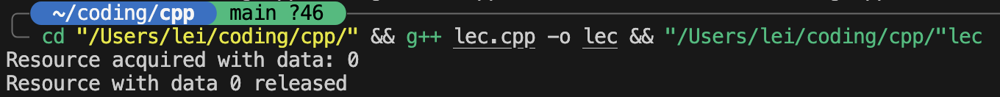
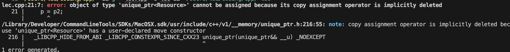
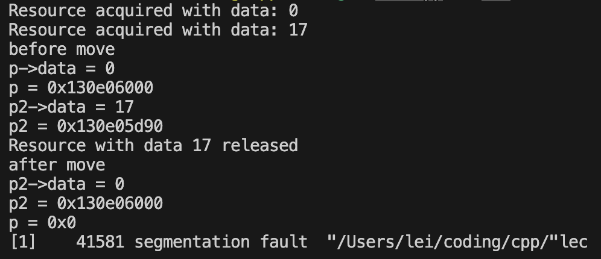
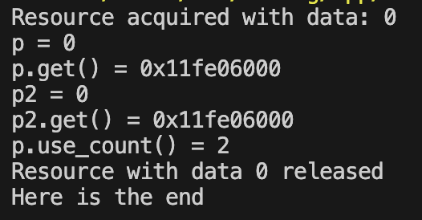
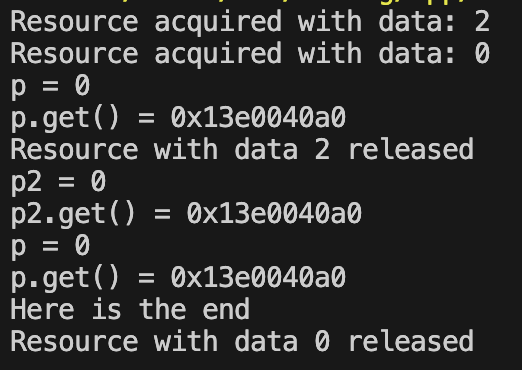

# 智能指针

!!! tip "为什么我们需要智能指针"
    智能指针是对普通指针的封装，主要解决了C++中原始指针使用过程中的以下几个主要问题：

    1. **内存泄漏问题**：在使用原始指针时，如果忘记调用`delete`来释放内存，就会导致内存泄漏。智能指针通过RAII（资源获取即初始化）机制，在对象离开作用域时自动释放内存，避免了这个问题。

    2. **异常安全**：当函数发生异常时，堆上分配的内存可能无法正确释放。智能指针能确保即使在异常发生时，内存也能被正确释放。

    3. **所有权管理复杂**：在大型程序中，很难跟踪谁拥有某个指针，谁负责删除它。智能指针通过不同的模型（如独占所有权、共享所有权等）清晰地表达了资源的所有权意图。

    4. **悬挂指针问题**：使用普通指针时，一个指针可能指向已经被释放的内存（悬挂指针），而智能指针可以避免这种情况。

    5. **代码简化**：智能指针减少了手动内存管理的代码量，让开发者可以专注于业务逻辑而不是内存管理细节。

使用`#include <memory>`头文件来使用智能指针。

智能指针有:

1. **`std::unique_ptr`**：独占所有权的智能指针，不能被复制，只能被移动。适用于一个对象只有一个所有者的场景。    

2. **`std::shared_ptr`**：共享所有权的智能指针，可以被多个指针共享。适用于多个对象需要共享同一个资源的场景。它使用引用计数来管理资源的生命周期，当最后一个指向该资源的`shared_ptr`被销毁时，资源才会被释放。

3. **`std::weak_ptr`**：弱引用智能指针，不能单独拥有资源，只能与`shared_ptr`一起使用。它用于解决循环引用的问题。`weak_ptr`不会增加引用计数，因此不会阻止资源的释放。


## `std::unique_ptr`

```cpp title="sample"
#include<iostream>
#include<memory>

using namespace std;

struct Resource{
    int data;
    Resource(int d=0) : data(d) {
        cout << "Resource acquired with data: " << data << endl;
    }
    ~ Resource() {
        cout << "Resource with data " << data << " released" << endl;
    }
};

int main(){
    unique_ptr<Resource> p(new Resource);
}
```

运行结果为:

<div align="center">
    
</div>


这样,说明指针`p`在结束时自动释放了资源,尽管我们没有手动调用`delete`。这就是RAII的好处。

### 使用`unique_ptr`

1. `unique_ptr`可以像正常指针一样解引用:
    ```cpp
    cout << "p->data = "<<p->data << endl;
    ```

2. `unique_ptr`不能被复制:
    ```cpp
    unique_ptr<Resource> p2(new Resource(17));
    p = p2;
    ```

    <div align="center">
        
    </div>

    - 如果能赋值的话,那么`p`和`p2`都管理同一块内存,这不仅违背了`unique_ptr`的设计初衷,而且会导致内存泄漏,因为当`p`和`p2`都被销毁时,它们会尝试释放同一块内存.

3. 可以使用`std::move`来转移所有权:
    ```cpp
    int main(){
    unique_ptr<Resource> p(new Resource);
    unique_ptr<Resource> p2(new Resource(17));
    cout << "before move" << endl;
    cout << "p->data = "<<p->data << endl;
    cout << "p = "<<p.get() << endl;

    cout << "p2->data = "<<p2->data << endl;
    cout << "p2 = "<<p2.get() << endl;

    p2 = std::move(p);

    cout<<"after move" << endl;

    cout << "p2->data = "<<p2->data << endl;
    cout << "p2 = "<<p2.get() << endl;
    
    cout << "p = "<<p.get() << endl;
    try {
    cout << "p->data = "<<p->data << endl;
    }

    catch (const std::exception& e) {
        cout << "Exception: " << e.what() << endl;
    }
    }
    ```
    - `std::move`将`p`的所有权转移给`p2`,此时`p`变为`nullptr`,而`p2`拥有资源的所有权.

    - 所以这里会报一个段错误,因为`p`已经不再拥有资源的所有权,它指向的内存已经被释放了.

    - 并且,在`move`都同时,`p2`原来的资源会调用析构函数

    <div align="center">
        
    </div>


### 实现`unique_ptr`

1. 定义基本的资源和函数
    ```cpp
    template<typename T>
    class u_ptr{
    private:
        T* ptr;
    public:
        explicit u_ptr(T* p = nullptr) : ptr(p) {}

        ~u_ptr() {
            delete ptr;
        }
    };
    ```

2. 定义指针需要的解引用等操作函数
    ```cpp
            T* operator*() {
        return ptr;
    }

    T* operator->() {
        return ptr;
    }

    T* get() const{
        return ptr;
    }

    T* release() {
        T* temp = ptr;
        ptr = nullptr;
        return temp;
    }

    void reset(T* p = nullptr) {
        delete ptr;
        ptr = p;
    }
    ```

3. 禁用复制构造函数和赋值运算符
    ```cpp
    u_ptr(const u_ptr&) = delete;
    u_ptr& operator=(const u_ptr&) = delete;
    ```

4. 定义移动构造函数和赋值运算符(`&&`表示右值引用)
    ```cpp
    u_ptr(u_ptr&& other) noexcept : ptr(other.release()) {}
    
    u_ptr& operator=(u_ptr&& other) noexcept {
        if (this != &other) {
            reset(other.release());
        }
        return *this;
    }
    ```

5. 完整代码
    ```cpp
    #include<iostream>
    #include<memory>

    using namespace std;

    struct Resource{
        int data;
        Resource(int d=0) : data(d) {
            cout << "Resource acquired with data: " << data << endl;
        }
        ~ Resource() {
            cout << "Resource with data " << data << " released" << endl;
        }
    };


    template<typename T>
    class u_ptr{
    private:
        T* ptr;
    public:
        explicit u_ptr(T* p = nullptr) : ptr(p) {}

        ~u_ptr() {
            delete ptr;
        }

        T* operator*() {
            return ptr;
        }

        T* operator->() {
            return ptr;
        }

        T* get() const{
            return ptr;
        }

        T* release() {
            T* temp = ptr;
            ptr = nullptr;
            return temp;
        }

        void reset(T* p = nullptr) {
            delete ptr;
            ptr = p;
        }
        
        u_ptr(const u_ptr&) = delete;
        
        u_ptr& operator=(const u_ptr&) = delete;

        u_ptr(u_ptr&& other) noexcept : ptr(other.release()) {}
        
        u_ptr& operator=(u_ptr&& other) noexcept {
            if (this != &other) {
                reset(other.release());
            }
            return *this;
        }
        };

    int main(){
        u_ptr<Resource> p(new Resource);
        u_ptr<Resource> p2(new Resource(17));
        cout << "before move" << endl;
        cout << "p->data = "<<p->data << endl;
        cout << "p = "<<p.get() << endl;

        cout << "p2->data = "<<p2->data << endl;
        cout << "p2 = "<<p2.get() << endl;

        p2 = std::move(p);

        cout<<"after move" << endl;

        cout << "p2->data = "<<p2->data << endl;
        cout << "p2 = "<<p2.get() << endl;
        
        cout << "p = "<<p.get() << endl;
    }
    ```

---

> 也可以为一个数组实现`unique_ptr`,使用`std::unique_ptr<T[]>`来管理动态数组的内存,这样可以避免手动调用`delete[]`来释放内存.

```cpp
#include <iostream>
#include <memory>
using namespace std;
int main() {
    // 创建一个动态数组
    unique_ptr<int[]> arr(new int[5]);

    // 初始化数组
    for (int i = 0; i < 5; ++i) {
        arr[i] = i * 10;
    }

    // 输出数组元素
    for (int i = 0; i < 5; ++i) {
        cout << arr[i] << " ";
    }
    cout << endl;

    // 不需要手动释放内存，arr会在离开作用域时自动释放
}
```


## `std::shared_ptr`

```cpp title="sample"
int main(){
    {
    shared_ptr<Resource> p(new Resource);

    cout << "p = " << p->data << endl;
    cout << "p.get() = " << p.get() << endl;

    shared_ptr<Resource> p2(p);

    cout << "p2 = " << p2->data << endl;
    cout << "p2.get() = " << p2.get() << endl;
    
    cout << "p.use_count() = " << p.use_count() << endl;
    }
    cout<<"Here is the end"<<endl;
}
```

这里,`p`和`p2`都指向同一块内存,并且引用计数为2,当`p`和`p2`都被销毁时,资源才会被释放.

<div align="center">
    
</div>

那么,对于共享指针,如果有两个指针管理同一片内存,并且有一个指针废弃的时候,发生了什么?

```cpp
int main(){
    shared_ptr<Resource> p2(new Resource(2));
    {
    shared_ptr<Resource> p(new Resource);

    cout << "p = " << p->data << endl;
    cout << "p.get() = " << p.get() << endl;

    p2 = p;

    cout << "p2 = " << p2->data << endl;
    cout << "p2.get() = " << p2.get() << endl;
    cout <<"p = " << p->data << endl;
    cout << "p.get() = " << p.get() << endl;
    }

    cout <<"Here is the end"<<endl;
}
```

可以看到:

<div align="center">
    
</div>

这里和上面有什么区别呢?

可以发现,资源析构的地方不同.第一段代码资源在`cout<<"Here is the end"<<endl;`前析构,而第二段代码则在`cout<<"Here is the end"<<endl;`后析构.

这是因为:

- `{}`可以标定变量的作用域,当`p`离开作用域时,它会自动释放资源,并且引用计数会减1.

- 第二段代码中,`p2`的作用域在`{}`外,所以当`p`离开作用域时,`p2`仍然指向同一块内存,并且引用计数会减1,但是资源不会被释放.

- 所以只有当函数结束,`p2`的引用计数为0时,资源才会被释放.

所以,`shared_ptr`的析构发生在引用计数为0时,而不是在某个指针离开作用域时.

### 实现`shared_ptr`

1. 定义基本的资源和函数
    ```cpp
    template<typename T>
    class s_ptr{
    private:
        struct Control_block{
            int ref_count;
            T* p;
            Control_block(T* p) : ref_count(1), p(p) {}
            ~Control_block() {
                delete p;
            }
        };

        Control_block* cb;
        void add_shared(){
            if(cb){
                ++cb->ref_count;
            }
        }

        void release(){
            if(cb){
                --cb->ref_count;
                if(cb->ref_count == 0){
                    delete cb;
                }
            }
        }
    public:

        explicit s_ptr(T* p = nullptr) : cb(p ? new Control_block(p) : nullptr) {}

        ~s_ptr(){
            release();
        }

    };
    ```

2. 实现拷贝复制等操作,因为这是允许的
    ```cpp
    s_ptr(const s_ptr& other) : cb(other.cb) {
        add_shared();
    }

    s_ptr& operator=(const s_ptr& other){
        if(this != &other){
            release();
            cb = other.cb;
            add_shared();
        }
        return *this;
    }
    ```

3. 实现解引用等
    ```cpp
    T& operator*() const {
        return *(cb->p);
    }

    T* operator->() const {
        return cb->p;
    }

    T* get() const {
        return cb ? cb->p : nullptr;
    }
    ```

4. 还有`swap`函数,可以交换两个`shared_ptr`的资源
    ```cpp
    void swap(s_ptr& other) {
        std::swap(cb, other.cb);
    }
    ```