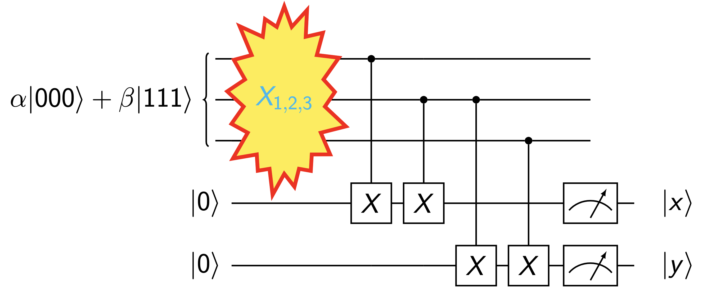
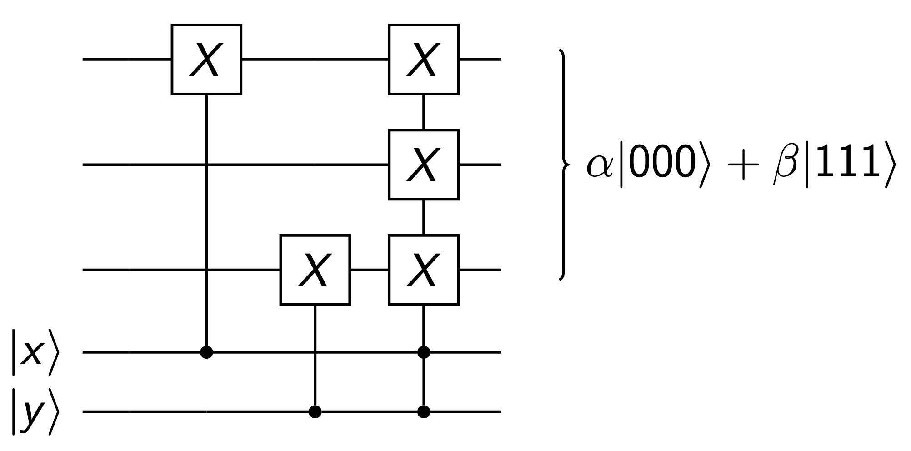
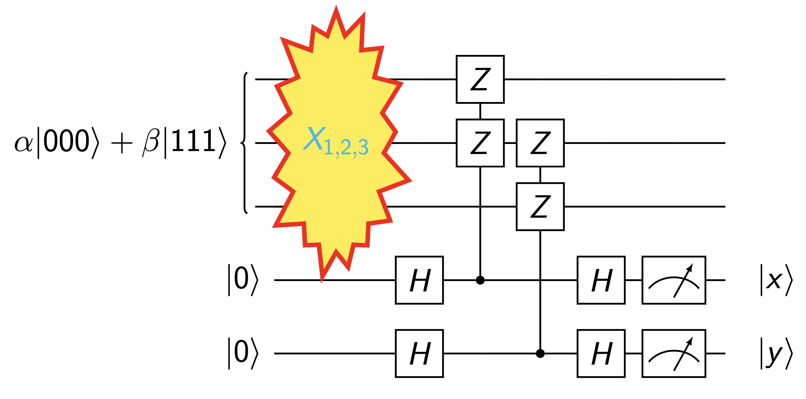

# Principles of Quantum Error Correction

量子的性质决定了,如果我们想对量子比特进行纠错或者检错,我们不能直接知道量子比特的状态.而是需要借助辅助qubit.

## Representation of Quantum Errors

我们可以把环境与系统的演化抽象为两个简单的过程

$$
\begin{aligned}
&|e_0\rangle|0\rangle \rightarrow |e_1\rangle|0\rangle + |e_2\rangle|1\rangle\\ 
&|e_0\rangle|1\rangle \rightarrow |e_3\rangle|0\rangle + |e_4\rangle|1\rangle
\end{aligned}
$$

我们再简化一步,认为环境和系统是弱耦合的,这意味着:

$$
\sqrt{|\langle e_0|e_1\rangle|^2} \approx \sqrt{|\langle e_0|e_4\rangle|^2} \approx 1,\quad \langle e_2|e_2\rangle, \langle e_3|e_3\rangle \ll 1.
$$

意思就是,弱耦合下,发生错误的概率很低

最后,我们再定义一个统一的投影算符写法:

$$
P_0|\psi\rangle = |0\rangle\langle 0|\psi\rangle, \quad P_1|\psi\rangle = |1\rangle\langle 1|\psi\rangle,
$$

可以统一表示为：

$$
P_\alpha = \frac{I + (-1)^\alpha Z}{2} \qquad (\alpha \in \{0, 1\}).
$$

现在,对于任意的系统状态$|\psi\rangle = \alpha|0\rangle + \beta|1\rangle$，我们都可以写出演化的过程

!!! info

    考虑任意单比特状态 $|\psi\rangle = \alpha|0\rangle + \beta|1\rangle$。
    === "Step 1"
        
        首先写出环境与系统的联合状态演化：
        
        $$
        \begin{aligned}
        |e_0\rangle|\psi\rangle &= \alpha |e_0\rangle|0\rangle + \beta |e_0\rangle|1\rangle \\
        &\rightarrow \alpha \left(|e_1\rangle|0\rangle + |e_2\rangle|1\rangle\right) + \beta \left(|e_3\rangle|0\rangle + |e_4\rangle|1\rangle\right) \\
        &= |e_1\rangle (\alpha|0\rangle) + |e_2\rangle (\alpha|1\rangle) + |e_3\rangle (\beta|0\rangle) + |e_4\rangle (\beta|1\rangle)
        \end{aligned}
        $$
        
        这里我们引入投影算符 $P_0$ 和 $P_1$。注意到：
        
        * $\alpha|0\rangle = P_0|\psi\rangle$
        * $\alpha|1\rangle = X P_0|\psi\rangle$ （因为 $X|0\rangle = |1\rangle$）
        * $\beta|1\rangle = P_1|\psi\rangle$
        * $\beta|0\rangle = X P_1|\psi\rangle$ （因为 $X|1\rangle = |0\rangle$）
        
        约定记号 $|e\rangle O|\psi\rangle \equiv |e\rangle \otimes O|\psi\rangle$，我们可以将上述演化改写为投影算符形式：
        
        $$
        |e_0\rangle|\psi\rangle \rightarrow \left[ |e_1\rangle I + |e_2\rangle X \right] P_0|\psi\rangle + \left[ |e_3\rangle X + |e_4\rangle I \right] P_1|\psi\rangle
        $$

    === "Step 2"
        
        接下来，我们将 $P_0 = \frac{I+Z}{2}$ 和 $P_1 = \frac{I-Z}{2}$ 代入上式中：
        
        $$
        \begin{aligned}
        |e_0\rangle|\psi\rangle &\rightarrow \left[ |e_1\rangle I + |e_2\rangle X \right] \left( \frac{I + Z}{2} \right) |\psi\rangle + \left[ |e_3\rangle X + |e_4\rangle I \right] \left( \frac{I - Z}{2} \right) |\psi\rangle \\
        &= \frac{1}{2} \left[ |e_1\rangle(I + Z) + |e_2\rangle(X + XZ) + |e_3\rangle(X - XZ) + |e_4\rangle(I - Z) \right] |\psi\rangle \\
        &= \left[ \frac{|e_1\rangle + |e_4\rangle}{2} I + \frac{|e_1\rangle - |e_4\rangle}{2} Z + \frac{|e_3\rangle + |e_2\rangle}{2} X + \frac{|e_3\rangle - |e_2\rangle}{2} ZX \right] |\psi\rangle
        \end{aligned}
        $$
        
        !!! note "算符项合并的反对易说明"
            在最后一步中，我们利用了泡利矩阵的反对易性质，即 $XZ = -ZX$，因此可以对交叉项做如下合并与化简：
            
            $$
            \frac{|e_2\rangle(XZ) - |e_3\rangle(XZ)}{2} = \frac{-|e_2\rangle(ZX) + |e_3\rangle(ZX)}{2} = \frac{|e_3\rangle - |e_2\rangle}{2} ZX
            $$

    === "Step 3"
    
        
        由于泡利矩阵满足关系 $ZX = iY$，我们可以将上述演化结果整理为以系统泡利算符 $\{I, X, Y, Z\}$ 的线性组合：
        
        $$
        |e_0\rangle|\psi\rangle \rightarrow \left( |d\rangle I + |a\rangle X + |b\rangle Y + |c\rangle Z \right) |\psi\rangle
        $$
        
        其中环境的状态系数分别定义为：
        
        $$
        \begin{aligned}
        |d\rangle &= \frac{|e_1\rangle + |e_4\rangle}{2} \\
        |a\rangle &= \frac{|e_3\rangle + |e_2\rangle}{2} \\
        |b\rangle &= i\frac{|e_3\rangle - |e_2\rangle}{2} \\
        |c\rangle &= \frac{|e_1\rangle - |e_4\rangle}{2}
        \end{aligned}
        $$
        
        !!! tip "物理含义"
            这说明任何量子误差都可以被分解为**无误差 ($I$)**、**比特翻转误差 ($X$)**、**相位翻转误差 ($Z$)** 以及**比特与相位联合翻转误差 ($Y$)** 的叠加。这也是量子纠错码只需纠正这几种基本的泡利误差的理论依据。

            $X$为比特翻转:$X |0\rangle = |1\rangle , X |1\rangle = |0\rangle$

            $Z$为相位翻转:$Z |0\rangle = |0\rangle , Z |1\rangle = -|1\rangle$

            $Y = iXZ$
            

最后，我们可以把结果拓展到多比特：

$$
|e_0\rangle|\Psi_n\rangle \rightarrow |d\rangle|\Psi_n\rangle + \sum_{i=1}^{n} \left( |a_i\rangle X_i |\Psi_n\rangle + |b_i\rangle Y_i |\Psi_n\rangle + |c_i\rangle Z_i |\Psi_n\rangle \right).
$$

## Error Correction

在后面的所有讨论中,我们都约定:

原始正确的信息编码是${|000\rangle,|111\rangle}$。

考虑一位错误,因此错误的可能就是

$$
{|001\rangle,|010\rangle,|100\rangle,|110\rangle,|101\rangle,|011\rangle,|111\rangle}
$$

对于这样的一位错误,我们可以用如图的电路来检测

    
     
    <caption>检错电路</caption>

我们只要去检测最后的$|x\rangle,|y\rangle$,就能知道情况是如下四种的哪一种:

- No error: $|00\rangle$

- $X_1$: $|10\rangle$

- $X_2$: $|11\rangle$

- $X_3$: $|01\rangle$

另外,我们甚至可以用$|x\rangle,|y\rangle$来实现纠错,电路如图所示:

    
     
    <caption>纠错电路</caption>

## Understanding Error Detection

让我们关注这两个算符:

$$
U_1 = Z_1 Z_2 \hspace{2em} U_2 = Z_2 Z_3
$$

这两个算符具有一个极为重要的特性：它们作用在逻辑量子比特态 $|\psi\rangle \equiv \alpha|000\rangle + \beta|111\rangle$ 上时，能够保持状态完全不变：

$$
U_1 |\psi\rangle = |\psi\rangle, \qquad U_2 |\psi\rangle = |\psi\rangle.
$$

因为它们稳定了该状态，所以被称为该状态的**稳定子（stabilizer）**。

* 换句话说，$U_1$ 和 $U_2$ 稳定了编码空间（codespace）中的所有状态：
  
  $$
  \mathcal{C} = \text{span}\{|000\rangle, |111\rangle\}.
  $$

---

让我们考虑与编码空间正交的子空间：

$$
\mathcal{F} = \text{span}\{|001\rangle, |010\rangle, |100\rangle, |011\rangle, |101\rangle, |110\rangle\}
$$

被称为**非编码空间**（non-coding space），即发生错误后系统所处在的子空间。

要检测是否发生了单比特翻转错误，其本质就是要判断当前系统的状态是处于编码空间 $\mathcal{C}$ 中，还是退化到了非编码空间 $\mathcal{F}$ 中。为此，我们可以使用如下的投影检错电路来实现：

    
     
    <caption>基于辅助比特与控制-U_i 门的投影测量电路</caption>

这电路的本质就是**对易（commuting）与反对易（anti-commuting）关系**。

!!! info "$U_i$与$X_i$的对易/反对易关系"

    当系统在传输或计算中发生了一个误差算符 $X_j$（例如第 $j$ 个比特上发生了比特翻转）时，系统状态会演化为 $X_j|\psi\rangle$。由于稳定子具有性质 $U_i|\psi\rangle = |\psi\rangle$。此时再去对系统测量 $U_i$，其状态的本征值演化表现为：

    === "反对易关系（发生错误）"
        
        若某个稳定子 $U_i$ 与发生的误差算符 $X_j$ **反对易**（即满足 $U_i X_j = -X_j U_i$），那么当我们在误差发生后测量稳定子 $U_i$ 时：
        
        $$
        U_i \left( X_j |\psi\rangle \right) = -X_j U_i |\psi\rangle = -X_j \left( U_i |\psi\rangle \right) = -X_j |\psi\rangle
        $$
        
        这表明受损后的状态 $X_j|\psi\rangle$ 变成了 $U_i$ 的 **$-1$ 本征态**。因此，我们在投影测量 $U_i$ 时，必定会以 $100\%$ 的概率测得本征值 **$-1$**！这也代表我们成功检测到了误差的存在。

    === "对易关系（未受影响）"
        
        若稳定子 $U_i$ 与发生的误差算符 $X_j$ **对易**（即满足 $U_i X_j = X_j U_i$），那么当我们在误差发生后测量 $U_i$ 时：
        
        $$
        U_i \left( X_j |\psi\rangle \right) = X_j U_i |\psi\rangle = X_j |\psi\rangle
        $$
        
        这表明受损状态仍然是 $U_i$ 的 **$+1$ 本征态**。因此，投影测量 $U_i$ 时，测得的本征值依旧为 **$+1$**。

    $U_i$与$x_j$反对易的条件是,它们在奇数个比特位上的算子不同,且都不是单位算符.

    例如$U_1 = Z_1 Z_2 I_3$,它与$X_1 I_2 I_3$反对易.
    