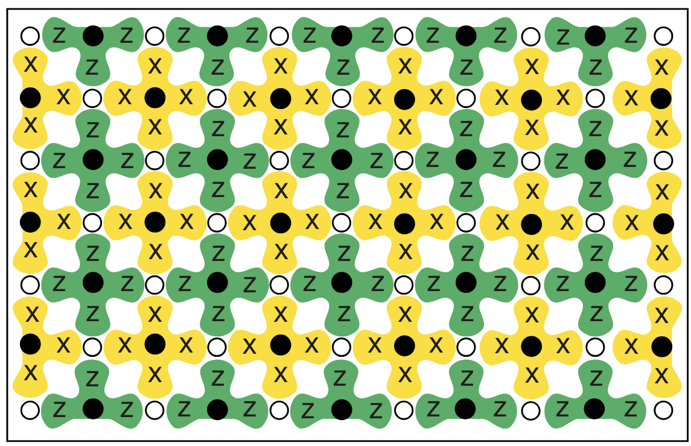
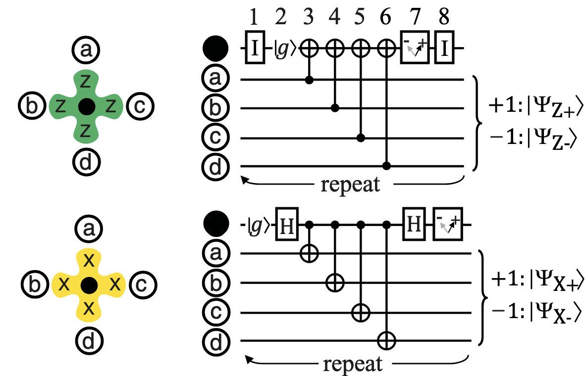

# Fault-Tolerant Quantum Computation

描述一个纠错码的一般记号为 $[n, k, d]$，其中：

- $n$：编码后的总比特数（物理比特数）

- $k$：逻辑比特数（实际承载的信息量）

- $d$：任意两个合法编码（无错误编码）之间的**最小距离**（minimum distance）

!!! info "重复码与纠错能力"

    === "重复码"

        重复码（repetition code）是最简单的纠错码。它将一个逻辑比特重复编码为 $n$ 个物理比特，因此重复码的参数为 $[n, 1, n]$。

        例如三比特重复码 $[3, 1, 3]$：$0 \mapsto 000$，$1 \mapsto 111$。

    === "纠错能力"

        一般来说，一个具有最小距离 $d$ 的码最多可以纠正：

        $$
        t = \left\lfloor \frac{d-1}{2} \right\rfloor
        $$

        个错误。

        例如，对于 $5$ 比特编码（$d = 5$），可以纠正最多 $2$ 个错误，因为剩余的 $3$ 个正确比特仍然占多数（majority）。

## Surface Code

在表面码（Surface Code）中，量子比特排列在一个**二维阵列**上。通过测量稳定子（stabilizer），这些量子比特被纠缠成一个随机选取的静态态（quiescent state）。

    
     
    <caption>表面码二维晶格结构示意图</caption>

在上图中：

- **黑色实心圆（●）**：测量量子比特（ancilla/measurement qubit）。它位于一个 plaquette 的中心，用来读出该稳定子的测量结果。
- **白色空心圆（○）**：数据量子比特（data qubit）。真正编码量子信息的是这些数据量子比特，而不是中心的测量量子比特。
- **绿色花形区域**：$Z$ 稳定子（Z-stabilizer plaquette），中心的测量量子比特与周围四个数据量子比特相互作用，用来测量 $Z_a Z_b Z_c Z_d$。
- **黄色花形区域**：$X$ 稳定子（X-stabilizer plaquette），中心的测量量子比特与周围四个数据量子比特相互作用，用来测量 $X_a X_b X_c X_d$。

表面码具有两族稳定子：

$$
Z_a Z_b Z_c Z_d, \qquad X_a X_b X_c X_d.
$$

其中 $a, b, c, d$ 是围绕同一个测量量子比特（花形中心的黑色实心圆）的四个数据量子比特（外圈的白色空心圆）。

每一个稳定子的测量都需要通过一系列 CNOT 操作，涉及 **4 个数据量子比特**和 **1 个测量量子比特**。

    
     
    <caption>表面码稳定子测量电路</caption>

!!! info "Z 稳定子与 X 稳定子测量"

    === "Z 稳定子测量"

        对于 $Z$ 稳定子 $Z_a Z_b Z_c Z_d$（绿色 plaquette，上方电路），测量流程为：

        1. 辅助量子比特初始化为 $|g\rangle$
        2. 以数据量子比特 $a, b, c, d$ 为**控制位**，以辅助量子比特为**目标位**，依次施加 **CNOT** 门（无需 Hadamard 门）
        3. 最终测量辅助量子比特，重复执行

        测量结果为：

        - $+1$：系统处于 $|\Psi_{Z+}\rangle$（无 $X$ 类错误）
        - $-1$：系统处于 $|\Psi_{Z-}\rangle$（检测到 $X$ 类错误）

    === "X 稳定子测量"

        对于 $X$ 稳定子 $X_a X_b X_c X_d$（黄色 plaquette，下方电路），测量流程为：

        1. 辅助量子比特初始化为 $|g\rangle$
        2. 施加 **Hadamard 门** $H$，将辅助量子比特置于 $|+\rangle$ 态
        3. 以辅助量子比特为**控制位**，依次对数据量子比特 $a, b, c, d$ 施加 **CNOT** 门
        4. 再施加一个 **Hadamard 门** $H$
        5. 最终测量辅助量子比特，重复执行

        测量结果为：

        - $+1$：系统处于 $|\Psi_{X+}\rangle$（无 $Z$ 类错误）
        - $-1$：系统处于 $|\Psi_{X-}\rangle$（**检测到 $Z$（相位翻转）错误**）

因此,对于表面码的检错,我们不是看某一瞬间逻辑比特到底是多少,而是看在一段时间内.逻辑比特有没有发生翻转.

## Particle Statistics and Exchange
