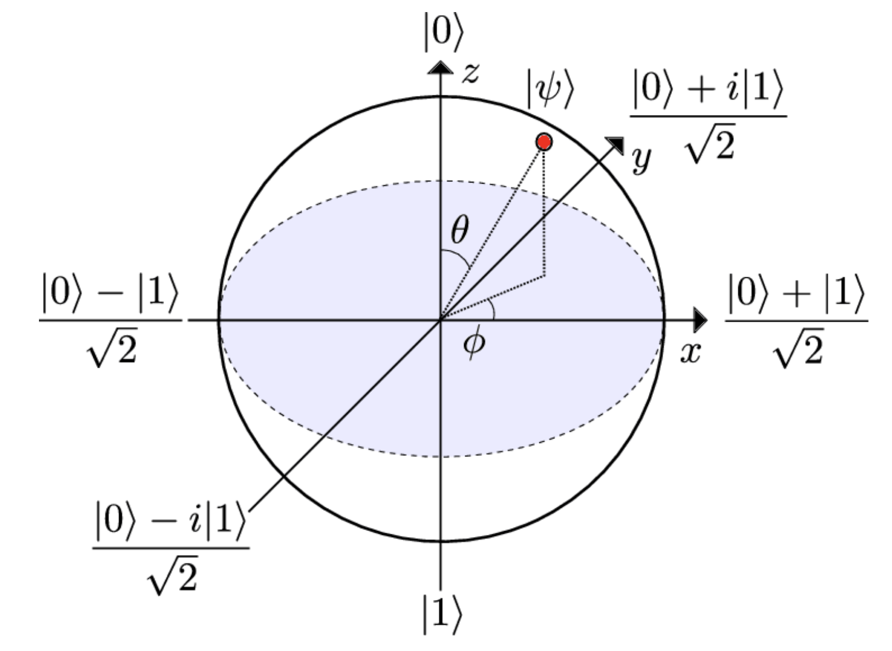

# Spins, Qubits, and Linear Operators for  Measurement

## Stern-Gerlach Experiment

Stern-Gerlach 实验研究的是: 带有磁矩的原子束经过**非均匀磁场**时会如何偏转。

=== "实验装置"

    实验装置可以概括为:

    - 先用 collimator 把银原子束压窄成一束很细的粒子流
    - 再让它穿过一个沿 `z` 方向、且强度随位置变化的非均匀磁场
    - 最后原子打到玻璃探测屏上,观察落点分布

    磁场通常写成

    $$
    \vec{B}(z) = B(z)\hat{z}
    $$

    这里关键不只是有磁场,而是磁场有梯度,因此原子会受到与

    $$
    F_z \propto \frac{dB}{dz}
    $$

    相关的力,从而在 `z` 方向发生偏转。

=== "测量结果"

    如果把自旋想成一个经典小磁针,那原子束经过磁场后,按直觉似乎应该在屏上形成**连续分布**。

    但 Stern 和 Gerlach 实际观察到的是:

    - 打开电磁铁后,银原子束分裂成了两条清晰的分支
    - 屏上只出现两个离散落点区域,而不是一整片连续条纹

    这说明沿 `z` 方向测量时,自旋只给出两个离散结果,通常记作:

    $$
    |+z\rangle,\ |-z\rangle
    $$

    或者对应地理解为“spin up / spin down”。

=== "再次测量"

    如果把第一台仪器后的探测屏拿掉,只保留其中一束,再把它送入第二台**同样沿 `z` 方向**的 Stern-Gerlach 仪器中,结果是:

    - 光束**不会再次分裂**

    - 它只会沿原来的那一支继续前进

    这表示第一次测量之后,粒子已经被制备到了某个确定的 `z` 方向自旋本征态中。对同一方向重复测量,结果是确定的。

    如果把第二台仪器旋转,让磁场梯度改为沿 `x` 方向,情况就不同了:

    - 原来从 `z` 方向筛出来的单束原子,进入第二台后会**再次分裂成两束**
    
    - 且这两束的强度相等

    也就是说,一个确定的 `$|+z\rangle$` 态,在 `x` 方向测量时会得到两个结果,概率各为 `1/2`。

    这可以记成

    $$
    |+z\rangle = \frac{1}{\sqrt{2}}\left(|+x\rangle + |-x\rangle\right)
    $$

    这正是量子态叠加的典型表现。

=== "物理意义"

    如果自旋只是经典意义下“只有两个值”的量,那我们可能会把它理解为一个集合,例如 `{0,1}`。这种描述只具有布尔逻辑,无法解释:

    - 为什么同方向重复测量不再分裂

    - 为什么换一个测量方向后又会重新分裂

    - 为什么两个输出束恰好是等强的

    因此,自旋**不是经典 bit**。

    更合适的描述是:

    - 自旋态属于一个二维复向量空间 $\mathbb{C}^2$

    - $|+z\rangle, |-z\rangle$ 可以看成这空间中的一组基

    - $|+x\rangle, |-x\rangle$ 是另一组基

    - 同一个态在不同基下展开系数不同,于是对应不同测量结果的概率分布

    所以每个自旋 `1/2` 系统都可以编码一个 **qubit**。

=== "Qubit 与 Bloch 球"

    可以把经典 bit 的两个状态表示成二维空间中的两个正交单位向量:

    $$
    |0\rangle \equiv |\uparrow\rangle =
    \begin{pmatrix}
    1\\
    0
    \end{pmatrix},
    \qquad
    |1\rangle \equiv |\downarrow\rangle =
    \begin{pmatrix}
    0\\
    1
    \end{pmatrix}
    $$

    对经典 bit 来说,系统只能处在 $|0\rangle$ 或 $|1\rangle$ 之一,不会同时处在两者的叠加态里。但在量子力学中,这两个态可以叠加,于是我们把它们提升为 $ \mathbb{C}^2 $中的一组基。

    因此一个一般的 qubit 状态可以写成

    $$
    |\psi\rangle = \alpha |0\rangle + \beta |1\rangle
    = \begin{pmatrix}
    \alpha\\
    \beta
    \end{pmatrix},
    \qquad \alpha,\beta \in \mathbb{C}
    $$

    并满足归一化条件

    $$
    \langle\psi|\psi\rangle = |\alpha|^2 + |\beta|^2 = 1
    $$

    这里的归一化来自概率解释: 测到 $|0\rangle$ 与 $|1\rangle$ 的概率之和必须为 `1`。

    同一个态也常写成

    $$
    |\psi\rangle = \cos\frac{\theta}{2}|0\rangle + e^{i\phi}\sin\frac{\theta}{2}|1\rangle
    $$
    > 这里多乘上一个$e^{i\phi}$不改变模长,因为$|e^{i\phi}|=1$。因此,我们可以把一个 qubit 的状态用 Bloch 球面上的一个点来表示,其中 $\theta$ 是极角, $\phi$ 是方位角。

    这样就能把一个纯态表示成 Bloch 球面上的一个点。

    

    
    

    !!! note "为什么是 $\theta/2$ 而不是 $\theta$"
        这样写可以保证 $|0\rangle$ 与 $|1\rangle$ 之间的相对相位只由 $\phi$ 参数控制。如果直接写成 $\cos\theta |0\rangle + e^{i\phi}\sin\theta |1\rangle$，那么 $( \theta,\phi )$ 与 $( \pi-\theta,\pi+\phi )$ 会只差一个整体相位 $e^{i\pi}=-1$，从而对应同一个量子态，这样映射就不是一一对应了。

    需要注意的是, Bloch 球上的几何表示并**不直接保持正交关系**。例如

    $$
    \langle 0|1\rangle = 0
    $$

    但在 Bloch 球上, $|0\rangle$ 和 $|1\rangle$ 只是被画成方向相反的两个单位向量。

## Linear Operators and Matrices

这里直接给出几条结论:

- 矩阵是测量的工具,它是一个**线性算子**。

- 矩阵的特征值就是测量结果

- 矩阵的特征向量就是测量后粒子坍缩到的状态

=== "什么叫线性算子"

    在线性代数里,一个算子本质上就是“把向量映射到另一个向量的规则”。如果这个规则记作 $A$,那么

    $$
    A: V \to V
    $$

    表示它把向量空间 $V$ 中的一个态映射到另一个态。

    所谓**线性**,就是它必须满足:

    $$
    A(\alpha |\psi\rangle + \beta |\phi\rangle)
    =
    \alpha A|\psi\rangle + \beta A|\phi\rangle
    $$

    也就是说,先做线性组合再作用算子,和先分别作用再线性组合,结果一样。

    这件事很重要,因为量子态本身允许叠加。如果算子不保持线性,那它就没法和量子叠加原理兼容。

=== "厄米算子"

    在量子力学中,我们特别关注**厄米算子**（Hermitian operator）。一个算子 $A$ 是厄米的,如果它满足

    $$
    A = A^\dagger
    $$

    这里 $A^\dagger$ 是 $A$ 的共轭转置。厄米算子有几个重要性质:

    - 它的特征值都是实数,因此可以对应实际测量结果
    > 这里用线代I中学过的知识就知道,$A |X\rangle = \lambda |X\rangle$,经过变换我们可以得到$\langle X|A|X\rangle = \lambda \langle X|X\rangle = \lambda^* \langle X|X\rangle$,因此$\lambda = \lambda^*$,说明$\lambda$是实数.

    - 不同特征值对应的特征向量是正交的,因此可以形成一个完备的基底

    所有用来测量的矩阵都是厄米的,因为测量结果必须是实数!

    如果系统当前处于状态 $|\psi\rangle$,现在去测量某个可观测量 $L$,并且 $\lambda$ 是 $L$ 的一个本征值,对应本征态为 $|\lambda\rangle$,那么测到结果 $\lambda$ 的概率为

    $$
    P_\lambda = \langle\psi|\lambda\rangle\langle\lambda|\psi\rangle
    = |\langle\lambda|\psi\rangle|^2.
    $$

    这就是 Born rule 在离散本征态情形下的写法。这里 $\langle\lambda|\psi\rangle$ 表示“把态 $|\psi\rangle$ 投影到测量基底 $|\lambda\rangle$ 上得到的概率振幅”,而其模平方才是真正的测量概率。

=== "别忘了可对角化矩阵"

    我们知道一个矩阵的代数重数是它的特征值的重数,而几何重数是对应特征值的线性无关特征向量的个数。对于厄米矩阵来说,代数重数和几何重数总是相等的,因此它们都是可对角化的。

    更具体地说,如果矩阵 $A$ 有一组线性无关的特征向量

    $$
    |v_1\rangle,\ |v_2\rangle,\ \dots,\ |v_n\rangle
    $$

    以及对应的特征值

    $$
    \lambda_1,\ \lambda_2,\ \dots,\ \lambda_n,
    $$

    满足

    $$
    A|v_i\rangle = \lambda_i |v_i\rangle,
    \qquad i=1,2,\dots,n,
    $$

    那么把这些特征向量按列排成矩阵

    $$
    P=\begin{pmatrix}
    |v_1\rangle & |v_2\rangle & \cdots & |v_n\rangle
    \end{pmatrix},
    $$

    就有

    $$
    P^{-1}AP = D,
    $$

    其中

    $$
    D=
    \begin{pmatrix}
    \lambda_1 & 0 & \cdots & 0\\
    0 & \lambda_2 & \cdots & 0\\
    \vdots & \vdots & \ddots & \vdots\\
    0 & 0 & \cdots & \lambda_n
    \end{pmatrix}.
    $$

    这也等价于写成

    $$
    A = P D P^{-1}.
    $$

    在原来的基底下,算子写成矩阵 $A$；但如果换到由特征向量组成的新基底下,它就变成了对角矩阵 $D$。所以对角化的本质其实就是**换基**。

---

## Pauli Matrices
> 在我看来,泡利矩阵的计算初衷就是,对于自旋方向真的是$+z$的态,我们希望它在$\sigma_z$上的测量结果是$+1$,
>
> 而对于自旋方向真的是$-z$的态,我们希望它在$\sigma_z$上的测量结果是$-1$.因此我们就可以通过定义
>
> $\sigma_z$的矩阵表示来满足这个要求。对于$\sigma_x$和$\sigma_y$也是同样的道理。

=== "$\sigma_z$ 的矩阵表示"

    之前已经知道,沿 $z$ 方向测量自旋时,两个本征态分别是

    $$
    |0\rangle,\quad |1\rangle,
    $$

    对应的测量结果是 $+1$ 和 $-1$。因此在 $\{|0\rangle,|1\rangle\}$ 这组基底下,算子 $\sigma_z$ 的矩阵元为

    $$
    \sigma_z =
    \begin{pmatrix}
    \langle 0|\sigma_z|0\rangle & \langle 0|\sigma_z|1\rangle\\
    \langle 1|\sigma_z|0\rangle & \langle 1|\sigma_z|1\rangle
    \end{pmatrix}
    =
    \begin{pmatrix}
    1 & 0\\
    0 & -1
    \end{pmatrix}.
    $$

    这里也用到了归一化条件

    $$
    \langle 0|0\rangle = \langle 1|1\rangle = 1.
    $$

    如果一个自旋态写成

    $$
    |\psi\rangle = \alpha |0\rangle + \beta |1\rangle,
    $$

    那么:

    - $|\alpha|^2$ 是测得自旋向上,也就是测得 $\sigma_z = +1$ 的概率
    - $|\beta|^2$ 是测得自旋向下,也就是测得 $\sigma_z = -1$ 的概率

=== "$\sigma_x$ 的构造"

    如果把 Stern-Gerlach 仪器旋转到 $x$ 方向,那么测量结果仍然只有 $\pm 1$。于是可以定义两个新的本征态:

    $$
    \sigma_x |r\rangle = |r\rangle,\qquad
    \sigma_x |l\rangle = -|l\rangle.
    $$

    实验告诉我们,若先制备出 $|r\rangle$ 态,再去沿 $z$ 方向测量,会以相等概率分裂成两束。因此在

    $$
    |r\rangle = \alpha |0\rangle + \beta |1\rangle
    $$

    中必须有

    $$
    |\alpha|^2 = |\beta|^2 = \frac12.
    $$

    相位可以通过坐标轴选取吸收掉,通常直接取为 $0$,于是

    $$
    |r\rangle = \frac{1}{\sqrt2}|0\rangle + \frac{1}{\sqrt2}|1\rangle.
    $$

    再利用正交归一条件

    $$
    \langle r|l\rangle = 0,\qquad \langle l|l\rangle = 1,
    $$

    可以得到

    $$
    |l\rangle = \frac{1}{\sqrt2}|0\rangle - \frac{1}{\sqrt2}|1\rangle.
    $$

    现在要求 $\sigma_x$ 在这两个态上的作用满足

    $$
    \sigma_x
    \begin{pmatrix}
    1/\sqrt2\\
    1/\sqrt2
    \end{pmatrix}
    =
    \begin{pmatrix}
    1/\sqrt2\\
    1/\sqrt2
    \end{pmatrix},
    \qquad
    \sigma_x
    \begin{pmatrix}
    1/\sqrt2\\
    -1/\sqrt2
    \end{pmatrix}
    =
    -
    \begin{pmatrix}
    1/\sqrt2\\
    -1/\sqrt2
    \end{pmatrix},
    $$

    解出来就是

    $$
    \sigma_x =
    \begin{pmatrix}
    0 & 1\\
    1 & 0
    \end{pmatrix}.
    $$

=== "$\sigma_y$ 与泡利矩阵"

    用类似但稍复杂一些的方式,可以得到

    $$
    \sigma_y =
    \begin{pmatrix}
    0 & -i\\
    i & 0
    \end{pmatrix}.
    $$

    它对应本征值 $\pm 1$ 的本征态可以写成

    $$
    |i\rangle = \frac{1}{\sqrt2}|0\rangle + \frac{i}{\sqrt2}|1\rangle,
    \qquad
    |o\rangle = \frac{1}{\sqrt2}|0\rangle - \frac{i}{\sqrt2}|1\rangle.
    $$

    于是

    $$
    \sigma_x =
    \begin{pmatrix}
    0 & 1\\
    1 & 0
    \end{pmatrix},
    \qquad
    \sigma_y =
    \begin{pmatrix}
    0 & -i\\
    i & 0
    \end{pmatrix},
    \qquad
    \sigma_z =
    \begin{pmatrix}
    1 & 0\\
    0 & -1
    \end{pmatrix}
    $$

    这三者统称为 **Pauli matrices**。
    > 从推导中可以看出,这三个矩阵的基都是基于 $\sigma_z$ 的本征态 $|0\rangle,|1\rangle$ 构造出来的。
=== "任意方向的自旋测量"

    由于自旋测量和空间方向有关,可以把三者合起来写成一个三维算子向量

    $$
    \vec{\sigma} = \sigma_x \hat{x} + \sigma_y \hat{y} + \sigma_z \hat{z}.
    $$

    这里要区分两种“向量”:

    - 我们生活的空间是三维实空间,方向 $\hat{x},\hat{y},\hat{z}$ 是空间方向
    - 量子态 $|\psi\rangle$ 属于二维复向量空间,这是态空间

    如果要沿任意方向

    $$
    \hat{n} = (n_x,n_y,n_z)
    $$

    测量自旋,对应的算子就是

    $$
    \sigma_n = \vec{\sigma}\cdot\hat{n}
    = \sigma_x n_x + \sigma_y n_y + \sigma_z n_z
    =
    \begin{pmatrix}
    n_z & n_x - i n_y\\
    n_x + i n_y & -n_z
    \end{pmatrix}.
    $$

    可以验证,它的特征值仍然是

    $$
    \pm 1.
    $$

=== "与 Bloch 球的对应"

    任意纯态都可以写成

    $$
    |\psi\rangle
    =
    \cos\frac{\theta}{2}|+z\rangle
    +
    e^{i\phi}\sin\frac{\theta}{2}|-z\rangle.
    $$

    它对应的三维 Bloch 向量为

    $$
    \vec r =
    (\sin\theta\cos\phi,\ \sin\theta\sin\phi,\ \cos\theta).
    $$

    也就是说:

    - 态空间里的 qubit 可以用 Bloch 球面上的一个点表示
    - 这个点的方向,正好对应“沿哪个方向测量时更像是自旋向上态”

    因而 Pauli 矩阵、Stern-Gerlach 测量和 Bloch 球三者其实是在描述同一件事的不同侧面。