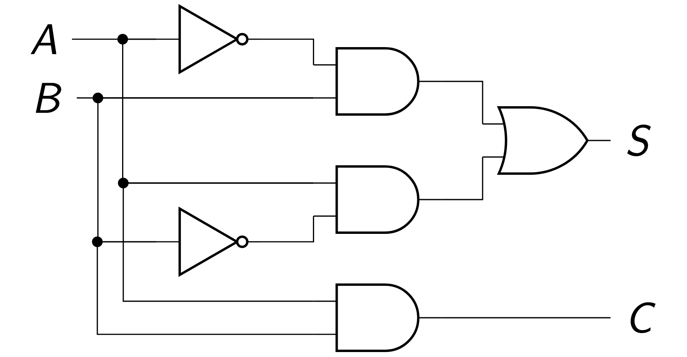
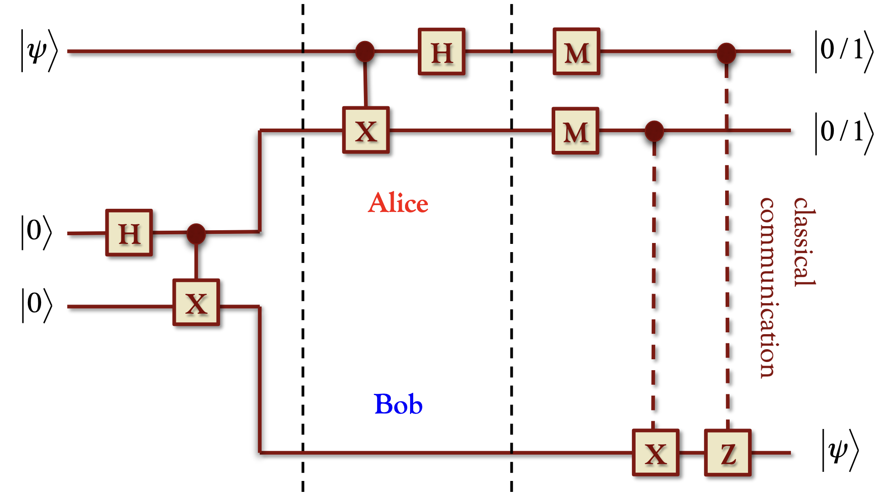

# 量子电路

如果要使用量子比特来实现下图所示的电路:

我们首先需要实现量子比特的复用,因为很明显图中一个信号需要被送入多个逻辑门

很直接的,有两种方法:

1. **复制 (Copy / Clone)**：
   
    如果输入一个处于 $|\psi\rangle = \mu|0\rangle + \nu|1\rangle$ 态的量子比特，我们将得到一个处于相同状态 $|\psi\rangle = \mu|0\rangle + \nu|1\rangle$ 的新量子比特，并拿回原来处于 $|\psi\rangle$ 态的量子比特。换句话说，系统的最终状态是：

    $$
    |\psi\rangle|\psi\rangle = \mu^2|0\rangle|0\rangle + \mu\nu|0\rangle|1\rangle + \nu\mu|1\rangle|0\rangle + \nu^2|1\rangle|1\rangle
    $$

2. **纠缠 (Entangle)**：

    给定一个量子态 $|\psi\rangle = \mu|0\rangle + \nu|1\rangle$ 以及另一个处于特定状态（例如 $|0\rangle$）的辅助量子态，我们将它们纠缠后可以得到：

    $$
    \mu|0\rangle|0\rangle + \nu|1\rangle|1\rangle
    $$

!!! note "不可克隆定理"
    假设存在一个理想的克隆算符 $U_c$。它作用于初始纯态为 $|\psi\rangle$ 的量子比特、一个辅助量子比特 $|0\rangle$ 以及一个初始态为 $|a_0\rangle$ 的辅助系统 (ancilla)。

    假设理想克隆对两个非正交的输入态 $|\psi\rangle$ 和 $|\phi\rangle$ 均有效，则克隆变换满足：
    $$
    U_c(|\psi\rangle|0\rangle|a_0\rangle) = |\psi\rangle|\psi\rangle|a_\psi\rangle
    $$
    $$
    U_c(|\phi\rangle|0\rangle|a_0\rangle) = |\phi\rangle|\phi\rangle|a_\phi\rangle
    $$
    其中 $|a_\psi\rangle$ 和 $|a_\phi\rangle$ 是辅助系统的输出态。根据酉变换保持内积不变的性质：
    $$
    \langle \psi|\phi \rangle = (\langle \psi|\phi \rangle)^2 \langle a_\psi|a_\phi \rangle
    $$
    整理得：
    $$
    \langle \psi|\phi \rangle (1 - \langle \psi|\phi \rangle \langle a_\psi|a_\phi \rangle) = 0
    $$

    由于 $|\langle a_\psi|a_\phi \rangle| \le 1$，该等式只有在 $\langle \psi|\phi \rangle$ 为 $0$（正交）或 $1$（相同）时成立。

    **结论**：理想克隆算符 $U_c$ 不存在。只能存在近似的克隆变换。

!!! info "量子计算作为映射"

    计算可以被视为一个映射 $f: x \to f(x)$，其中 $x$ 是一个 $n$ 位整数，$f(x)$ 是一个 $m$ 位整数。在量子计机中，所需的总资源（比特数）至少为 $n + m$。计算是通过对这 $n + m$ 个量子比特施加酉变换 $U_f$ 来实现的：

    $$
    U_f (|x \rangle_n |y \rangle_m) = |x \rangle_n |y \oplus f(x)\rangle_m
    $$

    这是为了保持量子计算的可逆性,其中$y$相当于一个辅助寄存器,当$y$取0比特的时候, 寄存器中存放的就是$f(x)$.对寄存器中再做一次$\oplus f(x)$操作,我们就重新得到了$y$.

    也就是:

    $$U_f U_f (|x \rangle_n |y \rangle_m) = U_f (|x \rangle_n |y \oplus f(x)\rangle_m) = |x \rangle_n |y \oplus f(x) \oplus f(x)\rangle_m = |x \rangle_n |y \rangle_m$$

## Quantum Gates

在经典逻辑运算中,与或非构成了图灵完备性的一组基础逻辑门,而在量子运算中,我们需要以下四个门:

=== "X Gate"
    X门也就是非门,表示为矩阵就是:

    $$
    X = \begin{bmatrix} 0 & 1 \\ 1 & 0 \end{bmatrix}
    $$

=== "Hadamard Gate"
    
    H门在逻辑上,是一个把基态变成叠加态的门,表示为矩阵就是:

    $$
    H = \frac{1}{\sqrt{2}}\begin{bmatrix} 1 & 1 \\ 1 & -1 \end{bmatrix}
    $$

    它的效果是:

    $$
    H|0\rangle = \frac{1}{\sqrt{2}}(|0\rangle + |1\rangle) , H|1\rangle = \frac{1}{\sqrt{2}}(|0\rangle - |1\rangle)
    $$

=== "S/Z门"
    Z门的作用是把这个向量绕Z轴转$\pi$弧度,表示为矩阵就是:

    $$
    Z = \begin{bmatrix} 1 & 0 \\ 0 & -1 \end{bmatrix}
    $$

    而S门就是Z门的一半:

    $$
    S = \begin{bmatrix} 1 & 0 \\ 0 & i \end{bmatrix}
    $$

=== "T门"
    T门是S门的一半,表示为矩阵就是:

    $$
    T = \begin{bmatrix} 1 & 0 \\ 0 & e^{i\pi/4} \end{bmatrix}
    $$

    相当于旋转45度

=== "CNOT门"
    CNOT门也叫Controlled Not,也即是有条件的取反,分为控制位与目标位,逻辑是:

    - 如果控制位是 $|0\rangle$,则目标位不变
    
    - 如果控制位是 $|1\rangle$,则目标位取反

    矩阵的表示形式为:

    $$
    CNOT = 
    \begin{bmatrix}
    1 & 0 & 0 & 0 \\
    0 & 1 & 0 & 0 \\
    0 & 0 & 0 & 1 \\
    0 & 0 & 1 & 0 \\
    \end{bmatrix}
    $$

> 我们认为H,S,T,CNOT四个门足以实现任意的单量子比特门和任意的受控操作,从而实现图灵完备性

!!! example "Teleportation"
    

    
    

    这张图展示了如何利用基本的电路操作,在Alice不知道自己手上是什么比特的情况下,把这个比特传送到Bob的手上.

    === "Step1"
        最开始,系统的状态是:

        $$ (a|0\rangle + b|1\rangle) \otimes |0\rangle \otimes |0\rangle $$

        其中,第一个量子比特是Alice手上的量子比特,第二个量子比特是Alice和Bob纠缠的量子比特,第三个量子比特是Bob手上的量子比特.

        这两个$|0\rangle$先由一个H门和一个CNOT(两个输入的X)门制备成纠缠对: $\frac{1}{\sqrt{2}}(|00\rangle + |11\rangle)$
    
        现在,系统的总状态变成了:

        $$ (a|0\rangle + b|1\rangle) \otimes \frac{1}{\sqrt{2}}(|00\rangle + |11\rangle) = \frac{1}{\sqrt{2}}(a|000\rangle + a|011\rangle + b|100\rangle + b|111\rangle) $$

    === "Step2"

        然后,看上方那个X门.它以$|\psi\rangle$作为控制位,把第二个比特当目标位

        所以:

        $$ 
        \frac{1}{\sqrt{2}}(a|000\rangle + a|011\rangle + b|100\rangle + b|111\rangle) \xrightarrow{CNOT} \frac{1}{\sqrt{2}}(a|000\rangle + a|011\rangle + b|110\rangle + b|101\rangle) 
        $$

        
    === "Step3"
        最后，第一个比特再经过一个 Hadamard 门，我们得到系统的最终状态：

        $$ 
        \frac{1}{\sqrt{2}}(a|000\rangle + a|011\rangle + b|110\rangle + b|101\rangle) \xrightarrow{H \otimes I \otimes I} \frac{1}{2} (a|000\rangle + a|100\rangle + a|011\rangle + a|111\rangle + b|010\rangle - b|110\rangle + b|001\rangle - b|101\rangle) 
        $$

    === "Step4"
        由于 Alice 需要对前两个比特进行测量，为了看清测量后 Bob 的比特状态，我们将上述状态 $|\Psi_4\rangle$ 按 Alice 的前两位测量基进行整理：

        *   **前两位是 $|00\rangle$ 的项**：
            $$ a|000\rangle + b|001\rangle = |00\rangle (a|0\rangle + b|1\rangle) = |00\rangle |\psi\rangle $$
        *   **前两位是 $|01\rangle$ 的项**：
            $$ b|010\rangle + a|011\rangle = |01\rangle (b|0\rangle + a|1\rangle) = |01\rangle X|\psi\rangle $$
        *   **前两位是 $|10\rangle$ 的项**：
            $$ a|100\rangle - b|101\rangle = |10\rangle (a|0\rangle - b|1\rangle) = |10\rangle Z|\psi\rangle $$
        *   **前两位是 $|11\rangle$ 的项**：
            $$ a|111\rangle - b|110\rangle = |11\rangle (a|1\rangle - b|0\rangle) = |11\rangle XZ|\psi\rangle \text{ (忽略整体负号)} $$

        **最后得到：**
        $$ |\Psi_4\rangle = \frac{1}{2} \left( |00\rangle |\psi\rangle + |01\rangle X|\psi\rangle + |10\rangle Z|\psi\rangle + |11\rangle XZ|\psi\rangle \right) $$

!!! abstract "总结"
    根据最后计算出的结果,我们知道,只要Alice把前两位的测量结果告诉Bob,Bob就能施加对应的变换,实现量子态的隐形传态.

    在整个过程中,我们没有对$a,b$进行任何测量,因此原来量子的状态并不会坍缩.