# 量子算法

## The Deutsch Problem

假设有这样一个黑盒函数 $f: \{0,1\} \to \{0,1\}$,我们想知道这个函数是**常数函数**(即 $f(0) = f(1)$)还是**平衡函数**(即 $f(0) \neq f(1)$).

在经典计算中,我们需要至少两次查询这个函数(分别查询 $f(0)$ 和 $f(1)$)才能确定它的类型.

但是通过量子电路,我们可以在一次查询中确定 $f$ 的类型,这就是**Deutsch 算法**的核心思想.

我们把量子电路设计如下:

    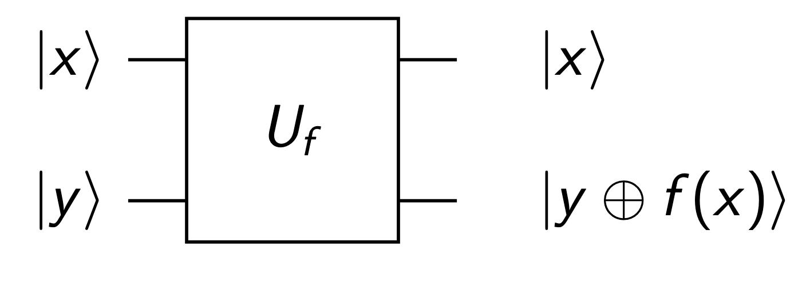

也就是说,我们有一个黑盒量子门 $U_f$ 定义如下:

$$
U_f |x\rangle |y\rangle = |x\rangle |y \oplus f(x)\rangle
$$

=== "f(x)=0"
    效果就是什么都不做,即 $U_f |x\rangle |y\rangle = |x\rangle |y\rangle$.

    

        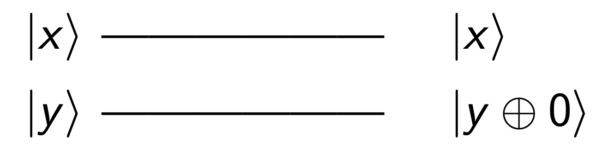
    

=== "f(x)=x"
    实际上是一个CNOT,因为CNOT效果就是 $|x\rangle |y\rangle \to |x\rangle |y \oplus x\rangle$.

    

        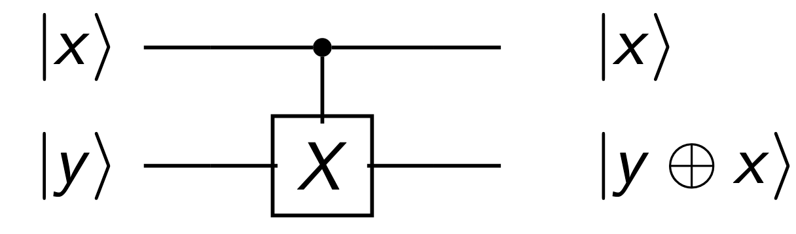
    

=== "f(x)=\bar{x}"
    这个函数的效果是 $|x\rangle |y\rangle \to |x\rangle |y \oplus \bar{x}\rangle$.

    

        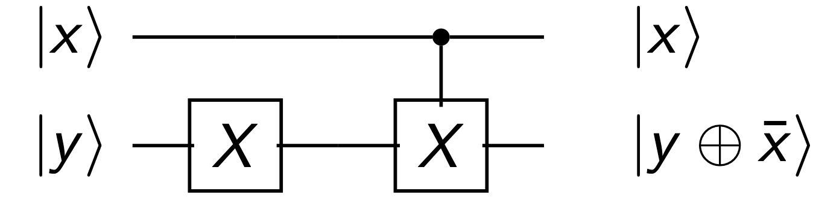
    

=== "f(x)=1"

    

        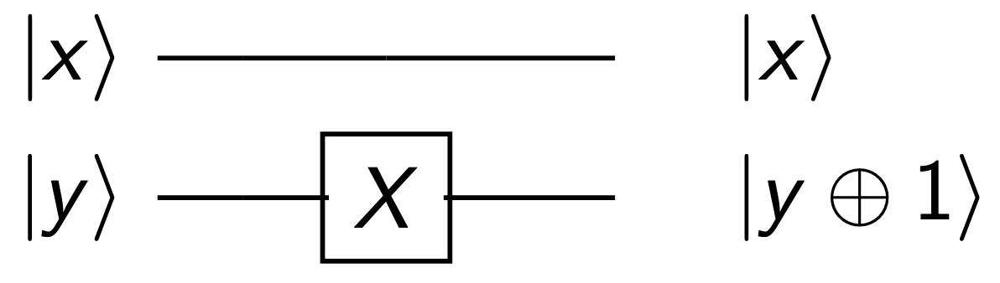
    

那么,为了一次测量就区分出 $f$ 的类型,我们希望函数输出的结果对于这两种函数,有确定性的不同,例如,对于常数函数,我们希望第一个比特的测量结果是 $|0\rangle$,对于平衡函数,我们希望第一个比特的测量结果是 $|1\rangle$.

最终的结构如下:

    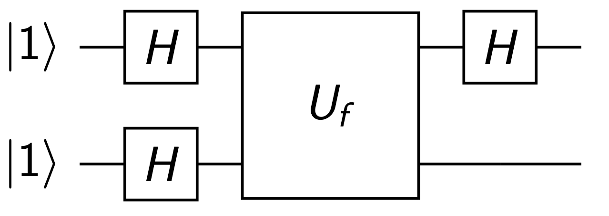

可以计算,系统的最终状态是:

$$
|\psi\rangle =
\begin{cases}
|1\rangle \dfrac{1}{\sqrt{2}} \left[ |f(0)\rangle - |1 \oplus f(0)\rangle \right], & f(0) = f(1) \\

|0\rangle \dfrac{1}{\sqrt{2}} \left[ |f(0)\rangle - |1 \oplus f(0)\rangle \right], & f(0) \neq f(1)
\end{cases}
$$

因此,我们只需要测量第一个比特,就可以确定 $f$ 的类型.

---

我们也可以从电路的情况来理解

在作业中,我们已经知道如下的等价电路:

    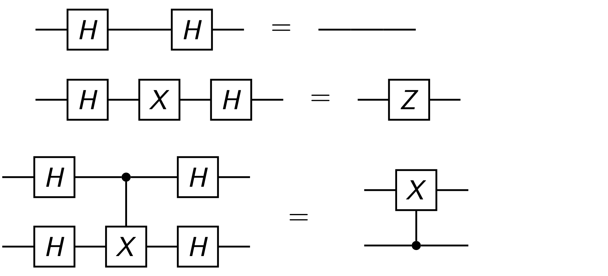

所以最终的电路可以转换为:

=== "f(x)=0"
    

        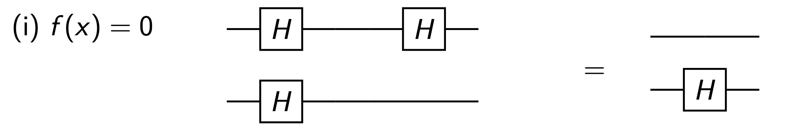
    

=== "f(x)=x"
    

        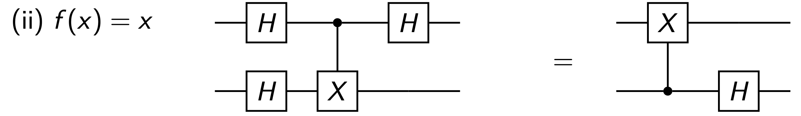
    

=== "f(x)=\bar{x}"
    

        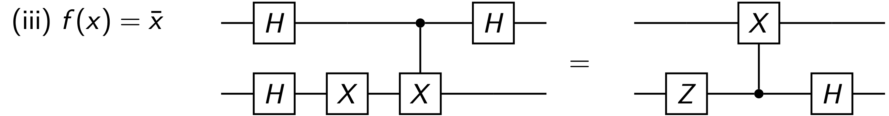
    

=== "f(x)=1"
    

        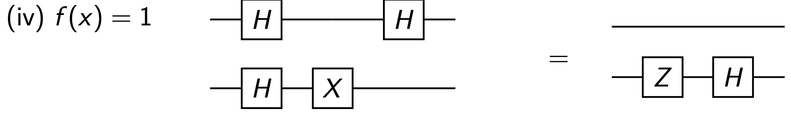
    

可以看到,对于常数函数,第一个比特实际上没有任何变化,而对于平衡函数,第一个比特会被翻转,因此测量结果就可以区分出 $f$ 的类型.

## The Grover's Search Algorithm

一个经典的搜索问题,对于一个无结构的数据库,我们需要 $O(N)$ 的时间来找到一个特定的元素.

问题可以转化为一个函数 $f: \{0,1\}^n \to \{0,1\}$,其中 $f(x) = 1$ 当且仅当 $x$ 是我们要找的元素.

问题在于,我们如何尽可能减少查询这个函数的次数来找到满足条件的 $x$.

这就是**Grover's Search Algorithm** 的核心问题.

!!! info "Grover's Algorithm 的核心思想"

    算法的核心思想是,在一开始,我们并不知道到底是哪个x,因此,我们制备一个均匀叠加态,这个态中包含了所有可能的 $x$ 的信息,并且等权重.

    然后,我们通过一个叫做**Grover Operator**的量子门来逐步放大满足条件的 $x$ 的概率幅度,同时抑制不满足条件的 $x$ 的概率幅度.

    最终,我们就有比较大的概率去测量得到满足条件的 $x$.

首先,为了编码$N$个元素,我们需要 $n = \lceil \log_2 N \rceil$ 个量子比特.

我们选择一个初始状态 $|\phi\rangle = \frac{1}{\sqrt{N}} \sum_{x=0}^{N-1} |x\rangle$,这是一个均匀叠加态,包含了所有可能的 $x$ 的信息.

每一个$x$都是一个 $n$ 位的二进制数,因此 $|\phi\rangle$ 是一个 $n$ 量子比特的态.

!!! info "反射变换"

    对于一个归一化向量 $|\phi\rangle$,定义算符

    $$
    W = 2|\phi\rangle\langle\phi| - I
    $$

    这个算符称为**关于 $|\phi\rangle$ 方向的反射变换**.

    为了理解它的作用,任取一个态 $|\psi\rangle$,把它分解为平行于 $|\phi\rangle$ 和垂直于 $|\phi\rangle$ 的两部分:

    $$
    |\psi\rangle = \alpha |\phi\rangle + |\psi_\perp\rangle,\qquad \langle \phi | \psi_\perp \rangle = 0
    $$

    其中 $\alpha = \langle \phi | \psi \rangle$. 那么

    $$
    W |\psi\rangle
    = (2|\phi\rangle\langle\phi| - I)(\alpha |\phi\rangle + |\psi_\perp\rangle)
    = \alpha |\phi\rangle - |\psi_\perp\rangle
    $$

    可以看到:

    - 平行于 $|\phi\rangle$ 的分量保持不变
    - 垂直于 $|\phi\rangle$ 的分量变号

    因此,从几何上看,$W$ 就是把向量 $|\psi\rangle$ 关于 $|\phi\rangle$ 所张成的轴做镜像反射.

然后,假设我们最终需要的态是$|a\rangle$,所有其他态叠加在一起,变成$|a_\perp\rangle$.

在Grover's Algorithm中,我们需要两个反射变换:

- 关于 $|a_\perp\rangle$ 的反射变换 $W_a = 2|a_\perp\rangle\langle a_\perp| - I$

- 关于 $|\phi\rangle$ 的反射变换 $W_\phi = 2|\phi\rangle\langle\phi| - I$

具体的过程可以看下图,

    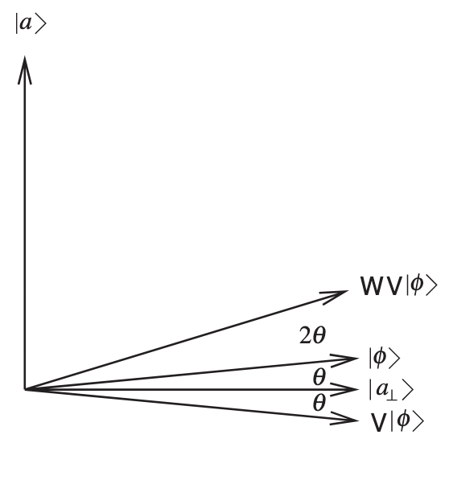

先把$\phi\rangle$ 翻到$a_prep\rangle$ 下面,然后再以原来的$\phi\rangle$ 作为轴做反射,最终到达了比$原来更接近a\rangle$ 的位置.

每一次做这两个反射一次,我们就会把状态向 $|a\rangle$ 的方向推进一个角度 $2 \theta$,其中 $\sin(\theta/2) = 1/\sqrt{N}$.

---
!!! info

    那么这个反射和我们最开始说的$f(x)$ 的查询有什么关系呢?

    实际上,关于 $|a_\perp\rangle$ 的反射变换 $V$ 可以通过查询函数 $f$ 来实现.

    我们可以发现,$V$函数实际上是这个效果:

    $$
    V|x\rangle =
    \begin{cases}
    |x\rangle, & x \neq a \\
    -|a\rangle, & x = a
    \end{cases}
    $$

    由于 $f(x) = 1$ 当且仅当 $x = a$,上式也可以统一写成

    $$
    V|x\rangle = (-1)^{f(x)} |x\rangle
    $$

    我们最开始拥有的函数是

    $$
    U_f |x\rangle |y\rangle = |x\rangle |y \oplus f(x)\rangle
    $$

    正如作业中学过的,我们可以通过适当选择 $|y\rangle$ 的初始状态来实现 $V$ 的效果.

    选择$y = H|1\rangle = \frac{1}{\sqrt{2}}(|0\rangle - |1\rangle)$,我们有:
    $$
    \begin{aligned}
    U_f |x\rangle H|1\rangle
    &= U_f |x\rangle \frac{1}{\sqrt{2}}(|0\rangle - |1\rangle) \\
    &= \frac{1}{\sqrt{2}} \left( |x\rangle |f(x)\rangle - |x\rangle |1 \oplus f(x)\rangle \right) \\
    &= (-1)^{f(x)} |x\rangle H|1\rangle
    \end{aligned}
    $$

---

最后,我们知道$\theta = \arcsin(1/\sqrt{N})$,因此,我们需要大约 $\pi/(2\theta) \approx O(\sqrt{N})$ 次迭代来把状态推进到 $|a\rangle$ 的方向,从而以较高的概率测量得到 $|a\rangle$.